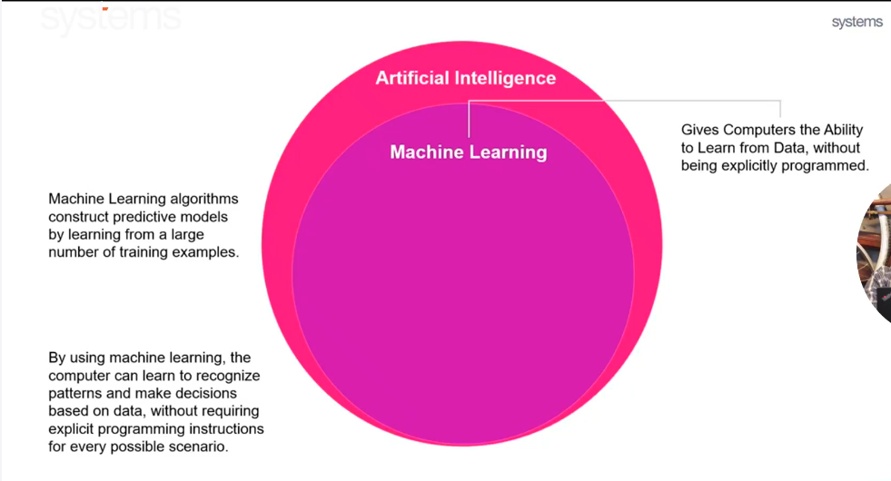
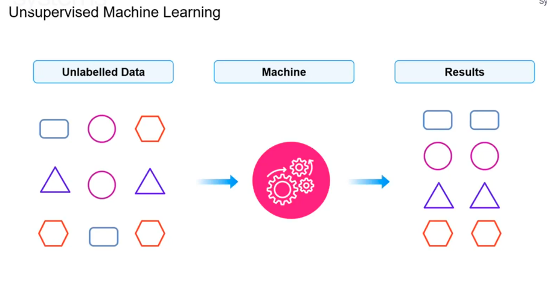
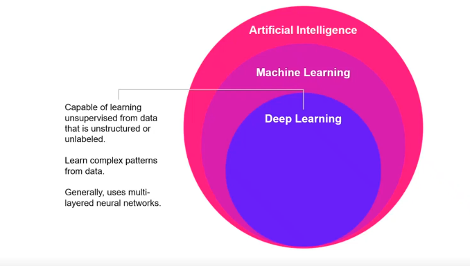
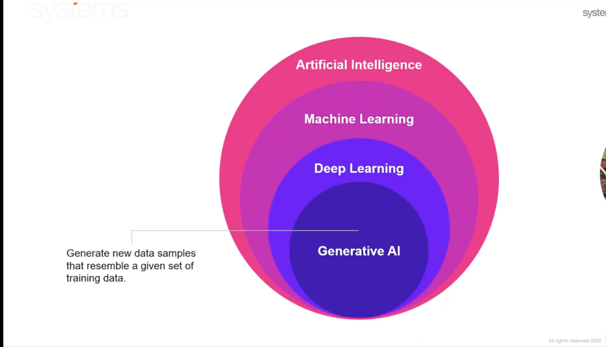
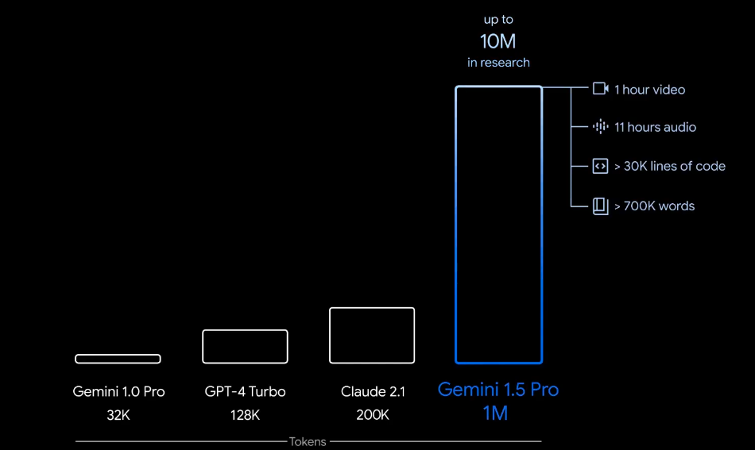

# Building Blocks of Generative AI

**Date:** Wednesday, October 15, 2025  
**Time:** 4:07 PM

---

## Training Objective

### Inevitability of Change

- The way we have been doing a business in the services industries in the past years for decades is rapidly changing.
  - The way generative AI is taking over the market.
  - The ways developers code it.
  - The way testers test its operation.

### Democratization of Knowledge

- Giving everyone equal access to knowledge and learning through technology.

### Responsible AI

### Tools & Accelerators Demonstration

---

# Generative AI vs Agentic AI

## Generative AI

### What it means

- AI that can generate (create) new things - like text, images, music, code, or videos - based on what it has learned.
- Generative AI refers to advanced Artificial Intelligence systems designed to create high-quality content including text, images, audio, and even video, unlike traditional AI that analyzes or classifies data.

### Examples

- ChatGPT writing an essay or email.
- DALL-E or Midjourney creating an image.
- Copilot writing code.

### How it works

- It learns patterns from existing data and then produces new outputs that look similar - but are new.

## Agentic AI

### What it means

- AI that can act on its own, make decisions, and take actions toward a goal - not just generate content.

### Examples

- An AI that books flights, sends emails, or runs marketing campaigns automatically.
- An AI "agent" that can use tools, browse the web, and execute tasks - not just talk.
- "AutoGPT" or "ChatGPT with memory + tool use" are steps toward Agentic AI.

### How it works

Agentic AI can:

1. **Plan** - figure out what needs to be done.
2. **Act** - use tools or APIs.
3. **Reflect** - see if it worked, then try again.

## Comparison: Generative AI vs Agentic AI

| Feature            | Generative AI                  | Agentic AI                    |
| ------------------ | ------------------------------ | ----------------------------- |
| Main purpose       | Create content                 | Take actions & achieve goals  |
| Works how?         | Generates text, image, or code | Uses tools, plans, and acts   |
| Needs human input? | Yes - user prompts             | Less - can act autonomously   |
| Example            | ChatGPT writing a story        | AI agent that books your trip |
| Analogy            | A creative writer              | A personal assistant          |

---

## Gen AI Foundation

- Evolution
- Machine Learning
- Deep Learning
- Gen AI

## Gen AI Deep-Drive

- Tokens, Prompts, Benchmarks, etc.
- Visionnet GenAI Accelerators
- Demo-rich

## GenAI-first Business Problems

- Hands-on workshop to build a real-world, business-specific RAG implementation.

---

# ASI - Artificial Superintelligence

## Simple definition

Artificial Superintelligence (ASI) is a type of AI that would be smarter than humans - in every possible way.

## More details

- Today's AI (like ChatGPT or Copilot) is powerful but still limited - it can't think, reason, or feel like humans.
- Artificial General Intelligence (AGI), the next level, would match human intelligence - it can understand and learn anything a human can.
- Artificial Superintelligence (ASI) goes beyond human intelligence. It could:
  - Learn faster than us.
  - Solve problems we can't.
  - Be creative in ways we can't imagine.
  - Make better decisions than any human expert.

---

# Artificial Intelligence (AI)

Artificial Intelligence (AI) is a domain that enables machines to mimic human behavior.

### Areas shown in the AI overview diagram

- **Natural language processing (NLP) There are examples such as:**
  - Classification & clustering
  - Information extraction
- **Speech**
  - Speech to text
  - Text to speech
- **Expert systems**
- **Planning, scheduling & optimization**
- **Robotics**
- **Vision**
  - Image recognition
  - Machine vision

---

# Machine Learning

## Simple Definition

Machine Learning is a type of Artificial Intelligence (AI) that allows computers to learn from data and improve automatically without being directly programmed.

## Simple Word

Instead of writing rules for a computer to follow, we give it examples (data) - and it figures out the rules by itself.

## Example

Let's say you want a computer to recognize cats in photos.

You don't tell it, "A cat has whiskers, two ears, and a tail."

Instead, you show it many pictures of cats and non-cats, and it learns the difference by finding patterns.

## How it works (in 3 steps)

1. **Train:** Feed the computer lots of data.
2. **Learn:** The computer finds patterns or relationships in that data.
3. **Predict:** It uses what it learned to make decisions about new data.

## Learning Paradigms

1. Supervised Machine Learning
2. Unsupervised Machine Learning
3. Semi-Supervised Machine Learning
4. Reinforcement Learning
5. Self Supervised Machine Learning

## 1. Supervised Learning

### Sample Definition

- The computer learns from labeled data - data that already has the correct answers.

### Example

You show the computer many pictures labeled as:

- 🐱 "This is a cat"
- 🐶 "This is a dog"

It learns the difference between cats and dogs.

Then when you show a new picture, it can predict which animal it is.

### Used for

- Email spam detection (spam / not spam)
- Predicting house prices
- Image or voice recognition

### Visual process represented in the notes

**Labeled Data -> Machine -> ML Model -> Predictions**

The notes illustrate labeled examples being fed into a machine/ML model and then used to classify test data.

## 2. Unsupervised Learning

### Sample Definition

The computer learns from unlabeled data - there are no correct answers; it just finds patterns on its own.

### Example

- You give the computer a bunch of photos without any labels.
- It groups them into clusters - maybe all cat photos in one group, all dog photos in another - without being told what they are.

### Used for

- Customer segmentation (grouping similar users)
- Market analysis
- Finding hidden patterns in data

### Visual process represented in the notes

**Unlabelled Data -> Machine -> Results**

The notes illustrate unlabeled examples being grouped into clusters by the machine.

## 3. Reinforcement Learning

### Sample Definition

- The computer learns by trial and error, getting rewards for doing the right thing.

### Example

Think of training a dog 🐕:

- If it does something good -> give a treat 🍪
- If it does something wrong -> no treat

### Used For

- Self-driving cars (learning to drive safely)
- Game-playing AIs (like AlphaGo, chess)
- Robotics and automation

### Summary Table

| Type          | Learns From                 | Example            | Goal               |
| ------------- | --------------------------- | ------------------ | ------------------ |
| Supervised    | Labeled data (with answers) | Spam detection     | Predict outcomes   |
| Unsupervised  | Unlabeled data              | Grouping customers | Find patterns      |
| Reinforcement | Rewards & penalties         | Teaching a robot   | Learn best actions |

> **Note:** The learning paradigms list in the source also includes **Semi-Supervised Machine Learning** and **Self Supervised Machine Learning**, but the detailed notes provided here do not include separate sections for them.

---

# Deep Learning

## Sample Definition

Deep Learning is a special kind of Machine Learning that uses artificial neural networks - systems inspired by how the human brain works - to learn from large amounts of data.

## In simple words

- Machine Learning = learning from data.
- Deep Learning = learning from a lot of data using layers of "artificial neurons."

## Example

Let's say you want AI to recognize faces 👤.

- **Traditional Machine Learning:** you tell it, "look for eyes, nose, mouth."
- **Deep Learning:** it figures out all those features by itself using many layers of learning.

### Each layer learns something simple

- **1st layer ->** edges and colors
- **2nd layer ->** shapes like eyes and noses
- **3rd layer ->** full faces

All combined -> a smart model that can recognize people automatically.

## Why it's called "Deep"

Because the neural network has many layers - like an onion 🧅 or a sandwich 🥪 - where each layer learns a deeper level of understanding.

## Real-world uses

- Face recognition (Instagram, iPhone Face ID)
- Voice assistants (Siri, Alexa)
- Self-driving cars detecting objects
- ChatGPT and image generators like DALL-E (they're built on deep learning!)

## Relation between AI, ML, and DL

| Level                        | Description                                     | Example                       |
| ---------------------------- | ----------------------------------------------- | ----------------------------- |
| Artificial Intelligence (AI) | Any system that can think or act like a human   | Chatbots, Robots              |
| Machine Learning (ML)        | AI that learns from data                        | Spam filters, Recommendations |
| Deep Learning (DL)           | ML using neural networks to learn automatically | ChatGPT, Image recognition    |

The notes also visualize these as nested levels:

**Artificial Intelligence -> Machine Learning -> Deep Learning**

---

# Generative AI

## Sample Definition

Generative AI is a type of Artificial Intelligence that can create new content - like text, images, music, videos, or code - based on what it has learned from existing data.

## Sample words

It is an AI that doesn't just analyze data - it creates something new from it.

You give it a prompt, and it generates an answer, picture, or idea.

## Examples

- ChatGPT -> writes essays, emails, or stories 📝
- DALL-E / Midjourney -> creates images 🎨
- Suno / Udio -> makes music 🎵
- Copilot / Replit AI -> writes code 💻
- Runway / Pika Labs -> generates videos 🎥

## How it works

1. The AI is trained on huge datasets (text, images, sounds, etc.).
2. It learns patterns in that data - how words, shapes, or sounds connect.
3. When you ask it something, it creates new content that fits those patterns.

## Generative AI vs Traditional AI

| Feature  | Traditional AI              | Generative AI                 |
| -------- | --------------------------- | ----------------------------- |
| Purpose  | Analyze or predict          | Create new content            |
| Example  | Predict stock prices        | Write a news article          |
| Output   | Numbers, labels, categories | Text, image, audio, code      |
| Data use | Understand patterns         | Reproduce patterns creatively |

## Real-world uses

- Chatbots and virtual assistants
- Marketing content and design
- Movie scripts and storyboards
- Game development and animation
- Education, summarization, and translation

## Challenges

- Bias or misinformation if trained on bad data
- Copyright and ethical concerns
- Needs Responsible AI rules to avoid misuse

### Visual relationship shown in the notes

The source also presents Generative AI as a layer within the broader AI -> ML -> DL hierarchy and describes it as generating new data samples that resemble a given set of training data.

---

# LLM (Large Language Models)

## How Large are the LLMs

The notes introduce the topic of LLM size and then move into tokens.

## Tokens

A token is a small piece of text that an AI model reads or writes.

It can be:

- A word
- Part of a word
- Or even a punctuation mark (like `.`, `,`, `!`)

### Why Tokens

- AI models don't read full sentences at once.
- Instead, they break sentences into tokens, understand them, and then predict the next token.

### Examples of Tokens

| Text                    | How it becomes tokens                               |
| ----------------------- | --------------------------------------------------- |
| Hello                   | 1 token                                             |
| ChatGPT is amazing      | 4 tokens -> "Chat", "GPT", "is", "amazing"          |
| I'm learning AI         | Might be 4 tokens -> "I", "'m", "learning", "AI"    |
| Artificial Intelligence | Could be 2 or 3 tokens -> depends on how it's split |

### Why Tokens Matter

1. **AI Models Think in Tokens** -> They predict one token at a time.
2. **Your message length is counted in tokens, not words.**
3. **There are token limits** -> e.g., ChatGPT can only read/process a certain number of tokens in one conversation.
4. **Cost of AI usage** = usually charged per number of tokens processed.

### Analogy (Real-life Example)

Imagine reading a book:

- Instead of reading entire sentences, you read it word by word.
- Each word = token.
- You understand it piece by piece -> that's how AI understands your text.

> Tokens are the small pieces of text (like words or parts of words) that AI models use to understand and generate language.

### LLM size / context-related visual shown in the notes

The notes include an illustrative chart with the following values:

| Model          | Context / Token Size Shown |
| -------------- | -------------------------: |
| Gemini 1.0 Pro |                        32K |
| GPT-4 Turbo    |                       128K |
| Claude 2.1     |                       200K |
| Gemini 1.5 Pro |                         1M |

The chart also notes **up to 10M in research**, with examples of what a large context can represent:

- ~1 hour of video
- ~11 hours of audio
- > 30K lines of code
- > 700K words

## Tokenizer

The notes include the heading **Tokenizer:** without additional explanatory text.

---

# Context Window

## Simple Definition

A context window is the maximum amount of information (text/tokens) an AI model can read, remember, and use at one time while replying.

## Think of it like this

- It is the AI model's **short-term memory**.
- Whatever fits inside this memory, the AI can **see and use** to answer your question.
- Anything beyond that limit is **forgotten or ignored**.

## Example

- Let's say a model has a context window of **4,000 tokens**.
- If your conversation + your question is within 4,000 tokens, the AI can understand all of it.
- If it becomes longer than 4,000 tokens, the oldest messages get pushed out (forgotten).

## Real-Life Analogy

Imagine you are trying to memorize a paragraph, but your mind can only hold **1 page at a time**.

- That 1 page = **Context window**
- If there is more than 1 page, you forget parts of the first page to read the new one.

## Why it matters

| Feature                               | Why it's important                                     |
| ------------------------------------- | ------------------------------------------------------ |
| Memory limit                          | AI can't remember everything you said forever          |
| Long conversations                    | After the limit, older messages are forgotten          |
| Better models = bigger context window | GPT-4, GPT-5 etc. have larger limits than older models |
| Token-based                           | The context window is measured in tokens, not words    |

## Some Context Window Sizes

The notes contain two related sets of context-window figures: an initial text table and a later visual chart.

### Text table in the notes

| AI Model             | Context Window                    |
| -------------------- | --------------------------------- |
| GPT-3.5              | ~4,096 tokens                     |
| GPT-4                | 8,000 - 32,000 tokens             |
| GPT-5 (latest)       | Higher limits (varies by version) |
| Claude 3 (Anthropic) | Up to 200,000 tokens              |

### Visual chart in the notes

| AI Model       | Context Window / Token Size shown |
| -------------- | --------------------------------: |
| Gemini 1.0 Pro |                               32K |
| GPT-4 Turbo    |                              128K |
| Claude 2.1     |                              200K |
| Gemini 1.5 Pro |                                1M |

The visual chart further states **up to 10M in research** and gives examples including **1 hour of video, 11 hours of audio, >30K lines of code, and >700K words**.

---

# Prompting

## Definition

Prompting means giving instructions or inputs to an AI model so it can generate a response, answer, image, code, or other output.

## Simple Definition

A prompt is what you type or ask the AI. Prompting is the way you ask the AI to get the best response.

## Example of Prompt

- "Write a poem about the moon in simple English."
- "Generate an image of a flying car in a futuristic city."
- "Explain machine learning like I'm 12 years old."

## Types of Prompting

| Type               | Example                                                  | Purpose                       |
| ------------------ | -------------------------------------------------------- | ----------------------------- |
| Instruction Prompt | "Explain photosynthesis."                                | Ask AI to do something.       |
| Creative Prompt    | "Write a short story about a robot who learns emotions." | Create content.               |
| Question Prompt    | "What is the capital of Japan?"                          | Get facts.                    |
| Role-based Prompt  | "Act as a doctor and explain how fever works."           | Make AI take a specific role. |
| Few-shot Prompting | Provide examples, then ask AI to continue.               | Teach AI through examples.    |

## 1. Zero-Shot Learning

- The AI can do a task without being given any examples of it before.

### Example

> "Translate this sentence into French: 'How are you?'"

Even if you never showed it any example of translations in your prompt, it can still do it.

### Simple Analogy

Like someone solving a new type of puzzle they've never seen before - but still figuring it out from their knowledge.

## 2. One-Shot Learning

- The AI learns the task after seeing just one example.

### Example

Translate English to Urdu.

**Example:**

- English: Good morning
- Urdu: صبح بخیر

**Now translate:**

- English: How are you?

The AI uses this one example to learn the pattern and answers correctly.

### Analogy

Like showing a kid one picture of a giraffe - and after that, they can recognize all giraffes.

## 3. Few-Shot Prompt

- The AI learns using a few examples (typically 2-5) before solving similar tasks.

### Examples

You give 3 examples:

**Task: Convert sentences to polite English.**

1. "Send me the file." -> "Could you please send me the file?"
2. "Close the door." -> "Could you please close the door?"
3. "Call me." -> "Could you please call me?"

**Now do this:**

> "Give me water."

The AI understands the pattern and gives:

> **"Could you please give me water?"**

### Analogy

Like teaching someone by giving 3-4 samples - and then they continue on their own.

## Comparison Table

| Type      | Examples Given? | Example Scenario                               |
| --------- | --------------- | ---------------------------------------------- |
| Zero-Shot | ❌ No examples  | "Translate to Japanese." (without showing how) |
| One-Shot  | ✅ 1 example    | Show 1 translation, then ask for another       |
| Few-Shot  | ✅ 2-5 examples | Show a few examples of polite rephrasing       |

---

# Chain of Thought (CoT)

Chain of Thought (CoT) is a prompting technique where an AI model explains step-by-step how it arrives at an answer instead of just giving the final result.

Within Chain of Thought, there are often two styles of reasoning involved.

## 1. Common Sense Chain of Thought

This involves everyday, intuitive reasoning - the kind humans use without formal logic or calculations.

### Characteristics

- Based on life experience, intuition, and general knowledge.
- No deep calculations or rules.
- Works well for social situations, daily life, or obvious cause-and-effect logic.

### Example

**Question:**

> "If you leave ice outside on a hot day, what will happen?"

**Common Sense CoT:**

- Hot temperature causes ice to absorb heat.
- When ice absorbs heat, it melts.
- So the ice will turn into water.

**Answer:** The ice will melt.

## 2. Reasoning-Based Chain of Thought (Logical/Analytical)

This uses structured steps, logic, math, or rules to reach a conclusion.

### Characteristics

- Involves calculations, formulas, or rules.
- Used for math problems, puzzles, logic questions.
- More structured and less intuitive.

### Example

**Question:**

> "Sarah has 12 apples. She gives half to John and then buys 4 more. How many does she have now?"

**Reasoning CoT:**

- Half of 12 is 6 -> she gives away 6.
- 12 - 6 = 6 apples left.
- She buys 4 more -> 6 + 4 = 10.

**Answer:** Sarah has 10 apples.

## Difference Between Common Sense and Reasoning CoT

| Feature                | Common Sense CoT                  | Reasoning / Logical CoT            |
| ---------------------- | --------------------------------- | ---------------------------------- |
| Based on               | Intuition & experience            | Logic, math, structured rules      |
| Example scenarios      | Everyday life, cause-effect       | Math, puzzles, structured problems |
| Requires formulas?     | ❌ No                             | ✅ Often yes                       |
| Human-like explanation | ✔ Yes                             | ✔ Yes but more analytical          |
| Example question       | "Why do we wear coats in winter?" | "Solve 3×(5+2)"                    |

## Why This Matters in AI

- AI models can generate better and more accurate responses when encouraged to **"think aloud."**
- Developers can choose **commonsense CoT** for social/behavioral questions and **reasoning CoT** for analytical tasks.
- Helps in debugging wrong answers - you can see where the AI's thinking went off track.

## Example Showing Both in One Question

### Question

A man buys a coat for $50 and sells it for $60. Then he buys it back for $70 and sells it again for $80. How much profit did he make?

### Common Sense CoT

- He sold twice and made money both times.
- So he made some profit.

_(This is vague - not accurate.)_

### Reasoning CoT

- First sale profit = $60 - $50 = $10
- Second sale loss = $70 - $80 = -$10? -> No. Actually:
  - Bought for $70, sold for $80 -> profit = $10
- Total profit = $10 + $10 = $20

**Answer:** $20 profit.

## Chain of Thought Type

| Chain of Thought Type | Used For                         | Style                     |
| --------------------- | -------------------------------- | ------------------------- |
| Commonsense           | Daily life, intuitive questions  | Natural, experience-based |
| Reason-based          | Math, logic, structured analysis | Step-by-step, rule-based  |

---

# Prompt Drift

Prompt Drift happens when an AI model slowly moves away from the user's original instructions during a conversation or while generating a long response.

## It means

- The AI starts following a different direction than what you asked for.
- It may change tone, format, topic, or style unintentionally.
- This usually happens in long chats, multi-step prompts, or unclear instructions.

## Simple Example of Prompt Drift

**You:** "Write a formal email to my boss about taking leave."

**AI starts correctly...**

> Dear Sir, I hope you're well. I request leave...

**But later drifts...**

> ...and by the way, did you know vacations reduce stress? Here's why relaxation is important...

🙁 It started following the prompt, but then it drifted into unnecessary details.

## Why Does Prompt Drift Happen?

| Cause                          | Explanation                                                              |
| ------------------------------ | ------------------------------------------------------------------------ |
| Long conversations             | AI starts to focus on recent messages instead of original instructions.  |
| Unclear instructions           | If the prompt isn't specific, the AI may wander.                         |
| Multiple instructions together | Confusion between tasks (example: formal + casual + creative).           |
| Context window limits          | Older parts of the conversation are forgotten when memory exceeds limit. |

---

# Model Chaining

## What is Model Chaining?

- Model Chaining means using multiple AI models one after another, where the output of one model becomes the input for the next.
- You chain models together to complete a big or complex task in smaller steps.

## Simple Example

Imagine you want an AI to:

1. Read a long research article.
2. Summarize it.
3. Translate the summary into Urdu.
4. Create a presentation slide from it.

Instead of one model doing all this at once, you chain models like this:

| Step | Model Task                             | Output               |
| ---: | -------------------------------------- | -------------------- |
|    1 | Model 1 -> Summarize the article       | Summary              |
|    2 | Model 2 -> Translate to Urdu           | Urdu summary         |
|    3 | Model 3 -> Create bullet points/slides | Presentation content |

Each step uses the output of the previous one. This is **Model Chaining**.

## Why Use Model Chaining?

| Benefit         | Explanation                                          |
| --------------- | ---------------------------------------------------- |
| More control    | Each model has a specific role/task                  |
| Higher accuracy | Breaking tasks reduces errors                        |
| Easier to debug | If something goes wrong, you know which stage failed |
| Reusability     | You can reuse parts of the chain in other projects   |

## Real-World Example - Customer Support Chatbot

| Step | Model Task                                         | Output                                            |
| ---: | -------------------------------------------------- | ------------------------------------------------- |
|    1 | Understand user message (Intent Detection model)   | "User wants refund"                               |
|    2 | Extract key details (Information Extraction model) | Order ID: 12345                                   |
|    3 | Generate reply message (Generative AI model)       | "Your refund for order 12345 is being processed." |

## Another Example - AI Content Creation Pipeline

**Task:** Create a blog post with an image.

| Step | Model                        | Task                       |
| ---: | ---------------------------- | -------------------------- |
|    1 | GPT Model                    | Generate blog outline      |
|    2 | GPT Model                    | Write full article         |
|    3 | Image AI (DALL-E/Midjourney) | Create a relevant image    |
|    4 | SEO Model                    | Add keywords and meta tags |

## Tools Used for Model Chaining

- **LangChain** (popular for chaining LLMs with memory, tools, APIs)
- **LLM + Python code together**
- **Airflow, Node.js, or workflows for automation**

> Model Chaining is when you connect multiple AI models so that each model solves a part of the problem, and together they complete the full task.
