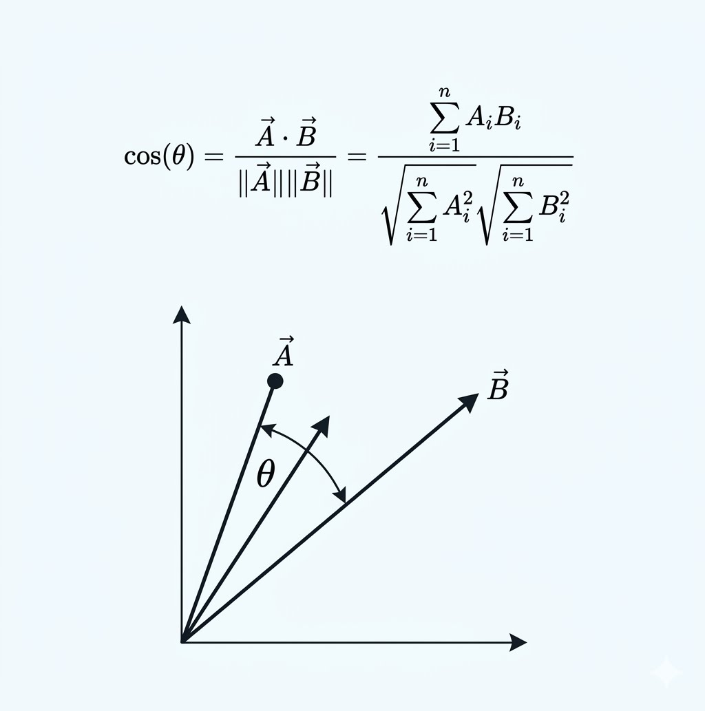
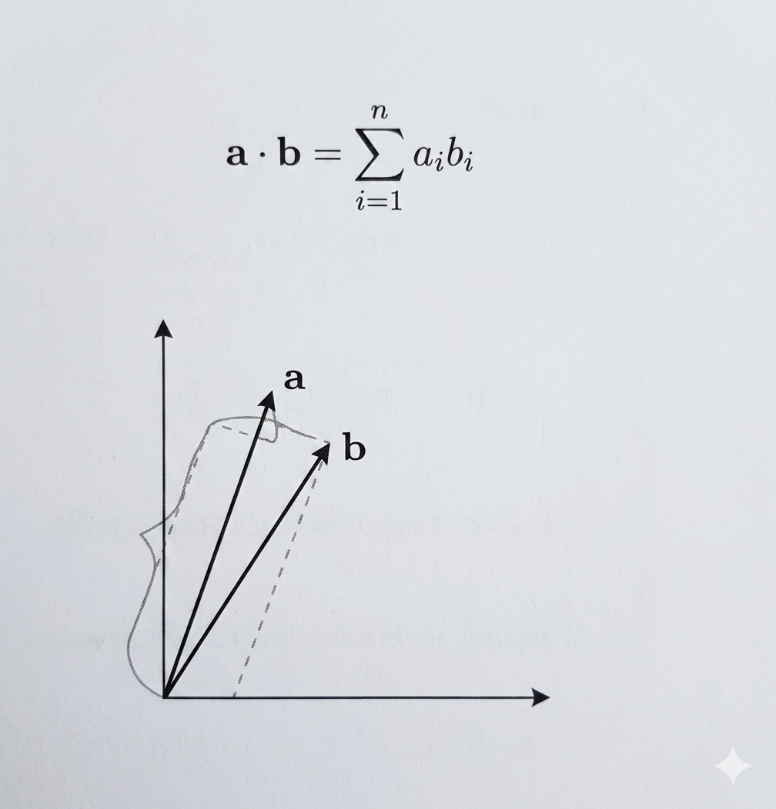
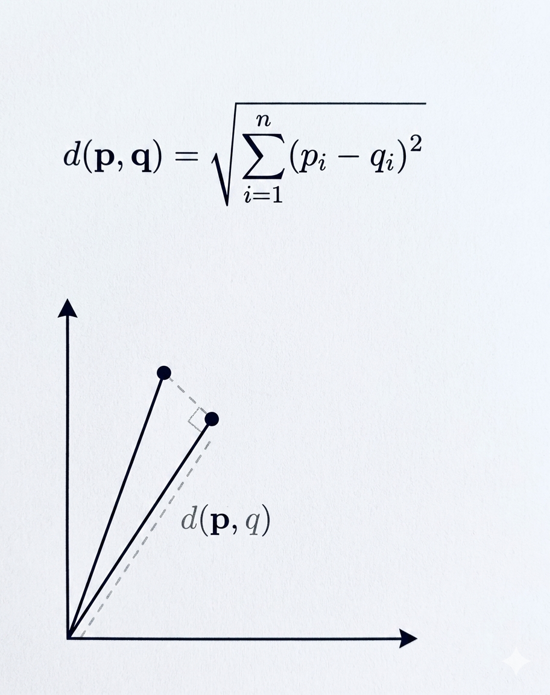
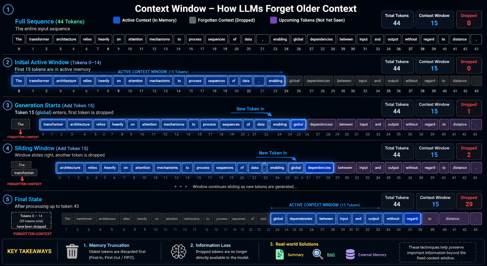

# Topics:

- [Language Model](#language-models)
  - [Large Language Model (LLM)](#what-is-a-large-language-model)
- [Tokenization](#tokenization)
- [Embeddings](#embeddings)
- [Autoregression]()
- [Transformers]()
- [Mixture of Experts (MoE)]()

## Language Models

_Predicting the next token_

An AI algorithm designed to process, predict, and generate human language. By analyzing massive datasets, it learns the statistical patterns and relationships between words. These models power everything from predictive text on phones to conversational AI assistants, machine translation, and coding tools.

### Evolution of Language Models

- **Statistical (SLM)**
  - N-grams & Markov Chains.
  - Based on simple word frequency counts.
- **Neural (NLM)**
  - Recurrent Neural Networks (RNNs).
  - Introduced word embeddings.
- **Pre-trained (PLM)**
  - BERT & ELMo.
  - Shifted to bidirectional context understanding.
- **Large (LLM)**
  - Transformers (GPT series).
  - Massive scale in data and parameters.

## What Is a Large Language Model?

_Predicting the next token — at scale_

A language model assigns a probability to every possible next token given the text so far. A large language model is one scaled up in parameters, data, and compute until new capabilities emerge.

### Core Concepts

- **Next-token prediction**
  At its core the model estimates P(token | all previous tokens). Generating text just means sampling from that distribution over and over.

- **Self-supervised pretraining**
  It learns from enormous amounts of raw text with no manual labels — the next word in the data is its own supervision signal.
  - _Example:_ Input: [ The capital of France is ] ➔ Output: [ Paris. ]

### What Makes it "Large"

| Scale / Feature  | Description                                                    |
| :--------------- | :------------------------------------------------------------- |
| **10^9 – 10^12** | learned parameters                                             |
| **Trillions**    | of tokens of training text                                     |
| **Emergent**     | few-shot & in-context learning, with no task-specific training |

## Tokenization

_Turning raw text into a fixed vocabulary of integer IDs_

### Core Concepts

- **Subword units, not words**
  Tokenizers split text into pieces smaller than words. Frequent words stay whole; rare ones fragment into reusable sub-pieces.

- **BPE / WordPiece / Unigram**
  Algorithms learn a fixed vocabulary (~30k–200k) by merging the most frequent byte or character pairs into single tokens.

- **Every token is an integer ID**
  Each token maps to an index. That index selects a row of the embedding matrix — the bridge to the next stage.

- **Why subword wins**
  A bounded vocab with no out-of-vocabulary words, while still handling morphology, code, and many languages.

### Example

`"tokenizing language is fun"` becomes:

- `token` (#1567)
- `izing` (#2890)
- `lang` (#3001)
- `uage` (#4119)
- `is` (#318)
- `fun` (#2300)

_Common word stays whole • rarer word splits into sub-pieces_

## In an LLM: Tokens are the LLM's unit of everything

- Context windows are measured in tokens (e.g. 128k–200k), and API usage is billed per token.
- Rule of thumb: ~1 token ≈ 0.75 English words, so token ≠ word.

## Embeddings

_Token IDs become dense vectors whose geometry encodes meaning_

### Core Concepts

- **A learned lookup table**
  The embedding matrix $E \in \mathbb{R}^{(V \times d)}$ holds one vector per vocab token. Token ID $i$ selects row $i$ — a vector of length $d$.

- **Geometry is meaning**
  Vectors are positioned during training so related tokens land near each other; some directions even encode analogies (king - man + woman = queen).

- **Static vs contextual**
  word2vec/GloVe give one fixed vector per token. Transformer embeddings are contextual meaning the same token gets a different vector depending on its surroundings.

### Vector Representation

Token ID `#1567` ➔ `[0.18, -0.92, 0.44, ..., -0.31]` _(a d-dimensional dense vector)_

**Similar meanings cluster in vector space:**
For example, animals (Chicken, Wolf, Dog, Cat) cluster together, and fruits (Banana, Apple) cluster together in a multi-dimensional space (e.g., 300 dimensions).

### In an LLM

In an LLM, token embeddings are summed with positional embeddings before layer 1. Model dimension $d$ runs from 768 (GPT-2) to 4096+ in frontier models.

## Similarity & Distance Metrics

_The three you will actually reach for, and how they differ_

| Metric                          | What it measures                                                                         | Range                                  | Magnitude? | Typical use                                                         | Visualization                            |
| :------------------------------ | :--------------------------------------------------------------------------------------- | :------------------------------------- | :--------- | :------------------------------------------------------------------ | :--------------------------------------- |
| **Cosine similarity**           | Angle between vectors — direction only.  $\cos\theta = \frac{a \cdot b}{\|a\| \|b\|}$ | [-1, 1] higher = closer             | Ignored    | Text / sentence embeddings, semantic search. The default metric.    |       |
| **Dot product (inner product)** | Projection of one vector onto another.  $a \cdot b = \sum a_i b_i$                    | $(-\infty, \infty)$ higher = closer | Sensitive  | Recommenders; fast ANN — equals cosine when vectors are normalized. |              |
| **Euclidean (L2) distance**     | Straight-line distance between points.  $\|a - b\|_2$                                 | $[0, \infty)$ lower = closer        | Sensitive  | Clustering (k-means), image/feature vectors, spatial data.          |  |

> **Note:** All three rank identically on unit-normalized vectors — cosine, dot product, and L2 then agree on ordering.

## The Autoregressive Loop

_Predict the next token, append it, and feed the whole sequence back in_

**P(next token | all previous tokens)** — how every LLM generates, one token at a time.

### The Loop Steps

1. **Tokens in:** the prefix so far
2. **Embed:** IDs ➔ vectors
3. **Transformer:** attention + MLP layers
4. **Predicted Tokens:** Token selected based on sampling method
5. **Sample 1 token:** pick the next ID

_append the new token ➔ the sequence grows by one ➔ repeat until EOS or max length_

- **"Auto-regressive"**
  "Auto" = on itself, "regressive" = predicting from its own past output. Each token conditions every token after it.

- **This IS the LLM**
  GPT, Llama, and Claude all run this loop. Instruction-tuned chat models simply wrap it around a formatted prompt of system + user turns.

> **Exmaple: Demo 1 - (Tokenization) (Embeddings) (Similarity Search)**

## From Logits to a Token

_The decoding knobs an LLM exposes — temperature, top_k, top_p_

**Softmax over the vocab ➔ a probability for every token**

### Decoding Strategies

- **Greedy / argmax**
  Always take the highest-probability token. Deterministic, but repetitive and bland.

- **Temperature**
  Scale logits before softmax. T < 1 sharpens (safer, more deterministic); T > 1 flattens (more diverse, riskier).

- **Top-k**
  Keep only the k highest-probability tokens, renormalize, then sample from those.

- **Top-p (nucleus)**
  Keep the smallest set of tokens whose probabilities sum to p, then sample — adapts the cutoff to each step.

### Generation Loop & Stop Conditions

During autoregressive generation (the token-prediction loop), the model will continue to predict and sample tokens until a stop condition is met:

- A specific end-of-sequence (EOS) token or stop token is sampled.
- A predefined stop sequence is matched.
- The maximum number of allowed tokens is reached.
- The context window becomes full.

## The Context Window

_How much the model can "see" at once. The "working memory" of model. This is measured in tokens_

### Shared Token Budget

| System prompt | Conversation history | Retrieved context (RAG) | Room to generate |
| :------------ | :------------------- | :---------------------- | :--------------- |

_One shared token budget ➔ prompt + history + retrieved docs + the response all live here (commonly 128k–200k tokens today)._

## Core Concepts

- **One shared budget**
  Prompt, conversation history, any retrieved documents, and the model's own answer all count against the same limit.

- **Why it's capped**
  Self-attention compares every token with every other, so cost grows ~$\mathcal{O}(n^2)$. Longer windows mean more memory and slower, pricier inference.

- **Lost in the middle**
  Models recall facts at the start and end of a long context more reliably than those buried in the middle. The placement of tokens matter.

### Context Windows Have Grown Fast

**1K** _(GPT-2)_ ➔ **4K** _(GPT-3)_ ➔ **32K** _(GPT-4)_ ➔ **128K** _(GPT-4 Turbo)_ ➔ **200K** _(Claude)_ ➔ **1M+** _(Gemini 1.5)_

### Forgotten Context (Dropped from memory)

### THE CORE PROBLEM

### One word. Two completely different meanings.

The token "bit" is identical in both sentences. Nothing about the word itself tells us what it means — only the words around it do. A language model must read that surrounding context.

| 🐕 Meaning 1 — an action                    | 💧 Meaning 2 — a quantity                     |
| :------------------------------------------ | :-------------------------------------------- |
| [ The ] [ dog ] **[ bit ]** [ the ] [ man ] | [ a ] [ little ] **[ bit ]** [ of ] [ water ] |
| **"bit"** = past tense of bite (a verb).    | **"bit"** = a small amount (a noun).          |
| Clue words: _dog_ · _man_                   | Clue words: _little_ · _water_                |

### Static embeddings can't tell the two apart

Every word first becomes a vector of numbers (an embedding). The question is whether that vector can change depending on context.

| Static embedding                                                                                | Contextual embedding                                                                                              |
| :---------------------------------------------------------------------------------------------- | :---------------------------------------------------------------------------------------------------------------- |
| _Old approach (e.g. Word2Vec / GloVe)_                                                          | _What transformers produce_                                                                                       |
| **bit** → `[0.21, -0.74, 0.08, ...]`                                                            | **bit** _(dog...man)_ → `[0.88, 0.12, -0.41, ...]`  **bit** _(little...water)_ → `[-0.33, 0.61, 0.27, ...]` |
| **ONE fixed vector** — no matter the sentence                                                   |                                                                                                                   |
| ✕ Both "bit"s get the exact same numbers, so the action and the quantity are indistinguishable. | ✓ **DIFFERENT vectors**, shaped by the neighbours. This reshaping is what attention does.                         |

### Transformers

Transformers process all words at once by RNNs/LSTMs and use attention to focus on the most important ones.

**Example:**

Sentence: "The cat sat on the mat because it was tired."

Attention helps the model know "it" refers to "the cat", not "the mat"

---

##### TRANSFORMER

## Self-attention: every word looks at every other word

Each word builds its new meaning by asking "which other words are relevant to me?" and blending them in. It does this with three learned vectors per word:

| 🔍 Query (Q)                                                      | 🔑 Key (K)                                                                    | 📊 Value (V)                                                       |
| :---------------------------------------------------------------- | :---------------------------------------------------------------------------- | :----------------------------------------------------------------- |
| What I'm looking for. "bit" asks: who is doing this, and to whom? | What each word offers. "dog" and "man" advertise that they're people/animals. | The actual information a word passes on once it's judged relevant. |

---

$$Attention(Q, K, V) = softmax(Q K^T / \sqrt{d_k}) V$$

_Score each word pair ($Q \cdot K$) → turn scores into weights with softmax → take a weighted blend of the Values._

## How "bit" attends to its neighbours

Thicker lines = more attention. In each sentence "bit" leans on different words, so it ends up with a different meaning — exactly the two vectors from the last slide.

| "The dog bit the man"                                                                            | "a little bit of water"                                                                                 |
| :----------------------------------------------------------------------------------------------- | :------------------------------------------------------------------------------------------------------ |
| `[ The ]` `[ dog ]` `[ the ]` `[ man ]`    ↳ _Attends to:_ **dog** & **man** → **[ bit ]** | `[ a ]` `[ little ]` `[ of ]` `[ water ]`    ↳ _Attends to:_ **little** & **water** → **[ bit ]** |
| _Leans on "dog" + "man" → bit = the act of biting_                                               | _Leans on "little" + "water" → bit = a small amount_                                                    |

# Multi-head attention

_Many perspectives at once_

One attention pattern captures one kind of relationship. Multi-head attention runs several in parallel — each "head" has its own Q, K, V and learns to focus on something different.

| Head Type               | Example Focus           |
| :---------------------- | :---------------------- |
| **Head 1 (Verb-Link)**  | 85% Weight on "Dog"     |
| **Head 2 (Noun-Link)**  | 82% Weight on "Little"  |
| **Head 3 (Structural)** | 45% Weight on "." (End) |

_By aggregating these views, the Transformer gets a holistic understanding._

---

### Concatenate + combine

The heads' outputs are joined and passed through a final linear layer, so the word ends up understanding several relationships at the same time.

`[ H1 ]` `[ H2 ]` `[ H3 ]` `[ H4 ]` ➔ **[ bit ✓ ]**

---

### Positional encoding: because order changes meaning

Attention on its own is order-blind. It sees an unordered bag of words. But word order carries meaning, so we must add position information to each embedding.

#### Same words, opposite meaning

- [ The ] [ **dog** ] [ bit ] [ the ] [ **man** ]
  _dog = biter, man = bitten_
- [ The ] [ **man** ] [ bit ] [ the ] [ **dog** ]
  _man = biter, dog = bitten — reversed!_

**Identical words. Only the positions differ and the meaning flips completely.**

---

#### How it works

**Each position gets a unique signature**
built from sine & cosine waves of different frequencies.

$$PE(pos, 2i) = \sin(pos / 10000^{(2i/d)})$$

$$PE(pos, 2i+1) = \cos(pos / 10000^{(2i/d)})$$

This vector is added to the word's embedding, so **"bit at position 3" differs from "bit at position 1."**

Here is the Markdown representation of the current slide in the video:

## The transformer block, end to end

_Putting it all together_

#### The three pieces, in one sentence each

- **Attention**
  Each word reshapes itself by blending in the words that matter. So "bit" borrows from "dog/man" or "little/water."
- **Multi-head**
  Several attention patterns run in parallel, capturing different relationships (roles, quantity, nearby words) at once.
- **Positional encoding**
  Adds word-order information, so "dog bit man" never collapses into "man bit dog."

---

### | Why Multi-Head Wins

- **Subspace Learning:** Each head projects the input into a different representation space, allowing for more diverse features.
- **Parallelization:** Unlike RNNs, attention heads can be calculated simultaneously on GPUs, making Transformers incredibly fast.
- **Long-Range Dependencies:** No matter how far apart "The Dog" and "Bit" are, the dot product computes their relationship in a single step.

## Transformer Architecture

Here is the Markdown representation of the current slide in the video:

## The Dense Scaling Wall

Historically, improving AI meant building larger models. However, running every parameter for every single token (Dense computing) scales unsustainably, creating critical bottlenecks in inference speed and memory.

## Mixture of Experts (MoE)

- **Dense Networks:** The traditional approach. Every neuron and parameter is activated for every calculation, demanding massive computational resources.
- **Sparse Networks (MoE):** The modern solution. The model contains billions of parameters, but only activates a tiny fraction (the most relevant ones) for any given input.
- **The Result:** Decoupling model capacity from computational cost. You get the intelligence of a massive model with the speed of a small one.

---

### A Team of Specialists

Imagine an AI model as a hospital. You don't see every doctor for a broken bone; you see an orthopedist.

A Mixture of Experts model divides complex tasks among smaller, specialized sub-networks known as "experts." Instead of processing the entire network, a manager dictates which expert is best suited for the specific token being processed.

---

### Core Architecture

1. **Gating Network**
   Acts as the manager or router. It analyzes the incoming token and determines which experts are most qualified to process it, assigning a probability score to each.
2. **The Experts**
   Multiple Feed-Forward Networks (FFNs). During training, these components naturally specialize in different syntactic, semantic, or logical problem spaces.
3. **Output Fusion**
   The outputs from the selected top-k experts are combined, weighted by the gating network's confidence scores, to produce the final comprehensive result.

# Mixture of Experts (MoE) vs Transformers

- Transformer uses a feed-forward network.
- MoE uses experts, which are feed-forward networks but smaller compared to that in Transformer.

During inference, a subset of experts are selected. This makes inference faster in MoE.

Also, since the network has multiple decoder layers:

---

### Multi-Layer Routing Flow

---

### MoE Vs Transformer Decoder

| Transformer Decoder Block | MoE Decoder Block                         |
| ------------------------- | ----------------------------------------- |
| Layer norm                | Layer norm                                |
| Masked self-attention     | Masked self-attention                     |
| Layer norm                | Layer norm                                |
| Feed forward network      | **Router** $\rightarrow$ Selected experts |

---

## Key Advantages & Challenges

---

### Advantages

- **Inference Speed:** Drastically faster text generation and analysis compared to dense equivalents.
- **Specialization:** Emergent expert specialization leads to higher accuracy in nuanced tasks.
- **Scalability:** Allows for scaling total parameters to the trillions while keeping compute costs flat.

---

### Challenges

- **VRAM Intensity:** Even though compute is low, the entire model must reside in GPU memory, requiring high VRAM.
- **Load Balancing:** Routers can collapse, sending all traffic to one expert. Auxiliary losses are needed to balance loads.
- **Training Complexity:** Distributed training requires high-bandwidth node interconnects.
