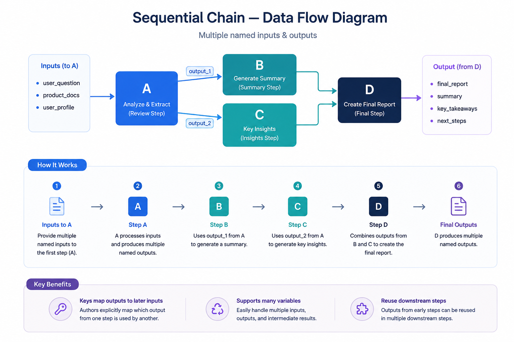
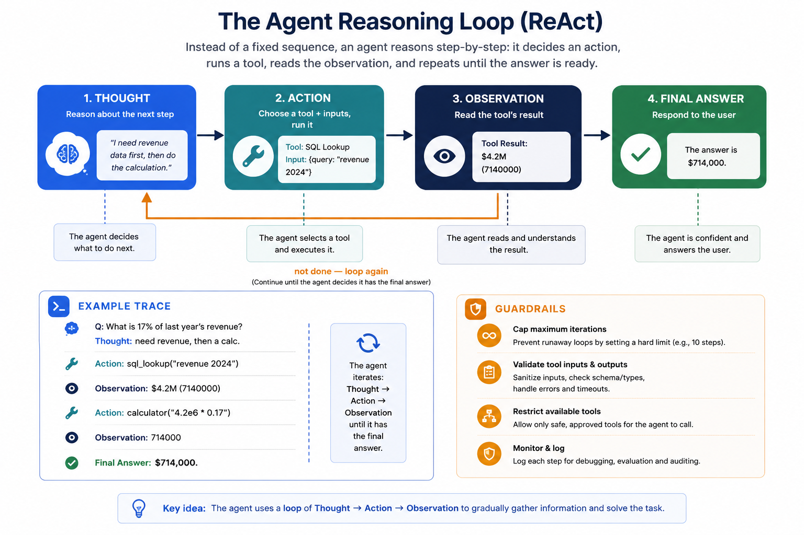
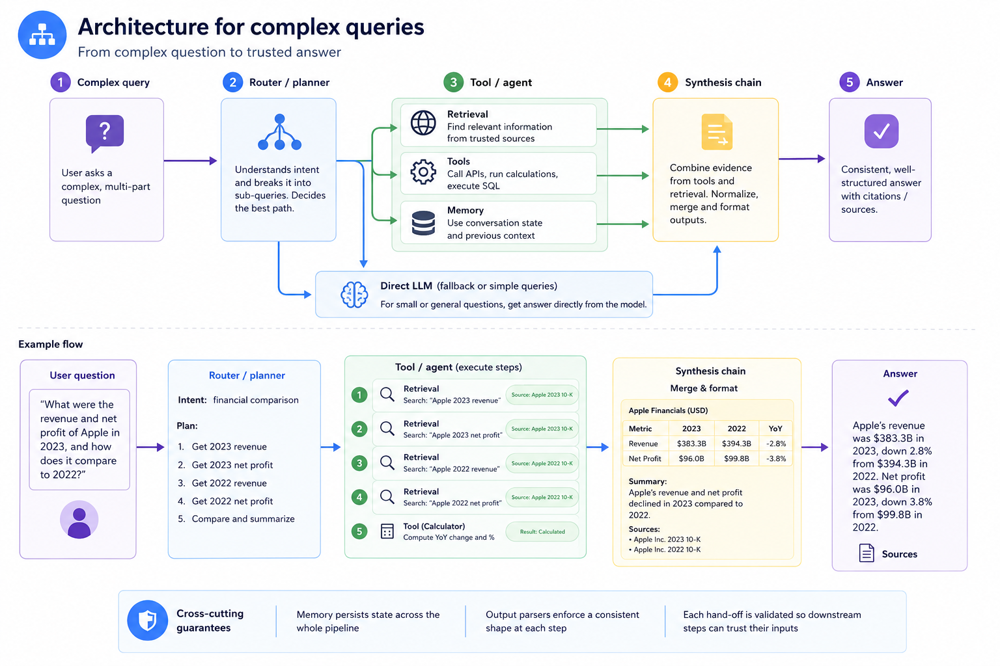

# Components of LangChain

## 1. PROMPTS & TEMPLATES

- Create structured and variable-driven prompts.
- Template with `{variables}`
- Prompt Engineering Tools

## 2. LLM MODELS

- Integrate Large Language and Chat Models.
- GPT-4, Claude, Llama 3
- Model I/O Management

## 3. RETRIEVAL & RAG

- Index, Connect, and Retrieve External Data.
- Document Loaders
- Text Splitters
- Embeddings Vector DB
- Retrievers

## 4. CHAINS (LCEL)

- Orchestrate sequences of LangChain components.
- LCEL (LangChain Expression Language)
- Simple to complex chains

## 5. MEMORY

- Store and access conversational context.
- Chat Message History
- ConversationBufferMemory
- Context Management

## 6. AGENTS

- Dynamically choose which actions to take.
- Reasoning and Planning
- Dynamic Action Selection

## 7. TOOLS

- Perform actions using external APIs and services.
- Search Engine, Calculator, Wikipedia API, Database Query

---

# What is a "Chain" in LangChain?

**FOUNDATIONS**

A chain is a reusable, composable sequence of calls. Each link takes structured input, does one job either formats a prompt, calls a model, parse output, fetch data and passes its result to the next link.

## Key Characteristics

- **Modularity**
  Swap a model, prompt, or parser without touching the rest.
- **Reusability**
  The same chain runs across inputs, datasets and apps.
- **Reliability**
  Small typed steps are easier to test, trace and debug than one mega-prompt.
- **Composability**
  Chains nest inside chains — the basis for multi-step pipelines.

## The Core Pattern

1. **Input variables**
   _(`{"question": "..."}`)_
   ⬇
2. **PromptTemplate**
   _(Fills a template string)_
   ⬇
3. **LLM / Chat model**
   _(Generates a completion)_
   ⬇
4. **OutputParser**
   _(Structures the raw text)_
   ⬇
5. **Result**
   _(Clean, typed output)_

# The LLMChain — the atomic chain

**CHAINING • BUILDING BLOCK**

## Core Flow

The diagram illustrates the sequential flow of data through an LLMChain:

1. **Inputs**
   _(e.g., `{topic}`)_
   ⬇
2. **Prompt Template**
   _(`format()`)_
   ⬇
3. **LLM**
   _(`predict()`)_
   ⬇
4. **Output Parser**
   _(`parse()`)_

---

## What an LLMChain Bundles

- **Inputs / Input Variables** — structural input key-value pairs passed to the chain (e.g., `{"topic": "RoPE"}`).
- **PromptTemplate** — declares input variables and the wording sent to the model.
- **LLM / ChatModel** — the engine; provider is swappable (OpenAI, Bedrock, Azure, local).
- **Output parser (optional)** — turns raw text into JSON, lists, or typed objects.
- **Memory (optional)** — reads/writes conversation state around each call.

---

## Code Implementation

```python
from langchain.prompts import PromptTemplate
from langchain.chains import LLMChain

prompt = PromptTemplate(
    input_variables=["topic"],
    template="Explain {topic} in 3 bullets."
)

chain = LLMChain(llm=model, prompt=prompt)
result = chain.invoke({"topic": "RoPE"})

# modern LCEL equivalent:
chain = prompt | model | StrOutputParser()
```

---

> **Note:** In current LangChain, LCEL (`prompt | model | parser`) is the idiomatic form; LLMChain is the classic, still-supported equivalent.

---

# LCEL — the LangChain Expression Language

**Overview:** LCEL composes components with the pipe operator `|`. It is the modern, recommended replacement for the legacy `LLMChain` / `SequentialChain` classes.

---

## Core Pipeline Flow

```

[ Prompt ]  |  [ Model ]  |  [ Parser ]  -->  [ Output ]

```

> _Every component is a `Runnable` with the same interface — so they snap together with `|`, and the whole chain is itself a `Runnable` you can nest in another._

---

### ONE CHAIN, EVERY RUN MODE

```python
chain = prompt | model | StrOutputParser()

chain.invoke({"topic": "ROPE"}) # one
chain.batch([a, b, c])          # many
for tok in chain.stream(x):     # stream
    print(tok, end="")
await chain.ainvoke(x)          # async

# define once -> sync, async, batch,
# and streaming all come for free

```

### COMPOSE ONCE — GET THIS FOR FREE

- **Streaming** — token-by-token as the model generates
- **Async** — `ainvoke` / `astream` on every step
- **Batch & parallel** — many inputs executed together
- **Fallbacks & retries** — graceful degradation built in
- **Tracing** — every step observable in LangSmith

## LCEL in practice — composition patterns

**Overview:** Four everyday patterns. From a basic pipe to parallel fan-out, retrieval, and fallbacks — all built from the same `|` operator.

---

## Patterns Overview

### 1. Basic pipe + run modes

```python
from langchain_core.output_parsers \
    import StrOutputParser

chain = prompt | model | StrOutputParser()
chain.invoke({"topic": "RoPE"})
chain.batch([a, b, c])
```

---

### 2. Parallel fan-out (RunnableParallel)

```python
from langchain_core.runnables \
    import RunnableParallel

fan = RunnableParallel(
    summary=summarize, keywords=extract_kw)
fan.invoke(doc)  # both run concurrently

```

---

### 3. RAG with passthrough

```python
from langchain_core.runnables \
    import RunnablePassthrough

rag = ({"context": retriever,
        "question": RunnablePassthrough()}
       | rag_prompt | model | StrOutputParser())

```

---

### 4. Fallbacks & branching

```python
from langchain_core.runnables \
    import RunnableBranch

robust = primary.with_fallbacks([backup])
router = RunnableBranch(
    (is_code, code_chain), default_chain)
```

# Simple Sequential Chain

> **Overview:** Runs chains back-to-back. The single text output of one chain becomes the single input of the next — no variable names, just one value flowing through.

---

## Data Flow Diagram


---

## Key Usage & Example

### Use It When

- **Single Output Dependency:** Each step needs only the previous step's result.
- **Linear Execution:** The flow is strictly linear — no branching.
- **Simplicity:** You want the simplest possible multi-step setup.
- **No State Retention:** Intermediate values don't need to be referenced later.

### Code Implementation

```python
from langchain.chains import SimpleSequentialChain

overall = SimpleSequentialChain(
    chains=[name_chain, tagline_chain, ad_chain],
    verbose=True
)

overall.run("eco-friendly water bottle")
# -> passes one string down the line

```

## Sequential Chain Data Flow Diagram:



# SimpleSequential vs. SequentialChain

**Overview:** Comparison between linear single-value chaining (`SimpleSequentialChain`) and multi-variable key-mapped chaining (`SequentialChain`).

---

## Architecture Comparison

## Comparison Table

| Property                   | SimpleSequentialChain  | SequentialChain                      |
| :------------------------- | :--------------------- | :----------------------------------- |
| **Variables per step**     | Single (unnamed)       | Multiple (named keys)                |
| **Branch / reuse outputs** | No                     | Yes — by output key                  |
| **Setup complexity**       | Minimal                | Moderate                             |
| **Best for**               | Quick linear pipelines | Richer workflows with shared context |

# Retrieval-Augmented Generation flow

**Overview:** A retriever fetches the most relevant documents for a query so the model answers from your data, not just its training. This is the backbone of RAG.

### Visual Representation


# Retriever types & when to use them

**Overview:** A breakdown of different retriever strategies, how they work, and the specific scenarios where they excel.

---

## Retriever Types

- **Vector store retriever**
  Embeds query, returns nearest neighbours by cosine/dot similarity. The default for semantic search.

- **Hybrid / BM25 + dense**
  Blends keyword (sparse) and semantic (dense) scores — robust to exact terms and paraphrase alike.

- **Contextual compression**
  Re-ranks and trims retrieved chunks so only the relevant spans reach the prompt; saves tokens.

- **Multi-query retriever**
  LLM rewrites the question into several variants, retrieves for each, then de-duplicates results.

- **Parent-document**
  Searches small chunks but returns their larger parent for fuller context.

- **Self-query retriever**
  LLM extracts metadata filters from natural language (e.g. "after 2023" → date filter).

---

## Best Practice

> _Rule of thumb: start with a vector retriever, add hybrid + re-ranking when precision matters, and self-query when users filter by attributes._

# Memory types — keeping conversational state

**Overview:** Chains are stateless by default. Memory stores and re-injects prior turns so a multi-turn conversation stays coherent. Each type trades token cost against fidelity.

---

## Memory Types Comparison

| Memory type                   | What it stores                                 | Token cost      | Best for                              |
| :---------------------------- | :--------------------------------------------- | :-------------- | :------------------------------------ |
| **ConversationBufferMemory**  | Full verbatim transcript of every turn         | Grows unbounded | Short chats; max fidelity             |
| **ConversationBufferWindow**  | Only the last k turns                          | Bounded by k    | Long chats; recent context matters    |
| **ConversationSummaryMemory** | A running LLM-generated summary                | Low & stable    | Long sessions; gist over detail       |
| **Summary-Buffer (hybrid)**   | Recent turns verbatim + older turns summarised | Bounded         | Balance of recall and cost            |
| **EntityMemory**              | Structured facts about key entities            | Low             | Tracking people/objects across turns  |
| **VectorStore-backed**        | Embeds turns; retrieves relevant ones          | Retrieval-based | Very long histories; selective recall |

---

## Key Idea

> _Memory is just another input variable — it loads prior context into the prompt before the model call, then saves the new turn after it._

# How memory is injected into a chain

**Overview:** A step-by-step look at how memory integrates into an LLM chain by loading prior context before prompt construction and saving the new interaction afterward.

---

## Injection Flow (The Loop)


_(Loops every turn: each turn reads prior context, then writes the new turn back to memory)._

---

## Code Implementation

```python
from langchain.memory import ConversationBufferWindowMemory

memory = ConversationBufferWindowMemory(k=4)
chain = ConversationChain(llm=model, memory=memory)
chain.predict(input="Where did we leave off?")

```

---

## Watch the budget 💡

> _Buffer memory grows every turn and can blow the context window. Window or summary memory caps the size — pick based on how far back recall must reach._

---

# Tools — giving chains the power to act

**Overview:** A tool is a function the model can call: search, calculator, API, database, code runner. An agent is a chain that decides which tool to use, observes the result, and loops until it can answer.

---

## Anatomy of a tool

- **Name** — A short id the model references
- **Description** — Tells the model when to use it — critical for routing
- **Args schema** — Typed inputs (Pydantic) the model must fill
- **Function** — The actual code that runs and returns a result

```python
@tool
def search(q: str) -> str: ...
```

---

## Common Tool Types

| Tool Type             | Description                     |
| --------------------- | ------------------------------- |
| **Web search**        | Live facts & news               |
| **Math / code**       | Exact computation               |
| **SQL / DB**          | Query structured data           |
| **Retriever-as-tool** | Search your corpus              |
| **External APIs**     | Weather, CRM, internal services |
| **Custom functions**  | Any Python you wrap             |

# The agent reasoning loop (ReAct)

**Overview:** Instead of a fixed sequence, an agent reasons step-by-step: it decides an action, runs a tool, reads the observation, and repeats until the answer is ready.

---

## The ReAct Loop Flow



_(The agent loops through reasoning, acting, and observing until it has enough information to formulate a final response)._

---

## Example Trace

**Q:** What is 17% of last year's revenue?

**Thought:** need revenue, then a calc.

**Action:** `sql_lookup("revenue 2024")` → **Observation:** $4.2M

**Action:** `calculator("4.2e6 * 0.17")` → **Observation:** 714000

**Final Answer:** $714,000.

---

## ⚠️ Guardrails

- **Cap maximum iterations** to prevent runaway loops.
- **Validate and sanitise** tool inputs and outputs.
- **Restrict which tools** each agent may call.

# From chains to agents

**Overview:** A chain follows a path you hard-code. An agent hands control flow to the LLM: at each step it picks a tool, reads the result, and decides whether to keep going or answer.

---

## Control Flow Comparison


> _The LLM decides the path at runtime, looping until done._

---

## Anatomy of an Agent

| Component               | Description                                        |
| ----------------------- | -------------------------------------------------- |
| **LLM (reasoner)**      | Chooses the next action from the context.          |
| **Tools**               | The set of actions the agent can take.             |
| **Prompt + scratchpad** | Instructions plus the running action trace.        |
| **Output parser**       | Reads the LLM's chosen action and arguments.       |
| **AgentExecutor**       | Runtime loop: call tool, feed result back, repeat. |

# Types of agents & when to use them

**Overview:** A breakdown of the different agent architectures, highlighting their specific mechanics and when to apply them.

---

## Agent Taxonomy

| Agent Type                | Description                                                                                        |
| :------------------------ | :------------------------------------------------------------------------------------------------- |
| **Tool-calling agent**    | Uses the model's native tool-calling API to emit structured calls. The modern default.             |
| **ReAct agent**           | Interleaves reasoning and actions as plain text — works with any model, no native tool API needed. |
| **Structured-chat agent** | Chat models driving multi-input tools described as JSON schemas.                                   |
| **Conversational agent**  | ReAct plus memory for coherent, multi-turn, tool-using chat.                                       |
| **Self-ask with search**  | Breaks a question into follow-ups, each answered by one search tool.                               |
| **Plan-and-execute**      | A planner drafts the steps up front; an executor runs them in order.                               |

---

## 💡 Modern Practice

> **LangChain now builds custom agents with LangGraph** — explicit, inspectable state-machine control over the loop, rather than a fixed agent class.

# Workflows vs. agents — design patterns

**Overview:** Most production systems are workflows (LLMs on predefined paths), not fully autonomous agents. These are the building-block patterns. From fixed to fully dynamic.

---

## Design Patterns

| Pattern                  | Description                                                                              |
| :----------------------- | :--------------------------------------------------------------------------------------- |
| **Prompt chaining**      | Fixed sequence of LLM calls; each step refines the last, with optional validation gates. |
| **Routing**              | Classify the input, then dispatch it to a specialised prompt or chain.                   |
| **Parallelization**      | Run subtasks concurrently (sectioning), or sample several times and vote.                |
| **Orchestrator-workers** | A lead LLM decomposes a task, delegates to worker LLMs, then synthesises results.        |
| **Evaluator-optimizer**  | One LLM drafts, another critiques and scores; loop until it passes the bar.              |
| **Autonomous agent**     | Open-ended tool-use loop driven by environment feedback (ReAct-style).                   |

---

## 💡 Key Takeaway

> **Rule of thumb:** Workflows give predictable, cheaper results on predefined paths; agents let the model steer for flexibility at higher cost and latency. Start with the simplest pattern and add autonomy only when the task genuinely needs it.

# The kinds of memory an agent has

**Overview:** Agents juggle three memory horizons: a per-step working memory inside one run, conversational memory across a session, and a persistent store across sessions.

---

## The Three Memory Horizons

| Horizon               | Component          | Scope            | Function                                                                                                      | Persistence                           |
| :-------------------- | :----------------- | :--------------- | :------------------------------------------------------------------------------------------------------------ | :------------------------------------ |
| **Working memory**    | `agent_scratchpad` | WITHIN ONE RUN   | Holds the thought → action → observation steps of the current task so the LLM sees what it has already tried. | Ephemeral — reset on each invocation. |
| **Short-term memory** | `conversation`     | ACROSS A SESSION | Recent dialogue carried between turns via buffer, window, or summary memory.                                  | Same mechanisms as chain memory.      |
| **Long-term memory**  | `persistent store` | ACROSS SESSIONS  | Facts and past interactions saved in a store (usually a vector DB) and retrieved on demand.                   | Survives restarts; selective recall.  |

---

## Long-Term Memory (By Cognitive Type)

- **Episodic** — past interactions and events.
- **Semantic** — facts and domain knowledge.
- **Procedural** — instructions and learned skills (often the system prompt).

---

## 🔑 How the scratchpad works

> _Each loop, the executor formats prior `intermediate_steps` into `{agent_scratchpad}` and re-sends them, so the model always sees its own running trace._

# Types of completion APIs

**Overview:** Chains and agents ultimately call a model API. The shape of that call and what comes back determines what you can build on top.

---

## API Types Comparison

| API type                     | You send                 | You get back                    | Enables                         |
| :--------------------------- | :----------------------- | :------------------------------ | :------------------------------ |
| **Text completion**          | A single prompt string   | Completion text                 | Simple instruct tasks (legacy)  |
| **Chat completion**          | Role-tagged messages[]   | An assistant message            | Conversation — today's standard |
| **Tool / function calling**  | Messages + tool schemas  | Text or structured `tool_calls` | Agents that take actions        |
| **Structured output / JSON** | Messages + a JSON schema | Schema-valid JSON               | Reliable, parseable results     |
| **Streaming / stateful**     | Messages (+ prior state) | Incremental tokens              | Low-latency, multi-turn UX      |

---

## The Call Shape Changes

### Text Completion

```python
# text completion
completions.create(
    prompt="Summarise: ...")
```

### Chat Completion

```python
# chat completion
chat.completions.create(
    messages=[
        {"role":"system", ...},
        {"role":"user", ...}])

```

### Tool Calling

```python
# tool calling
resp = chat.completions.create(
    messages=msgs, tools=[schema])
resp.choices[0].message \
    .tool_calls    # structured!

```

---

## 💡 One interface, many providers

> _LangChain wraps all of these behind a single model abstraction. The same chain runs on OpenAI Chat Completions, the Anthropic Messages API, Bedrock or a local model — swap the provider without rewriting the pipeline._

Here is the structured Markdown representation of the content from the current video slide:

# Worked example: a support agent

_Two custom tools (order DB + courier API) and conversation memory. The agent decides which tool to call, chains the calls, and answers — no hard-coded sequence._

---

## Code Implementation

```python
from langchain_core.tools import tool
from langchain.agents import (
    create_tool_calling_agent, AgentExecutor)

@tool
def lookup_order(order_id: str) -> dict:
    '''Get an order's status + tracking.'''
    return db.get(order_id)

@tool
def check_shipping(carrier: str,
                   tracking: str) -> str:
    '''Latest delivery ETA for a parcel.'''
    return courier_api.eta(carrier, tracking)

tools = [lookup_order, check_shipping]
agent = create_tool_calling_agent(
    model, tools, prompt)

exe = AgentExecutor(agent=agent, tools=tools,
                    memory=memory, max_iterations=4)

exe.invoke({"input":
    "Where's order A123 & when does it arrive?"})
```

---

## RUN TRACE

- **User:** Where's order A123 & when will it arrive?
- **-> tool_call** `lookup_order("A123")`
- **<-** `{carrier:"UPS", tracking:"1Z9", shipped}`
- **-> tool_call** `check_shipping("UPS","1Z9")`
- **<-** `"Arriving tomorrow by 8 PM"`
- **Final:** Order A123 shipped via UPS, arriving tomorrow by 8 PM.

---

## Agent Flow Diagram

The slide also includes a flowchart demonstrating how "memory threads turns together":

1. **User** input goes to the **Agent**.
2. The **Agent** calls the `lookup_order` tool.
3. The agent subsequently calls the `check_shipping` tool based on the result.
4. The final **Answer** is generated and returned to the user.

## Architecture for complex queries

Real questions combine retrieval, reasoning, tools and synthesis. Compose smaller chains into one pipeline with a router deciding the path per query.



# Worked example: a research assistant

**MULTI-STEP CHAINS • IN PRACTICE**

_Query: "Compare our Q4 churn to the industry and draft a one-paragraph summary." This needs internal data + web facts + reasoning + writing._

---

## Step-by-Step Flow

1.  **Retrieve internal**
    Vector retriever pulls Q4 churn figures from company docs.
2.  **Tool call**
    Web-search tool fetches current industry churn benchmarks.
3.  **Reason / compute**
    LLM compares the two; calculator verifies the delta.
4.  **Synthesize**
    A writing chain drafts the one-paragraph summary.
5.  **Parse / format**
    Output parser returns `{summary, metrics}` as clean JSON.

> ℹ️ _Each `|` is a hand-off; swap any stage without rewriting the rest — that is the payoff of composition._

---

## Code Implementation

```python
from langchain_core.runnables import RunnableParallel
from langchain_core.output_parsers import JsonOutputParser

# 1+2 gather context in parallel
context = RunnableParallel(
    internal = retriever,
    industry = web_search_tool,
)

# 3+4+5 reason, write, structure
pipeline = (
    context
    | compare_prompt
    | model
    | JsonOutputParser()
)

pipeline.invoke({"period": "Q4"})
```

# Best practices & common pitfalls

> **PRODUCTION**

---

## ✅ Do

- **Keep links small** — One responsibility per chain — easier to test and trace.
- **Use output parsers** — Enforce typed/JSON outputs so hand-offs never break silently.
- **Write strong tool descriptions** — The model routes on them; vague text = wrong tool calls.
- **Cap memory & iterations** — Bound window size and agent loops to control cost and runaways.
- **Trace everything** — Log each step (LangSmith) to debug multi-step failures fast.

---

## ⚠️ Avoid

- **One giant prompt** — Hard to debug, brittle, and impossible to reuse partially.
- **Unbounded buffer memory** — Silently overflows the context window on long chats.
- **Blind trust in tool output** — Validate and sanitise before feeding results back to the model.
- **Over-retrieving** — Too many chunks dilute the prompt and raise cost — re-rank and trim.
- **No failure path** — Tools error and models hallucinate; add fallbacks and retries.
