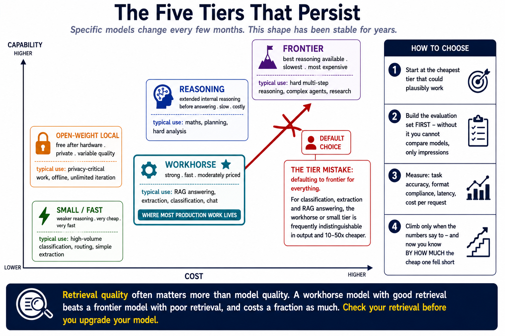

# Appendix C: Model Landscape

> **How to choose a model — and where to find current facts.** Specific model names, prices and context windows change every few months. This appendix teaches the selection method and points at authoritative live sources, so it stays useful as the names churn.

**Referenced from:** [Module 2 §2.11](../modules/02-python-and-environment.md#211-your-first-api-call) · [Module 3 §3.9](../modules/03-tokens-embeddings-similarity.md#39-the-context-window) · [Module 12 §12.1](../modules/12-fine-tuning.md#121-the-decision)

---

> ### ⚠️ Read this first
>
> **This file deliberately contains almost no specific model names, prices or benchmark numbers.**
>
> That's not laziness. Any such list is wrong within months, and a stale table in a teaching resource is worse than no table — people quote it. Everything below is either a durable *method* or a link to a source that maintains itself.
>
> **For current facts, go to the provider's own documentation.** Links are in [Where to find current facts](#where-to-find-current-facts).

**Last reviewed:** the structure below was written to survive model churn. If something here contradicts a provider's docs, the docs are right.

---

## Contents

- [Where to find current facts](#where-to-find-current-facts)
- [The tiers that persist](#the-tiers-that-persist)
- [How to choose](#how-to-choose)
- [Reading a pricing page](#reading-a-pricing-page)
- [Context windows](#context-windows)
- [Embedding models](#embedding-models)
- [Open weights vs open source](#open-weights-vs-open-source)
- [Benchmarks, and their limits](#benchmarks-and-their-limits)
- [Handling model deprecation](#handling-model-deprecation)
- [How to update this file](#how-to-update-this-file)

---

## Where to find current facts

**Always go to the source.** These pages are maintained by the people who set the numbers.

| What you need | Where |
|---|---|
| **OpenAI** models, pricing, limits | [platform.openai.com/docs/models](https://platform.openai.com/docs/models) · [pricing](https://openai.com/api/pricing/) |
| **Anthropic** models, pricing | [docs.anthropic.com](https://docs.anthropic.com/en/docs/about-claude/models) · [pricing](https://www.anthropic.com/pricing) |
| **Google** Gemini models | [ai.google.dev/gemini-api/docs/models](https://ai.google.dev/gemini-api/docs/models) |
| **Open-weight models** | [huggingface.co/models](https://huggingface.co/models) |
| **Local models** | [ollama.com/library](https://ollama.com/library) |
| **Embedding model rankings** | [MTEB leaderboard](https://huggingface.co/spaces/mteb/leaderboard) |
| **Cross-provider price comparison** | Several third-party trackers exist; verify against the provider before relying on one |

> **💡 Bookmark the two you actually use.** Checking a provider's model page before starting a project takes thirty seconds and saves you writing code against a deprecated name.

---

## The tiers that persist

Specific models change; **this shape has been stable for years** and is a safer thing to reason with.

| Tier | Characteristics | Typical use |
|---|---|---|
| **Frontier** | Best reasoning available; slowest; most expensive | Hard multi-step reasoning, complex agents, research |
| **Workhorse** | Strong, fast, moderately priced. **Where most production work lives.** | RAG answering, extraction, classification, chat |
| **Small/fast** | Weaker reasoning; very cheap; very fast | High-volume classification, routing, simple extraction |
| **Reasoning** | Extended internal reasoning before answering; slow; costly | Maths, planning, hard analysis |
| **Open-weight local** | Free after hardware; private; variable quality | Privacy-critical work, offline, unlimited iteration |



Providers usually offer something in each tier, named to signal position — a "mini", "flash", "haiku" or "nano" suffix generally means small and fast.

### The tier mistake people make

**Defaulting to frontier for everything.** Module 12 §12.1 makes the argument: for classification, extraction and RAG answering, the workhorse or small tier is frequently indistinguishable in output and 10–50× cheaper.

**Test the cheap one first.** You can only justify the expensive one against a measurement, and Module 11 gave you the harness to produce it.

---

## How to choose

A decision procedure that doesn't depend on which models exist this month.

### 1. Start at the cheapest tier that could plausibly work

For most of what this course builds — RAG answering, structured extraction, classification — that's the small or workhorse tier.

### 2. Build the evaluation set first

Module 11 §11.7. Twenty to fifty real cases with known-correct answers. **Without this you cannot compare models**, only impressions.

### 3. Measure, don't assume

| Measure | Because |
|---|---|
| **Task accuracy** | The only reason to pay more |
| **Format compliance** | Small models fail structured output more often (Module 5 §5.8) |
| **Latency** | Including time to first token (Module 13 §13.9) |
| **Cost per request** | Multiply out to your real volume |

### 4. Climb only when the numbers say to

If the cheap model passes your evaluation set, you're done. If not, you now know **by how much** it fell short — which tells you whether a better model, a better prompt, or better retrieval is the fix.

> **🔑 Module 8's lesson generalises: retrieval quality often matters more than model quality.** A workhorse model with good retrieval beats a frontier model with poor retrieval, and costs a fraction as much. Check your retrieval before you upgrade your model.

### 5. Pin the model, and record it

```python
MODEL = "gpt-4o-mini"    # one constant, one line to change
```

Every lab in this course does this. It means a model change is a one-line diff you can attribute a quality change to — and Module 11 §11.12's drift monitoring depends on knowing which model produced which results.

---

## Reading a pricing page

Four things people miss.

**1. Input and output are priced separately, and output costs more** — often 3–5×. So a system generating long answers costs disproportionately more than one that reads a lot and answers briefly.

```python
cost = (input_tokens / 1e6) * input_price + (output_tokens / 1e6) * output_price
```

**2. Cached input is usually cheaper.** Most providers discount repeated prompt prefixes substantially. This is why Module 6 §6.3 recommends putting stable content in the system prompt: it's cacheable.

**3. Images are priced as tokens**, and the count depends on resolution. Module 10 §10.2 has the arithmetic and the surprising result: above a threshold, bigger images cost the same and buy nothing.

**4. Fine-tuned models usually cost more per token** than their base. Module 12 §12.11's break-even calculation exists because of this.

### Do the multiplication before you deploy

```python
per_request = 0.002
for volume in (1_000, 100_000, 10_000_000):
    print(f"{volume:>12,} requests: ${per_request * volume:>12,.2f}")
```

A cost that's invisible per call is very visible at volume. **This takes thirty seconds and has saved a great many people an uncomfortable conversation.**

---

## Context windows

The trend has been strongly upward — from a couple of thousand tokens to a million and beyond — and it will keep moving. **What doesn't change is the shape of the constraint:**

| Property | Why it persists |
|---|---|
| **One shared budget** | Prompt, history, retrieved documents and the answer all compete (Module 3 §3.9) |
| **Cost grows quadratically** | Attention compares every token with every other (Module 4 §4.3) |
| **Recall sags in the middle** | "Lost in the middle" (Module 3 §3.9) |
| **You pay per token** | A large window you fill is a large bill |

> **⚠️ A big context window is not a replacement for retrieval.** A focused 2,000-token context routinely beats an unfocused 100,000-token one — better answers, faster, and roughly 50× cheaper. Module 8's chunking and re-ranking don't become obsolete when windows grow; they become the reason you can use a smaller one.

---

## Embedding models

Chosen differently from chat models, and the choice is stickier.

| Consideration | Why |
|---|---|
| **Dimension** | Drives storage, memory and query latency roughly linearly (Module 7 §7.11) |
| **Max input length** | Determines how large a chunk can be |
| **Language coverage** | Check it covers *your* languages, not just English |
| **Local or hosted** | Local is free and private; hosted is often stronger on nuance |

> **🔑 Changing your embedding model means re-indexing everything.** Query and documents must be embedded by the same model or the vectors aren't comparable — and nothing errors, results just become nonsense (Module 3 §3.7). **Record which model built your index, in the index metadata.**

That stickiness means embedding choice deserves more care than chat-model choice. Chat models you can swap in a line; embeddings you re-index a corpus for.

**Where to look:** the [MTEB leaderboard](https://huggingface.co/spaces/mteb/leaderboard) ranks embedding models with dimensions listed. Treat it as a starting point — Module 7 §7.5's argument applies: benchmark results don't transfer to your data, so measure on yours.

---

## Open weights vs open source

A distinction that matters commercially and is frequently blurred.

| | Meaning |
|---|---|
| **Open weights** | You can download and run the model. Licence terms vary and may restrict use. |
| **Open source** | Weights, training code *and* data available under an OSI-approved licence. Rare. |

**Most "open" models are open-weight, not open-source.** Some licences restrict commercial use, impose conditions above a user threshold, or forbid particular applications.

> **⚠️ Read the licence on the model card before building a product on it.** "It's on Hugging Face" tells you nothing about whether you may use it commercially. This is a real and recurring source of unpleasant surprises.

---

## Benchmarks, and their limits

Public benchmarks are useful for coarse comparison and misleading for specific decisions.

| Problem | Detail |
|---|---|
| **Contamination** | Benchmark data may be in the training set |
| **Overfitting to the test** | Providers optimise for the metrics that get reported |
| **Poor transfer** | Aggregate scores say little about *your* task |
| **Self-reported** | Vendor benchmarks favour vendors |

**Use them to shortlist. Use your own evaluation set to decide.** Module 11 §11.7 is the whole point: twenty to fifty real cases from your domain tell you more than any leaderboard.

> **💡 A useful heuristic: if two models are close on a public benchmark, treat them as equivalent** and choose on price, latency and reliability instead. Benchmark gaps smaller than a few points rarely survive contact with a specific task.

---

## Handling model deprecation

Models get retired. Plan for it.

| Practice | Effect |
|---|---|
| **Pin the model in one constant** | One-line migration |
| **Subscribe to provider changelogs** | You hear before your app breaks |
| **Keep the evaluation set current** | You can verify a replacement in an hour |
| **Log which model served each request** | You can correlate a quality change with a model change |
| **Have a fallback configured** | Module 6 §6.8's `.with_fallbacks()` |

**A fine-tuned model is the hard case.** It's tied to its base, and when that base is retired you redo the entire pipeline — data, training, evaluation. Module 12 §12.11 lists this as an ongoing cost people forget. A prompt migrates in an afternoon.

---

## How to update this file

If you're maintaining this course, keep this appendix **method-first**. The temptation is to add a table of current models and prices; resist it, or accept that you're signing up to update it monthly.

**Safe to add:**
- New *categories* of model, if a genuinely new tier appears
- Links to authoritative sources
- Durable selection heuristics

**Avoid:**
- Specific prices
- Specific context-window sizes
- Benchmark scores
- "The best model for X is Y"

If you do add specifics, **date them inline** so a reader can judge staleness:

```markdown
As of March 2026, the workhorse tier prices around $0.15/1M input tokens.
```

> A reader who sees a date can discount appropriately. A reader who sees a bare number assumes it's current — which is exactly how stale figures propagate.

---

<div align="center">

**[🏠 Course README](../README.md)** · **[💻 Local stack](A-local-stack.md)** · **[📖 Glossary](B-glossary.md)** · **[🔧 Troubleshooting](D-troubleshooting.md)**

</div>
