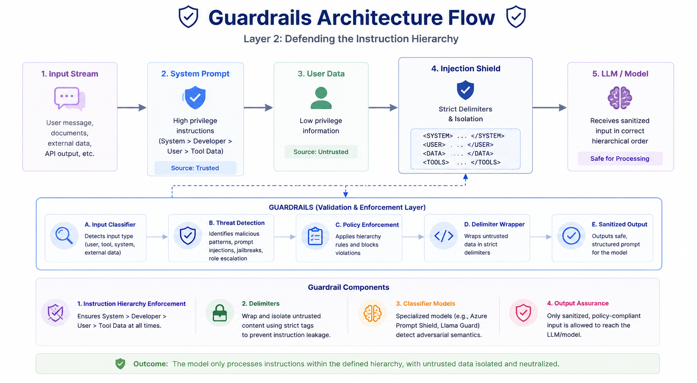
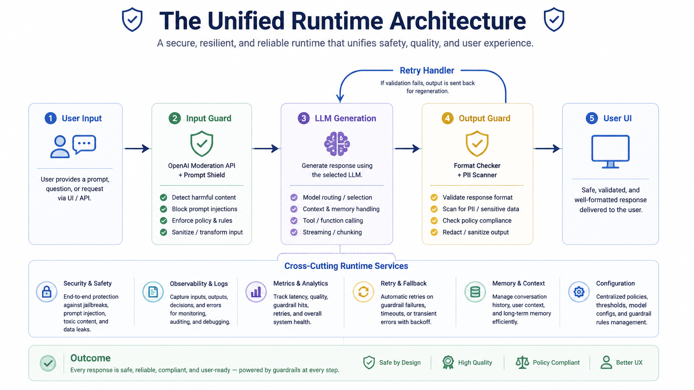
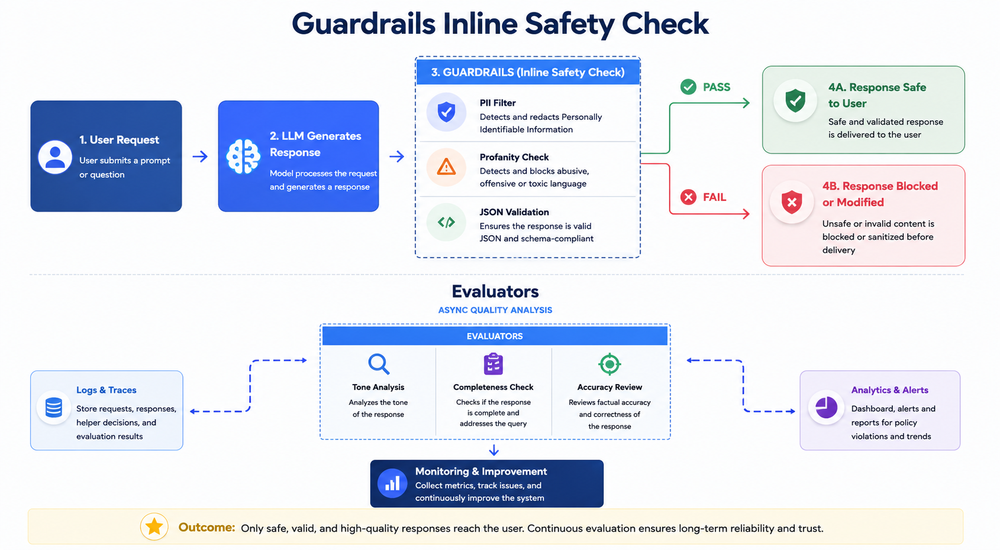

**Defining the Roles**

**Guardrails (The Seatbelt)**
Deterministic, inline safety checks that operate in real-time. Their goal is to **block catastrophic failures** before they impact the user.

_Generative AI Guardrails Focus Areas:_

- **Ethical Considerations:** Responsible AI deployment
- **System Security:** Protection from threats
- **Operational Efficiency:** Cost-effective AI usage
- **Legal Compliance:** Adherence to regulations
- **Data Protection:** Ensuring data integrity
- **No Impact:** No environmental concerns

---

**Evaluators (The Scorecard)**
Diagnostic tools that measure quality and drift. Their goal is to **inform improvement**, tracking metrics like groundedness and bias over time.

_Top 5 LLM Evaluation Metrics:_

- **Accuracy:** Measures the proportion of correct predictions out of total predictions.
- **Precision and Recall:** Precision checks correct positive predictions, while recall captures all relevant ones.
- **BLEU Score:** Assesses the quality of text generation by comparing it to reference outputs using n-gram overlaps.
- **F1 Score:** A harmonic mean of precision and recall, balancing their trade-off.
- **Perplexity:** Indicates how well a model predicts a sample, with lower values signifying better performance.

# Why Guardrails Matter

## Core Pillars

### 1. Brand Protection

Preventing toxic, inappropriate, or biased outputs that can cause severe reputational damage and legal liability.

---

### 2. Reliability

Ensuring factual accuracy, reducing hallucinations, and maintaining consistent behavior aligned with user intent.

---

### 3. System Security

Protecting backend databases and preventing unauthorized actions triggered by malicious prompt injections.

# The Semantic Gap

---

## [Traditional Software]

- **Architecture:** Code and data are strictly separated via architecture.
- **Behavior:** If user data attempts to execute as code, the compiler or database throws a deterministic error (e.g., SQL injection prevention via parameterized queries).

---

## [Large Language Models]

- **Architecture:** Instructions and data share the exact same stream of natural language tokens.
- **Behavior:** The model processes everything within a single context window.

---

### Core Takeaway

LLMs do not fail by crashing. They fail quietly by following malicious data disguised as trusted instructions.

# The Threat Landscape (OWASP Top 10 LLM Risks)

---

## 1. Direct Prompt Injection

- **Summary:** The User attacks.
- **Details:** Malicious inputs designed to override system instructions (e.g., Jailbreaks). _(OWASP LLM01:2025)_

---

## 2. Indirect Prompt Injection

- **Summary:** The Data attacks.
- **Details:** Hidden instructions embedded in external content, like RAG documents or web pages.

---

## 3. Hallucinations

- **Summary:** The Model lies.
- **Details:** Outputting plausible but factually incorrect or ungrounded information.

---

## 4. Data Leakage

- **Summary:** The Model overshares.
- **Details:** Exposing Personally Identifiable Information (PII) or proprietary system prompts.

# Layer 1: The Moderation API Baseline

A highly optimized, parallel classifier that flags policy violations before the main LLM processes the prompt.

---

| Provider                                       | Efficacy (F1 Score) | Latency Impact |
| :--------------------------------------------- | :-----------------: | :------------: |
| **OpenAI Moderation** (omni-moderation-latest) |      **0.899**      |   **~191ms**   |
| Azure Content Safety                           |        0.757        |     ~52ms      |
| LLM-based Classifiers (e.g., PromptFoo)        |        0.592        |    ~1118ms     |

---

> **Summary:** Fast and reliable for predefined safety categories (Hate, Violence, Self-Harm). However, content moderation APIs do not stop prompt injection or jailbreaks.

# Moderation Categories & Interventions

| Category             | Example Trigger (Concept)                                                   | Recommended System Action                                              |
| :------------------- | :-------------------------------------------------------------------------- | :--------------------------------------------------------------------- |
| **Hate Speech**      | Derogatory statements targeting protected groups based on race or religion. | Hard block, return standard policy violation error, flag user account. |
| **Self-Harm**        | Inquiries on methods for self-injury or expressions of suicidal ideation.   | Intercept prompt, redirect output to local crisis helpline resources.  |
| **Violence/Graphic** | Detailed descriptions of violence or intent to commit violent acts.         | Block generation, log prompt securely for human moderation review.     |
| **Sexual**           | Explicit sexual content or solicitations.                                   | Filter output, apply content warning if in an age-restricted context.  |

# Layer 2: Defending the Instruction Hierarchy

---

## Architecture Flow

## 

## Key Defense Mechanisms

- **The Instruction Hierarchy:** Enforcing strict parsing rules where **System** > **Developer** > **User** > **Tool data**.
- **Delimiters:** Wrapping untrusted external data in strict `<data>` tags to isolate it from instructions.
- **Classifier Models:** Deploying specialized small models (e.g., Azure Prompt Shield, Llama Guard) trained specifically to detect adversarial semantics and instruction overrides.

# Defense-in-Depth Strategies

---

- **Explicit Delimiters:** Use strict boundaries like triple quotes (`"""`) or XML tags to clearly separate system instructions from untrusted user inputs.
- **Input Sanitization:** Strip, encode, or escape special characters and known injection phrases before the text reaches the primary language model.
- **Pre-flight LLM Checks:** Route the prompt through a smaller, faster model (e.g., Llama 3 8B) trained specifically to classify adversarial intent before processing.
- **Output Parsers & Validation:** Strictly type and validate the expected JSON or structured output to ensure the model wasn't manipulated into executing arbitrary code.

# Building Resilient Pipelines: The Retry Handler

Guardrails will inevitably trigger false positives, or the LLM will generate a blocked response. A retry handler ensures the application bends instead of breaking.

---

## Retry Loop Architecture

- **Initial Generation:** The LLM generates the primary response.
- **Output Guardrail (Triggers Flag):** Evaluates the output and flags any compliance, safety, or formatting failures.
- **Retry Handler:** Injects a targeted correction prompt (e.g., _"Your previous output violated formatting rules. Regenerate with corrections."_).
- **Regeneration (Max 3 attempts):** Loops back to regenerate output with injected corrections.

---

> **Graceful Degradation:** If all retries exhaust the budget, return a safe, pre-scripted fallback rather than a raw system error.

### The Unified Runtime Atchitecture

# Context is Everything: Generic vs. Custom Guardrails

---

## Generic Guardrails

- **Focus:** Hate, Violence, General Toxicity, Prompt Injection.
- **Solution:** Solved by out-of-the-box APIs and standard classifiers.

---

## Custom Guardrails

- **Focus:** Brand voice alignment, off-topic deflection, competitor mentions, exact JSON schema enforcement.
- **Implementation:** Requires "LLM-as-a-Judge" routing or structured output parsing via Constrained Decoding (using finite state machines to mask output probability distributions).

# The Evaluation Harness: Catching Hallucinations

> _You cannot improve what you cannot measure. Before production, evaluate system outputs against Truthful QA sets._

---

## The RAG Evaluation Triad

- **Contextual Relevance:** Evaluates how well the **Retrieved Context** matches the intent of the **User Query** (minimizing noise).
- **Faithfulness (Hallucination Check):** Ensures the **LLM Answer** is strictly grounded in and supported by the **Retrieved Context**.
- **Answer Relevance:** Verifies that the generated **LLM Answer** directly addresses the original **User Query**.

# Assessing Output Quality

---

## Accuracy & Toxicity

_Evaluating the core content generated by the model._

- **Accuracy:** Measuring factual correctness using ground-truth datasets, RAG retrieval scores, and LLM-as-a-judge frameworks.
- **Toxicity:** Identifying and filtering hate speech, self-harm instructions, or NSFW content before it reaches the end-user.

---

## Latency & Drift

_Monitoring operational health and long-term consistency._

- **Latency:** Tracking Time-to-First-Token (TTFT) and total response times to ensure strict SLA compliance in real-time apps.
- **Drift:** Detecting statistical changes in model behavior or output distribution over time as underlying model weights change.

# Scaling Evaluation with LLM-as-a-Judge

---

## Evaluation Process

1. **Curate Golden Dataset:** Curate a 'Golden Dataset' of 100+ human-verified Q&A pairs to establish ground truth.
2. **Capture Traces:** Run the production LLM over the dataset queries and capture the traces.
3. **Frontier Model Evaluation:** Prompt a superior frontier model (e.g., GPT-4o) to act as a judge, comparing the pipeline's output against the Golden Dataset.

---

> **Crucial Rule:** Mandate 'Chain-of-Thought' (CoT) grading. The Judge must output its step-by-step reasoning before generating its final score. This eliminates known LLM-as-a-judge pitfalls like verbosity bias and position bias.

# The Latency vs. Quality Trade-off

---

| Pipeline Layer / Stage            | Total Cumulative Latency |
| :-------------------------------- | :----------------------: |
| **Base LLM Call**                 |          800ms           |
| **+ Content Moderation (Input)**  |          950ms           |
| **+ Content Moderation (Output)** |          1100ms          |
| **+ Pre-flight Injection Check**  |          1400ms          |

---

> **Key Takeaway:** Adding comprehensive guardrails significantly improves safety and output quality, but introduces a measurable latency penalty. Systems must balance security requirements with user experience SLAs.

# Synthesis: The Cost-Latency-Safety Matrix

---

## Trade-off Spectrum

| Tier                                   | Characteristics |   Latency   | Safety & Reliability |
| :------------------------------------- | :-------------- | :---------: | :------------------: |
| **Regex / Rule-based filtering**       | Fast, Brittle   |    ~1ms     |         Low          |
| **Azure / OpenAI Moderation APIs**     | Balanced        |  50–190ms   |       Moderate       |
| **LLM-as-a-Judge / Human-in-the-Loop** | Highly Reliable | 1–8 seconds |         High         |

---

> **The Golden Rule:** Use fast, deterministic checks for the runtime hot path; reserve LLM Judges for asynchronous evaluation and pre-production test harnesses.

# Building Resilient Systems

---

## 1. Exponential Backoff

Gradually increasing wait times between retries (e.g., 1s, 2s, 4s) to prevent overwhelming the API during sudden outages.

---

## 2. Jitter

Adding randomness to the backoff interval to prevent a 'thundering herd' problem when thousands of clients retry simultaneously.

---

## 3. Circuit Breakers

Halting all requests to a failing service after a threshold of errors is met, allowing the upstream API time to recover gracefully.

### Guardrails Inline Safety Check

