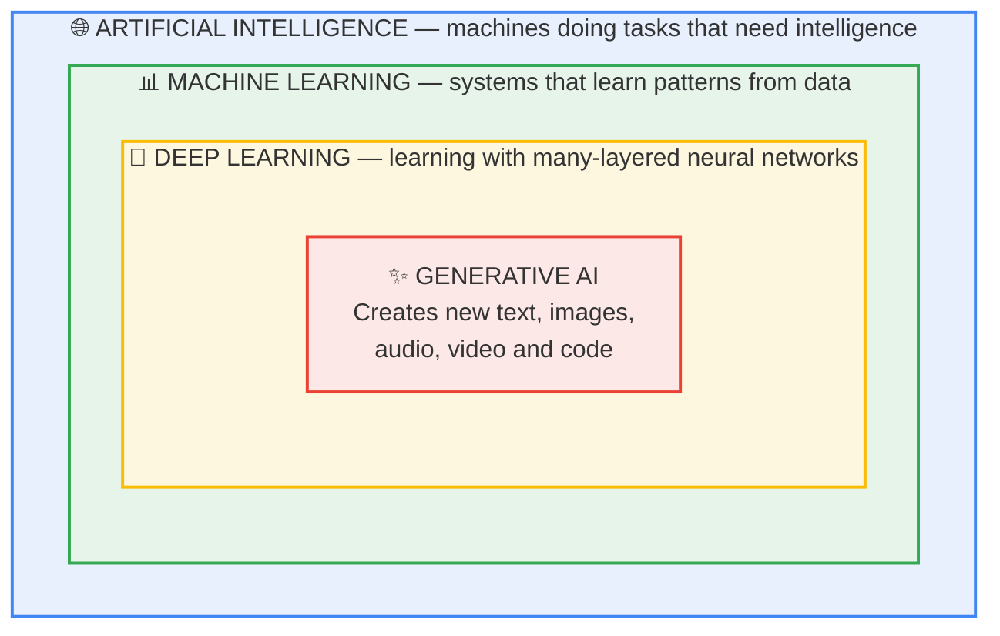
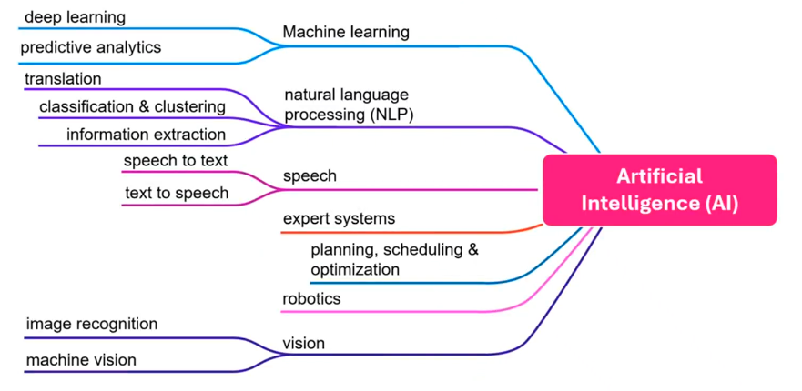
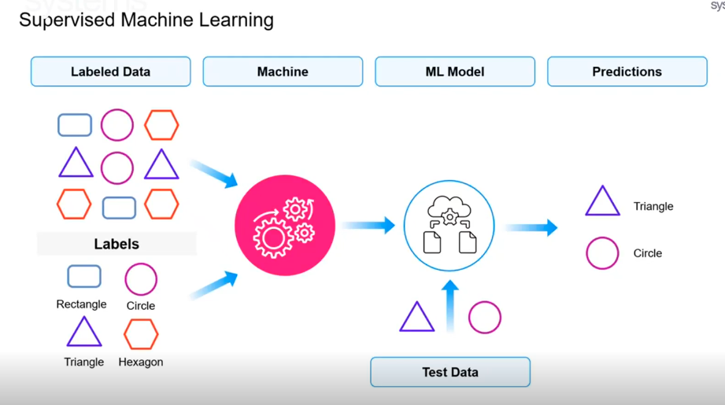

# Module 1: Foundations — AI, ML, DL & Generative AI

> **By the end of this module** you'll be able to take any AI product you encounter — a spam filter, a self-driving car, ChatGPT — and say precisely what kind of system it is and roughly how it works. You'll also be able to explain, in plain English, how a chatbot produces a sentence.

| | |
|---|---|
| **Time** | ~75 minutes (50 min reading, 25 min lab) |
| **Prerequisites** | None whatsoever |
| **You need** | A web browser. No installs, no accounts, no code. |
| **Cost** | Free |

---

## Contents

- [1.0 Why This Matters](#10-why-this-matters)
- [1.1 The Big Picture: Four Nested Circles](#11-the-big-picture-four-nested-circles)
- [1.2 Artificial Intelligence: The Outer Circle](#12-artificial-intelligence-the-outer-circle)
- [1.3 Machine Learning: Learning From Examples](#13-machine-learning-learning-from-examples)
- [1.4 Deep Learning: Layers That Find Their Own Features](#14-deep-learning-layers-that-find-their-own-features)
- [1.5 Generative AI: Models That Produce, Not Just Judge](#15-generative-ai-models-that-produce-not-just-judge)
- [1.6 A Second Way to Sort AI: Narrow, General, Super](#16-a-second-way-to-sort-ai-narrow-general-super)
- [1.7 How a Large Language Model Actually Works](#17-how-a-large-language-model-actually-works)
- [1.8 Generative AI vs Agentic AI](#18-generative-ai-vs-agentic-ai)
- [1.9 The Vocabulary Map](#19-the-vocabulary-map)
- [🧪 Hands-On Lab 1](#-hands-on-lab-1)
- [✅ Key Takeaways](#-key-takeaways)
- [⚠️ Common Mistakes & Misconceptions](#️-common-mistakes--misconceptions)
- [📚 Going Deeper](#-going-deeper)

---

## 1.0 Why This Matters

Four words get used interchangeably in almost every article you'll read: **AI**, **machine learning**, **deep learning**, and **generative AI**. They are not synonyms. They're four circles nested inside each other, and mixing them up causes real, practical problems.

Here's a concrete example. Suppose your company says: *"We need AI to reduce customer support load."*

Depending on which circle you're actually in, the answer is completely different:

| Interpretation | What you'd build | Time & cost |
|---|---|---|
| Rule-based AI | A decision tree: "if the message contains 'refund', route to billing" | Days. Nearly free. |
| Machine learning | A classifier trained on 50,000 past tickets to predict the right department | Weeks. Needs labelled data. |
| Generative AI | An assistant that reads your help docs and writes the reply itself | Days. Needs an API key and guardrails. |

All three are "AI." Choosing the wrong one wastes months. By the end of this module you'll be able to tell them apart instantly — and that skill is what the remaining thirteen modules are built on.

There's a second reason this module exists. Almost everything that confuses people about ChatGPT — why it invents facts, why it can't do arithmetic reliably, why it gives you a different answer the second time you ask — follows directly from *how it works*. Section 1.7 explains that mechanism. Get it now and the rest of the course will feel obvious rather than magical.

---

## 1.1 The Big Picture: Four Nested Circles

Before any definitions, hold this shape in your head:



Read it from the outside in. Each circle is a **subset** of the one containing it:

- **All** generative AI is deep learning.
- **All** deep learning is machine learning.
- **All** machine learning is AI.
- But **not** all AI is machine learning — a chess program from 1985 that follows hand-written rules is AI with no learning in it at all.

That last point is the one people get wrong most often. "AI" is the broad, old, umbrella term. It does not imply learning.

**Analogy.** Think of *vehicles* → *cars* → *electric cars* → *Teslas*. Every Tesla is an electric car; not every vehicle is a Tesla. When someone says "we bought a vehicle," you've learned very little. The same is true when a press release says "powered by AI."

---

## 1.2 Artificial Intelligence: The Outer Circle

### Definition

**Artificial Intelligence** is the broad field of building machines that perform tasks we'd normally consider to require human intelligence — understanding language, recognising images, planning, making decisions.

The term was coined in 1956, long before machine learning was practical. For its first several decades, most AI was **rule-based**: humans wrote the rules explicitly and the computer followed them.

### The two families

| | **Rule-based (symbolic) AI** | **Learning-based AI** |
|---|---|---|
| Where do the rules come from? | A human writes them | The system infers them from data |
| Example | A thermostat; a tax-filing wizard; a chess engine's opening book | A spam filter; a face unlock; ChatGPT |
| Strength | Fully predictable and auditable — you can read every rule | Handles messy, subtle patterns no human could enumerate |
| Weakness | Brittle. Every new case needs a new hand-written rule. | Opaque. Hard to explain *why* it decided something. |

### Read this code — don't run it

You'll write and run plenty of Python from Module 2 onward. For now, just read. This is a rule-based spam filter:

```python
# ---------------------------------------------------------------
# RULE-BASED APPROACH
# A human (you) decides every rule in advance.
# ---------------------------------------------------------------

def is_spam_rule_based(email_text):
    """Return True if the email looks like spam, using hand-written rules."""

    # The human author lists the suspicious words by hand.
    spam_words = ["free money", "click here", "you won", "viagra"]

    # Lower-case the text so "FREE MONEY" also matches.
    text = email_text.lower()

    # If ANY listed word appears, call it spam.
    for word in spam_words:
        if word in text:
            return True

    return False


print(is_spam_rule_based("Click here for FREE MONEY!"))  # True  ✅ caught it
print(is_spam_rule_based("C.l.i.c.k h.e.r.e now!"))      # False ❌ missed it
```

Notice the failure on the last line. A spammer adds full stops between letters and the rule collapses. You could add a rule for that — and then they'll use `Сlick` with a Cyrillic С, and you'll add another rule, forever. **This is the fundamental limit of rule-based AI: you must anticipate every case in advance.**

Machine learning exists to escape exactly this trap.

### The breadth of the field

AI covers far more than chatbots. Traditional sub-fields include:

- **Natural Language Processing (NLP)** — classification, clustering, information extraction, translation
- **Speech** — speech-to-text, text-to-speech
- **Computer Vision** — image recognition, object detection, machine vision
- **Expert systems** — encoding a specialist's knowledge as rules
- **Planning, scheduling & optimisation** — routing delivery vans, allocating airline crews
- **Robotics** — physical systems that sense and act



> **📌 Worth knowing:** Generative AI has absorbed a lot of attention, but the majority of AI actually running in production today — fraud detection, recommendations, logistics, credit scoring — is *not* generative. It's classification and prediction, and it works extremely well. GenAI is a powerful new tool, not a replacement for the rest of the field.

---

## 1.3 Machine Learning: Learning From Examples

### Definition

**Machine Learning** is the subset of AI where the system finds the rules itself, by looking at examples, rather than being given the rules by a programmer.

### The core idea, stated as a swap

This is the single most important sentence in the module:

> **Traditional programming:** you supply the *rules*, and the computer produces the *answers*.
> **Machine learning:** you supply the *answers* (examples), and the computer produces the *rules*.

```
TRADITIONAL PROGRAMMING          MACHINE LEARNING
─────────────────────────        ─────────────────────────
   Data  ──┐                        Data     ──┐
           ├──▶  Answers                       ├──▶  Rules  (the "model")
   Rules ──┘                        Answers  ──┘
```

### The classic example

You want a program that recognises cats in photos.

**The rule-based attempt:** "A cat has two pointed ears, whiskers, four legs, fur..." You immediately hit trouble. What about a cat curled up with its ears hidden? Photographed from behind? A hairless Sphynx? A cat in shadow? You cannot write enough rules.

**The machine learning approach:** show the system 100,000 photos, each labelled *cat* or *not cat*. It works out for itself which visual patterns distinguish them. Nobody ever writes down "look for whiskers" — and in fact the patterns it finds are usually not ones a human would have described.

### The three-step loop


1. **Train** — feed the system many examples.
2. **Learn** — it adjusts its internal numbers (**parameters**) until its guesses on those examples are mostly right. This adjusting *is* the learning.
3. **Predict** — show it something it has never seen and it applies what it learned.

The output of steps 1–2 is called a **model**: a file full of numbers that encodes the learned patterns. Training is expensive and slow; using a trained model (**inference**) is fast and cheap. That asymmetry shapes the entire industry — including why you'll rent access to someone else's enormous model via an API rather than training your own.

### Two words you'll see constantly

| Term | Meaning | Analogy |
|---|---|---|
| **Parameters** (or *weights*) | The adjustable numbers inside a model. Learning = tuning these. | The knobs on a mixing desk. Training turns the knobs until the sound is right. |
| **Training** vs **Inference** | Training = learning from examples. Inference = using the finished model. | Training = studying for the exam. Inference = sitting it. |

When you read "a 70-billion-parameter model," that means 70 billion tuned knobs.

### How machines learn: the five paradigms

Not all learning works the same way. The difference is **what kind of feedback the system gets**.

#### 1. Supervised learning — learning with an answer key

Every training example comes with the correct answer attached (a **label**).



- **How it works:** show it 10,000 photos, each tagged 🐱 *cat* or 🐶 *dog*. It learns the difference, then classifies new photos.
- **Used for:** spam detection, house-price prediction, medical image screening, credit scoring
- **The catch:** somebody has to create the labels. For 100,000 examples, that's expensive and slow. This bottleneck is why paradigm 5 matters so much.

#### 2. Unsupervised learning — finding structure with no answer key

No labels at all. The system groups things by similarity.


- **How it works:** give it 10,000 untagged customer records. It discovers there are, say, four natural groups. It cannot tell you what they mean — a human interprets them as "bargain hunters," "loyal regulars," and so on.
- **Used for:** customer segmentation, anomaly detection, topic discovery, recommendation systems
- **The catch:** you get groups, not answers. Interpretation is on you.

#### 3. Reinforcement learning — learning from reward and penalty

No answer key. Instead, the system acts, and gets a score.

- **How it works:** exactly like training a dog 🐕. Good action → treat 🍪. Bad action → nothing. Over thousands of attempts, it learns which actions earn rewards.
- **Used for:** game-playing AI (AlphaGo, chess), robotics, self-driving simulation
- **The catch:** it needs to fail thousands of times to learn. Fine in a simulator; unacceptable in a real car on a real road.

> **💡 Why this matters later:** a variant called **RLHF** (Reinforcement Learning from Human Feedback) is how ChatGPT and Claude were taught to be *helpful* rather than merely fluent. Humans ranked candidate responses; the model was rewarded for producing the preferred ones. You'll meet RLHF again in Modules 5 and 12.

#### 4. Semi-supervised learning — a few labels, mostly not

A small labelled set plus a large unlabelled one. A pragmatic middle ground when labelling is expensive: label 1,000 examples by hand, use the patterns in the other 99,000 to sharpen the result.

#### 5. Self-supervised learning — the answer key hides in the data

This one is the key to everything that follows, and it's the paradigm your intuition is least likely to have.

The system **creates its own labels from the structure of the raw data**. No human labels anything.

For text, the trick is beautifully simple: **hide the next word and try to predict it.** The hidden word *is* the label — and it was already sitting there in the sentence.

```
Training text:  "The capital of France is Paris."

Turn it into a self-made exercise:
    Input:              "The capital of France is ___"
    Correct answer:     "Paris"      ← already in the data. Nobody labelled it.
```

Repeat across trillions of words from books, code and the web. Every single word in every sentence becomes a free training example.

**Why this changed everything:** supervised learning needs humans to label data, so it caps out at maybe millions of examples. Self-supervised learning needs no humans, so it scales to *trillions*. That's the unlock that made large language models possible. To learn to fill in the blank across a huge diversity of text, a model has to pick up grammar, facts, reasoning patterns, translation, and code — because all of those help it predict the missing word.

> **🔑 Remember this:** LLMs are trained by **self-supervised learning** — predicting hidden text. Everything strange about how they behave traces back to this one fact. We'll return to it in Section 1.7.

### Summary table

| Paradigm | Feedback it gets | Everyday example | Goal |
|---|---|---|---|
| **Supervised** | Labelled answers | Spam detection | Predict a known target |
| **Unsupervised** | Nothing | Customer segmentation | Discover structure |
| **Reinforcement** | Rewards & penalties | Teaching a robot to walk | Learn a good strategy |
| **Semi-supervised** | A few labels | Medical imaging with limited expert time | Stretch scarce labels |
| **Self-supervised** | Labels it makes itself | **How LLMs are trained** | Learn general structure at scale |

---

## 1.4 Deep Learning: Layers That Find Their Own Features

### Definition

**Deep Learning** is machine learning using **neural networks with many layers**. "Deep" refers to the number of layers — nothing more mysterious than that.

### What a neural network is

Loosely inspired by the brain — and the analogy shouldn't be pushed far — a neural network is a stack of layers of simple maths units ("neurons"). Each neuron takes numbers in, multiplies them by its weights, adds them up, and passes the result on.

One neuron is trivial. Millions arranged in layers can represent extraordinarily complex relationships.

### Why depth is the whole point

Here's the key idea, using face recognition:


| Layer | What it learns to detect |
|---|---|
| **Layer 1** | Edges, corners, patches of colour |
| **Layer 2** | Combinations of edges — curves, corners, textures |
| **Layer 3** | Parts — an eye, a nose, the corner of a mouth |
| **Layer 4** | Arrangements of parts — a whole face |
| **Layer 5** | *This particular* face |

Each layer builds on the previous one, from simple to complex. **Nobody programmed "look for eyes."** The layers discovered that eyes were a useful intermediate concept, entirely on their own, because it helped them predict correctly.

This is the difference that matters:

| | **Classical machine learning** | **Deep learning** |
|---|---|---|
| Who chooses what to look for? | A human engineer designs the features ("measure ear-to-ear distance") | The network discovers its own features |
| Data appetite | Works with thousands of examples | Usually needs hundreds of thousands or more |
| Compute appetite | Runs on a laptop | Wants GPUs |
| Interpretability | Reasonably inspectable | Largely a black box |

That human step — deciding what to measure — used to be most of the job, and it was called **feature engineering**. Deep learning largely automated it away. That's why it took over.

**Analogy.** Learning to read. You don't start with whole books. You learn letter shapes, then letters into syllables, then syllables into words, then words into sentences, then sentences into meaning. Each level relies on the one below. A deep network does the same, and works out the intermediate levels for itself.

### The trade-off, stated honestly

Deep learning needs a lot of data and a lot of compute, and it's hard to inspect. For many real business problems — a few thousand rows in a spreadsheet — a simple classical model will beat a neural network, train in seconds, and let you explain the decision to an auditor. **Deep learning is not automatically the right answer.** It wins when you have huge amounts of messy, unstructured data: images, audio, text.

---

## 1.5 Generative AI: Models That Produce, Not Just Judge

### Definition

**Generative AI** is deep learning used to **create new content** — text, images, audio, video, code — rather than to classify, score, or predict a value.

### The distinction that actually matters

Nearly every model before roughly 2020 was **discriminative**: it took input and produced a judgement. Generative models produce **new artifacts**.

| | **Discriminative (traditional)** | **Generative** |
|---|---|---|
| Question it answers | "Which category is this?" | "What would plausibly come next?" |
| Input → output | Photo → `"cat"` | `"a cat in a spacesuit"` → a new photo |
| Output size | Small: a label, a number, a probability | Large: a paragraph, an image, a song |
| Example | Spam filter, credit scorer | ChatGPT, Midjourney, GitHub Copilot |
| Analogy | A **critic** who reviews the film | A **director** who makes the film |


### What it can create

| Modality | Example tools | What you give it |
|---|---|---|
| **Text** | ChatGPT, Claude, Gemini | A prompt → essays, emails, summaries, translations |
| **Images** | Midjourney, DALL·E, Stable Diffusion | A description → an image |
| **Code** | GitHub Copilot, Cursor | A comment or function name → working code |
| **Audio / music** | Suno, ElevenLabs | Text → speech or a song |
| **Video** | Sora, Runway, Pika | A description → a video clip |

### How it works, in one paragraph

The model is trained on an enormous amount of existing content. It learns the *statistical structure* of that content — which words tend to follow which, which pixels tend to sit next to which. To generate, it repeatedly answers "given everything so far, what plausibly comes next?" and appends the answer. Do that a few hundred times and you have a paragraph.

That's genuinely it. The next section unpacks it properly, because the consequences are where all the practical insight lives.

> **⚠️ A limitation worth internalising now:** a generative model optimises for **plausibility**, not truth. It produces text that *looks* like text a knowledgeable person would write. Usually plausible and true coincide. When they don't, you get a confident, fluent, completely false statement — a **hallucination**. This isn't a bug someone forgot to fix; it's a direct consequence of the training objective. Modules 8 and 11 are largely about engineering around it.

---

## 1.6 A Second Way to Sort AI: Narrow, General, Super

Sections 1.1–1.5 sorted AI by **technique**. There's a second axis: **how broad is its competence?** Both are in common use, which is a frequent source of confusion.

### 1. Narrow AI (ANI) — everything that exists today

AI that does one class of task, however impressively.

- **Examples:** every AI system in existence. Chess engines, spam filters, face unlock, self-driving software, **and ChatGPT**.
- **Key trait:** competence doesn't transfer outside its training. A world-champion chess engine cannot play checkers, and has no idea what chess *is*.

> **This deserves emphasis:** ChatGPT is narrow AI. It's remarkably *broad* narrow AI — it writes code, poetry and legal summaries — but it's still a system trained on one objective (predict text) that cannot step outside it. It doesn't set its own goals or learn from your conversation after training ends.

### 2. General AI (AGI) — hypothetical

AI matching human flexibility across essentially any intellectual task: learning a new skill from a couple of examples, transferring knowledge between unrelated domains, reasoning about genuinely novel situations.

- **Status:** does not exist. Whether current approaches lead there is actively, sharply disputed among researchers.
- **Be sceptical** of confident timelines in either direction. Nobody knows.

### 3. Superintelligence (ASI) — hypothetical and further out

AI substantially exceeding the best human performance across all domains: science, strategy, creativity, persuasion.

- **Status:** entirely speculative. It's a serious topic in AI-safety research and a staple of marketing hype. Tell the two apart by whether the speaker is selling something.

### Where we actually are

```
   ┌─────────────────────────────────────────────────────────────┐
   │  ▓▓▓▓▓▓▓▓▓▓▓▓▓▓▓▓▓▓▓▓▓  NARROW AI (ANI)  ░░░░  AGI  ░  ASI  │
   │  ▲                                                          │
   │  └── everything that exists, including every frontier model  │
   └─────────────────────────────────────────────────────────────┘
        ▓ = real, shipping today    ░ = hypothetical
```

Keep the two axes separate. **ChatGPT is: generative (by technique) + narrow (by breadth).** Both labels are correct and they describe different things.

---

## 1.7 How a Large Language Model Actually Works

This is the most important section in the module. Read it slowly.

### The one-sentence version

> **A large language model is a system that, given some text, predicts what text comes next — and generates by doing that over and over, feeding its own output back in.**

That's the whole mechanism. Everything else is detail.

### Step by step

Suppose you type: `The capital of France is`

**Step 1 — Split the text into tokens.** The model doesn't see letters or words; it sees **tokens**, which are words or word-fragments.

```
"The capital of France is"  →  ["The", " capital", " of", " France", " is"]
```

**Step 2 — Predict a probability for every possible next token.** Not one guess — a probability distribution across its entire vocabulary (typically 50,000–200,000 tokens):

```
 " Paris"    ████████████████████████████████████  87%
 " located"  ████                                   4%
 " a"        ██                                     2%
 " the"      █                                      1%
 " Berlin"   ▏                                    0.2%
 ...and ~199,995 others sharing the rest
```

**Step 3 — Pick one.** Usually a *sample* weighted by those probabilities, not automatically the top one. (Why? Because always taking the top choice makes text repetitive and lifeless. The setting that controls this is called **temperature** — Module 3.)

**Step 4 — Append it and go back to Step 2.**

```
Round 1:  "The capital of France is"           →  " Paris"
Round 2:  "The capital of France is Paris"     →  ","
Round 3:  "The capital of France is Paris,"    →  " and"
Round 4:  "The capital of France is Paris, and" → " it"
...
```

It stops when it generates a special *end-of-text* token, hits a length limit, or you cut it off.

### Read this code — don't run it

This is the loop in Python-shaped pseudocode. Every LLM in existence is a very sophisticated version of this:

```python
# ---------------------------------------------------------------
# THE AUTOREGRESSIVE LOOP — conceptually, the whole of text generation
# ("autoregressive" = it feeds its own output back into itself)
# ---------------------------------------------------------------

def generate(prompt, max_new_tokens=100):
    """Generate text by repeatedly predicting one more token."""

    # Start with what the user gave us, split into tokens.
    tokens = tokenize(prompt)

    for _ in range(max_new_tokens):

        # Ask the model for a probability over EVERY token in its
        # vocabulary, given everything generated so far.
        probabilities = model.predict_next(tokens)

        # Choose one token, weighted by those probabilities.
        next_token = sample_from(probabilities)

        # If the model signals "I'm done", stop.
        if next_token == END_OF_TEXT:
            break

        # Otherwise append it — and the loop now sees a longer sequence.
        tokens.append(next_token)

    return detokenize(tokens)
```

The critical line is `tokens.append(next_token)`. The model has no memory, no plan, and no internal notepad. On every single round it re-reads the entire text from the beginning and predicts one more token. What looks like sustained reasoning is this loop running hundreds of times.

### Six behaviours this explains

This is the payoff. Every one of these follows from the mechanism above.

| Observation | Why it happens |
|---|---|
| **It invents facts confidently** | It optimises for *plausible-sounding*, not *true*. A fabricated citation is highly plausible text. Nothing in the objective rewards truth. |
| **Same question, different answer** | Step 3 *samples* rather than always picking the top token. Randomness is deliberate. |
| **It's bad at arithmetic** | `4,271 × 8,392` is a calculation, not a text pattern. It's pattern-matching digits it has seen, not computing. (Fix: give it a calculator tool — Module 9.) |
| **"Think step by step" improves answers** | Each token is predicted from the visible text. Forcing intermediate steps into that text gives later tokens better material to build on. It literally has more to work with. (Module 5.) |
| **It forgets earlier conversation** | It re-reads everything each round, but only up to a fixed limit — the **context window**. Text beyond it is invisible. (Module 3.) |
| **It doesn't know recent events** | Training ended on a fixed date. It has no live connection to anything. (Fixes: RAG in Module 8, tools in Module 9.) |

Notice that none of these are oversights awaiting a patch. They're structural. **Most of this course is about engineering around them** — which is exactly why understanding the mechanism first makes everything downstream feel logical.

### What about "understanding"?

You'll see fierce arguments about whether LLMs "really understand" language. Two things are worth saying, and no more:

1. **Mechanically**, an LLM is doing next-token prediction over learned statistical structure. That's not in dispute.
2. **Whether that constitutes understanding** depends on what you think understanding is — and that's philosophy, not engineering. Reasonable, well-informed people disagree.

For building things, you can set the question aside. What matters is the practical rule: **treat output as a plausible draft to be verified, never as a fact to be trusted.** That rule holds regardless of who wins the philosophy argument.

---

## 1.8 Generative AI vs Agentic AI

"Agentic AI" is the current industry buzzword. Here's the actual distinction.

### Generative AI: produces content when asked

You prompt, it responds, it stops. One turn.

> You: "Write an email requesting leave."
> It: *writes the email.* Done.

### Agentic AI: pursues a goal across multiple steps

Wrap a generative model in a loop, give it tools, and let it decide what to do next. Now it can act.

> You: "Book me a flight to Karachi next Tuesday under $500."
> It: searches flights → compares prices → checks your calendar → fills the booking form → reports back.

The generative model is still the engine. What's new is the **loop**, the **tools**, and the **autonomy**.

### The three capabilities that make it agentic

1. **Plan** — break a goal into steps
2. **Act** — actually use tools: call APIs, search, run code, write files
3. **Reflect** — check the result and adapt if it failed

### Comparison

| | **Generative AI** | **Agentic AI** |
|---|---|---|
| Purpose | Create content | Achieve a goal |
| Steps | One | Many, decided as it goes |
| Uses tools? | No | Yes — that's the point |
| Human involvement | Every turn | Set the goal, then supervise |
| Fails how? | Bad output you can see and discard | Bad *actions* with real consequences |
| Analogy | A writer you commission | An assistant you delegate to |

> **⚠️ The risk changes shape.** A generative model that hallucinates gives you a wrong paragraph — annoying, and you can spot it. An *agent* that hallucinates might delete the wrong file or email the wrong client. Autonomy multiplies both usefulness and consequence, which is why Module 9 spends as much time on guardrails as on capability.

You'll build agents in Module 9. For now just hold the distinction: **generative = produces; agentic = acts.**

---

## 1.9 The Vocabulary Map

Your reference sheet for the rest of the course.

| Term | One-line meaning | Everyday example |
|---|---|---|
| **AI** | Machines doing tasks that need intelligence | The whole field |
| **Machine Learning (ML)** | AI that learns rules from examples | Spam filter |
| **Deep Learning (DL)** | ML using many-layered neural networks | Face unlock |
| **Generative AI** | DL that creates new content | ChatGPT, Midjourney |
| **Agentic AI** | Generative AI in a loop, with tools, pursuing a goal | An AI that books your travel |
| **LLM** | Large Language Model — a big text-predicting model | GPT, Claude, Gemini, Llama |
| **Narrow AI (ANI)** | Competent at one class of task. All AI today. | Everything that exists |
| **AGI** | Human-level breadth. Hypothetical. | — |
| **ASI** | Beyond human across the board. Speculative. | — |
| **Model** | The trained file of numbers that does the work | `llama-3-8b` |
| **Parameters / weights** | The adjustable numbers inside a model | "70 billion parameters" |
| **Training** | Teaching the model from data. Slow, expensive. | Done once by the model's creator |
| **Inference** | Using a trained model. Fast, cheap. | Every message you send ChatGPT |
| **Token** | A word or word-fragment; the model's unit of text | `"tokenizing"` → `["token", "izing"]` |
| **Prompt** | The text you give the model as input | "Explain gravity to a 10-year-old" |
| **Hallucination** | Confident, fluent, false output | An invented citation |
| **Context window** | How much text the model can see at once | "128,000 tokens" |
| **Supervised learning** | Learning from labelled examples | Cat/dog classifier |
| **Self-supervised learning** | Labels derived from the data itself. **How LLMs learn.** | Predict the hidden next word |
| **RLHF** | Reinforcement Learning from Human Feedback — tunes models to be helpful | Why ChatGPT is polite and useful |

Don't memorise this. You'll absorb it by using it, and this table will be here when you need it.

---

## 🧪 Hands-On Lab 1

**→ [Go to Lab 1: The AI Autopsy](../labs/01-foundations/README.md)**

Classify ten real systems, run three experiments on a chatbot that reveal the mechanism from Section 1.7, and train an actual machine learning model in your browser in five minutes.

Requires only a web browser. No installs, no API key, no code. Budget 25 minutes.

---

## ✅ Key Takeaways

1. **Four nested circles.** AI ⊃ Machine Learning ⊃ Deep Learning ⊃ Generative AI. Every generative model is deep learning; not all AI involves learning at all.

2. **Machine learning inverts programming.** Instead of supplying rules to get answers, you supply answers to get rules. That escape from hand-written rules is the entire reason ML exists.

3. **"Deep" just means many layers** — and each layer discovers its own useful intermediate concepts. Nobody programs "look for eyes."

4. **LLMs are trained by self-supervised learning:** predict the hidden next word. Because the labels come free from the data, this scales to trillions of examples. That scaling is what made LLMs possible.

5. **Generation is one loop.** Predict the next token, append it, repeat. There's no plan and no memory beyond the visible text.

6. **The model optimises for plausibility, not truth.** Hallucination is a structural consequence of the training objective, not a bug awaiting a fix.

7. **Two independent axes.** Technique (rule-based / ML / DL / generative) and breadth (narrow / general / super). ChatGPT is *generative* **and** *narrow*.

8. **Generative produces; agentic acts.** Adding a loop and tools turns a content generator into something that takes real action — with correspondingly real consequences.

---

## ⚠️ Common Mistakes & Misconceptions

<br>

> ### ❌ "AI and machine learning are the same thing"
> **Reality:** ML is a subset. A rule-based expert system is AI with zero learning. This matters commercially — "powered by AI" is often a hand-written decision tree.

<br>

> ### ❌ "ChatGPT searches the internet for answers"
> **Reality:** Base text generation involves no lookup at all. It generates token by token from learned patterns. *Some products* bolt on a search tool (and will cite links when they do), but that's an added capability — Module 9. This misconception is the single biggest source of surprise about hallucinations: people expect retrieval and get generation.

<br>

> ### ❌ "Hallucinations are a bug that will be fixed in the next version"
> **Reality:** They follow directly from optimising for plausible text. Better models hallucinate *less often* and are *harder to catch* when they do. The engineering answer is grounding (RAG, Module 8) and verification (evaluation, Module 11) — not waiting.

<br>

> ### ❌ "The model learns from my conversations"
> **Reality:** Weights are frozen after training. Within one chat it appears to remember because the whole conversation is re-sent as input every turn. Start a new chat and it's gone. (Some products add a separate memory feature that stores notes and re-injects them — again, added machinery, not learning.)

<br>

> ### ❌ "More parameters always means better"
> **Reality:** Data quality, training method and fine-tuning matter enormously. Well-trained small models routinely beat larger older ones — and are cheaper and faster. Module 12 covers picking the right size.

<br>

> ### ❌ "AGI is nearly here" / "AGI is impossible"
> **Reality:** Both are confident claims about an open research question. Serious researchers disagree sharply. Treat any specific timeline — in either direction — as an opinion, and check what the speaker is selling.

<br>

> ### ❌ "Deep learning is always the best approach"
> **Reality:** For a few thousand rows of tabular data, a simple model will often beat a neural network, train in seconds, and let you explain the decision to a regulator. Deep learning wins on large, messy, unstructured data — text, images, audio.

<br>

> ### ❌ "Generative AI has made traditional ML obsolete"
> **Reality:** Most ML in production today is classification and prediction — fraud detection, recommendations, forecasting, logistics. It works well and is far cheaper than an LLM call. GenAI added a new capability; it didn't delete the old ones.

---

## 📚 Going Deeper

Entirely optional. Nothing here is needed for Module 2.

**Watch**
- [3Blue1Brown — *But what is a neural network?*](https://www.youtube.com/watch?v=aircAruvnKk) (19 min) — the best visual explanation of neural networks ever made
- [Andrej Karpathy — *Deep Dive into LLMs like ChatGPT*](https://www.youtube.com/watch?v=7xTGNNLPyMI) — long, and worth every minute once you've finished Module 4

**Play**
- [Google Teachable Machine](https://teachablemachine.withgoogle.com/) — train a real classifier in your browser in five minutes (this is the Lab 1 stretch challenge)
- [OpenAI Tokenizer](https://platform.openai.com/tokenizer) — paste text, see the tokens (you'll use this properly in Module 3)

**Read**
- [*Attention Is All You Need*](https://arxiv.org/abs/1706.03762) — the 2017 paper that started all of this. Don't try it yet; revisit after Module 4 and it'll be readable.

---

<div align="center">

**[⬅ Back to README](../README.md)** · **[🧪 Do Lab 1](../labs/01-foundations/README.md)** · **➡️ Module 2: Python & Your Environment** *(coming next)*

</div>
