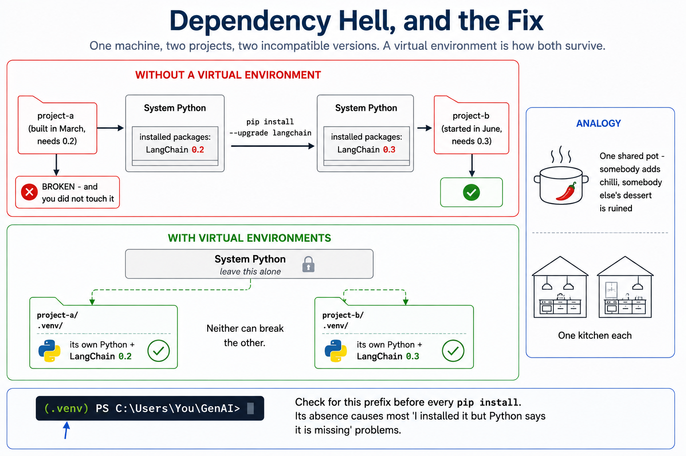
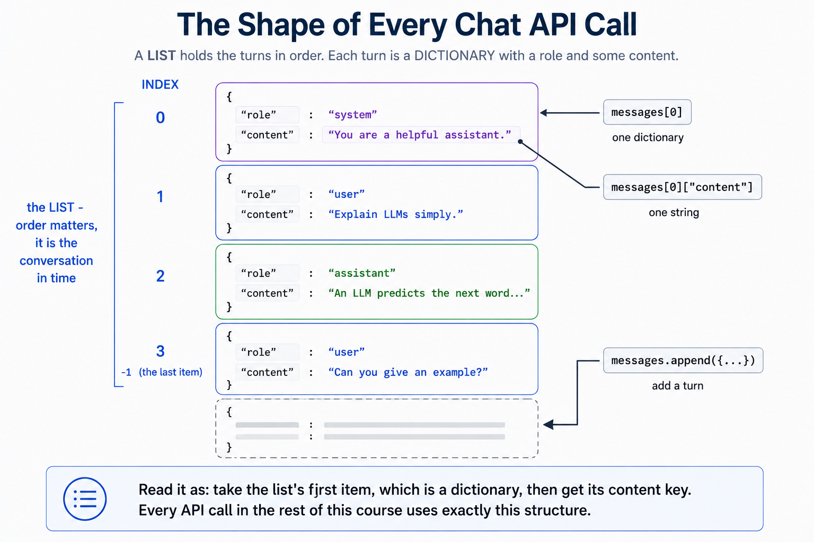
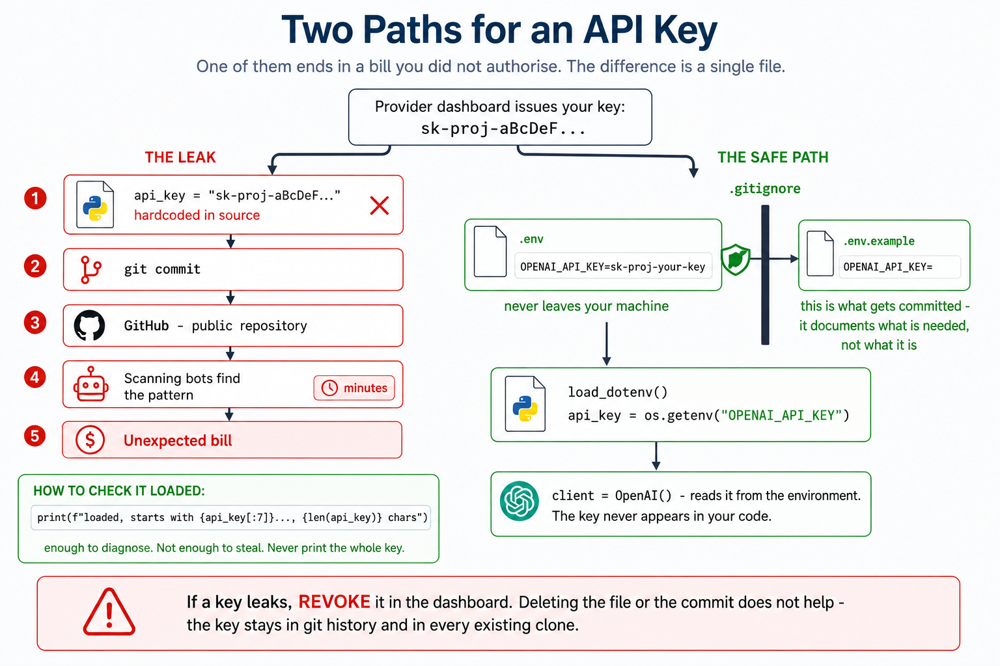

# Module 2: Python & Your Environment

> **By the end of this module** you'll have a working Python setup, understand why virtual environments exist, be able to read and write the Python you need for this course, know how to keep an API key from leaking, and have made your first real call to a language model from code.

| | |
|---|---|
| **Time** | ~2.5 hours (90 min reading + doing, 60 min lab) |
| **Prerequisites** | [Module 1](01-foundations.md) |
| **You need** | A computer where you can install software, and a browser |
| **Cost** | Free, or ~$0.001 for the final section (one API call) |

---

## Contents

- [2.0 Why This Matters](#20-why-this-matters)
- [2.1 The Terminal: Five Commands](#21-the-terminal-five-commands)
- [2.2 Installing Python](#22-installing-python)
- [2.3 Virtual Environments: Why Before How](#23-virtual-environments-why-before-how)
- [2.4 Installing Packages With pip](#24-installing-packages-with-pip)
- [2.5 Python I: Variables and Types](#25-python-i-variables-and-types)
- [2.6 Python II: The Four Containers](#26-python-ii-the-four-containers)
- [2.7 Python III: Decisions, Loops and Functions](#27-python-iii-decisions-loops-and-functions)
- [2.8 Imports: Using Other People's Code](#28-imports-using-other-peoples-code)
- [2.9 Notebooks: Jupyter and Colab](#29-notebooks-jupyter-and-colab)
- [2.10 API Keys: How Not to Leak Money](#210-api-keys-how-not-to-leak-money)
- [2.11 Your First API Call](#211-your-first-api-call)
- [🧪 Hands-On Lab 2](#-hands-on-lab-2)
- [✅ Key Takeaways](#-key-takeaways)
- [⚠️ Common Mistakes & Misconceptions](#️-common-mistakes--misconceptions)
- [📚 Going Deeper](#-going-deeper)

---

## 2.0 Why This Matters

This is the least glamorous module in the course and the one most likely to make or break you.

Almost everyone who abandons a GenAI tutorial abandons it here — not because the AI concepts were hard, but because `pip install` threw a wall of red text, or the code that worked yesterday stopped working today, or they pasted an API key into a file, pushed it to GitHub, and got an email about a $400 bill.

So this module is deliberately thorough about the boring parts. **You do not need to become a Python programmer.** You need roughly 20% of the language — enough to read a script, change it, and understand the error when it breaks. That's what's here. Nothing more.

Two things in particular are worth your patience:

- **Section 2.3 (virtual environments)** prevents a category of problem that is genuinely maddening to debug once you have three projects on one machine.
- **Section 2.10 (API keys)** prevents a category of problem that costs actual money.

If you're short on time, skim the Python sections — they're reference material you'll come back to — but read 2.3 and 2.10 properly.

> **📌 Genuinely stuck at any point?** Two escape hatches: (1) [Google Colab](https://colab.research.google.com/) runs everything in your browser with nothing installed — skip to §2.9 and use that for the whole course; (2) `appendix/D-troubleshooting.md` lists the specific errors people hit here and their fixes.

---

## 2.1 The Terminal: Five Commands

The **terminal** (also *command line*, *shell*, *console*) is a text window where you type commands instead of clicking. You'll use it constantly, and you need five commands.

### Opening it

| OS | How |
|---|---|
| **Windows** | Press `Win`, type `powershell`, press Enter. *(Use PowerShell, not the old `cmd`.)* |
| **macOS** | Press `Cmd+Space`, type `terminal`, press Enter |
| **Linux** | `Ctrl+Alt+T`, or search "Terminal" |

You'll see a **prompt** — something like `PS C:\Users\You>` or `you@laptop ~ %`. It's waiting for input. The prompt text itself is not something you type.

### The five commands

Throughout this course, when you see a command block, type the command **after** the prompt symbol. Don't type the prompt.

**1. Where am I?**

```powershell
# Windows PowerShell
pwd
```
```bash
# macOS / Linux
pwd
```

Prints your current folder — the "working directory". Every command runs relative to it, which is the source of about a third of all beginner confusion.

**2. What's in here?**

```powershell
# Windows
ls
```
```bash
# macOS / Linux
ls
```

Lists files and folders in the current directory.

**3. Move somewhere**

```powershell
cd Documents          # go into the Documents folder
cd ..                 # go UP one level
cd "F:\Programming\AI\GenAI"   # jump to an exact path (quotes handle spaces)
```

`cd` = "change directory". **This is the command you'll use most**, and forgetting to `cd` into your project folder is the single most common reason a command "doesn't work".

**4. Make a folder**

```powershell
mkdir my-project
```

**5. Stop a running program**

Press **`Ctrl+C`**. Not a typed command — a key combination. It interrupts whatever is running. Learn it now; you'll need it when a script hangs.

### Three shortcuts that save real time

| Trick | What it does |
|---|---|
| **`Tab` key** | Auto-completes file and folder names. Type `cd Doc` then `Tab` → `cd Documents`. Use this constantly; it prevents typos. |
| **`↑` arrow** | Recalls your previous command. Press repeatedly to go further back. |
| **Drag and drop** | Drag a folder from your file explorer onto the terminal window to paste its full path. |

> **💡 Windows note:** this course's commands are written for **PowerShell**, which is the default on Windows 11. PowerShell understands `ls`, `pwd` and `cd`, so most commands look identical across all three operating systems. Where they differ, both versions are shown.

---

## 2.2 Installing Python

### Check whether you already have it

```powershell
python --version
```

**If you see `Python 3.10.x` or higher** (3.11, 3.12, 3.13...) — you're done. Skip to §2.3.

**If you see `Python 2.7.x`** — that's a different, long-dead language. Install Python 3.

**If you see an error, or nothing, or a Microsoft Store window opens** — install Python.

> **On macOS/Linux**, try `python3 --version` as well. Many systems reserve the bare name `python` for an old version and put the current one under `python3`.

### Installing

**Windows**

1. Go to [python.org/downloads](https://www.python.org/downloads/)
2. Download the latest **Python 3.x** installer
3. Run it — and **⚠️ tick the box that says "Add python.exe to PATH"** on the very first screen

That checkbox is easy to miss and causes the single most common Windows error: `python: command not found`. If you missed it, re-run the installer and choose **Modify**.

4. Click **Install Now**
5. **Close and reopen your terminal** — it only reads PATH when it starts
6. Verify: `python --version`

**macOS**

The system Python is old and shouldn't be touched. Install a current one:

```bash
# Option A — installer (simplest)
# Download from python.org/downloads and run it

# Option B — Homebrew, if you have it
brew install python
```

Verify with `python3 --version`.

**Linux (Debian/Ubuntu)**

```bash
sudo apt update
sudo apt install python3 python3-pip python3-venv
python3 --version
```

### `python` vs `python3` vs `py`

A persistent source of confusion:

| Command | Where it usually works |
|---|---|
| `python` | Windows; also inside an activated virtual environment on any OS |
| `python3` | macOS and Linux |
| `py` | Windows only — a launcher that finds your Python installations |

**Find yours now and remember which it is.** In this course I write `python`; substitute `python3` if that's what your machine uses.

Once you activate a virtual environment (next section), **`python` works everywhere** — one of several reasons to always use one.

---

## 2.3 Virtual Environments: Why Before How

### The problem, concretely

You build Project A in March. It needs LangChain version 0.2.

In June you start Project B, which needs LangChain 0.3. You run `pip install --upgrade langchain`.

**Project A now breaks**, because 0.3 renamed things 0.2 used. You have one Python installation, one set of installed packages, and two projects with incompatible needs. You cannot satisfy both.

This is **dependency hell**, and in the fast-moving GenAI ecosystem — where breaking changes ship monthly — you will hit it within weeks.

### The solution

A **virtual environment** is a private, self-contained folder holding its own copy of Python and its own packages, used by one project only.

```
Your computer
│
├── 🌐 System Python              ← leave this alone
│
├── 📁 project-a/
│   └── .venv/  →  LangChain 0.2  ← Project A sees only this
│
└── 📁 project-b/
    └── .venv/  →  LangChain 0.3  ← Project B sees only this
```



Both projects work. Neither can break the other.

**Analogy.** A shared kitchen where everyone dumps ingredients into one pot — someone adds chilli, someone else's dessert is ruined. A virtual environment gives each cook their own kitchen.

> **🔑 The rule:** one project, one virtual environment. Always. It takes fifteen seconds and prevents hours of debugging. Professional Python developers do this without thinking, and skipping it is the mark of someone who is about to have a bad afternoon.

### Creating one

Navigate to your project folder first — **this matters**, because the environment is created wherever you currently are:

```powershell
cd "F:\Programming\AI\GenAI"     # your project folder
python -m venv .venv
```

Breaking that down:

- `python -m venv` — run Python's built-in `venv` module
- `.venv` — the folder name to create. The leading dot is convention (it hides the folder on macOS/Linux) and `.gitignore` already excludes it.

Takes a few seconds and creates a `.venv/` folder. **You never need to look inside it.**

### Activating it

Creating it isn't enough — you must **activate** it in each new terminal session.

```powershell
# Windows PowerShell
.\.venv\Scripts\Activate.ps1
```
```bash
# macOS / Linux
source .venv/bin/activate
```

**You'll know it worked** because your prompt now starts with `(.venv)`:

```
(.venv) PS F:\Programming\AI\GenAI>
```

That prefix is your indicator that packages will install into this project rather than system-wide. **Check for it before every `pip install`.**

### ⚠️ The Windows PowerShell blocker

On Windows you may hit:

```
.\.venv\Scripts\Activate.ps1 : File cannot be loaded because
running scripts is disabled on this system.
```

This stops a lot of people. Windows blocks script execution by default. Fix it once, permanently:

```powershell
Set-ExecutionPolicy -Scope CurrentUser -ExecutionPolicy RemoteSigned
```

Answer `Y`. Then activate again.

**Is that safe?** `RemoteSigned` allows scripts you write locally, and requires downloaded scripts to be signed. It's the setting Microsoft recommends for development machines, and `-Scope CurrentUser` means you're not changing anything system-wide or needing admin rights.

### Deactivating

```powershell
deactivate
```

The `(.venv)` prefix disappears. Closing the terminal has the same effect — which is why you'll re-activate every time you sit down to work. That's normal, not a mistake.

### The daily routine

```powershell
cd "F:\Programming\AI\GenAI"        # 1. go to the project
.\.venv\Scripts\Activate.ps1        # 2. activate  (source .venv/bin/activate on mac/linux)
# ... work ...
deactivate                          # 3. optional
```

Steps 1 and 2, every session. Muscle memory within a week.

---

## 2.4 Installing Packages With pip

A **package** (or *library*) is code someone else wrote that you can use. **pip** is Python's package installer.

Python's own collection of packages is [PyPI](https://pypi.org/) — the Python Package Index. Over 500,000 packages, free.

### Installing

**With your virtual environment activated** — check for that `(.venv)` prefix:

```powershell
pip install requests
```

Install several at once:

```powershell
pip install requests python-dotenv openai
```

### Install everything this course needs

The repo ships a `requirements.txt` listing every package with a comment explaining what it's for:

```powershell
pip install -r requirements.txt
```

`-r` means "read the list from this file". This takes a few minutes and downloads a lot — `torch` alone is large. Grab a coffee.

> **💡 Prefer a leaner install?** Every module lists exactly which packages it needs. For Module 2 you only need three:
> ```powershell
> pip install python-dotenv openai numpy
> ```

### Useful pip commands

```powershell
pip list                        # everything installed here
pip show openai                 # details about one package
pip install --upgrade openai    # upgrade to latest
pip uninstall openai            # remove
pip freeze > requirements.txt   # save YOUR exact versions to a file
```

That last one is how you make your work reproducible — it records exact version numbers so someone else (or you, in six months) can recreate your environment precisely.

### `pip` vs `python -m pip`

If `pip` behaves strangely — especially installing to the wrong place — use:

```powershell
python -m pip install requests
```

This guarantees you're using the pip belonging to *this* Python. When you have several Pythons installed, a bare `pip` can point at the wrong one. `python -m pip` is unambiguous, and it's what to reach for whenever a package installs "successfully" but then won't import.

### Reading pip errors

Most beginner installation failures are one of three things:

| Error contains | Meaning | Fix |
|---|---|---|
| `No module named pip` | pip missing | `python -m ensurepip --upgrade` |
| `Could not find a version that satisfies` | Typo in the name, or your Python is too old/new for it | Check spelling on PyPI; check `python --version` |
| `error: Microsoft Visual C++ 14.0 or greater is required` | A package needs compiling on Windows | Install [Build Tools for Visual Studio](https://visualstudio.microsoft.com/visual-cpp-build-tools/), or find a pre-built wheel |

> **⚠️ Installed something but Python says `ModuleNotFoundError`?** Nine times out of ten your virtual environment wasn't activated when you installed, so the package went somewhere else. Check for `(.venv)`, then `pip list` to confirm it's really there.

---

## 2.5 Python I: Variables and Types

Now the language itself. **You need about 20% of Python for this course**, and this is it.

### Running Python code

Two ways.

**A file** — put code in `hello.py`, then:

```powershell
python hello.py
```

**Interactively** — type `python` alone to get a REPL where each line runs immediately:

```powershell
python
```
```python
>>> 2 + 2
4
>>> print("hi")
hi
>>> exit()
```

The REPL is excellent for quick experiments. Use it while reading this section.

### Variables

A variable is a name for a value:

```python
# Assign values to names. No type declarations needed —
# Python works out the type from the value.
model_name = "gpt-4o-mini"     # text
temperature = 0.7              # decimal number
max_tokens = 200               # whole number
is_streaming = True            # true/false

# Use a name anywhere you'd use the value.
print(model_name)              # gpt-4o-mini
print(max_tokens + 50)         # 250
```

**Naming rules:** letters, numbers and underscores; can't start with a number; case-sensitive (`Model` ≠ `model`). Convention is `lower_case_with_underscores`.

### The five types you need

```python
# --- str: text, in single or double quotes ---
prompt = "Explain embeddings simply"

# --- int: whole numbers ---
token_count = 1024

# --- float: decimals ---
temperature = 0.7

# --- bool: True or False (capitalised!) ---
use_cache = True

# --- None: the deliberate absence of a value ---
api_response = None            # nothing here yet

# Ask Python what type something is:
print(type(prompt))            # <class 'str'>
print(type(token_count))       # <class 'int'>
print(type(temperature))       # <class 'float'>
print(type(use_cache))         # <class 'bool'>
print(type(api_response))      # <class 'NoneType'>
```

`None` matters more than it looks. It's what you get back when something is missing — an absent API key, a field that wasn't in the response — and `if x is None:` is how you check.

### Working with text

Strings are what you'll manipulate most in this course, because prompts are strings.

```python
name = "Ada Lovelace"

# --- Useful methods (each returns a NEW string) ---
print(name.upper())            # ADA LOVELACE
print(name.lower())            # ada lovelace
print(name.replace("Ada", "Grace"))   # Grace Lovelace
print(len(name))               # 12  ← number of characters

# --- Slicing: grab part of a string ---
print(name[0])                 # A     first character (counting starts at 0!)
print(name[:3])                # Ada   from the start, up to (not including) index 3
print(name[-8:])               # Lovelace   the last 8 characters

# --- Splitting into a list ---
print(name.split(" "))         # ['Ada', 'Lovelace']
```

> **⚠️ Strings are immutable.** Methods return a *new* string; they never change the original. `name.upper()` on its own does nothing useful — you must capture the result: `shouty = name.upper()`. This trips up nearly everyone once.

### f-strings — the one piece of syntax to memorise

Putting values inside text. You'll use this in every prompt you ever write:

```python
topic = "embeddings"
level = "beginner"

# Prefix the string with f, then put expressions in {curly braces}.
prompt = f"Explain {topic} to a {level}."
print(prompt)                  # Explain embeddings to a beginner.

# Expressions work too, not just names:
count = 3
print(f"Generating {count} examples ({count * 2} sentences).")
# Generating 3 examples (6 sentences).

# Triple quotes let a string span multiple lines — ideal for prompts:
system_prompt = f"""You are a helpful tutor.
Explain {topic} at a {level} level.
Keep your answer under 100 words."""
print(system_prompt)
```

**That last pattern — an f-string in triple quotes — is how essentially every prompt template in this course is built.** Get comfortable with it now.

### Comments

```python
# A single-line comment. Python ignores everything after the #.

temperature = 0.7    # comments can also follow code

# Comments explain WHY, not WHAT. This is useless:
temperature = 0.7    # set temperature to 0.7

# This is useful:
temperature = 0.7    # 0.7 balances creativity against reliability for summaries
```

---

## 2.6 Python II: The Four Containers

Ways to hold multiple values. LLM APIs are built almost entirely out of the first two.

### Lists — ordered, changeable

Square brackets. Use when order matters and you'll add or remove items.

```python
# A list of prompts to send
prompts = [
    "What is an LLM?",
    "What are embeddings?",
    "What is tokenization?",
]

# --- Reading ---
print(prompts[0])       # What is an LLM?    ← first item is index 0
print(prompts[-1])      # What is tokenization?   ← -1 is the last item
print(prompts[0:2])     # first two items
print(len(prompts))     # 3

# --- Changing (lists ARE mutable, unlike strings) ---
prompts.append("What is RAG?")     # add to the end
prompts.remove("What is an LLM?")  # remove by value
prompts[0] = "What are vectors?"   # replace by position

print(prompts)
# ['What are vectors?', 'What is tokenization?', 'What is RAG?']

# --- Numbers ---
scores = [0.91, 0.86, 0.39, 0.27]
print(max(scores))      # 0.91
print(min(scores))      # 0.27
print(sum(scores))      # 2.43
print(sorted(scores, reverse=True))   # highest first
```

> **📌 Counting starts at zero.** The first item is `[0]`, the second `[1]`. Nearly all programming works this way, and it will feel wrong for about a week.

### Dictionaries — labelled values

Curly braces with `key: value` pairs. Use when you want to look things up **by name** rather than by position.

```python
# Model settings
config = {
    "model": "gpt-4o-mini",
    "temperature": 0.7,
    "max_tokens": 200,
}

# --- Reading: by key, not position ---
print(config["model"])           # gpt-4o-mini

# --- Safer reading: .get() returns None instead of crashing ---
print(config.get("top_p"))              # None
print(config.get("top_p", 1.0))         # 1.0   ← supply a default

# --- Adding / updating ---
config["stream"] = True          # add a new key
config["temperature"] = 0.2      # update an existing one

# --- Looping over both keys and values ---
for key, value in config.items():
    print(f"{key} = {value}")
# model = gpt-4o-mini
# temperature = 0.2
# max_tokens = 200
# stream = True
```

> **⚠️ `config["top_p"]` on a missing key raises `KeyError` and stops your program.** `config.get("top_p")` returns `None` instead. When reading API responses — where fields are often optional — reach for `.get()`.

### Lists of dictionaries — the shape of every chat API

This combination is worth its own subsection, because **it is how you talk to every LLM**:

```python
# A conversation: a LIST (ordered turns) of DICTIONARIES (each with a role and content).
messages = [
    {"role": "system",    "content": "You are a helpful assistant."},
    {"role": "user",      "content": "Explain LLMs simply."},
    {"role": "assistant", "content": "An LLM predicts the next word..."},
    {"role": "user",      "content": "Can you give an example?"},
]

# Order matters — it's the chronological conversation.
print(messages[0]["content"])    # You are a helpful assistant.
print(messages[-1]["content"])   # Can you give an example?

# Adding a turn is just appending to the list:
messages.append({"role": "user", "content": "Thanks!"})
print(f"The conversation now has {len(messages)} messages.")   # 5
```



**Stop and make sure this shape makes sense to you.** `messages[0]["content"]` reads as: take the list's first item (a dictionary), then get its `content` key. Every API call in the remaining twelve modules uses this structure, and the three roles — `system`, `user`, `assistant` — are what Module 5 is about.

### Tuples — ordered, fixed

Round brackets. Like a list, but **cannot be changed** after creation. Use for values that belong together permanently.

```python
# Coordinates — a pair that shouldn't be modified piecemeal
location = (24.8607, 67.0011)      # Karachi: latitude, longitude

print(location[0])                 # 24.8607

# location[0] = 25.0   ← would raise TypeError. That's the point.

# Handy for returning two things from a function:
def get_dimensions():
    return (1920, 1080)

width, height = get_dimensions()   # "unpacking" — assign both at once
print(f"{width} x {height}")       # 1920 x 1080
```

### Sets — unique, unordered

Curly braces without keys. Automatically discards duplicates.

```python
# Note "user" appears twice in the input...
roles = {"system", "user", "assistant", "user"}
print(roles)          # {'system', 'user', 'assistant'}  ← only 3. Duplicate dropped.
print(len(roles))     # 3

# The classic use: de-duplicate a list
tags = ["rag", "llm", "rag", "agents", "llm"]
unique_tags = set(tags)
print(unique_tags)              # {'rag', 'llm', 'agents'}
print(list(unique_tags))        # convert back to a list if you need order/indexing

# Fast membership testing
print("rag" in unique_tags)     # True
```

### Choosing between them

| Container | Syntax | Ordered? | Changeable? | Duplicates? | Reach for it when |
|---|---|---|---|---|---|
| **List** | `[1, 2, 3]` | ✅ | ✅ | ✅ | A sequence you'll modify — **conversation turns** |
| **Dict** | `{"a": 1}` | ✅ | ✅ | Keys unique | Lookup by name — **config, API responses** |
| **Tuple** | `(1, 2)` | ✅ | ❌ | ✅ | Fixed groupings — coordinates, paired returns |
| **Set** | `{1, 2}` | ❌ | ✅ | ❌ | Uniqueness and fast `in` checks |

**In practice, for this course: lists and dictionaries do 95% of the work.**

---

## 2.7 Python III: Decisions, Loops and Functions

### Indentation is syntax

Before anything else — in Python, **indentation is not cosmetic**. It defines which lines belong to which block. Most languages use `{ }`; Python uses whitespace.

```python
if True:
    print("indented by 4 spaces — this is INSIDE the if")
    print("also inside")
print("not indented — this is OUTSIDE the if")
```

**Use 4 spaces per level. Never mix tabs and spaces** — it produces `IndentationError`, or worse, code that runs but does the wrong thing. Any decent editor can be set to insert spaces when you press Tab; VS Code does it by default.

### `if` / `elif` / `else`

```python
score = 82

if score >= 90:
    grade = "A"
elif score >= 80:          # only checked if the test above was False
    grade = "B"
elif score >= 70:
    grade = "C"
else:                      # the fallback when nothing above matched
    grade = "F"

print(grade)               # B
```

Comparison and logic operators:

```python
# --- Comparisons ---
print(5 == 5)       # True   ← EQUALITY is two equals signs
print(5 != 3)       # True   ← "not equal"
print(5 > 3, 5 < 3, 5 >= 5, 5 <= 4)   # True False True False

# --- Combining with and / or / not ---
temperature = 0.7
has_key = True

if has_key and temperature < 1.0:
    print("Ready to call the API")

if not has_key:
    print("Missing API key")

# --- Membership ---
print("rag" in ["rag", "agents"])     # True
print("gpt" in "gpt-4o-mini")         # True   ← works on strings too
```

> **⚠️ `=` assigns, `==` compares.** `if x = 5:` is a syntax error. This is the most common typo in all of programming.

### Loops

**`for` — do something once per item.** This is the loop you'll use 90% of the time.

```python
prompts = ["What is an LLM?", "What are embeddings?"]

# Loop over a list
for prompt in prompts:
    print(f"Sending: {prompt}")
# Sending: What is an LLM?
# Sending: What are embeddings?

# Loop a fixed number of times with range()
for i in range(3):
    print(f"Attempt {i}")
# Attempt 0
# Attempt 1
# Attempt 2      ← range(3) gives 0, 1, 2 — three values, starting at zero

# Get position AND value with enumerate()
for index, prompt in enumerate(prompts, start=1):
    print(f"{index}. {prompt}")
# 1. What is an LLM?
# 2. What are embeddings?
```

**`while` — keep going until a condition changes.**

```python
attempts = 0
max_attempts = 3

while attempts < max_attempts:
    print(f"Retrying... attempt {attempts + 1}")
    attempts += 1              # ⚠️ WITHOUT this line, infinite loop
```

> **⚠️ Every `while` loop must contain something that eventually makes its condition False.** Forget it and the program runs forever — press `Ctrl+C`. This exact pattern (retry with a cap) is how you'll handle API failures in Module 11.

**Escaping early:**

```python
for i in range(10):
    if i == 3:
        break        # exit the loop entirely
    if i == 1:
        continue     # skip just this iteration, carry on
    print(i)
# 0
# 2
```

### Functions

A named, reusable block of code. Functions are how you stop copy-pasting.

```python
# 'def' defines a function. 'topic' is a parameter — a placeholder for input.
def build_prompt(topic):
    """Return a simple explanation prompt for a topic."""
    return f"Explain {topic} in simple terms."


# Call it by name, passing an argument:
print(build_prompt("embeddings"))     # Explain embeddings in simple terms.
print(build_prompt("attention"))      # Explain attention in simple terms.
```

Three things to notice:

1. **`def name(parameters):`** then an indented body
2. **`return`** sends a value back to whoever called it. No `return` means the function returns `None`.
3. The `"""triple-quoted string"""` on the first line is a **docstring** — documentation. It's optional for Python, but in Module 9 it becomes load-bearing: when you turn a function into a tool an AI agent can call, **the docstring is how the model decides whether to use it.** Get in the habit now.

**Default values** make parameters optional:

```python
# 'level' has a default, so callers may omit it.
def build_prompt(topic, level="beginner"):
    """Return an explanation prompt, pitched at a given level."""
    return f"Explain {topic} to a {level}."


print(build_prompt("RAG"))                  # Explain RAG to a beginner.
print(build_prompt("RAG", "expert"))        # Explain RAG to an expert.
print(build_prompt("RAG", level="expert"))  # same — naming the argument is clearer
```

**Type hints** document what goes in and comes out. Python doesn't enforce them, but they make code far more readable and your editor will catch mistakes:

```python
# topic is a string, max_words is an integer, and this returns a string.
def build_prompt(topic: str, max_words: int = 100) -> str:
    """Build an explanation prompt with a word limit.

    Args:
        topic: The subject to explain.
        max_words: Maximum length of the desired answer.

    Returns:
        A formatted prompt string.
    """
    return f"Explain {topic} in under {max_words} words."


print(build_prompt("vector databases", 50))
# Explain vector databases in under 50 words.
```

This is the style used throughout the rest of the course.

### A note on `input()`

You'll see `input()` in tutorials — it pauses and waits for typing:

```python
name = input("What is your name? ")    # waits for the user
print(f"Hello, {name}")
```

Fine in a terminal script. **But it hangs forever in a Jupyter notebook cell or an automated script**, which is a confusing way to lose ten minutes. This course avoids `input()` and sets values in variables instead — easier to re-run and easier to test.

---

## 2.8 Imports: Using Other People's Code

Most of what you'll do is combine libraries. `import` brings them in.

```python
# --- Import a whole module ---
import os
print(os.getcwd())                  # current working directory

# --- Import with a shorter alias (a strong convention for these two) ---
import numpy as np
import pandas as pd

# --- Import specific names from a module ---
from dotenv import load_dotenv      # just this one function
load_dotenv()
```

**Where `import` looks:** Python's standard library first (`os`, `json`, `math`, `random`, `datetime` — always available, nothing to install), then packages installed in your active environment. `ModuleNotFoundError` means it's not installed *in the environment you're currently running*.

### NumPy — arrays and vector maths

NumPy underpins essentially all numerical Python. You'll need it from Module 3, where embeddings are just arrays of numbers.

```python
import numpy as np

# An "array" is a list optimised for maths.
vector_a = np.array([1, 2, 3])
vector_b = np.array([4, 5, 6])

# --- Whole-array arithmetic, no loop needed ---
print(vector_a + vector_b)       # [5 7 9]
print(vector_a * 2)              # [2 4 6]

# --- The dot product: multiply pairwise, then sum ---
# (1*4) + (2*5) + (3*6) = 4 + 10 + 18 = 32
print(np.dot(vector_a, vector_b))   # 32

# --- Handy constructors and stats ---
print(np.zeros(3))               # [0. 0. 0.]
print(np.ones(3))                # [1. 1. 1.]
print(np.arange(1, 10, 2))       # [1 3 5 7 9]   start, stop, step
print(np.mean(vector_a))         # 2.0
```

> **💡 Why the dot product matters:** in Module 3 you'll learn that an embedding is a list of hundreds of numbers representing meaning, and that the dot product of two embeddings measures **how similar in meaning they are**. That one line — `np.dot(a, b)` — is the mathematical core of semantic search, vector databases, and RAG. It's the whole of Modules 7 and 8 in miniature.

### Pandas — tables

Pandas handles tabular data. You'll use it lightly, mostly to inspect evaluation results in Module 11.

```python
import pandas as pd

# A DataFrame is a table. Build one from a dict of columns.
data = {
    "prompt": ["What is an LLM?", "What is GenAI?", "What is RAG?"],
    "response_length": [120, 95, 210],
}
df = pd.DataFrame(data)

print(df)
#              prompt  response_length
# 0   What is an LLM?              120
# 1    What is GenAI?               95
# 2      What is RAG?              210

print(df.head(2))                    # first 2 rows
print(df["response_length"].mean())  # 141.666...
print(df.describe())                 # count, mean, std, min, max...
```

---

## 2.9 Notebooks: Jupyter and Colab

A **notebook** mixes code, output and notes in one document. You run it cell by cell, seeing results as you go. For learning and experimenting it's better than a plain script, and it's the format most GenAI tutorials use.

### Google Colab — nothing to install

**The easiest option, and the recommended fallback if your local setup fights you.**

1. Go to [colab.research.google.com](https://colab.research.google.com/)
2. **New notebook**
3. Type code in a cell, press `Shift+Enter` to run it

Colab gives you Python, most common libraries pre-installed, and free GPU access (useful in Module 12). It runs on Google's machines, so nothing touches your computer.

```python
# Install something Colab doesn't have — note the leading !
!pip install openai

# Then use it normally
import openai
print(openai.__version__)
```

The `!` prefix runs a terminal command from inside a notebook cell.

> **⚠️ Colab sessions are temporary.** After a period of inactivity everything resets — installed packages, variables, files. Re-run your cells from the top. And **never type an API key directly into a Colab cell** you might share; §2.10 covers this, and Colab's key-shaped **Secrets** panel in the left sidebar is the right way.

### Jupyter locally

With your virtual environment active:

```powershell
pip install jupyterlab
jupyter lab
```

Your browser opens. Create a notebook with **File → New → Notebook**.

### Using notebooks

| Action | Key |
|---|---|
| Run cell, move to next | `Shift + Enter` |
| Run cell, stay | `Ctrl + Enter` |
| Add cell below | `Esc` then `B` |
| Delete cell | `Esc` then `D`, `D` |
| Switch to text (Markdown) | `Esc` then `M` |
| Interrupt a stuck cell | `Esc` then `I`, `I` |

### The one notebook trap

**Cells remember things, and they can run out of order.**

```python
# Cell 1
x = 10

# Cell 2
print(x * 2)      # 20

# Now go back and change Cell 1 to x = 99, but DON'T re-run it.
# Cell 2 still prints 20, because x is still 10 in memory.
```

Notebook state is whatever you've actually executed, in whatever order you executed it — not what the file looks like. This produces bugs that are genuinely baffling.

> **🔑 The fix:** when something makes no sense, **Kernel → Restart Kernel and Run All Cells**. This clears memory and runs everything top to bottom. Before sharing a notebook, always do this — it proves the notebook works from a clean start.

### `ipykernel`: making Jupyter see your environment

A classic frustration: you `pip install` a package, but the notebook still says `ModuleNotFoundError`. The cause is that Jupyter is running a *different* Python than the one you installed into.

Fix it by registering your environment as a named kernel:

```powershell
# with .venv activated
pip install ipykernel
python -m ipykernel install --user --name=genai --display-name "Python (GenAI)"
```

Then in Jupyter, choose **Kernel → Change Kernel → Python (GenAI)**. Now the notebook uses your project's packages.

---

## 2.10 API Keys: How Not to Leak Money

Read this section properly. It's short, and it's the one that protects your wallet.

### What an API key is

A long secret string that identifies you to a provider and bills you for what you use:

```
sk-proj-aBcDeFgHiJkLmNoPqRsTuVwXyZ1234567890...
```

**Treat it exactly like a credit card number.** Anyone who has it can spend your money.

### Getting one

| Provider | Where | Notes |
|---|---|---|
| **OpenAI** | [platform.openai.com/api-keys](https://platform.openai.com/api-keys) | Primary provider in this course. Requires payment details. |
| **Google Gemini** | [aistudio.google.com/apikey](https://aistudio.google.com/apikey) | Generous free tier — good if you'd rather not pay |
| **Anthropic** | [console.anthropic.com](https://console.anthropic.com/settings/keys) | Requires payment details |
| **Ollama** | *no key* | Free, local, private. See Appendix A. |

> **⚠️ Do this before anything else: set a spending limit.** In OpenAI, go to **Settings → Billing → Limits** and set a hard monthly cap — $5 is plenty for this entire course. Anthropic and Google have equivalents. This is the cheapest insurance in the course: it converts a possible catastrophe into a possible inconvenience. Do it now, before you generate a key.

### ❌ How to leak your key

```python
# ❌❌❌ NEVER DO THIS ❌❌❌
api_key = "sk-proj-aBcDeFgHiJkLmNoPqRsTuVwXyZ1234567890"
```

Hardcoding a key means it ends up in your file, then in Git, then — if you ever push publicly — indexed and scraped within minutes. **Bots actively scan GitHub for exactly this pattern.** People have woken up to four-figure bills from keys that were public for under an hour.

It also leaks via: screenshots, screen-sharing, pasting code into a chatbot for help, and Stack Overflow questions.

### ✅ The `.env` pattern

Keep secrets in a separate file that Git ignores.

**Step 1 — copy the template:**

```powershell
# Windows
Copy-Item .env.example .env
```
```bash
# macOS / Linux
cp .env.example .env
```

**Step 2 — put your real key in `.env`:**

```
OPENAI_API_KEY=sk-proj-your-actual-key-here
```

No quotes, no spaces around the `=`.

**Step 3 — confirm Git ignores it.** This repo's `.gitignore` already contains `.env`. Verify:

```powershell
git status
```

**`.env` must not appear.** If it does, stop and fix `.gitignore` before committing anything.

**Step 4 — load it in Python:**

```python
import os
from dotenv import load_dotenv

# Read the .env file and load its contents into environment variables.
load_dotenv()

# Fetch the value by name. Returns None if it isn't set.
api_key = os.getenv("OPENAI_API_KEY")

# ✅ Confirm it loaded WITHOUT printing the key itself.
if api_key:
    print(f"✅ API key loaded (starts with {api_key[:7]}..., {len(api_key)} chars)")
else:
    print("❌ No API key found. Check that .env exists and contains OPENAI_API_KEY.")
```

Note what that last block does and doesn't do: it confirms the key is present and gives you enough to spot a wrong-key mistake, **without ever printing the secret**. Printing the full key defeats the whole exercise — and it will end up in your terminal scrollback, your notebook output, and your screenshots.

### The two-file system

| File | Contains | Committed to Git? |
|---|---|---|
| `.env.example` | Placeholder names, no values | ✅ Yes — it documents what's needed |
| `.env` | Your real secrets | ❌ **Never** |

Collaborators clone the repo, copy `.env.example` to `.env`, and add their own keys. Nobody's secrets travel.



### If you leak a key

Act immediately — don't delete the file and hope:

1. **Revoke it** in the provider's dashboard. This is the only step that actually stops the bleeding; the key is dead instantly.
2. **Generate a new one.**
3. **Check your usage** dashboard for unexpected activity.

Deleting the commit is *not* sufficient — it stays in Git history and in anyone's existing clone. **Revocation is the fix.**

---

## 2.11 Your First API Call

Everything so far, put to work.

### Install and check

```powershell
pip install openai python-dotenv
```

Make sure `.env` holds your key, then:

```python
"""first_call.py — the smallest possible complete LLM call."""

import os
from dotenv import load_dotenv
from openai import OpenAI

# 1. Load .env into environment variables.
load_dotenv()

# 2. Fail early and clearly if the key is missing.
#    A precise error now beats a confusing one later.
if not os.getenv("OPENAI_API_KEY"):
    raise SystemExit("❌ No OPENAI_API_KEY found. Copy .env.example to .env and add your key.")

# 3. Create the client. It reads OPENAI_API_KEY from the environment
#    automatically — you never pass the key in code.
client = OpenAI()

# 4. Model names change over time. Keep it in one constant so there's
#    exactly one line to edit. Current options: platform.openai.com/docs/models
MODEL = "gpt-4o-mini"          # small, fast, cheap — ideal for learning

# 5. Make the call.
response = client.chat.completions.create(
    model=MODEL,
    messages=[
        # The 'system' message sets behaviour. The 'user' message is the request.
        # This is the list-of-dictionaries shape from §2.6.
        {"role": "system", "content": "You are a concise tutor. Answer in 2 sentences."},
        {"role": "user",   "content": "What is a token in a language model?"},
    ],
    temperature=0.7,           # 0 = predictable, 1+ = more varied
    max_tokens=150,            # a cap on the response length
)

# 6. Dig the text out of the response object.
answer = response.choices[0].message.content
print(answer)

# 7. Usage is reported back — this is what you're billed on.
print(f"\n--- tokens used: {response.usage.total_tokens} "
      f"(prompt {response.usage.prompt_tokens}, "
      f"completion {response.usage.completion_tokens}) ---")
```

Run it:

```powershell
python first_call.py
```

**You should see** a two-sentence answer about tokens, then a token count. That call costs a small fraction of a cent.

### Unpacking `response.choices[0].message.content`

That chain looks cryptic but it's just §2.6 in action:

- `response` — the object you got back
- `.choices` — a **list** (an API can return several alternatives)
- `[0]` — the first one
- `.message` — that choice's message
- `.content` — the actual text

### The free alternative: Ollama

No key, no cost, fully private, works offline.

```powershell
# 1. Install from ollama.com, then pull a model (one-time, a few GB)
ollama pull llama3

# 2. Install the Python client
pip install openai
```

Ollama exposes an OpenAI-compatible endpoint, so **the same code works with two lines changed**:

```python
from openai import OpenAI

# Point the client at your local Ollama server instead of OpenAI's servers.
client = OpenAI(
    base_url="http://localhost:11434/v1",   # local Ollama
    api_key="ollama",                        # required by the library, ignored by Ollama
)

response = client.chat.completions.create(
    model="llama3",                          # a model you've pulled
    messages=[{"role": "user", "content": "What is a token in a language model?"}],
)
print(response.choices[0].message.content)
```

Slower than a hosted frontier model, and noticeably weaker at complex reasoning — but free and unlimited. **Every lab in this course has an Ollama path.** Appendix A covers local models properly.

### Reading common API errors

| Error | Meaning | Fix |
|---|---|---|
| `AuthenticationError` | Key wrong, revoked, or not loaded | Check `.env`; confirm `load_dotenv()` ran; regenerate the key |
| `RateLimitError` | Too many requests too fast, **or** out of credit | Wait and retry; check billing — this error covers both |
| `NotFoundError: model ...` | Model name wrong or unavailable to you | Check the provider's current model list |
| `APIConnectionError` | Network problem, or Ollama isn't running | Check your connection; for Ollama confirm the server is up |
| `BadRequestError` | Malformed request — often a bad `messages` list | Check every message has both `role` and `content` |

`RateLimitError` deserves emphasis: it is *very* often "you have no credit left" rather than "you're going too fast". Check your billing page before you start adding retry logic.

---

## 🧪 Hands-On Lab 2

**→ [Go to Lab 2: Build Your Workbench](../labs/02-python-environment/README.md)**

Set up and verify your environment with a diagnostic script, write a small prompt-building toolkit that exercises every Python concept above, and make your first API call.

Includes `check_setup.py` — run it any time something breaks later in the course and it'll tell you what's wrong.

Budget 60 minutes. Free, or ~$0.001 for the optional API section.

---

## ✅ Key Takeaways

1. **`cd` into your project, activate your environment.** Every session. Look for `(.venv)` in your prompt before running `pip install` — its absence is the cause of most "I installed it but it won't import" problems.

2. **One project, one virtual environment.** Fifteen seconds of setup prevents dependency hell, which is genuinely miserable to debug.

3. **Indentation is syntax in Python.** 4 spaces, never mixed with tabs.

4. **Lists and dictionaries do 95% of the work** — and a **list of dictionaries** is the shape of every chat API call you'll make for the rest of the course.

5. **f-strings in triple quotes** are how you'll build every prompt template.

6. **Docstrings aren't just documentation.** In Module 9 they're how an AI agent decides which tool to call. Write them from now on.

7. **Never hardcode an API key.** Use `.env` + `python-dotenv` + `.gitignore`. Verify with `git status` that `.env` doesn't appear.

8. **Set a spending limit before generating your first key.** Cheapest insurance available.

9. **If a key leaks, revoke it.** Deleting the file or the commit does not help — the key stays in Git history.

10. **When a notebook makes no sense, Restart Kernel and Run All.** Out-of-order execution causes bugs that look impossible.

---

## ⚠️ Common Mistakes & Misconceptions

<br>

> ### ❌ `ModuleNotFoundError` right after a successful `pip install`
> **Cause:** you installed into a different Python than the one running your code — usually because the virtual environment wasn't activated.
> **Fix:** activate it, confirm `(.venv)` appears, then `pip list` to check the package is really there. Use `python -m pip install` instead of bare `pip` to remove all ambiguity. In notebooks, also check §2.9 on `ipykernel`.

<br>

> ### ❌ "I'll skip the virtual environment, it's just extra steps"
> **Reality:** it's extra steps for exactly one project. From the second onward it's what stops upgrading one thing from breaking another. The GenAI ecosystem ships breaking changes monthly — this is not a hypothetical risk.

<br>

> ### ❌ Committing `.env` to Git
> **Reality:** the most expensive beginner mistake in this whole course. Bots scan public GitHub for key patterns continuously. Run `git status` before your first commit and confirm `.env` is absent. If it's already committed, **revoke the key** — removing the file doesn't remove it from history.

<br>

> ### ❌ `print(api_key)` to check it loaded
> **Reality:** now your secret is in terminal scrollback, notebook output, and any screenshot you take. Print `api_key[:7]` and `len(api_key)` instead — enough to diagnose, not enough to steal.

<br>

> ### ❌ Expecting `RateLimitError` to mean "slow down"
> **Reality:** it very often means "you have no credit". Check billing before writing retry logic.

<br>

> ### ❌ `if x = 5:`
> **Reality:** `=` assigns, `==` compares. Python will refuse to run this. Universal, and everyone does it.

<br>

> ### ❌ Off-by-one from forgetting zero-indexing
> **Reality:** `my_list[1]` is the *second* item. `range(3)` gives `0, 1, 2`. Feels wrong for about a week, then becomes invisible.

<br>

> ### ❌ Expecting `name.upper()` to change `name`
> **Reality:** strings are immutable. Methods return new strings. Capture the result: `shouty = name.upper()`. Lists *are* mutable, which is why `my_list.append(x)` does work in place — an inconsistency worth remembering.

<br>

> ### ❌ Trusting what a notebook looks like over what it has run
> **Reality:** the state is whatever you executed, in whatever order. Editing a cell without re-running it changes nothing. **Restart Kernel and Run All** before believing — or sharing — any notebook.

<br>

> ### ❌ Using `input()` in a notebook
> **Reality:** the cell hangs waiting for typing that may never come. Set variables directly instead — easier to re-run and to automate.

<br>

> ### ❌ "I need to master Python before starting GenAI"
> **Reality:** you need this module. Classes, decorators, async, generators, comprehensions — all genuinely useful, none required to build a RAG pipeline. Come back for them when you feel their absence.

---

## 📚 Going Deeper

Optional. Nothing here is needed for Module 3.

**Python fundamentals**
- [Python Official Tutorial](https://docs.python.org/3/tutorial/) — the canonical reference, more thorough than you need
- [Automate the Boring Stuff](https://automatetheboringstuff.com/) — free online, the best beginner Python book there is
- [Real Python: Virtual Environments Primer](https://realpython.com/python-virtual-environments-a-primer/) — if §2.3 left you wanting detail

**Tooling**
- [VS Code Python setup](https://code.visualstudio.com/docs/python/python-tutorial) — configuring your editor properly pays for itself
- [Jupyter keyboard shortcuts](https://jupyterlab.readthedocs.io/en/stable/user/interface.html)

**Reference for later**
- [OpenAI API reference](https://platform.openai.com/docs/api-reference) — bookmark it; you'll return often
- `appendix/D-troubleshooting.md` — the specific errors this course tends to produce

---

<div align="center">

**[⬅ Module 1](01-foundations.md)** · **[🧪 Do Lab 2](../labs/02-python-environment/README.md)** · **[🏠 README](../README.md)** · **➡️ Module 3: Tokens, Embeddings & Similarity** *(coming next)*

</div>
