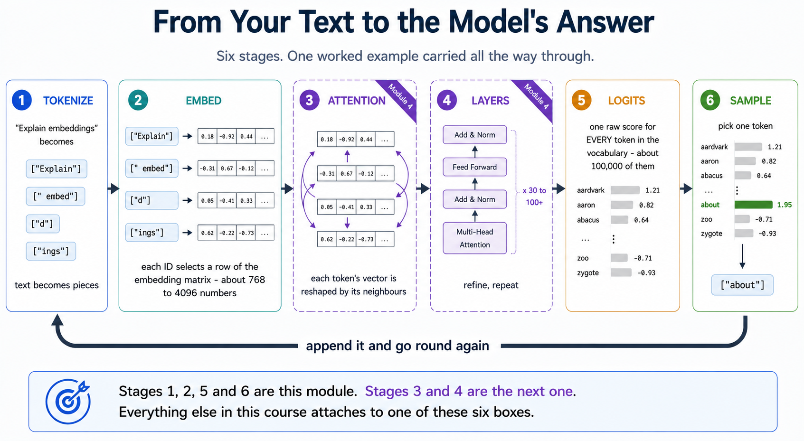
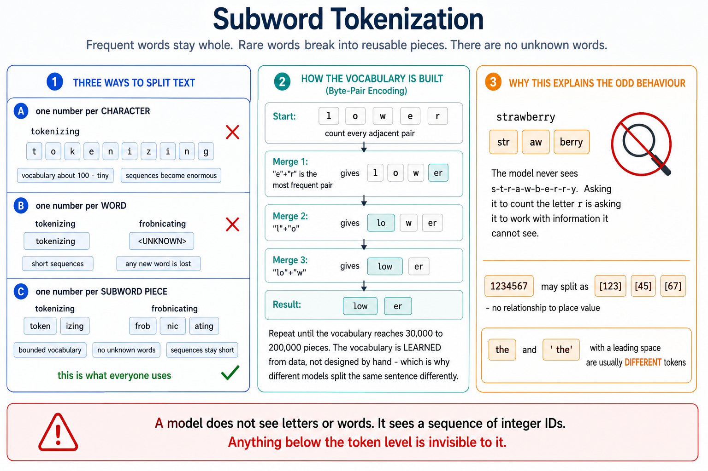
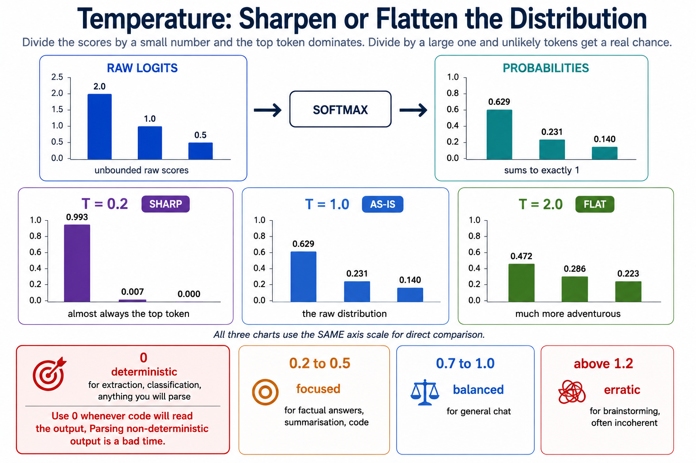

# Module 3: Tokens, Embeddings & Similarity

> **By the end of this module** you'll know exactly how text becomes numbers a model can work with, be able to count and cost your tokens precisely, understand what an embedding actually is, and have built a working semantic search engine that finds documents by meaning rather than keywords.

| | |
|---|---|
| **Time** | ~2 hours (75 min reading, 45 min lab) |
| **Prerequisites** | [Module 1](01-foundations.md), [Module 2](02-python-and-environment.md) |
| **Packages** | `tiktoken`, `numpy`, `sentence-transformers` (all free, no API key needed) |
| **Cost** | Free — the lab runs entirely on your machine |

---

## Contents

- [3.0 Why This Matters](#30-why-this-matters)
- [3.1 What a Language Model Is](#31-what-a-language-model-is)
- [3.2 Tokenization: Text Into Pieces](#32-tokenization-text-into-pieces)
- [3.3 Counting Tokens Exactly](#33-counting-tokens-exactly)
- [3.4 Embeddings: Meaning As Coordinates](#34-embeddings-meaning-as-coordinates)
- [3.5 Making Sense of Vector Space](#35-making-sense-of-vector-space)
- [3.6 Measuring Similarity](#36-measuring-similarity)
- [3.7 Semantic Search: Putting It Together](#37-semantic-search-putting-it-together)
- [3.8 From Numbers Back to a Token](#38-from-numbers-back-to-a-token)
- [3.9 The Context Window](#39-the-context-window)
- [🧪 Hands-On Lab 3](#-hands-on-lab-3)
- [✅ Key Takeaways](#-key-takeaways)
- [⚠️ Common Mistakes & Misconceptions](#️-common-mistakes--misconceptions)
- [📚 Going Deeper](#-going-deeper)

---

## 3.0 Why This Matters

A neural network cannot read. It multiplies numbers. So before a model can do anything with the sentence *"Explain embeddings"*, that sentence must become numbers — and the way that conversion happens determines a surprising amount of what you can and cannot build.

This module is the hinge of the whole course. Four things in it are load-bearing:

| Concept | What it unlocks |
|---|---|
| **Tokens** | Your bill, your context limits, and why the model can't count letters |
| **Embeddings** | Semantic search, RAG (Module 8), recommendations, clustering |
| **Similarity** | How a vector database decides what's "relevant" (Module 7) |
| **Decoding** | Why the same prompt gives different answers, and how to control that |

By the end you'll have written a semantic search engine — about 30 lines — that finds *"A kitten rested on the rug"* when you search for *"cat on a mat"*, despite the two sharing no words at all. That capability is the engine inside every RAG system, and Modules 7 and 8 are mostly about scaling it up.

> **📌 Everything here runs free and offline.** The lab uses a small embedding model that downloads once (~90 MB) and runs on your CPU. No API key required.

---

## 3.1 What a Language Model Is

### The definition

A **language model** assigns a probability to what comes next, given the text so far:

> **P(next token | all previous tokens)**

That's it. Module 1 §1.7 introduced this; here we make it precise, because everything else in the module falls out of it.

### How we got here

Language models aren't new. What changed was scale and architecture.

| Era | Approach | How it worked | Limit |
|---|---|---|---|
| **Statistical (SLM)** | N-grams, Markov chains | Count how often "New York" follows "in" | Only sees 2–5 words back. No notion of meaning. |
| **Neural (NLM)** | RNNs, LSTMs | Read words one at a time, keep a running memory | Memory fades over distance; can't parallelise |
| **Pretrained (PLM)** | BERT, ELMo | Read the whole sentence in both directions | Great at understanding, not built to generate |
| **Large (LLM)** | Transformers (GPT-style) | Attention over the full context, at massive scale | Expensive; context is capped |

The jump from RNNs to transformers is the one that mattered, and it came down to two things: **attention** (Module 4) and the fact that transformers can be trained in parallel on GPUs, which made enormous scale affordable.

### What makes a model "large"

| Dimension | Typical scale today |
|---|---|
| **Parameters** | 10⁹ – 10¹² (billions to trillions of tuned numbers) |
| **Training data** | Trillions of tokens of text |
| **Emergent ability** | Few-shot and in-context learning, with no task-specific training |

That last row is the interesting one. Nobody trained GPT-style models to translate French, or to write SQL, or to follow examples given in a prompt. Those capabilities **appeared** as a side effect of getting very good at next-token prediction at scale — because predicting the next token well, across a huge diversity of text, requires all of them.

### The pipeline

Here's the whole journey from your text to the model's answer. This module covers stages 1, 2, 5 and 6; Module 4 covers stages 3 and 4.

```
   Your text
       │
       ▼
  ┌─────────────┐
  │ 1. TOKENIZE │  "Explain embeddings"  →  ["Explain", " embed", "d", "ings"]
  └─────────────┘                          →  [849, 8369, 67, 826]
       │
       ▼
  ┌─────────────┐
  │ 2. EMBED    │  each ID  →  a vector of ~768–4096 numbers
  └─────────────┘
       │
       ▼
  ┌─────────────┐
  │ 3. ATTENTION│  each token's vector is reshaped by its context   ── Module 4
  └─────────────┘
       │
       ▼
  ┌─────────────┐
  │ 4. LAYERS   │  repeat 30–100+ times                            ── Module 4
  └─────────────┘
       │
       ▼
  ┌─────────────┐
  │ 5. LOGITS   │  one score for EVERY token in the vocabulary
  └─────────────┘
       │
       ▼
  ┌─────────────┐
  │ 6. SAMPLE   │  pick one token  →  append  →  go back to stage 1
  └─────────────┘
```



---

## 3.2 Tokenization: Text Into Pieces

### The problem it solves

You need to turn text into numbers. Three obvious approaches, two of which fail:

| Approach | Problem |
|---|---|
| **One number per character** | Vocabulary of ~100 — tiny — but sequences become enormous and the model must learn spelling from scratch |
| **One number per word** | Sequences are short, but English has millions of word forms. Any word not in your list becomes `<UNKNOWN>` — and you can never handle a typo, a new product name, or another language. |
| **One number per *sub-word piece*** | ✅ Bounded vocabulary, no unknown words, sequences stay short |

The third is what everyone uses. It's called **subword tokenization**.

### How it works

Frequent words stay whole. Rare words break into reusable pieces.

```
"tokenizing language is fun"

  token   →  #1567     ← common fragment, stays whole
  izing   →  #2890     ← reusable suffix
  lang    →  #3001
  uage    →  #4119
  is      →  #318      ← very common word, one token
  fun     →  #2300
```

Notice `izing`. Having learned that piece, the model can handle *tokenizing*, *organizing*, *categorizing* — and even words it has never seen, like *frobnicating*. **There are no unknown words**, because worst case it falls back to smaller and smaller pieces.



### How the vocabulary is built

The dominant algorithm is **Byte-Pair Encoding (BPE)**. It's greedy and simple:

1. Start with individual bytes as your vocabulary
2. Count every adjacent pair in your training text
3. Merge the most frequent pair into a single new token
4. Repeat until you hit your target vocabulary size (typically 30,000–200,000)

Common sequences get merged into single tokens; rare ones stay fragmented. **The vocabulary is learned from data, not designed by hand** — which is why different models tokenise the same sentence differently.

You'll also see **WordPiece** (BERT) and **Unigram** (T5/SentencePiece). Same idea, different merge criteria.

### Every token is an integer

This is the bridge to the next section:

```
"token"  →  ID #1567  →  selects row 1567 of the embedding matrix  →  a vector
```

The token ID is not meaningful in itself. `#1567` is just an address. What matters is the vector stored at that address — and that's §3.4.

### Some genuinely surprising consequences

Tokenization explains several LLM behaviours that otherwise look like bugs:

- **"How many r's in strawberry?"** The model sees something like `["str", "aw", "berry"]`, not individual letters. It has no direct access to spelling. Asking it to count characters is asking it to work with information it can't see.
- **Arithmetic is unreliable.** `1234567` may split into `["123", "45", "67"]` — an arbitrary grouping with no relationship to place value.
- **Rhyming and wordplay are hard** for the same reason: sound and spelling live below the token level.
- **Trailing whitespace matters.** `"the"` and `" the"` (with a leading space) are usually *different tokens* with different IDs. A stray space at the end of your prompt can genuinely change the output.

> **🔑 The mental model:** a model doesn't see letters or words. It sees a sequence of integer IDs. Anything below the token level is invisible to it.

---

## 3.3 Counting Tokens Exactly

Module 2 used a rule of thumb: ~4 characters per token. Now let's be exact.

### Install and count

```powershell
pip install tiktoken
```

```python
import tiktoken

# An "encoding" is a specific learned vocabulary. Different model families
# use different ones, so the same text gives different counts.
encoder = tiktoken.get_encoding("cl100k_base")   # GPT-4 / GPT-3.5 family

text = "Explain embeddings simply."

token_ids = encoder.encode(text)          # text  -> list of integer IDs
print(token_ids)                          # [849, 8369, 67, 826, 30032, 13]
print(f"{len(token_ids)} tokens")         # 6 tokens

# Decode each ID individually to SEE the pieces.
for token_id in token_ids:
    piece = encoder.decode([token_id])
    print(f"  {token_id:>7}  ->  {piece!r}")
```

That `!r` in the f-string prints the *repr* — so you see `' embeddings'` with its leading space rather than losing it silently. **When inspecting tokens, always use `!r`**; invisible whitespace is exactly what you're trying to see.

### Round-tripping

```python
# Encoding then decoding returns the original text exactly.
original = "Tokenization is lossless."
restored = encoder.decode(encoder.encode(original))
print(restored == original)     # True
```

Tokenization is **lossless** — no information is destroyed. It's a reversible re-encoding, not a summary.

### The rule of thumb, measured

```python
import tiktoken

encoder = tiktoken.get_encoding("cl100k_base")

samples = {
    "Plain English":  "The quick brown fox jumps over the lazy dog.",
    "Python code":    "def f(x): return {k: v for k, v in x.items()}",
    "Long number":    "The total was 1234567890 dollars.",
    "Technical term": "Retrieval-augmented generation with reranking.",
}

print(f"{'Sample':<16} {'chars':>6} {'tokens':>7} {'chars/token':>12}")
print("-" * 45)
for label, text in samples.items():
    n_tokens = len(encoder.encode(text))
    ratio = len(text) / n_tokens
    print(f"{label:<16} {len(text):>6} {n_tokens:>7} {ratio:>12.2f}")
```

You'll see plain English land near 4 characters per token, while code and numbers drop well below it — meaning **more tokens, and a higher bill, than the rule of thumb predicts**.

### The multilingual token tax

This one has real consequences:

```python
sentences = {
    "English":  "Artificial intelligence is transforming the world.",
    "Spanish":  "La inteligencia artificial está transformando el mundo.",
    "Hindi":    "कृत्रिम बुद्धिमत्ता दुनिया को बदल रही है।",
    "Arabic":   "الذكاء الاصطناعي يغير العالم.",
}

for language, text in sentences.items():
    print(f"{language:<10} {len(encoder.encode(text)):>4} tokens")
```

The same meaning costs **several times more tokens** in some languages than in English, because the vocabulary was learned from predominantly English training text. Non-Latin scripts fragment into many small pieces.

**The consequences are concrete:** identical requests cost more in some languages; the effective context window is smaller; and quality is often lower. It's a fairness issue built into the plumbing, not a pricing quirk — and it's worth knowing about if you build for a multilingual audience.

### Costing a request

```python
def count_tokens(text: str, encoding_name: str = "cl100k_base") -> int:
    """Count tokens exactly for a given encoding."""
    return len(tiktoken.get_encoding(encoding_name).encode(text))


def estimate_cost(
    input_text: str,
    expected_output_tokens: int,
    input_price_per_million: float,
    output_price_per_million: float,
) -> float:
    """Estimate the dollar cost of one request.

    Input and output tokens are priced DIFFERENTLY - output is usually several
    times more expensive. Check your provider's current pricing page for rates.
    """
    input_tokens = count_tokens(input_text)
    input_cost = (input_tokens / 1_000_000) * input_price_per_million
    output_cost = (expected_output_tokens / 1_000_000) * output_price_per_million
    return input_cost + output_cost


prompt = "Summarise the key ideas of retrieval-augmented generation."
cost = estimate_cost(prompt, expected_output_tokens=300,
                     input_price_per_million=0.15,
                     output_price_per_million=0.60)
print(f"Estimated: ${cost:.6f} per call")
print(f"At 10,000 calls/day: ${cost * 10_000:.2f}/day")
```

That last line is the habit worth forming. A cost that's invisible per call becomes very visible at volume, and multiplying it out *before* you deploy is how you avoid an unpleasant surprise.

> **⚠️ Different models, different tokenizers.** `cl100k_base` is not `o200k_base` is not Llama's tokenizer. Counts differ by 10–20% between families. Always count with the tokenizer of the model you're actually calling.

---

## 3.4 Embeddings: Meaning As Coordinates

### From ID to vector

A token ID is just an address. The **embedding** is what's stored there — a list of numbers that represents meaning.

```
Token ID #1567  →  [0.18, -0.92, 0.44, 0.07, ..., -0.31]
                    └────────── d numbers ──────────┘
```

`d` is the **embedding dimension**: 384 for the small model in this lab, 768 for GPT-2, 4096 or more in frontier models.

### It's a lookup table

Mechanically, an embedding layer is a big matrix:

```
Embedding matrix E, shape (V × d)
   V = vocabulary size    (e.g. 100,000 tokens)
   d = dimension          (e.g. 768 numbers per token)

Token ID i  →  row i of E  →  a d-dimensional vector
```

Nothing clever happens at lookup time. It's array indexing. **What's clever is what training put in those rows.**

### Geometry is meaning

Here's the central idea, and it's genuinely elegant:

> During training, vectors get positioned so that **tokens used in similar contexts end up close together in space**.

Nobody labelled "cat" and "kitten" as related. But because they appear in similar sentences, next-token prediction pushes their vectors toward each other. Meaning becomes **position**, and "related" becomes **nearby** — a question you can answer with arithmetic.

```
        (a simplified 2-D view of a 384-dimensional space)

         food ▲
              │        🍌 banana
              │   🍎 apple
              │                        🐺 wolf
              │                    🐕 dog   🐈 cat
              │                        🐔 chicken
              └──────────────────────────────────────▶ animal
```

Fruits cluster. Animals cluster. The clusters are far apart. **Distance is semantic distance.**

### Word analogies — and an honest caveat

The famous demonstration:

```
vector("king") - vector("man") + vector("woman")  ≈  vector("queen")
```

Subtracting "man" and adding "woman" moves you along something like a gender direction. Genuinely remarkable, and it says the space has *internal structure*, not just clusters.

> **⚠️ But it's routinely overstated.** In practice you must explicitly *exclude* the input words from the results, because the nearest vector to that arithmetic is often "king" itself. The effect is real but weaker and pickier than the popular version suggests, and it works far better for some relationships (gender, capital cities, verb tense) than others. Treat it as evidence of structure, not as a reliable API.

### Static vs contextual — the distinction that matters

| | **Static embeddings** | **Contextual embeddings** |
|---|---|---|
| Examples | word2vec, GloVe | What transformers produce |
| Vectors per word | **One**, fixed forever | **One per occurrence**, shaped by neighbours |
| `"bit"` in *"the dog bit the man"* | `[0.21, -0.74, ...]` | `[0.88, 0.12, ...]` |
| `"bit"` in *"a little bit of water"* | `[0.21, -0.74, ...]` — identical | `[-0.33, 0.61, ...]` — different |

A static embedding gives "bit" one vector, so the verb and the quantity are **indistinguishable**. That's a hard ceiling.

Transformers fix it. The embedding layer still starts with one vector per token, but each attention layer **reshapes it based on surrounding words**. By the final layer, the two "bit"s have genuinely different vectors.


**That reshaping is exactly what attention does, and it's the entire subject of Module 4.** This is the cliffhanger the next module resolves.

### Two different things called "embeddings"

A real source of confusion worth heading off:

| | **Token embeddings** | **Sentence / document embeddings** |
|---|---|---|
| Represents | One token | A whole sentence or document |
| Where it lives | Inside the model, layer 1 | Output of a dedicated embedding model |
| Count | One per token | One per document |
| You use it for | Nothing directly — internal machinery | **Semantic search, RAG, clustering** |
| Example model | Part of GPT | `all-MiniLM-L6-v2`, `text-embedding-3-small` |

**For the rest of this course, "embedding" almost always means the second kind** — one vector for a whole chunk of text. That's what goes into a vector database in Module 7 and powers retrieval in Module 8.

### Generating real embeddings

Free, local, no API key:

```powershell
pip install sentence-transformers
```

```python
from sentence_transformers import SentenceTransformer

# Downloads ~90 MB the first time, then caches. Runs on CPU.
model = SentenceTransformer("all-MiniLM-L6-v2")

sentences = [
    "The cat sat on the mat.",
    "A kitten rested on the rug.",
    "The stock market crashed today.",
]

embeddings = model.encode(sentences)

print(embeddings.shape)      # (3, 384)  -> 3 sentences, 384 numbers each
print(embeddings[0][:5])     # first 5 numbers of the first embedding
```

`(3, 384)` means three vectors of 384 numbers. The first two sentences share **no words** — "cat"/"kitten", "sat"/"rested", "mat"/"rug" — yet their vectors will be close together, because the model encodes meaning rather than spelling. §3.6 measures exactly how close.

The paid alternative (`text-embedding-3-small` via an API) is stronger on nuance and longer text, but costs money and sends your data to a third party. **For learning, and for a great many production cases, the local model is genuinely good enough.**

---

## 3.5 Making Sense of Vector Space

### What are the dimensions?

A natural question: if an embedding has 384 numbers, what does number 7 mean?

**Usually nothing interpretable.** Dimensions aren't hand-designed features like "formality" or "is-an-animal". They emerge from training, and meaning is spread across combinations of them. Individual dimensions rarely correspond to concepts you can name.

What *is* meaningful is **relative position**: which vectors are near which. That's why every technique in this course uses comparisons between vectors, never individual dimension values.

### Why so many dimensions?

Because meaning is high-dimensional. Words vary along countless axes at once — concrete/abstract, positive/negative, animate/inanimate, formal/casual, and thousands of subtler distinctions. In 2 dimensions everything collides. In 384, there's room to keep distinctions separate.

There's a trade-off:

| Dimension | Effect |
|---|---|
| **Fewer (128–384)** | Faster, less memory, cheaper to search. May lose nuance. |
| **More (1536–3072)** | Finer distinctions. More storage, slower search, more data needed. |

384 is a sweet spot for learning and for many real applications.

### Seeing it: projecting to 2-D

You can't visualise 384 dimensions, but you can **project** down to 2 while roughly preserving which points are near which:

```python
import numpy as np
import matplotlib.pyplot as plt
from sklearn.decomposition import PCA
from sentence_transformers import SentenceTransformer

model = SentenceTransformer("all-MiniLM-L6-v2")

texts = [
    "dog", "cat", "wolf", "chicken",          # animals
    "apple", "banana", "orange",              # fruit
    "car", "truck", "bicycle",                # vehicles
]
embeddings = model.encode(texts)              # shape (10, 384)

# PCA finds the 2 directions with the most variation and flattens onto them.
coords = PCA(n_components=2).fit_transform(embeddings)

plt.figure(figsize=(8, 6))
plt.scatter(coords[:, 0], coords[:, 1])

# Label each point so the clusters are readable.
for (x, y), label in zip(coords, texts):
    plt.annotate(label, (x, y), fontsize=11,
                 xytext=(5, 5), textcoords="offset points")

plt.title("Embeddings projected to 2-D with PCA")
plt.tight_layout()
plt.show()
```

You should see three clear clusters. Animals group together, fruit groups together, vehicles group together — **and nobody told the model those categories exist.**

> **⚠️ Read projections with care.** Squashing 384 dimensions into 2 loses most of the information. Points that look close in the plot may not be close in the real space. PCA plots are excellent for intuition and **useless as evidence** — always measure similarity in the full space.

---

## 3.6 Measuring Similarity

You have vectors. Now: how close are two of them? Three metrics, and you'll meet all three in Module 7 as vector-database options.

### 1. Cosine similarity — the default

Measures the **angle** between two vectors, ignoring their length.

$$\cos\theta = \frac{a \cdot b}{\|a\| \, \|b\|}$$

| | |
|---|---|
| **Range** | −1 to 1 |
| **Reading** | 1 = same direction, 0 = unrelated (perpendicular), −1 = opposite |
| **Magnitude** | Ignored |
| **Use for** | Text and sentence embeddings, semantic search — **the standard choice** |


Written out, with nothing hidden:

```python
import numpy as np

def cosine_similarity(a: np.ndarray, b: np.ndarray) -> float:
    """Cosine similarity between two vectors: 1 = identical direction."""
    # Dot product: multiply element-wise, then sum.
    dot = np.dot(a, b)

    # Magnitude (length) of each vector: sqrt of the sum of squares.
    magnitude_a = np.linalg.norm(a)
    magnitude_b = np.linalg.norm(b)

    # Dividing by both magnitudes cancels out length, leaving only angle.
    return dot / (magnitude_a * magnitude_b)


# Same direction, very different lengths:
a = np.array([1.0, 2.0, 3.0])
b = np.array([2.0, 4.0, 6.0])       # exactly 2x a
print(cosine_similarity(a, b))      # 1.0  -> length ignored, direction identical

# Perpendicular:
print(cosine_similarity(np.array([1.0, 0.0]), np.array([0.0, 1.0])))   # 0.0
```

**Why length gets ignored, and why that's what you want:** a long document produces a longer vector than a short one simply because there's more text. You don't want "similar" to mean "similar length". Direction carries the meaning; magnitude mostly carries verbosity.

### 2. Dot product — cosine's faster cousin

$$a \cdot b = \sum_i a_i b_i$$

| | |
|---|---|
| **Range** | −∞ to ∞ |
| **Magnitude** | **Sensitive** — longer vectors score higher |
| **Use for** | Recommenders where popularity should count; fast approximate search |


```python
def dot_product(a: np.ndarray, b: np.ndarray) -> float:
    """Raw dot product. Longer vectors produce bigger scores."""
    return np.dot(a, b)
```

### 3. Euclidean (L2) distance — straight-line distance

$$\|a - b\|_2 = \sqrt{\sum_i (a_i - b_i)^2}$$

| | |
|---|---|
| **Range** | 0 to ∞ |
| **Reading** | **Lower is closer** — it's a distance, not a similarity |
| **Use for** | Clustering (k-means), image features, spatial data |


```python
def euclidean_distance(a: np.ndarray, b: np.ndarray) -> float:
    """Straight-line distance. LOWER means more similar."""
    return np.linalg.norm(a - b)
```

> **⚠️ Watch the direction.** Cosine and dot product: **higher = more similar**. Euclidean: **lower = more similar**. Sorting the wrong way returns your worst matches with total confidence, and produces a RAG system that confidently retrieves irrelevant documents. It's a silent bug — nothing crashes.

### Normalisation makes all three agree

A vector is **normalised** (unit-length) when its magnitude is 1:

```python
def normalise(v: np.ndarray) -> np.ndarray:
    """Scale a vector to length 1, preserving its direction."""
    return v / np.linalg.norm(v)
```

Once vectors are normalised, something convenient happens:

- Cosine similarity **=** dot product (the denominator is 1×1)
- Euclidean distance becomes a monotonic function of cosine similarity

**So all three rank results identically.** This is why production systems normalise on the way in: you then get cosine's semantics with the dot product's speed, and can switch metrics without re-ranking anything.

`all-MiniLM-L6-v2` can normalise for you:

```python
embeddings = model.encode(sentences, normalize_embeddings=True)
# Now np.dot(embeddings[0], embeddings[1]) IS the cosine similarity.
```

### Choosing

| Situation | Metric |
|---|---|
| Text / sentence embeddings | **Cosine** (the default; use it unless you have a reason not to) |
| Normalised vectors, want speed | **Dot product** (identical ranking, less arithmetic) |
| Magnitude carries real signal | **Dot product** |
| Clustering, k-means, image features | **Euclidean** |

---

## 3.7 Semantic Search: Putting It Together

Time to build something. **Semantic search** finds documents by meaning rather than by shared words.

### Keyword vs semantic

| Query: *"cat on a mat"* | Keyword search | Semantic search |
|---|---|---|
| "The cat sat on the mat." | ✅ words match | ✅ |
| "A kitten rested on the rug." | ❌ **no shared words** | ✅ **found** |
| "The stock market crashed." | ❌ | ❌ |

Keyword search matches strings. Semantic search matches meaning. That second row is the entire point.

### The complete engine

```python
"""Minimal semantic search - the core of every RAG system."""

import numpy as np
from sentence_transformers import SentenceTransformer

model = SentenceTransformer("all-MiniLM-L6-v2")

# --- 1. The corpus: what we're searching over -----------------------
documents = [
    "The cat sat on the mat.",
    "A kitten rested on the rug.",
    "The stock market crashed today.",
    "Investors lost money in the financial crisis.",
    "LLMs can generate human-like text.",
    "Artificial intelligence writes like a human.",
]

# --- 2. INDEXING: embed every document, once, up front -------------
# normalize_embeddings=True means dot product == cosine similarity.
doc_embeddings = model.encode(documents, normalize_embeddings=True)
print(f"Indexed {len(documents)} documents as {doc_embeddings.shape} vectors")


# --- 3. SEARCHING -------------------------------------------------
def search(query: str, top_k: int = 3):
    """Return the top_k most semantically similar documents."""
    # Embed the query with the SAME model as the documents.
    query_embedding = model.encode(query, normalize_embeddings=True)

    # One dot product per document, all at once via matrix multiplication.
    # Because everything is normalised, these ARE cosine similarities.
    scores = doc_embeddings @ query_embedding      # shape: (n_documents,)

    # argsort gives indices from lowest to highest; [::-1] reverses it.
    ranked = np.argsort(scores)[::-1][:top_k]

    return [(documents[i], float(scores[i])) for i in ranked]


# --- 4. Try it ----------------------------------------------------
for query in ["cat on a mat", "AI writing", "money problems"]:
    print(f"\nQuery: {query!r}")
    for text, score in search(query):
        print(f"  {score:.3f}  {text}")
```

Expected shape of the output:

```
Query: 'cat on a mat'
  0.782  The cat sat on the mat.
  0.601  A kitten rested on the rug.        <- no shared words!
  0.094  LLMs can generate human-like text.
```

**That second result is the payoff.** No word overlap with the query, found anyway, because "kitten"/"cat" and "rug"/"mat" sit near each other in the embedding space.

### What you just built

Look at the shape of it, because it's the shape of Modules 7 and 8:

| Step | This script | At production scale |
|---|---|---|
| **Index** | `model.encode(documents)` | Same, in batches, over millions of chunks |
| **Store** | A numpy array in memory | A **vector database** (Module 7) |
| **Search** | `doc_embeddings @ query` — compares *all* documents | **ANN index** — compares a small fraction (Module 7) |
| **Use the results** | Print them | Feed them to an LLM as context — **that's RAG** (Module 8) |

The concepts don't change. Only the scale does.

### Where it falls down

Be aware of the limits now, because Module 8 is largely about fixing them:

- **Exact terms get missed.** Searching a product code like `"SKU-4471"` may match semantically-similar-but-wrong results. *Fix: hybrid search — combine keyword and semantic scoring.*
- **Long documents blur.** One vector for a 50-page PDF averages everything into mush. *Fix: chunking (Module 8).*
- **Comparing all documents doesn't scale.** Fine for thousands, hopeless for millions. *Fix: approximate nearest neighbour indexes (Module 7).*
- **The embedding model must match.** Query and documents **must** be embedded by the same model, or the vectors aren't comparable at all. Change your embedding model and you must re-index everything.

That last point catches people out in production. Different models produce different coordinate systems; there's no conversion.

---

## 3.8 From Numbers Back to a Token

We've gone text → tokens → vectors. Now the return trip: how the model's output becomes a word.

### Logits and softmax

The model's final layer produces one raw score — a **logit** — for every token in the vocabulary:

```
logits = [2.1, -0.5, 8.3, 0.2, ...]        # ~100,000 numbers
```

**Softmax** turns those into probabilities that sum to 1:

$$P(\text{token}_i) = \frac{e^{z_i}}{\sum_j e^{z_j}}$$

```python
import numpy as np

def softmax(logits: np.ndarray) -> np.ndarray:
    """Convert raw scores into probabilities that sum to 1."""
    # Subtract the max first. Mathematically a no-op, numerically essential:
    # without it, exp() of a large number overflows to infinity.
    shifted = logits - np.max(logits)
    exponentiated = np.exp(shifted)
    return exponentiated / np.sum(exponentiated)


logits = np.array([2.1, -0.5, 8.3, 0.2])
probabilities = softmax(logits)
print(probabilities.round(4))     # [0.0020 0.0001 0.9977 0.0003]
print(probabilities.sum())        # 1.0
```

That `- np.max(logits)` line is worth remembering. It's the standard trick for numerically stable softmax, and you'll write it again in Module 4.

### The decoding knobs

Given probabilities, which token do you pick? This is where you get real control.

**Greedy / argmax** — always take the highest.

```python
next_token = np.argmax(probabilities)
```

Deterministic and reproducible. Also repetitive and lifeless, and prone to getting stuck in loops.

**Temperature** — scale the logits before softmax.

```python
def apply_temperature(logits: np.ndarray, temperature: float) -> np.ndarray:
    """Sharpen (T<1) or flatten (T>1) the probability distribution."""
    if temperature == 0:
        # A hard 1.0 on the top token: equivalent to greedy decoding.
        result = np.zeros_like(logits)
        result[np.argmax(logits)] = 1.0
        return result
    return softmax(logits / temperature)


logits = np.array([2.0, 1.0, 0.5])
for t in [0.2, 1.0, 2.0]:
    print(f"T={t}: {apply_temperature(logits, t).round(3)}")
# T=0.2: [0.993 0.007 0.   ]   <- sharp: almost always the top token
# T=1.0: [0.629 0.231 0.14 ]   <- the raw distribution
# T=2.0: [0.472 0.286 0.223]   <- flat: much more adventurous
```

Dividing by a small number spreads the logits apart, so the top token dominates. Dividing by a large number squashes them together, so unlikely tokens get a real chance.



| Temperature | Behaviour | Use for |
|---|---|---|
| **0** | Deterministic | Extraction, classification, anything you'll parse |
| **0.2 – 0.5** | Focused | Factual answers, summarisation, code |
| **0.7 – 1.0** | Balanced | General chat (the usual default) |
| **> 1.2** | Erratic | Brainstorming — often incoherent |

**Top-k** — keep only the k most likely tokens, renormalise, sample from those. Blocks nonsense but uses a fixed cutoff whether the model is confident or not.

**Top-p (nucleus)** — keep the smallest set of tokens whose probabilities sum to `p` (e.g. 0.9), then sample. **Adapts per step**: when the model is confident, that set is small; when it's uncertain, the set widens. Generally preferred over top-k.

> **💡 Practical advice:** set temperature *or* top-p, not both — tuning them together makes the effect hard to reason about. Start with temperature. Use 0 whenever the output will be parsed by code; parsing non-deterministic output is a bad time.

### When generation stops

The loop from Module 1 §1.7 keeps going until one of:

1. An **end-of-sequence** token is sampled
2. A **stop sequence** you specified appears
3. **`max_tokens`** is reached
4. The **context window** fills

Number 3 is a common gotcha: a response cut off mid-sentence usually means `max_tokens` was too low, not that the model failed.

---

## 3.9 The Context Window

The **context window** is how many tokens the model can see at once — its working memory, measured in tokens.

### One shared budget

The crucial thing is that **everything competes for the same space**:

```
┌─────────────────────────────────────────────────────────────────┐
│  TOTAL CONTEXT WINDOW  (e.g. 128,000 tokens)                    │
├──────────────┬────────────────┬──────────────┬──────────────────┤
│ System       │ Conversation   │ Retrieved    │ Room to          │
│ prompt       │ history        │ documents    │ GENERATE         │
└──────────────┴────────────────┴──────────────┴──────────────────┘
        └── every one of these is charged against the same limit ──┘
```

Retrieve 100 documents and you may leave no room for an answer. This budget is a real design constraint in Module 8, and it's why "just retrieve more" isn't a strategy.

### Why it's capped

Self-attention compares every token with every other token, so cost grows roughly with the **square** of the length:

| Context length | Relative attention cost |
|---|---|
| 1,000 tokens | 1× |
| 10,000 tokens | ~100× |
| 100,000 tokens | ~10,000× |

Doubling context roughly quadruples the attention work. That O(n²) scaling is why long contexts are slow and expensive, and why extending them is an active research area. Module 4 explains where the square comes from.

### Growth over time

**1K** *(GPT-2)* → **4K** *(GPT-3)* → **32K** *(GPT-4)* → **128K** *(GPT-4 Turbo)* → **200K+** *(Claude)* → **1M+** *(Gemini 1.5)*

A million tokens is roughly 700,000 words, or 30,000+ lines of code, or an hour of video.

> **📌 Specific numbers age fast.** See `appendix/C-model-landscape.md` for current figures. What doesn't change is the *shape* of the constraint: one shared budget, quadratic cost.

### Two failure modes

**1. Overflow.** Exceed the window and something must go. Most chat applications silently drop the oldest turns.


This is why a long conversation "forgets" the beginning. Nothing is broken — the early text is simply no longer in the input.

**2. Lost in the middle.** More subtle, and more dangerous.

Models reliably recall information at the **start** and **end** of a long context, and measurably less reliably in the **middle**.

```
Recall reliability across a long context:

  high │████                                          ████
       │    ███                                    ███
       │       ████                            ████
  low  │           ████████████████████████████
       └──────────────────────────────────────────────────
        start              middle                     end
```

**The practical consequence:** placement matters. Put your instructions and most important context at the beginning or the end — never buried in the middle of a long dump of retrieved text. "It's in the context somewhere" is not the same as "the model will use it," and this directly shapes how you order retrieved chunks in Module 8.

---

## 🧪 Hands-On Lab 3

**→ [Go to Lab 3: From Text to Meaning](../labs/03-tokens-embeddings/README.md)**

Count tokens exactly across languages and content types, implement cosine similarity, dot product and Euclidean distance from scratch in NumPy, then build a working semantic search engine and break it on purpose to find its limits.

Runs entirely free and offline. Budget 45 minutes.

---

## ✅ Key Takeaways

1. **Models see integer token IDs, never letters or words.** Anything below the token level — spelling, individual digits, rhyme — is invisible. That's why "count the r's in strawberry" is genuinely hard.

2. **Subword tokenization means there are no unknown words**, and frequent words cost fewer tokens than rare ones.

3. **Count tokens with the tokenizer of the model you're calling.** Counts vary 10–20% across families, and the 4-chars-per-token rule fails badly on code, numbers and non-English text.

4. **An embedding turns meaning into position.** Related things end up nearby, so "is this relevant?" becomes arithmetic.

5. **Two different things are called embeddings.** Token embeddings live inside the model; *sentence* embeddings are what you use for search and RAG. This course means the second.

6. **Static embeddings give one vector per word; contextual embeddings give one per occurrence.** That reshaping is attention — Module 4.

7. **Cosine similarity is the default for text.** Normalise your vectors and cosine, dot product and Euclidean all rank identically — so you get cosine's meaning at the dot product's speed.

8. **Mind the direction of your metric.** Higher is better for cosine and dot product; *lower* is better for Euclidean. Sorting the wrong way silently returns your worst matches.

9. **Temperature controls the sampling spread.** Use 0 for anything you'll parse.

10. **The context window is one shared budget** — prompt, history, retrieved documents and the answer all compete for it — and models recall the middle of a long context least reliably.

---

## ⚠️ Common Mistakes & Misconceptions

<br>

> ### ❌ "One token = one word"
> **Reality:** roughly 0.75 words per token for English prose, and far off for anything else. `"tokenizing"` is two tokens; `"strawberry"` is three; an emoji can be several. Estimate with a tokenizer, not intuition.

<br>

> ### ❌ Embedding your query with a different model than your documents
> **Reality:** the two vector spaces are unrelated, so the similarity scores are meaningless — and nothing errors out. You get confidently wrong results. **Same model for both, always.** Changing embedding models means re-indexing your entire corpus.

<br>

> ### ❌ Sorting Euclidean distance descending
> **Reality:** you just retrieved your *worst* matches. Cosine and dot product: higher is better. Euclidean: lower is better. No exception will be raised.

<br>

> ### ❌ Trusting a 2-D PCA plot as evidence
> **Reality:** projecting 384 dimensions onto 2 discards most of the information. Plots are for intuition. Measure in the full space.

<br>

> ### ❌ "Bigger embeddings are always better"
> **Reality:** more dimensions cost storage, memory and search time, and need more data to be useful. A 384-dimension model often matches a 1536-dimension one on straightforward retrieval at a fraction of the cost.

<br>

> ### ❌ Assuming a big context window means you can stop chunking
> **Reality:** you can fit more in, but attention cost grows quadratically, you pay per token, and recall in the middle degrades. A focused 2,000-token context routinely beats an unfocused 100,000-token one — and costs 50× less.

<br>

> ### ❌ "Temperature 0 makes the model deterministic"
> **Reality:** it makes *sampling* deterministic, which removes most variation. But floating-point non-determinism on GPUs, batching effects, and silent model updates on the provider's side can still change output. Closer to reproducible, not guaranteed.

<br>

> ### ❌ Forgetting that whitespace is part of the token
> **Reality:** `"the"` and `" the"` are usually different tokens. A trailing space in a prompt, or an inconsistent join when building few-shot examples, can genuinely shift the output. Inspect tokens with `!r` so you can see it.

<br>

> ### ❌ "Cosine similarity of 0.8 means 80% similar"
> **Reality:** it isn't a percentage, and the scale isn't calibrated. What counts as "high" depends entirely on the model — for some, unrelated text sits around 0.1; for others, around 0.6. **Always calibrate on your own data** by checking scores for pairs you know are related and pairs you know aren't. Never hardcode a threshold you read in a blog post.

---

## 📚 Going Deeper

**Play**
- [OpenAI Tokenizer](https://platform.openai.com/tokenizer) — paste text, see tokens instantly
- [TensorFlow Embedding Projector](https://projector.tensorflow.org/) — explore real embedding spaces in 3-D
- [MTEB Leaderboard](https://huggingface.co/spaces/mteb/leaderboard) — how embedding models actually rank

**Read**
- [Byte-Pair Encoding explained](https://huggingface.co/learn/nlp-course/chapter6/5) — the algorithm, step by step
- [*Lost in the Middle*](https://arxiv.org/abs/2307.03172) — the paper behind §3.9
- [*Efficient Estimation of Word Representations*](https://arxiv.org/abs/1301.3781) — the original word2vec paper

**Watch**
- [Andrej Karpathy — *Let's build the GPT Tokenizer*](https://www.youtube.com/watch?v=zduSFxRajkE) (2 hrs) — builds BPE from scratch. The definitive treatment.

---

<div align="center">

**[⬅ Module 2](02-python-and-environment.md)** · **[🧪 Do Lab 3](../labs/03-tokens-embeddings/README.md)** · **[🏠 README](../README.md)** · **[➡️ Module 4: Transformers](04-transformers.md)**

</div>
