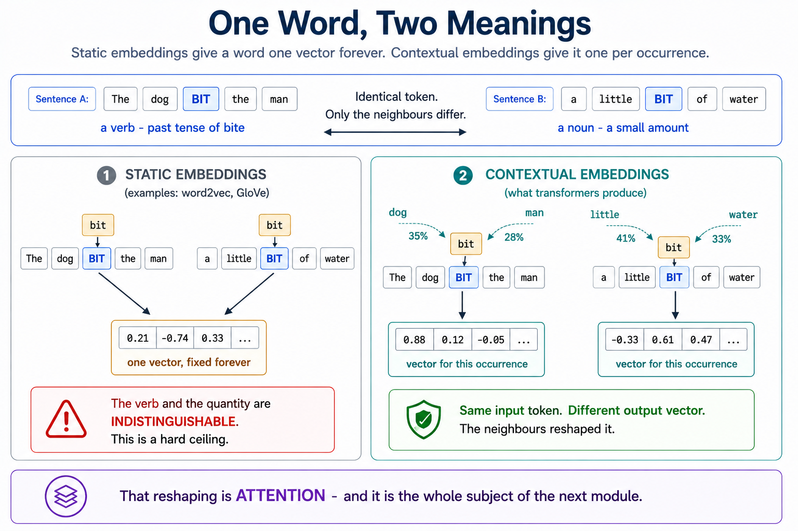
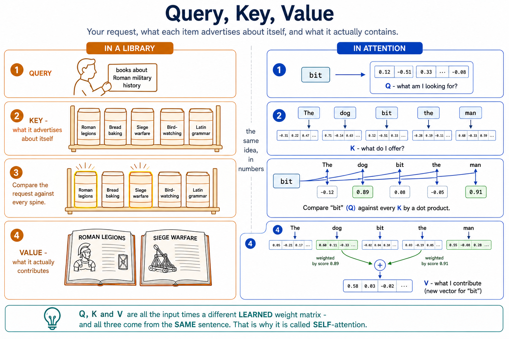
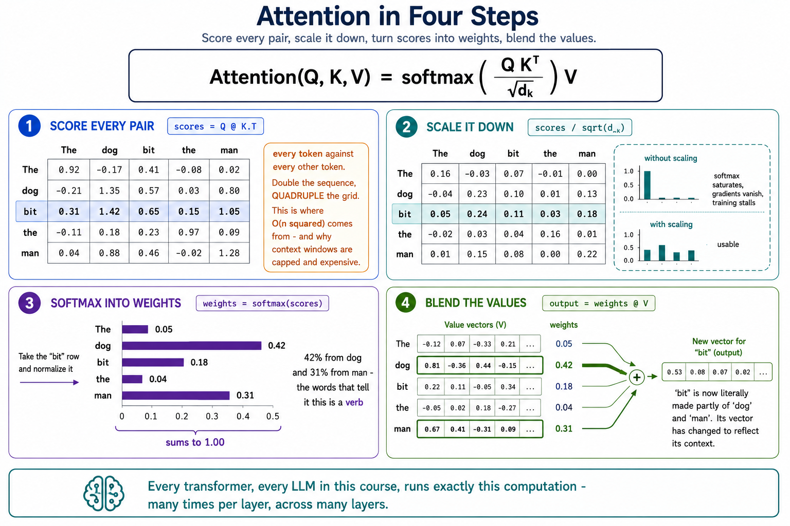
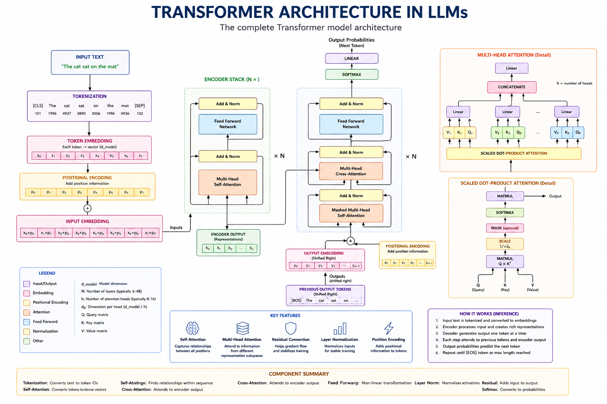
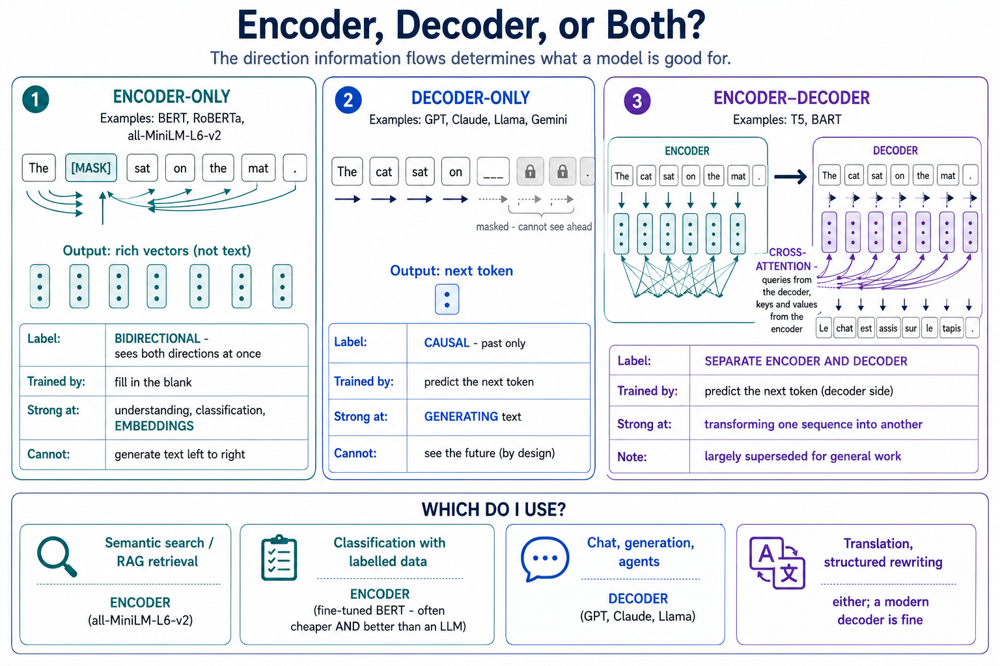
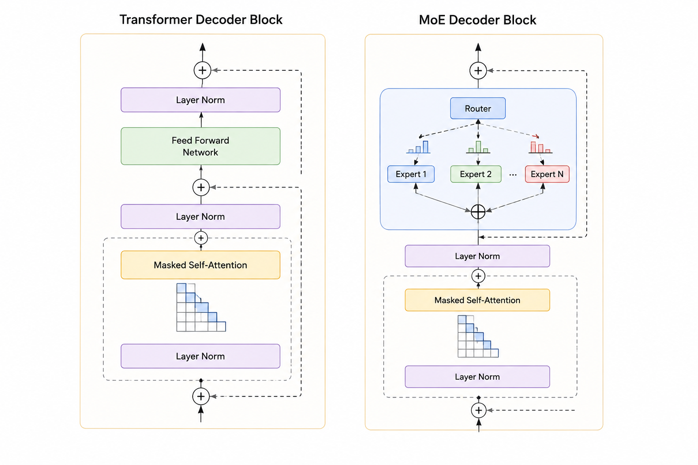
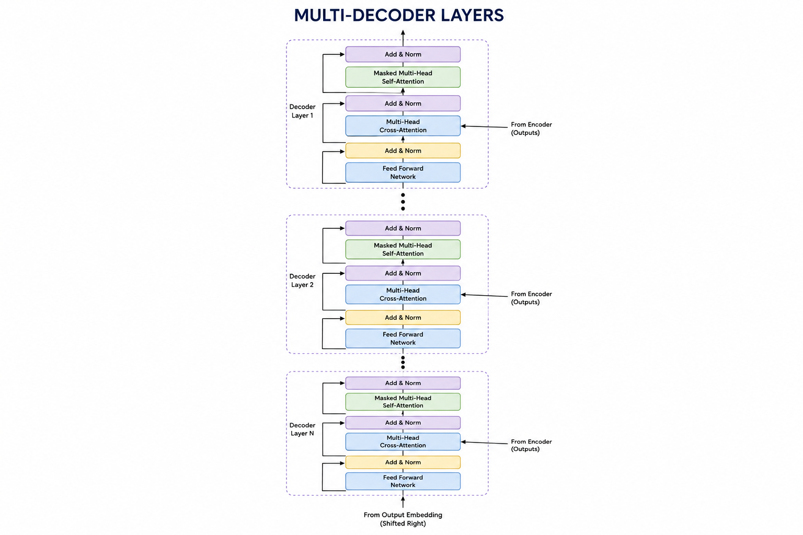

# Module 4: Transformers & Model Architecture

> **By the end of this module** you'll understand how attention lets a word take on different meanings in different sentences, be able to read the attention formula and implement it yourself, know the difference between BERT-style and GPT-style models and when to reach for each, and understand what pretraining and fine-tuning actually change.

| | |
|---|---|
| **Time** | ~2 hours (75 min reading, 45 min lab) |
| **Prerequisites** | [Module 3](03-tokens-embeddings-similarity.md) — you need tokens, embeddings and softmax |
| **Packages** | `numpy` only |
| **Cost** | Free — no API calls at all |

---

## Contents

- [4.0 Why This Matters](#40-why-this-matters)
- [4.1 The Problem: One Word, Two Meanings](#41-the-problem-one-word-two-meanings)
- [4.2 Self-Attention: Query, Key, Value](#42-self-attention-query-key-value)
- [4.3 The Formula, Line by Line](#43-the-formula-line-by-line)
- [4.4 Multi-Head Attention](#44-multi-head-attention)
- [4.5 Positional Encoding](#45-positional-encoding)
- [4.6 The Full Transformer Block](#46-the-full-transformer-block)
- [4.7 Causal Masking: Not Peeking Ahead](#47-causal-masking-not-peeking-ahead)
- [4.8 Encoder, Decoder, or Both?](#48-encoder-decoder-or-both)
- [4.9 Pretraining vs Fine-Tuning](#49-pretraining-vs-fine-tuning)
- [4.10 Mixture of Experts](#410-mixture-of-experts)
- [🧪 Hands-On Lab 4](#-hands-on-lab-4)
- [✅ Key Takeaways](#-key-takeaways)
- [⚠️ Common Mistakes & Misconceptions](#️-common-mistakes--misconceptions)
- [📚 Going Deeper](#-going-deeper)

---

## 4.0 Why This Matters

Module 3 ended on a cliffhanger. Static embeddings give each word **one fixed vector**, so the word "bit" in *"the dog bit the man"* and in *"a little bit of water"* gets identical numbers — and the model cannot tell a verb from a quantity.

Transformers solve this. The mechanism is called **attention**, and it's the single idea behind every model in this course.

You might reasonably ask whether you need this. You can build a RAG app without knowing how attention works, in the same way you can drive without knowing how an engine works. But understanding it pays off concretely:

| Understanding attention explains... | Which matters in... |
|---|---|
| Why context windows are capped and expensive | Module 8 — budgeting retrieved context |
| Why token *order and placement* change results | Module 5 — prompt structure |
| Why "lost in the middle" happens | Module 8 — ordering retrieved chunks |
| Why BERT can't chat and GPT can't be a great classifier | Module 7 — picking an embedding model |
| What fine-tuning actually changes | Module 12 — deciding whether to fine-tune |

This is the most technical module in the course. **There's exactly one formula**, and we'll take it apart term by term, then you'll implement it in about 20 lines of NumPy. No calculus, no derivations.

---

## 4.1 The Problem: One Word, Two Meanings

Take the token **"bit"** in two sentences:

| 🐕 An action | 💧 A quantity |
|---|---|
| `[The] [dog] `**`[bit]`**` [the] [man]` | `[a] [little] `**`[bit]`**` [of] [water]` |
| "bit" = past tense of *bite*, a verb | "bit" = a small amount, a noun |
| Clues: *dog*, *man* | Clues: *little*, *water* |

**Nothing about the word itself tells you which is which.** The token is identical. Only the neighbours differ.

So any system that assigns "bit" a single fixed vector has already lost. It needs a way to **look at the surrounding words and adjust**.



That's attention, stated as a one-line intuition:

> **Each word asks every other word: "are you relevant to me?" — then rebuilds itself as a blend of the ones that are.**

For "bit" in the first sentence, *dog* and *man* answer loudly, so "bit" ends up shaped like an action. In the second, *little* and *water* answer, so it ends up shaped like a quantity. **Same input token, different output vector.** That's a contextual embedding.

---

## 4.2 Self-Attention: Query, Key, Value

Each word produces three vectors. The names come from database search, and the analogy is genuinely useful.

### The three roles

| | 🔍 **Query (Q)** | 🔑 **Key (K)** | 📊 **Value (V)** |
|---|---|---|---|
| **Question it answers** | What am I looking for? | What do I offer? | What do I actually contribute? |
| For "bit" | "Who is doing this, and to whom?" | — | — |
| For "dog" | — | "I'm an animal, a possible subject" | The information "dog" passes on |

**The library analogy:**

- Your **query** is what you want: *"books about Roman military history"*
- Each book's **key** is its catalogue entry — what it advertises about itself
- Each book's **value** is its actual contents

You compare your query against every key to decide relevance, then read the values of whatever scored highly. Attention does exactly this, with numbers, for every word simultaneously.

### Where Q, K and V come from

Each is the token's embedding multiplied by a **learned weight matrix**:

```
Q = X · W_Q          X   = the input embeddings          (n_tokens × d_model)
K = X · W_K          W_* = learned weight matrices       (d_model × d_k)
V = X · W_V
```



Those three `W` matrices are **parameters** — part of the billions the model learned during training (Module 1 §1.3). Training discovers what makes a useful query, a useful key and a useful value.

> **📌 Why "self"-attention?** Because Q, K and V all come from the *same* sequence — the words attend to each other. In **cross-attention** (§4.8) the queries come from one sequence and the keys/values from another, which is how translation models connect source to target.

---

## 4.3 The Formula, Line by Line

Here it is. The one formula in this module:

$$\text{Attention}(Q, K, V) = \text{softmax}\!\left(\frac{Q K^\top}{\sqrt{d_k}}\right) V$$

Four steps, read from the inside out.

### Step 1 — `Q Kᵀ`: score every pair

Multiply each query by every key. Since a dot product is large when two vectors point the same way (Module 3 §3.6), this measures **how relevant each word is to each other word**.

```python
scores = Q @ K.T          # shape: (n_tokens, n_tokens)
```

For a 5-word sentence that's a 5×5 grid: `scores[i][j]` is how much word *i* cares about word *j*.

> **This is where O(n²) comes from.** Every token against every other token. Double the sequence, quadruple the grid. That's the whole explanation for why context windows are expensive (Module 3 §3.9).

### Step 2 — `/ √d_k`: scale it down

```python
scores = scores / np.sqrt(d_k)     # d_k = the dimension of the key vectors
```

**Why this is needed:** dot products of high-dimensional vectors produce large numbers. Feed large numbers into softmax and it saturates — one value gets ~1.0, everything else ~0.0. That's bad in two ways: the blend becomes a hard pick, and gradients vanish so the model can't learn.

Dividing by `√d_k` keeps the variance of the scores roughly constant regardless of dimension. It's a small correction with a large effect, and it's why the formula says *scaled* dot-product attention.

### Step 3 — `softmax(...)`: turn scores into weights

```python
weights = softmax(scores)          # each ROW now sums to 1
```

Same softmax as Module 3 §3.8, applied **per row**. After this, row *i* is a set of proportions: how much of each other word goes into word *i*'s new representation.

```
Row for "bit" in "The dog bit the man":

  The   0.05  ▏
  dog   0.42  ████████████████
  bit   0.18  ███████
  the   0.04  ▏
  man   0.31  ████████████
              └─ sums to 1.00
```

"bit" draws 42% from *dog* and 31% from *man*. Those are the words that tell it it's a verb.

### Step 4 — `... V`: take the weighted blend

```python
output = weights @ V
```

Each word's new vector is a weighted average of all the value vectors, using its own row of weights. **"bit" is now literally made partly of "dog" and "man".** Its vector has changed to reflect its context.



### All four steps together

```python
import numpy as np

def softmax(x: np.ndarray) -> np.ndarray:
    """Row-wise softmax. Subtracting the max prevents overflow."""
    shifted = x - np.max(x, axis=-1, keepdims=True)
    exponentiated = np.exp(shifted)
    return exponentiated / np.sum(exponentiated, axis=-1, keepdims=True)


def attention(Q: np.ndarray, K: np.ndarray, V: np.ndarray):
    """Scaled dot-product attention.

    Args:
        Q: Queries, shape (n_tokens, d_k)
        K: Keys,    shape (n_tokens, d_k)
        V: Values,  shape (n_tokens, d_v)

    Returns:
        (output, weights) - output is (n_tokens, d_v),
        weights is (n_tokens, n_tokens) and each row sums to 1.
    """
    d_k = Q.shape[-1]

    # 1. Score every query against every key.
    scores = Q @ K.T

    # 2. Scale to keep softmax out of its saturated region.
    scores = scores / np.sqrt(d_k)

    # 3. Convert each row of scores into weights summing to 1.
    weights = softmax(scores)

    # 4. Blend the values using those weights.
    output = weights @ V

    return output, weights
```

**That's it.** Every transformer, every LLM, every model in this course runs that computation — many times per layer, across many layers, with learned weight matrices producing Q, K and V. You'll build and test this in the lab.

### Why it beat RNNs

| | **RNN / LSTM** | **Transformer attention** |
|---|---|---|
| Processing | One token at a time, in order | **All tokens at once** |
| Long-range links | Information degrades over distance | **One step**, regardless of distance |
| GPU training | Sequential — can't parallelise | **Fully parallel** |
| Cost | Linear in length | Quadratic in length |

The second and third rows are why transformers won. Connecting word 1 to word 500 takes a single dot product rather than 500 sequential steps — and the whole thing parallelises onto GPUs, which is what made training at scale affordable.

The trade-off is that quadratic cost. Transformers bought parallelism and long-range reach by paying in compute.

---

## 4.4 Multi-Head Attention

One attention computation captures **one kind of relationship**. But language has many at once — grammatical subject, tense, coreference, tone.

So run several in parallel. Each is a **head**, with its own `W_Q`, `W_K`, `W_V`, learning to focus on something different.

```
Input: "The dog bit the man"
   │
   ├── Head 1  →  who did what to whom?     (bit ↔ dog, man)
   ├── Head 2  →  which nouns go together?  (the ↔ dog, the ↔ man)
   ├── Head 3  →  sentence structure        (attends to punctuation)
   └── Head 4  →  ... something else learned
   │
   ▼
Concatenate all heads  →  one final linear layer  →  output
```

Heads are not assigned roles by hand. They **specialise on their own** during training, because diverse perspectives reduce prediction error. Researchers have since found heads that track syntax, heads that resolve pronouns, and heads that mostly attend to the first token as a no-op.

```python
def multi_head_attention(X, W_Q_list, W_K_list, W_V_list, W_O):
    """Run several attention heads in parallel and combine them.

    Args:
        X: Input embeddings, shape (n_tokens, d_model)
        W_Q_list, W_K_list, W_V_list: One weight matrix per head.
        W_O: Output projection, shape (n_heads * d_v, d_model)

    Returns:
        Combined output, shape (n_tokens, d_model)
    """
    head_outputs = []

    # Each head sees the SAME input but projects it differently,
    # so each looks at a different aspect of the relationships.
    for W_Q, W_K, W_V in zip(W_Q_list, W_K_list, W_V_list):
        Q, K, V = X @ W_Q, X @ W_K, X @ W_V
        output, _ = attention(Q, K, V)
        head_outputs.append(output)

    # Join the heads side by side, then mix them with a learned projection.
    combined = np.concatenate(head_outputs, axis=-1)
    return combined @ W_O
```

**Why concatenate then project?** Concatenating just stacks the heads' findings next to each other. The final `W_O` lets the model *mix* them — deciding how much each head's perspective should influence the result.

**Typical scale:** 12 heads (GPT-2 small) to 96+ heads in frontier models. Note that `d_model` is usually split across heads rather than multiplied — with `d_model=768` and 12 heads, each head works in 64 dimensions. **Multi-head attention costs roughly the same as single-head**; you get many perspectives for free by dividing the space rather than enlarging it.

---

## 4.5 Positional Encoding

### Attention is order-blind

Here's a real problem with what we've built so far. Look again at the formula: it's a set of dot products and a weighted sum. **Nothing in it refers to position.**

Shuffle the input words and attention produces the same set of outputs, just reordered. To attention, a sentence is an unordered bag of words.

But order carries meaning:

- `[The] [dog] [bit] [the] [man]` — dog bites, man is bitten
- `[The] [man] [bit] [the] [dog]` — **completely reversed**

Identical words. Only positions differ. The meaning flips.

### The fix: add position to the embedding

Before layer 1, add a **positional encoding** to each token's embedding:

```
final_input[i] = token_embedding[i] + positional_encoding[i]
```

Now "bit at position 3" has different numbers from "bit at position 1", so attention can distinguish them.

### Sinusoidal encoding

The original transformer used sine and cosine waves at different frequencies:

$$PE(pos, 2i) = \sin\!\left(\frac{pos}{10000^{2i/d}}\right) \qquad PE(pos, 2i+1) = \cos\!\left(\frac{pos}{10000^{2i/d}}\right)$$

```python
def positional_encoding(n_positions: int, d_model: int) -> np.ndarray:
    """Build sinusoidal positional encodings.

    Returns:
        Array of shape (n_positions, d_model). Row p is position p's signature.
    """
    # positions: a column vector [[0], [1], [2], ...]
    positions = np.arange(n_positions)[:, np.newaxis]

    # One frequency per dimension pair - fast for early dims, slow for later.
    dimension_pairs = np.arange(0, d_model, 2)
    frequencies = 1.0 / (10000 ** (dimension_pairs / d_model))

    encoding = np.zeros((n_positions, d_model))
    encoding[:, 0::2] = np.sin(positions * frequencies)   # even dimensions
    encoding[:, 1::2] = np.cos(positions * frequencies)   # odd dimensions
    return encoding
```

**Why waves?** Each position gets a unique pattern (like a binary fingerprint in continuous form), the values stay bounded in [−1, 1] so they don't swamp the embeddings, and *relative* distances are recoverable — a fixed offset corresponds to a consistent transformation. That last property is what lets the model generalise to distances it saw rarely in training.

### What modern models actually use

Sinusoidal encoding is the textbook version. In practice:

| Approach | Used by | Idea |
|---|---|---|
| **Sinusoidal** | Original transformer | Fixed waves, added to the input |
| **Learned absolute** | BERT, GPT-2 | A trainable vector per position |
| **RoPE** (Rotary) | Llama, most current models | **Rotates** Q and K by an angle set by position |
| **ALiBi** | Some long-context models | Penalises attention by distance directly |

**RoPE** is the modern default, and worth understanding at a high level: rather than adding position to the input, it rotates the query and key vectors inside every attention layer. Because a dot product between two rotated vectors depends on the *difference* of their angles, relative position falls out naturally — and it extrapolates to longer sequences far better than learned absolute positions. If you've seen "RoPE scaling" in the context of extending a model's context window, that's what's being scaled.

---

## 4.6 The Full Transformer Block

Attention is the interesting part, but a transformer block has four components. Blocks are stacked — 12 in GPT-2 small, 100+ in frontier models.

```
        Input embeddings (+ positional encoding)
                    │
        ┌───────────▼────────────┐
        │  1. Layer Norm         │
        └───────────┬────────────┘
                    │
        ┌───────────▼────────────┐
        │  2. Multi-Head         │
        │     Self-Attention     │   ← tokens exchange information
        └───────────┬────────────┘
                    │
                (+) ◄─────────────── 3. Residual connection
                    │
        ┌───────────▼────────────┐
        │  1. Layer Norm         │
        └───────────┬────────────┘
                    │
        ┌───────────▼────────────┐
        │  4. Feed-Forward       │   ← each token processed independently
        │     Network (MLP)      │
        └───────────┬────────────┘
                    │
                (+) ◄─────────────── 3. Residual connection
                    │
                    ▼
             To the next block

              × 12 to 100+ blocks
```



### The three pieces that aren't attention

**Layer normalisation** — rescales each token's vector to have mean 0 and variance 1. Without it, values drift and training becomes unstable across dozens of layers. Housekeeping, but essential housekeeping.

**Residual connections** — the `(+)` arrows. The block's output is *added to* its input rather than replacing it:

```python
x = x + attention(layer_norm(x))       # note: x + ...
x = x + feed_forward(layer_norm(x))
```

This is the innovation that makes deep networks trainable at all. Each block learns a *refinement* to the representation rather than rebuilding it, and gradients get a direct path back through the `+` to earlier layers. Stacking 100 layers without residuals simply doesn't train.

**Feed-forward network** — two linear layers with a non-linearity, applied to **each token independently**:

```python
def feed_forward(x, W1, b1, W2, b2):
    """Position-wise FFN. Expands, applies a non-linearity, contracts."""
    # Typically expands 4x (768 -> 3072), then back down.
    hidden = np.maximum(0, x @ W1 + b1)     # ReLU (modern models use GELU/SwiGLU)
    return hidden @ W2 + b2
```

**The division of labour is worth naming:** attention moves information *between* tokens; the FFN does computation *within* each token. Attention decides what's relevant; the FFN thinks about it. And despite getting less attention in explanations, **the FFN holds roughly two-thirds of a transformer's parameters** — which is exactly why it's the part Mixture of Experts targets (§4.10).

---

## 4.7 Causal Masking: Not Peeking Ahead

A subtle but essential detail for any model that generates text.

### The problem

A generative model is trained to predict the next token. If attention can see the *whole* sequence, then when predicting position 3 it can look at position 4 — **the answer**.

That's cheating. The model would score perfectly in training and be useless at inference, when future tokens genuinely don't exist yet.

### The fix

Before softmax, set all "future" scores to negative infinity:

```python
def causal_mask(n_tokens: int) -> np.ndarray:
    """Build an additive mask that hides future positions.

    Returns:
        (n_tokens, n_tokens) array: 0 where attention is allowed,
        -inf where it must be blocked.
    """
    # np.triu(..., k=1) selects the strictly-upper triangle - the future.
    mask = np.triu(np.ones((n_tokens, n_tokens)), k=1)
    return np.where(mask == 1, -np.inf, 0.0)


def causal_attention(Q, K, V):
    """Attention where each position sees only itself and the past."""
    d_k = Q.shape[-1]
    scores = (Q @ K.T) / np.sqrt(d_k)

    # Adding -inf makes exp(-inf) = 0, so those weights vanish in softmax.
    scores = scores + causal_mask(Q.shape[0])

    weights = softmax(scores)
    return weights @ V, weights
```

For 4 tokens the mask allows this pattern:

```
                 attending to →
              tok0  tok1  tok2  tok3
  token 0  [   ✅    ❌    ❌    ❌  ]   sees only itself
  token 1  [   ✅    ✅    ❌    ❌  ]   sees itself + past
  token 2  [   ✅    ✅    ✅    ❌  ]
  token 3  [   ✅    ✅    ✅    ✅  ]   sees everything
```

**Why `-inf` rather than 0?** Because the mask is applied *before* softmax. `exp(-inf) = 0`, so masked positions get exactly zero weight and the remaining weights still sum to 1. Setting scores to 0 wouldn't work — `exp(0) = 1`, which is a substantial weight.

This lower-triangular pattern is why GPT-style models are called **causal** or **autoregressive**: information flows only forward in time. It's also the single biggest architectural difference between GPT and BERT, which is the next section.

---

## 4.8 Encoder, Decoder, or Both?

The original transformer had two halves. Later models kept one, the other, or both — and that choice determines what a model is good for.

### The three families

| | **Encoder-only** | **Decoder-only** | **Encoder–Decoder** |
|---|---|---|---|
| **Examples** | BERT, RoBERTa, embedding models | GPT, Claude, Llama, Gemini | T5, BART, original transformer |
| **Attention** | Bidirectional — sees both directions | **Causal** — past only | Bidirectional encoder + causal decoder |
| **Trained by** | Masked language modelling: fill in blanks | Next-token prediction | Sequence-to-sequence |
| **Strong at** | Understanding, classification, **embeddings** | **Generating text** | Transforming one sequence into another |
| **Weak at** | Generating fluent text | Being a top-tier classifier | Complexity; largely superseded |

### Encoder-only: built to understand

BERT sees the whole sentence at once, in both directions. Training hides ~15% of tokens and asks it to fill them in:

```
Input:  "The [MASK] sat on the mat."
Target: "cat"
```

To fill that blank it may use *both* the preceding and following words — which is why it builds such rich representations, and why it **cannot generate text left to right**. There's no "next token" objective.

> **📌 This is where your embedding model comes from.** `all-MiniLM-L6-v2` from Module 3 is an encoder-only model. Bidirectional attention is exactly what you want for representing a whole sentence — and it's why you use an encoder model for embeddings and a decoder model for chat. Different tools, different jobs.

### Decoder-only: built to generate

GPT-style models use causal masking (§4.7) and train on next-token prediction. Every position predicts what follows, which makes generation natural: run the loop from Module 1 §1.7.

**Why decoder-only won for LLMs**, despite bidirectional attention being strictly more informative:

1. **Training scales beautifully.** Every token is a training example, on any raw text — self-supervised learning (Module 1 §1.3) with no labels needed.
2. **Generation comes free.** No architectural change between training and use.
3. **Task-flexibility emerged.** Classification, translation and summarisation can all be *phrased* as text generation, so one model does everything via prompting.

That third point is the deep one. Instead of a specialised model per task, you get one generative model and change the **prompt** — which is why Module 5 exists at all.

### Encoder–decoder: built to transform

The encoder reads the input bidirectionally; the decoder generates output while attending to the encoder's representation via **cross-attention** (queries from the decoder, keys and values from the encoder).

Natural for translation, where input and output are different languages. Largely superseded for general-purpose work, because decoder-only models handle these tasks well enough with far simpler training.



### Choosing

| Your task | Family | Concrete choice |
|---|---|---|
| Semantic search, RAG retrieval | **Encoder** | `all-MiniLM-L6-v2`, `text-embedding-3-small` |
| Classification with lots of labelled data | **Encoder** | Fine-tuned BERT — often cheaper *and* better than an LLM |
| Chat, generation, agents | **Decoder** | GPT, Claude, Llama |
| Translation, structured rewriting | Either | A modern decoder model is usually fine |

> **💡 A genuinely useful non-obvious point:** for a narrow, high-volume classification task with training data available, a fine-tuned encoder model can beat a frontier LLM while running orders of magnitude cheaper and faster. "Use an LLM" is not always the right answer, and Module 12 returns to this.

---

## 4.9 Pretraining vs Fine-Tuning

Four levers for getting a model to do what you want. Understanding what each *changes* is how you avoid the most expensive mistakes in applied GenAI.

### The four approaches

| | **Pretraining** | **Fine-tuning** | **Instruction tuning** | **RAG** |
|---|---|---|---|---|
| **Weights** | Built from scratch | Updated | Updated (+ alignment) | **Unchanged** |
| **Data needed** | Trillions of tokens | 10³–10⁶ labelled examples | Curated instruction/response pairs | Your document corpus |
| **Cost** | $$$$ — weeks of GPU clusters | $$ — hours to days | $$ + human feedback | $ — infrastructure only |
| **Produces** | A base model | A specialist | A chat assistant | Grounded, citable answers |
| **Knowledge freshness** | Frozen at cutoff | Frozen | Frozen | **Live — update the index** |

### 1. Pretraining

Train from scratch on enormous raw text via next-token prediction. This is what creates GPT, Llama, Claude.

**You will almost certainly never do this.** It costs millions of dollars and needs a GPU cluster. The output is a **base model**: fluent at continuing text, but not a helpful assistant. Ask a raw base model a question and it may well continue with more questions, because that's what text that looks like that usually does.

### 2. Fine-tuning

Continue training a base model on smaller, specific data. This adjusts weights, so it changes **behaviour and style**.

### 3. Instruction tuning

A specific, important kind of fine-tuning: train on `(instruction → response)` pairs so the model reliably follows directions, usually followed by **RLHF** (Module 1 §1.3).

This is what turns a base model into ChatGPT. The capability was already latent in the base model — instruction tuning makes it *accessible* and reliably helpful.

```
Base model:          "What is the capital of France?"
                  →  "What is the capital of Germany? What is..."   (continuing the pattern)

Instruction-tuned:   "What is the capital of France?"
                  →  "The capital of France is Paris."              (answering)
```

Everything in Module 5 relies on the model having been instruction-tuned. Prompting a raw base model barely works.

### 4. RAG

Don't touch the weights. Retrieve relevant text at query time and put it in the prompt. Modules 7 and 8.

### The rule that matters

> **🔑 Fine-tuning teaches skills, style and format. RAG supplies facts.**

This one sentence prevents the most common expensive mistake in applied GenAI: **fine-tuning a model to teach it your company's documents.**

That doesn't work well, and here's why. Fine-tuning adjusts weights toward patterns in your data — it shapes *how* the model responds. It's a poor mechanism for reliable factual recall: facts get blurred with existing knowledge, you can't cite sources, and every document update means retraining. RAG handles all three: exact text, citations, and a re-index instead of a retrain.

| Your problem | Reach for |
|---|---|
| "It doesn't know our internal docs" | **RAG** |
| "It needs current information" | **RAG** or tools (Module 9) |
| "It won't match our house style/tone" | **Fine-tuning** |
| "I need reliable JSON in a specific schema" | **Prompting** first, then fine-tuning |
| "It's bad at our specialist terminology" | **RAG** first; fine-tuning if that's insufficient |
| "It's too slow/expensive at this volume" | **Fine-tune a smaller model** |

**Try prompting first, then RAG, then fine-tuning** — in that order of increasing cost and commitment. Module 12 covers the decision properly, including LoRA, which makes fine-tuning far cheaper than it used to be.

---

## 4.10 Mixture of Experts

The last architectural idea, and the reason some models advertise enormous parameter counts while running fast.

### The scaling wall

Bigger models are better. But in a **dense** model, *every* parameter is used for *every* token. Doubling the parameters doubles the compute per token. That gets unaffordable.

### The idea

Recall from §4.6 that the feed-forward network holds most of a transformer's parameters. **Mixture of Experts** replaces that one big FFN with many smaller "expert" FFNs plus a **router** that picks a couple per token.

```
        DENSE BLOCK                      MoE BLOCK
   ┌────────────────────┐         ┌────────────────────────┐
   │  Layer Norm        │         │  Layer Norm            │
   │  Self-Attention    │         │  Self-Attention        │
   │  Layer Norm        │         │  Layer Norm            │
   │  ┌──────────────┐  │         │  ┌──────────────────┐  │
   │  │ ONE big FFN  │  │         │  │ ROUTER           │  │
   │  │ always runs  │  │         │  │   ↓ picks top-2  │  │
   │  └──────────────┘  │         │  │ E1 E2 E3 ... E8  │  │
   └────────────────────┘         │  └──────────────────┘  │
                                  └────────────────────────┘
   all parameters active           ~2 of 8 experts active
```



**The hospital analogy:** you don't see every doctor for a broken bone. Reception routes you to an orthopedist. The hospital's total expertise is vast; your visit uses a small slice of it.

### Three parts

1. **Gating network (router)** — reads the token and scores which experts should handle it
2. **Experts** — several smaller FFNs which, during training, naturally specialise
3. **Output fusion** — combine the chosen experts' outputs, weighted by the router's confidence

And because routing happens **independently in every layer**, a single token can take a different path at each of dozens of layers. The number of possible routes is enormous.



### The payoff and the catch

| ✅ Advantages | ⚠️ Challenges |
|---|---|
| **Fast inference** — only a fraction of parameters run per token | **VRAM-hungry** — *all* experts must sit in memory even though few run |
| **Specialisation** — experts develop distinct competencies | **Load balancing** — routers can collapse onto one expert; needs an auxiliary loss to spread traffic |
| **Scales capacity without scaling compute** | **Training complexity** — distributed training needs high-bandwidth interconnects |

> **🔑 The key insight:** MoE **decouples model capacity from compute cost**. You get a large model's knowledge at a small model's speed. What you don't escape is memory — which is why an MoE model with a headline parameter count in the hundreds of billions may need as much VRAM as a dense model of that size, while running several times faster.

This is why you'll see models described as, say, "8×7B" — total capacity across experts, with only a couple active per token.

---

## 🧪 Hands-On Lab 4

**→ [Go to Lab 4: Build Attention From Scratch](../labs/04-transformers/README.md)**

Implement softmax, scaled dot-product attention, causal masking and multi-head attention in pure NumPy — then run the "bit" experiment and watch the same token produce two different vectors depending on its neighbours.

NumPy only. No API key, no downloads, no cost. Budget 45 minutes.

---

## ✅ Key Takeaways

1. **Attention lets each token rebuild itself as a weighted blend of the tokens relevant to it.** That's how one word gets different vectors in different sentences — the problem Module 3 left open.

2. **Query, Key, Value = what I want, what I offer, what I contribute.** All three are the input times a learned weight matrix.

3. **The formula is four steps:** score every pair (`QKᵀ`), scale by `√d_k`, softmax into weights, blend the values.

4. **`QKᵀ` compares every token with every other, which is exactly where O(n²) comes from** — and therefore why context windows are capped and expensive.

5. **Multi-head attention runs several perspectives in parallel** at roughly the cost of one, by splitting the dimensions across heads.

6. **Attention is order-blind.** Positional encoding is what stops "dog bit man" collapsing into "man bit dog". Modern models use RoPE.

7. **Residual connections are what make depth possible.** Each block refines rather than replaces, and gradients get a clear path back.

8. **Attention moves information between tokens; the FFN computes within each token** — and the FFN holds most of the parameters.

9. **Causal masking (`-inf` before softmax) stops a generative model seeing the answer.** It's the core architectural difference between GPT and BERT.

10. **Encoder = understanding and embeddings. Decoder = generation.** Use an encoder model for retrieval, a decoder model for chat.

11. **Fine-tuning teaches skills and style; RAG supplies facts.** Don't fine-tune to teach a model your documents.

12. **MoE decouples capacity from compute** — big-model knowledge at small-model speed, at the price of memory.

---

## ⚠️ Common Mistakes & Misconceptions

<br>

> ### ❌ "Attention means the model is focusing like a human"
> **Reality:** it's a weighted average computed from dot products. Attention weights are *sometimes* interpretable and frequently not — heads often attend to punctuation or the first token as a no-op. Treating attention maps as an explanation of the model's reasoning is a well-documented interpretability trap.

<br>

> ### ❌ Forgetting the `√d_k` scaling
> **Reality:** without it, large dot products saturate softmax into a near-one-hot distribution, gradients vanish, and training stalls. It's one line and it's not optional.

<br>

> ### ❌ Applying softmax over the wrong axis
> **Reality:** softmax must be applied **per row** (`axis=-1`), so each token's weights over other tokens sum to 1. Get the axis wrong and you normalise across tokens instead of across attentions — the code runs, the shapes are right, and the results are garbage. A classic silent bug, and the lab tests for it.

<br>

> ### ❌ Masking with 0 instead of `-inf`
> **Reality:** the mask is applied *before* softmax, and `exp(0) = 1` — a substantial weight. You need `-inf` so `exp(-inf) = 0`. Using 0 leaks future information and the model will look brilliant in training and fail at inference.

<br>

> ### ❌ "More heads is always better"
> **Reality:** `d_model` is *divided* among heads. More heads means fewer dimensions each, and past a point they add nothing. Studies have found many heads can be pruned with negligible loss.

<br>

> ### ❌ "Bidirectional attention is strictly better, so why does GPT use causal?"
> **Reality:** bidirectional attention is more informative but incompatible with left-to-right generation — you can't see the future at inference time because it doesn't exist. The families make different trade-offs for different jobs.

<br>

> ### ❌ Fine-tuning a model to teach it your company's documents
> **Reality:** the most common expensive mistake in applied GenAI. Fine-tuning shapes *how* a model responds, not what facts it reliably recalls. You get blurred facts, no citations, and a retrain per document update. **Use RAG.**

<br>

> ### ❌ "An MoE model with 8 experts needs 1/8 the memory"
> **Reality:** backwards. All experts must be in VRAM; only the *compute* is reduced. MoE saves time, not memory.

<br>

> ### ❌ Thinking attention weights are the model's parameters
> **Reality:** attention weights are computed fresh for every input and thrown away. The *learned* parameters are `W_Q`, `W_K`, `W_V`, `W_O` and the FFN weights. Weights-per-input versus weights-that-were-trained is a genuinely useful distinction to keep straight.

---

## 📚 Going Deeper

**The best explanations available**
- [Jay Alammar — *The Illustrated Transformer*](https://jalammar.github.io/illustrated-transformer/) — the single best visual walkthrough. Read it after this module and it'll click.
- [3Blue1Brown — *Attention in transformers*](https://www.youtube.com/watch?v=eMlx5fFNoYc) — exceptional visual intuition
- [Andrej Karpathy — *Let's build GPT from scratch*](https://www.youtube.com/watch?v=kCc8FmEb1nY) (2 hrs) — codes a working transformer live. The natural next step after Lab 4.

**Papers, now readable**
- [*Attention Is All You Need*](https://arxiv.org/abs/1706.03762) — the 2017 original. With this module behind you, sections 3.1–3.3 should genuinely make sense.
- [*BERT*](https://arxiv.org/abs/1810.04805) — the encoder-only approach
- [*RoFormer*](https://arxiv.org/abs/2104.09864) — RoPE, the modern positional encoding

**Interactive**
- [Transformer Explainer](https://poloclub.github.io/transformer-explainer/) — a live GPT-2 in your browser, showing attention as it runs

---

<div align="center">

**[⬅ Module 3](03-tokens-embeddings-similarity.md)** · **[🧪 Do Lab 4](../labs/04-transformers/README.md)** · **[🏠 README](../README.md)** · **➡️ Module 5: Prompt Engineering** *(coming next)*

</div>
