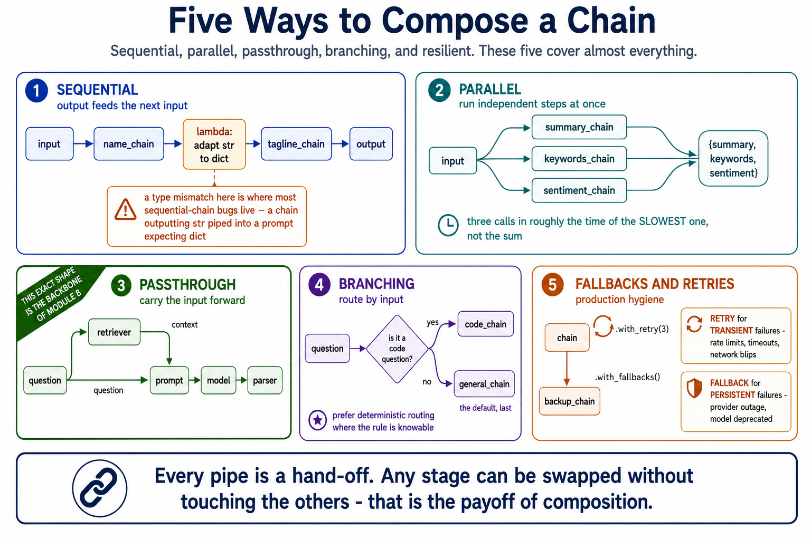
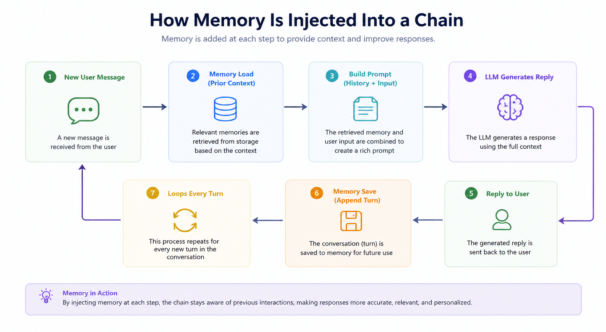
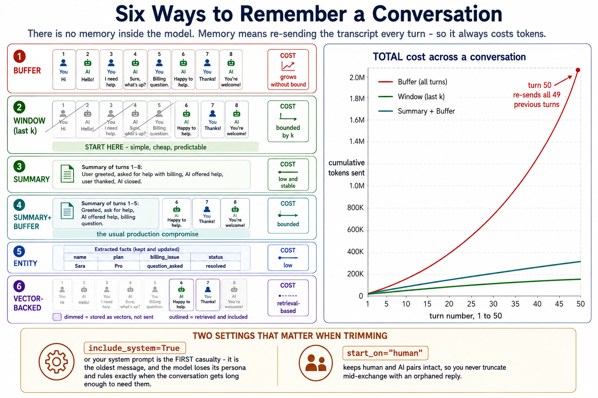
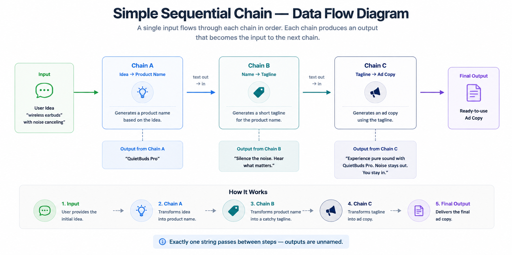

# Module 6: LangChain & Chains

> **By the end of this module** you'll understand what a "chain" actually is — well enough to build one from scratch — and be able to compose multi-step LLM pipelines with prompt templates, output parsers, parallel branches, fallbacks and conversation memory. You'll also know when *not* to reach for a framework.

| | |
|---|---|
| **Time** | ~2 hours (70 min reading, 50 min lab) |
| **Prerequisites** | [Module 5](05-prompt-engineering.md). Your `PromptTemplate` from Lab 5 matters here. |
| **Packages** | `langchain`, `langchain-core`, `langchain-openai` or `langchain-ollama` |
| **Cost** | ~$0.03 for the lab, or free with Ollama. Part 1 is free and offline. |

---

## Contents

- [6.0 Why This Matters](#60-why-this-matters)
- [6.1 The Honest Case For and Against LangChain](#61-the-honest-case-for-and-against-langchain)
- [6.2 What LangChain Gives You](#62-what-langchain-gives-you)
- [6.3 What a Chain Actually Is](#63-what-a-chain-actually-is)
- [6.4 LCEL and the Runnable Interface](#64-lcel-and-the-runnable-interface)
- [6.5 What You Get For Free](#65-what-you-get-for-free)
- [6.6 Prompt Templates](#66-prompt-templates)
- [6.7 Output Parsers and Structured Output](#67-output-parsers-and-structured-output)
- [6.8 Composition Patterns](#68-composition-patterns)
- [6.9 Memory: Conversational State](#69-memory-conversational-state)
- [6.10 Reading Old Tutorials](#610-reading-old-tutorials)
- [6.11 Debugging and Tracing](#611-debugging-and-tracing)
- [6.12 Best Practices and Pitfalls](#612-best-practices-and-pitfalls)
- [🧪 Hands-On Lab 6](#-hands-on-lab-6)
- [✅ Key Takeaways](#-key-takeaways)
- [⚠️ Common Mistakes & Misconceptions](#️-common-mistakes--misconceptions)
- [📚 Going Deeper](#-going-deeper)

---

## 6.0 Why This Matters

So far every model call has been standalone: build messages, send, parse the reply. That works right up until you need a second step.

Consider a realistic task: *"Read this support ticket, classify it, look up the customer's plan, draft a reply in our house style, and return it as JSON."*

Done by hand that's four API calls, four prompts, four parse steps, error handling at each stage, and glue code threading the output of one into the input of the next. Written naively it becomes a single 200-line function that's impossible to test, and where a failure in step 3 leaves you with no idea what step 2 produced.

**A chain is the abstraction that fixes this.** Small, single-purpose steps that snap together, each testable in isolation.

LangChain is the most widely used library for this. It's also genuinely contested — plenty of experienced teams deliberately don't use it. So this module does two things:

1. **Teaches the concepts** — chains, composition, parsers, memory — which are universal and outlive any library
2. **Teaches LangChain specifically**, because you'll encounter it constantly

And in the lab you'll **build a miniature chain framework from scratch**, including the `|` operator. That's the fastest way to stop finding LCEL mysterious: about 40 lines of Python, and it can't go out of date.

---

## 6.1 The Honest Case For and Against LangChain

Most tutorials skip this. You should hear it before investing.

### The case for

| Benefit | Detail |
|---|---|
| **Provider abstraction** | Swap OpenAI ↔ Anthropic ↔ Gemini ↔ local Ollama by changing one line |
| **Composition** | `prompt \| model \| parser` reads as the pipeline it is |
| **Free machinery** | Streaming, async, batching, retries and fallbacks come with the interface |
| **Integrations** | Hundreds of document loaders, vector stores and tools already written |
| **Ecosystem** | LangSmith for tracing, LangGraph for stateful agents |

### The case against

| Criticism | Detail |
|---|---|
| **Abstraction depth** | When something breaks, you may debug through several layers of framework to reach your own bug |
| **Version churn** | The API has changed substantially and repeatedly. Tutorials rot fast. |
| **Hidden prompts** | Some built-in chains inject prompts you didn't write and can't easily see |
| **Easy things get harder** | A single model call is genuinely simpler with the provider SDK |
| **Dependency weight** | A large tree for what is often a thin wrapper over an HTTP call |

### A reasonable position

> **Use the provider SDK directly** for one or two model calls. The SDK is well documented, the whole request is visible, and there's nothing between you and the API.
>
> **Reach for LangChain** when you have genuine composition needs: multi-step pipelines, retrieval, streaming with fallbacks, provider portability, or a use for the integration catalogue.

**Learn the concepts either way.** Chains, output parsers, memory management and retries are things you'll implement whether or not you import them — and if you write them yourself, you'll understand what the framework is doing for you.

> **📌 On version churn.** LangChain's API has moved a lot. This module teaches the **LCEL / Runnable** interface, which is the stable modern core, and §6.10 shows you how to recognise and translate the older patterns you'll meet in tutorials. Where code here differs from current docs, trust the docs — and note that the lab's core is framework-free precisely so it can't rot.

---

## 6.2 What LangChain Gives You

Seven component families. You'll use the first four constantly, memory occasionally, and the last two in Module 9.

| # | Component | What it does | Covered in |
|---|---|---|---|
| 1 | **Prompts & templates** | Structured, variable-driven prompts | §6.6 |
| 2 | **Models** | A uniform interface over chat and completion models | §6.4 |
| 3 | **Output parsers** | Turn raw text into strings, JSON, or typed objects | §6.7 |
| 4 | **Chains (LCEL)** | Compose components into pipelines | §6.4, §6.8 |
| 5 | **Memory** | Carry conversational state across turns | §6.9 |
| 6 | **Retrieval** | Loaders, splitters, embeddings, vector stores, retrievers | **Modules 7–8** |
| 7 | **Tools & agents** | Let the model call functions and decide what to do | **Module 9** |

### Installing, and the provider switch

```powershell
pip install langchain langchain-core langchain-openai langchain-ollama
```

The pattern worth adopting from the start — **one line switches your entire pipeline** between a paid API and a free local model:

```python
"""setup.py - choose your track once, use it everywhere."""

import os
from dotenv import load_dotenv

load_dotenv()

# Flip this single flag to switch the whole pipeline.
USE_FREE = False

if USE_FREE:
    # FREE: runs locally, no key, no cost, works offline.
    # One-time setup: install from ollama.com, then `ollama pull llama3`
    from langchain_ollama import ChatOllama
    model = ChatOllama(model="llama3", temperature=0.3)
else:
    # PAID: faster and stronger, costs a fraction of a cent per call.
    from langchain_openai import ChatOpenAI
    model = ChatOpenAI(model="gpt-4o-mini", temperature=0.3)

print(f"Active model: {type(model).__name__}")
```

**This is the single best argument for LangChain**, and it's worth seeing early. Everything downstream — every chain, prompt and parser — works unchanged with either. The rest of this module never has to mention the provider again.

> **💡 Model names.** The repo's original notebooks pull `llama3.2`; earlier modules here use `llama3`. Either works — use whatever you've pulled. See `appendix/C-model-landscape.md` for current hosted model names.

---

## 6.3 What a Chain Actually Is

Strip away the framework and a chain is a very simple idea:

> **A chain is a sequence of steps where each step takes structured input, does one job, and passes its result to the next.**

That's it. If you've used a Unix pipe, you already have the concept:

```bash
cat data.txt | grep error | sort | uniq -c
```

Each command does one thing and hands its output onward. LangChain does the same for LLM steps.

### The canonical shape

```
  Input variables          {"topic": "vector databases"}
        │
        ▼
  ┌──────────────────┐
  │  PromptTemplate  │     fills the template with your variables
  └────────┬─────────┘
           ▼
  ┌──────────────────┐
  │  Model           │     generates a completion
  └────────┬─────────┘
           ▼
  ┌──────────────────┐
  │  OutputParser    │     turns raw text into a usable type
  └────────┬─────────┘
           ▼
      Clean result           "Vector databases store embeddings..."
```

### Why bother

| Property | What it buys you |
|---|---|
| **Modularity** | Swap the model, prompt or parser without touching the rest |
| **Reusability** | One chain, many inputs, many applications |
| **Testability** | Small typed steps can be tested individually — a 200-line mega-function can't |
| **Composability** | Chains nest inside chains, which is what makes multi-step pipelines tractable |
| **Traceability** | When it fails, you can see *which step* failed and what it received |

That last one is worth emphasising. **The main practical benefit of chains isn't elegance — it's debuggability.** With one giant prompt, a bad output tells you nothing. With five steps, you can inspect each hand-off.

---

## 6.4 LCEL and the Runnable Interface

**LCEL** — the LangChain Expression Language — is just the `|` operator plus one shared interface.

### The core idea

Every LangChain component implements the same protocol, called **`Runnable`**:

| Method | Purpose |
|---|---|
| `.invoke(input)` | Run once |
| `.batch([inputs])` | Run many |
| `.stream(input)` | Yield output incrementally |
| `.ainvoke(input)` | Async version (also `abatch`, `astream`) |

Because prompts, models and parsers *all* implement it, they snap together — and **the resulting chain is itself a `Runnable`**, so it can be nested inside another chain. That closure property is the whole trick.

### A chain in three lines

```python
from langchain_core.prompts import ChatPromptTemplate
from langchain_core.output_parsers import StrOutputParser

prompt = ChatPromptTemplate.from_messages([
    ("system", "You are a concise technical writer."),
    ("human", "Explain {topic} in exactly 3 bullet points."),
])

# The pipe passes each step's output to the next.
chain = prompt | model | StrOutputParser()

result = chain.invoke({"topic": "vector databases"})
print(result)          # a plain string, ready to use
```

Read it as a data-flow: the dict fills the prompt, the prompt's messages go to the model, the model's response goes to the parser, the parser returns a string.

### What `|` actually does

No magic. Python lets any class define `__or__`, and `Runnable` implements it to return a `RunnableSequence`:

```python
# These are equivalent:
chain = prompt | model | parser

from langchain_core.runnables import RunnableSequence
chain = RunnableSequence(prompt, model, parser)
```

**You'll implement this yourself in the lab.** It's about ten lines, and doing it once permanently removes the sense that LCEL is doing something clever.

### What each step passes on

Worth knowing, because type mismatches between steps are the most common chain bug:

| Step | Receives | Returns |
|---|---|---|
| `ChatPromptTemplate` | `dict` of variables | a list of messages |
| Chat model | messages (or a string) | an `AIMessage` object |
| `StrOutputParser` | an `AIMessage` | `str` |
| `JsonOutputParser` | an `AIMessage` | `dict` / `list` |

> **⚠️ The `.content` gotcha.** A chat model returns an `AIMessage`, not a string. `prompt | model` gives you an object you must call `.content` on. Adding `StrOutputParser()` does that for you — which is why almost every chain ends with a parser. Forget it and you'll get `AIMessage(content='...')` where you expected text.

---

## 6.5 What You Get For Free

This is the real payoff of the shared interface. **Define a chain once and every run mode works:**

```python
chain = prompt | model | StrOutputParser()

# --- One input ---
chain.invoke({"topic": "RAG"})

# --- Many inputs, executed concurrently ---
chain.batch([{"topic": "RAG"}, {"topic": "agents"}, {"topic": "embeddings"}])

# --- Streaming, token by token ---
for chunk in chain.stream({"topic": "RAG"}):
    print(chunk, end="", flush=True)

# --- Async ---
await chain.ainvoke({"topic": "RAG"})
```

You wrote none of that. It comes from the interface.

| Capability | Why it matters |
|---|---|
| **Streaming** | Time-to-first-token dominates perceived speed. Users tolerate a slow full answer; they don't tolerate a blank screen. |
| **Batch** | Concurrent execution instead of a sequential loop — often 5–10× faster for bulk work |
| **Async** | Necessary for a web server handling concurrent requests |
| **Fallbacks & retries** | `.with_fallbacks()` and `.with_retry()` on any chain (§6.8) |
| **Tracing** | Every step observable in LangSmith (§6.11) |

**Streaming is the one to appreciate.** Implementing it by hand — handling server-sent events, accumulating chunks, dealing with partial JSON — is genuinely fiddly. Here it's a method name.

> **💡 `.batch()` is not free of rate limits.** It runs requests concurrently, which is exactly how you hit a provider's rate limit. Use `chain.batch(inputs, config={"max_concurrency": 5})` to throttle it.

---

## 6.6 Prompt Templates

You built a `PromptTemplate` in Lab 5. LangChain's version does the same job with more features.

### Two flavours

```python
from langchain_core.prompts import PromptTemplate, ChatPromptTemplate

# --- PromptTemplate: a single string, for completion-style use ---
simple = PromptTemplate(
    input_variables=["topic"],
    template="Explain {topic} in 3 bullet points.",
)

# --- ChatPromptTemplate: role-tagged messages. Use this one. ---
chat = ChatPromptTemplate.from_messages([
    ("system", "You are a concise technical writer. Keep answers under {max_words} words."),
    ("human", "Explain {topic}."),
])

# Inspect what will actually be sent - do this when debugging.
print(chat.format_messages(topic="RAG", max_words=50))
```

**Prefer `ChatPromptTemplate`.** Every modern model is a chat model, and Module 5 §5.3 explains why the system/user split matters.

> **🔑 `format_messages()` is your best debugging tool in this module.** When a chain misbehaves, print the rendered prompt *before* blaming the model. Most "the model ignored my instruction" bugs turn out to be "my instruction never reached the model."

### Few-shot templates

Lab 5's `format_few_shot_messages` has a built-in equivalent:

```python
from langchain_core.prompts import FewShotChatMessagePromptTemplate, ChatPromptTemplate

examples = [
    {"input": "Best meal I have ever had!", "output": "positive"},
    {"input": "Wrong order, never coming back.", "output": "negative"},
    {"input": "Food was okay, nothing special.", "output": "neutral"},
]

# Describes how ONE example is rendered...
example_prompt = ChatPromptTemplate.from_messages([
    ("human", "{input}"),
    ("ai", "{output}"),
])

# ...and this expands it across all examples.
few_shot = FewShotChatMessagePromptTemplate(
    example_prompt=example_prompt,
    examples=examples,
)

final_prompt = ChatPromptTemplate.from_messages([
    ("system", "Classify reviews as positive, negative or neutral. One word only."),
    few_shot,                      # the examples expand here
    ("human", "{input}"),
])

chain = final_prompt | model | StrOutputParser()
print(chain.invoke({"input": "It was delivered cold and tasteless."}))   # negative
```

Same structure you built by hand in Lab 5 — one system message, alternating example turns, then the real request.

### `MessagesPlaceholder`

A slot for a variable number of messages. Essential for memory (§6.9):

```python
from langchain_core.prompts import ChatPromptTemplate, MessagesPlaceholder

prompt = ChatPromptTemplate.from_messages([
    ("system", "You are a helpful assistant."),
    MessagesPlaceholder(variable_name="chat_history"),   # history is injected here
    ("human", "{input}"),
])
```

At runtime you pass `chat_history` as a list of messages and they're spliced in. Without this, you'd have to rebuild the whole template every turn.

---

## 6.7 Output Parsers and Structured Output

Module 5 §5.8 argued that unparseable output isn't a feature. LangChain provides the parsing layer.

### The common parsers

```python
from langchain_core.output_parsers import StrOutputParser, JsonOutputParser

# --- Raw text ---
chain = prompt | model | StrOutputParser()
result = chain.invoke({"topic": "RAG"})            # -> str

# --- JSON ---
chain = prompt | model | JsonOutputParser()
result = chain.invoke({"topic": "RAG"})            # -> dict
```

`JsonOutputParser` handles the code-fence-and-preamble problem you solved by hand in Lab 5. Same job as your `extract_json`, and now you know exactly what it's doing.

### Schema-validated output — the right default

```python
from pydantic import BaseModel, Field
from typing import Literal

class TicketClassification(BaseModel):
    """The shape we require back."""
    category: Literal["billing", "technical", "account", "other"]
    urgency: int = Field(ge=1, le=5, description="1 = low, 5 = critical")
    reasoning: str = Field(description="One sentence explaining the classification")


# with_structured_output sends the schema AND validates the response.
structured_model = model.with_structured_output(TicketClassification)

chain = prompt | structured_model

result = chain.invoke({"ticket": "I was charged twice this month."})
print(result.category)      # 'billing' - a validated string, not a guess
print(result.urgency + 1)   # arithmetic works: it's a real int
```

Three things this gives you that manual parsing doesn't:

1. **The schema is the documentation** — one source of truth
2. **`Literal` makes invalid categories a validation error**, not a surprise string downstream
3. **`Field(ge=1, le=5)`** enforces the range, so out-of-bounds values fail loudly

> **💡 Field order encodes reasoning order.** Put `reasoning` *before* `category` in the schema and the model reasons then concludes. Put it after and it commits then rationalises — the sycophancy trap from Module 5 §5.9, reappearing in a schema. **Order your fields so thinking comes first.**

### Parsers are just Runnables

Which means you can write your own with `RunnableLambda`:

```python
from langchain_core.runnables import RunnableLambda

def extract_first_line(text: str) -> str:
    """Keep only the first non-empty line."""
    for line in text.splitlines():
        if line.strip():
            return line.strip()
    return ""

# Any function becomes a chain step.
chain = prompt | model | StrOutputParser() | RunnableLambda(extract_first_line)
```

**This is the escape hatch worth remembering.** Anything the framework doesn't provide, you can drop in as a plain function. You are never stuck.

---

## 6.8 Composition Patterns

Five patterns cover almost everything.



### 1. Sequential — output feeds the next input

```python
from langchain_core.output_parsers import StrOutputParser

# Step 1: generate a product name
name_prompt = ChatPromptTemplate.from_template(
    "Suggest one product name for: {product}. Reply with the name only."
)
# Step 2: write a tagline FOR THAT NAME
tagline_prompt = ChatPromptTemplate.from_template(
    "Write a 6-word tagline for a product called {name}."
)

name_chain = name_prompt | model | StrOutputParser()
tagline_chain = tagline_prompt | model | StrOutputParser()

# The dict adapts step 1's output (a string) to step 2's input (a dict).
full_chain = name_chain | (lambda name: {"name": name}) | tagline_chain

print(full_chain.invoke({"product": "eco-friendly water bottle"}))
```

**Note the lambda.** `name_chain` outputs a `str`; `tagline_prompt` expects a `dict`. That adapter is where most sequential-chain bugs live — a type mismatch between steps.

### 2. Parallel — run independent steps at once

```python
from langchain_core.runnables import RunnableParallel

summary_chain = summary_prompt | model | StrOutputParser()
keywords_chain = keywords_prompt | model | StrOutputParser()
sentiment_chain = sentiment_prompt | model | StrOutputParser()

# All three run CONCURRENTLY, and the result is a dict with these keys.
analyse = RunnableParallel(
    summary=summary_chain,
    keywords=keywords_chain,
    sentiment=sentiment_chain,
)

result = analyse.invoke({"document": text})
print(result["summary"], result["keywords"], result["sentiment"])
```

Three independent calls in roughly the time of the slowest one, rather than the sum of all three. **Use it whenever steps don't depend on each other** — it's close to free latency.

### 3. Passthrough — carry the original input forward

```python
from langchain_core.runnables import RunnablePassthrough

# The RAG shape you'll build properly in Module 8:
rag_chain = (
    {"context": retriever, "question": RunnablePassthrough()}
    | rag_prompt
    | model
    | StrOutputParser()
)
```

`RunnablePassthrough` forwards the input unchanged. Here the question goes to *both* the retriever (to find documents) and the prompt (to be answered). **This exact shape is the backbone of Module 8** — worth recognising now.

### 4. Branching — route by input

```python
from langchain_core.runnables import RunnableBranch

def is_code_question(x) -> bool:
    return any(w in x["question"].lower() for w in ["code", "function", "bug", "error"])

router = RunnableBranch(
    (is_code_question, code_chain),        # (condition, chain) pairs
    general_chain,                          # the default, last
)
```

Cheaper and more predictable than letting a model decide. **Prefer deterministic routing where the rule is knowable** — reserve model-driven routing for genuinely ambiguous cases (Module 9).

### 5. Fallbacks and retries — production hygiene

```python
# If the primary model fails, try the backup.
robust = primary_chain.with_fallbacks([backup_chain])

# Retry transient failures with exponential backoff.
resilient = chain.with_retry(stop_after_attempt=3)

# Compose both.
production = chain.with_retry(stop_after_attempt=3).with_fallbacks([cheap_backup])
```

| Use | For |
|---|---|
| `.with_retry()` | **Transient** failures — rate limits, timeouts, network blips |
| `.with_fallbacks()` | **Persistent** failures — provider outage, model deprecated, content filter |

Retrying a persistent failure just wastes time and money. Falling back for a transient one gives you degraded output when a retry would have succeeded. **Match the tool to the failure class.**

### Putting it together

```python
# A realistic pipeline: gather context in parallel, then reason over it.
pipeline = (
    RunnableParallel(
        internal=retriever,                 # from our documents
        web=web_search_chain,               # from the internet
        question=RunnablePassthrough(),     # keep the original question
    )
    | compare_prompt
    | model
    | JsonOutputParser()
).with_retry(stop_after_attempt=2)

result = pipeline.invoke("How does our Q4 churn compare to the industry?")
```

Each `|` is a hand-off. Any stage can be swapped without touching the others — that's the payoff of composition.


---

## 6.9 Memory: Conversational State

**Chains are stateless by default.** Every `.invoke()` starts fresh. Memory is how a multi-turn conversation stays coherent.

### The uncomfortable truth about memory

There's no memory inside the model. Module 1 §1.7: the model re-reads its entire input every turn.

> **"Memory" means re-sending the conversation history as part of the prompt, every single time.**



That's the whole mechanism:

1. **Load** prior messages before building the prompt
2. **Inject** them into a `MessagesPlaceholder`
3. **Call** the model
4. **Save** the new exchange for next time

Understanding this explains everything about memory's costs: it grows your prompt, so it costs tokens on every turn, and eventually it overflows the context window.

### The modern approach

```python
from langchain_core.chat_history import InMemoryChatMessageHistory
from langchain_core.prompts import ChatPromptTemplate, MessagesPlaceholder
from langchain_core.runnables.history import RunnableWithMessageHistory

prompt = ChatPromptTemplate.from_messages([
    ("system", "You are a helpful assistant."),
    MessagesPlaceholder(variable_name="chat_history"),   # history lands here
    ("human", "{input}"),
])

chain = prompt | model | StrOutputParser()

# One history store per conversation, keyed by session id.
store = {}

def get_history(session_id: str):
    """Return this session's history, creating it on first use."""
    if session_id not in store:
        store[session_id] = InMemoryChatMessageHistory()
    return store[session_id]

conversational = RunnableWithMessageHistory(
    chain,
    get_history,
    input_messages_key="input",
    history_messages_key="chat_history",
)

# The session_id keeps separate users' conversations separate.
config = {"configurable": {"session_id": "user-123"}}

print(conversational.invoke({"input": "My name is Sara."}, config=config))
print(conversational.invoke({"input": "What is my name?"}, config=config))
# -> "Your name is Sara."  because turn 1 was re-sent as history
```

> **⚠️ `InMemoryChatMessageHistory` is in memory.** Restart your process and every conversation is gone. For anything real, back it with Redis, Postgres or a file. The interface is the same; only the store changes.

### The strategies, and their trade-offs

The real question is *what* to keep, because you can't keep everything forever.

| Strategy | Keeps | Token cost | Best for |
|---|---|---|---|
| **Buffer** | Every turn, verbatim | **Grows without bound** | Short conversations; maximum fidelity |
| **Window (last k)** | The last k turns only | Bounded by k | Long chats where recent context is what matters |
| **Summary** | A running LLM-written summary | Low and stable | Long sessions where the gist suffices |
| **Summary + buffer** | Recent turns verbatim, older ones summarised | Bounded | The usual production compromise |
| **Entity** | Structured facts about key entities | Low | Tracking people/objects across many turns |
| **Vector-backed** | Embeds turns; retrieves the relevant ones | Retrieval-based | Very long histories with selective recall |

**Start with a window.** It's simple, cheap and predictable. Move to summary-plus-buffer when you find users referring back to things a window drops.



### Implementing a window

```python
from langchain_core.messages import trim_messages

# Keep only the most recent messages that fit a token budget.
trimmer = trim_messages(
    max_tokens=1000,
    strategy="last",              # keep the END of the conversation
    token_counter=model,
    include_system=True,          # never drop the system prompt
    start_on="human",             # keep human/ai pairs intact
)

chain = trimmer | prompt | model | StrOutputParser()
```

Two details that matter more than they look: `include_system=True` stops your carefully written system prompt being the first casualty, and `start_on="human"` prevents a truncation that starts mid-exchange with an orphaned AI message.

> **💡 Cost reality check.** Buffer memory means turn 50 re-sends all 49 previous turns. Cost per turn grows linearly, so total cost across a conversation grows *quadratically*. A long chat with unbounded buffer memory is one of the easiest ways to run up a surprising bill. Bound it.

---

## 6.10 Reading Old Tutorials

LangChain's API has changed substantially. You **will** hit tutorials using the old patterns, so here's the translation table.

| Legacy (still works, deprecated) | Modern (use this) |
|---|---|
| `LLMChain(llm=model, prompt=prompt)` | `prompt \| model \| StrOutputParser()` |
| `chain.run(input)` | `chain.invoke(input)` |
| `SimpleSequentialChain(chains=[a, b])` | `a \| b` |
| `SequentialChain(...)` with `input_variables` | LCEL with explicit dict mapping |
| `ConversationBufferMemory()` | `RunnableWithMessageHistory` or LangGraph checkpointers |
| `ConversationChain(llm, memory)` | `RunnableWithMessageHistory` around your chain |
| `initialize_agent(...)` | `create_tool_calling_agent` / LangGraph (Module 9) |
| `from langchain.prompts import ...` | `from langchain_core.prompts import ...` |

### The two sequential-chain classes, for reference

You'll see these in older material:



**`SimpleSequentialChain`** — one unnamed value flows through:

```python
overall = SimpleSequentialChain(chains=[name_chain, tagline_chain, ad_chain])
overall.run("eco-friendly water bottle")
```


**`SequentialChain`** — multiple named variables, so later steps can reference earlier outputs by key:

| Property | `SimpleSequentialChain` | `SequentialChain` |
|---|---|---|
| Variables per step | One, unnamed | Several, named |
| Reuse an earlier output later | No | Yes, by key |
| Setup complexity | Minimal | Moderate |

**LCEL replaces both**, and more flexibly — a dict in the pipeline does what `SequentialChain`'s key mapping did, explicitly and visibly.

> **🔑 How to spot a stale tutorial:** `.run(`, `LLMChain`, `initialize_agent`, `ConversationBufferMemory`, or imports from `langchain.` rather than `langchain_core.`. The concepts still transfer; the code needs translating.

---

## 6.11 Debugging and Tracing

Chains fail in ways single calls don't: the failure is somewhere in the middle and the error message points at the wrong place.

### Print the rendered prompt first

```python
# Before blaming the model, check what it actually received.
print(prompt.format_messages(topic="RAG", max_words=50))
```

**A large share of "the model ignored my instructions" bugs are actually "my instructions never arrived"** — a missing variable, a template typo, memory not injected. Thirty seconds with `format_messages()` beats an hour of prompt tweaking.

### Inspect intermediate steps

Because every sub-chain is a `Runnable`, you can run it alone:

```python
# Test each stage in isolation to find where it breaks.
messages = prompt.invoke({"topic": "RAG"})
print("1. prompt ->", messages)

response = model.invoke(messages)
print("2. model  ->", response)

text = StrOutputParser().invoke(response)
print("3. parser ->", text)
```

**This is the single most useful debugging technique in the module**, and it's only possible because the steps are separable. It's the concrete payoff of not writing one giant function.

### Verbose and debug modes

```python
from langchain.globals import set_debug, set_verbose

set_verbose(True)    # readable step-by-step output
set_debug(True)      # everything, including raw payloads
```

Turn these off before production — `set_debug(True)` logs full prompts, which may contain user data.

### Add a logging step anywhere

```python
from langchain_core.runnables import RunnableLambda

def log(label: str):
    """A pass-through step that prints what flows through it."""
    def _log(x):
        print(f"[{label}] {str(x)[:200]}")
        return x           # MUST return the input unchanged
    return RunnableLambda(_log)

chain = prompt | log("after prompt") | model | log("after model") | StrOutputParser()
```

A tap you can insert at any point. Note that it must **return its input** — a logging step that returns `None` silently breaks the chain, which is an annoying five minutes to debug.

### LangSmith

For real projects, tracing beats print statements:

```python
# In .env
LANGSMITH_TRACING=true
LANGSMITH_API_KEY=your-key
LANGSMITH_PROJECT=my-project
```

Every step, its inputs and outputs, latency and token counts become visible in a web UI. Genuinely valuable once chains get deep, and it's the same data Module 11 uses for evaluation.

---

## 6.12 Best Practices and Pitfalls

### ✅ Do

| Practice | Why |
|---|---|
| **One responsibility per step** | Easier to test, trace and swap |
| **Always end with a parser** | Enforces a typed hand-off; avoids the `.content` surprise |
| **Bound memory explicitly** | Unbounded buffers overflow context and cost quadratically |
| **Add fallbacks and retries** | Models and networks fail; decide what happens when they do |
| **Version your prompts** | A behaviour change should be traceable to a change |
| **Test steps in isolation** | Find the broken stage, not just the broken chain |
| **Trace everything** | Multi-step failures are near-impossible to debug blind |

### ⚠️ Avoid

| Anti-pattern | Why it hurts |
|---|---|
| **One giant prompt** | Brittle, unreusable, and you can't tell which instruction failed |
| **Unbounded buffer memory** | Silently overflows the context window on long chats |
| **Trusting output without validation** | Use schemas; a plausible wrong shape breaks downstream code |
| **Chaining for its own sake** | A single call doesn't need a framework |
| **No failure path** | Tools error and models hallucinate. Plan for it. |
| **Framework where a function would do** | If you're fighting the abstraction, drop to `RunnableLambda` or the raw SDK |

That last one deserves saying plainly: **if LangChain is making something harder, stop using it for that part.** Mixed codebases — LangChain for the pipeline, plain SDK calls for the one awkward step — are entirely reasonable.

---

## 🧪 Hands-On Lab 6

**→ [Go to Lab 6: Build Your Own Chain Framework](../labs/06-langchain-chains/README.md)**

Implement a miniature chain framework from scratch — including the `|` operator, parallel execution, fallbacks and three memory strategies — then rebuild the same pipeline in real LangChain and compare.

Part 1 is pure Python: no API key, no packages, no cost. Budget 50 minutes.

---

## ✅ Key Takeaways

1. **A chain is a sequence of single-purpose steps**, each taking structured input and passing its result on. The main benefit is debuggability, not elegance.

2. **LCEL is `__or__` plus one shared interface.** Every component is a `Runnable`, and a chain of `Runnable`s is itself a `Runnable` — that closure is what makes nesting work.

3. **The shared interface is why you get streaming, batch, async, retries and tracing for free.** That's the strongest practical argument for the framework.

4. **Almost every chain ends with an output parser.** A chat model returns an `AIMessage`, not a string.

5. **Use `with_structured_output` and a Pydantic schema** for anything a program consumes — and order the fields so reasoning comes before conclusions.

6. **`RunnableLambda` is the escape hatch.** Any Python function becomes a chain step, so you're never stuck inside the abstraction.

7. **Match the resilience tool to the failure class:** `.with_retry()` for transient, `.with_fallbacks()` for persistent.

8. **"Memory" is re-sending the conversation as part of the prompt.** There is no state inside the model — which is why memory costs tokens every turn and eventually overflows.

9. **Bound your memory.** Unbounded buffer memory makes total conversation cost grow quadratically.

10. **`format_messages()` first.** Most "the model ignored me" bugs are "the instruction never arrived."

11. **Spot stale tutorials** by `.run(`, `LLMChain`, `initialize_agent`, or `ConversationBufferMemory`. Concepts transfer; code needs translating.

12. **Use the SDK directly for simple calls.** Reach for a framework when you have real composition needs.

---

## ⚠️ Common Mistakes & Misconceptions

<br>

> ### ❌ "LangChain is required to build with LLMs"
> **Reality:** it's one option. Many production systems use provider SDKs plus a few hundred lines of their own glue. Learn the concepts — chains, parsers, memory, retries — because you'll implement them either way.

<br>

> ### ❌ Expecting `prompt | model` to return a string
> **Reality:** it returns an `AIMessage`. You need `.content`, or (better) `StrOutputParser()` at the end of the chain. This is the single most common beginner error in LangChain.

<br>

> ### ❌ Copying code from a tutorial without checking its age
> **Reality:** LangChain's API has changed repeatedly. `LLMChain`, `.run()`, `initialize_agent` and `ConversationBufferMemory` all signal pre-LCEL material. Use §6.10's translation table.

<br>

> ### ❌ Type mismatches between chain steps
> **Reality:** the most common composition bug. A chain outputting `str` piped into a prompt expecting `dict` fails confusingly. Insert an adapter: `| (lambda x: {"key": x})`.

<br>

> ### ❌ Unbounded buffer memory
> **Reality:** it works beautifully in testing (short conversations) and blows the context window in production. Cost per turn grows linearly; total cost grows quadratically. Bound it from day one.

<br>

> ### ❌ "Memory means the model remembers me"
> **Reality:** the model is stateless. Memory is your application re-sending the transcript every turn. Nothing persists model-side, which is why memory has a token cost and a hard ceiling.

<br>

> ### ❌ Forgetting `include_system=True` when trimming
> **Reality:** naive truncation drops the oldest messages — and your system prompt is the oldest message. The model loses its persona and rules exactly when the conversation gets long enough to need them.

<br>

> ### ❌ A logging step that doesn't return its input
> **Reality:** `RunnableLambda(lambda x: print(x))` returns `None`, silently breaking the chain. Log *and* return.

<br>

> ### ❌ `.with_retry()` on a persistent failure
> **Reality:** retrying an invalid API key three times gets you three failures and three delays. Retries are for transient problems; fallbacks are for persistent ones.

<br>

> ### ❌ Using `.batch()` and hitting rate limits
> **Reality:** batch runs concurrently by design, which is exactly how you trip a rate limit. Pass `config={"max_concurrency": 5}`.

<br>

> ### ❌ Leaving `set_debug(True)` on in production
> **Reality:** it logs full prompts, which may contain user data and secrets. Development only.

<br>

> ### ❌ Adding chains because chains feel professional
> **Reality:** a single model call is clearer with the SDK. Composition earns its complexity when you have several steps, branching, retrieval, or provider portability to gain. Not before.

---

## 📚 Going Deeper

**Documentation**
- [LangChain: LCEL concepts](https://python.langchain.com/docs/concepts/lcel/) — the authoritative reference for §6.4
- [LangChain: Runnable interface](https://python.langchain.com/docs/concepts/runnables/)
- [LangChain: How-to guides](https://python.langchain.com/docs/how_to/) — task-oriented and genuinely useful

**Tools**
- [LangSmith](https://docs.smith.langchain.com/) — tracing and evaluation
- [LangGraph](https://langchain-ai.github.io/langgraph/) — stateful graphs; the modern route for agents (Module 9)

**The other side of the argument**
- Search out critiques of LangChain as well as tutorials. Reading why some teams dropped it will make you a better judge of when to use it — and that judgement is worth more than knowing the API.

**Alternatives worth knowing**
- **Plain provider SDKs** — often the right answer for simple applications
- [LlamaIndex](https://docs.llamaindex.ai/) — more focused on retrieval and indexing
- [Instructor](https://python.useinstructor.com/) — structured output, and little else

---

<div align="center">

**[⬅ Module 5](05-prompt-engineering.md)** · **[🧪 Do Lab 6](../labs/06-langchain-chains/README.md)** · **[🏠 README](../README.md)** · **➡️ Module 7: Embeddings & Vector Databases** *(coming next)*

</div>
