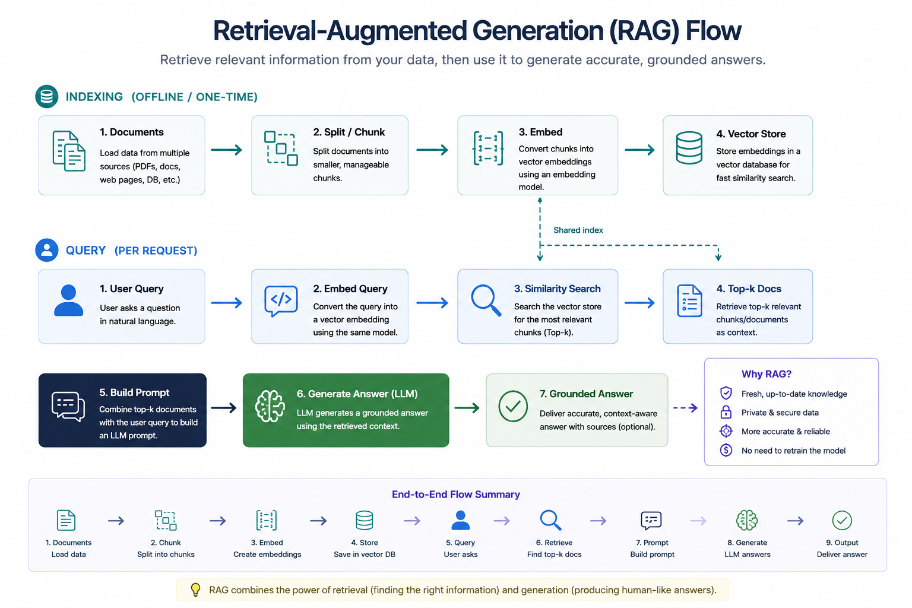
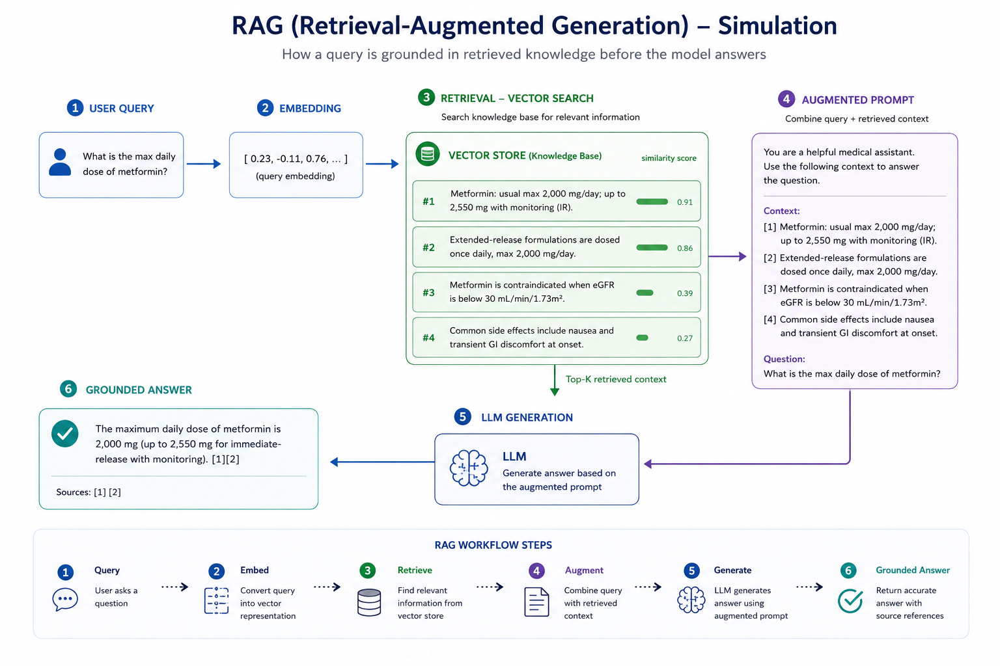
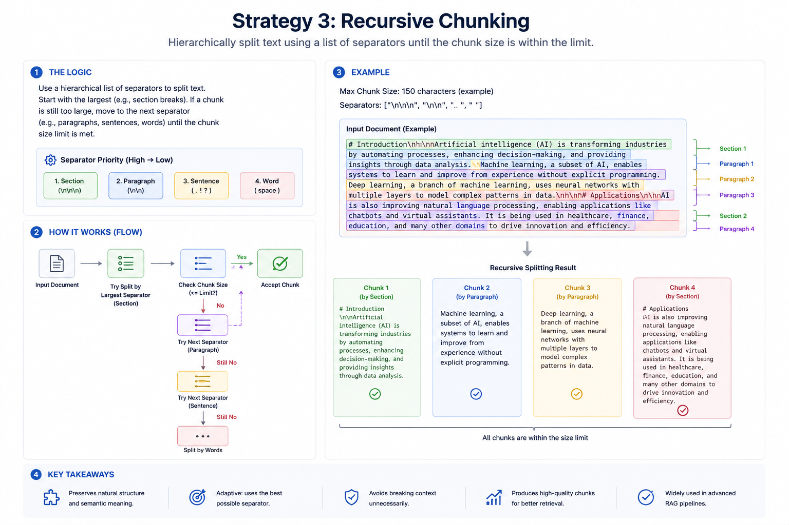
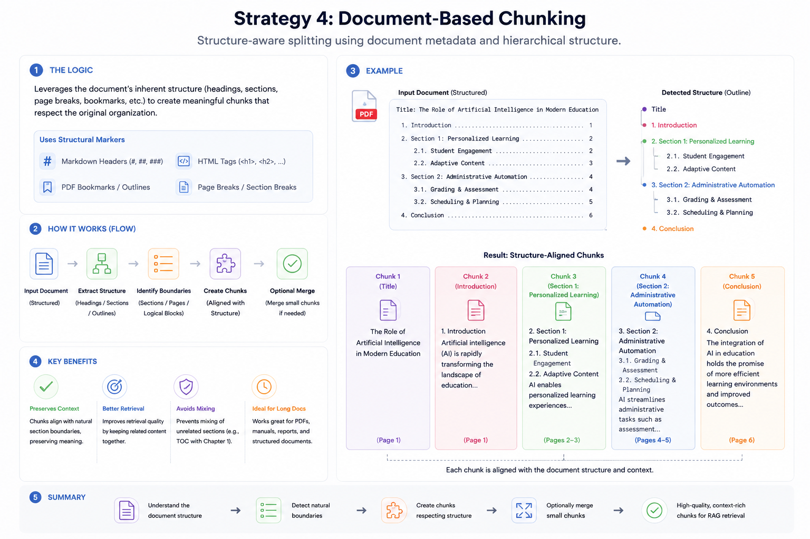
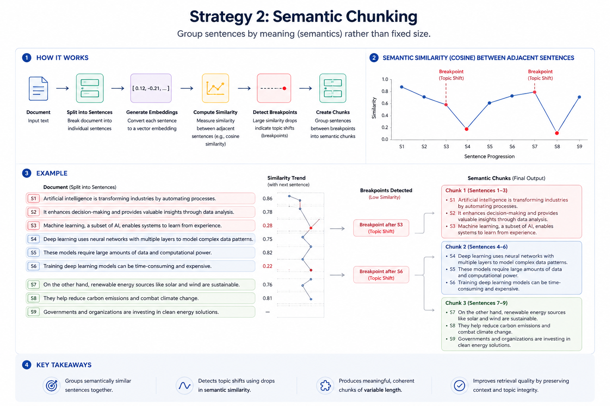
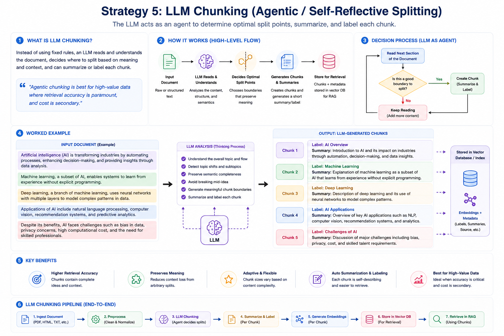
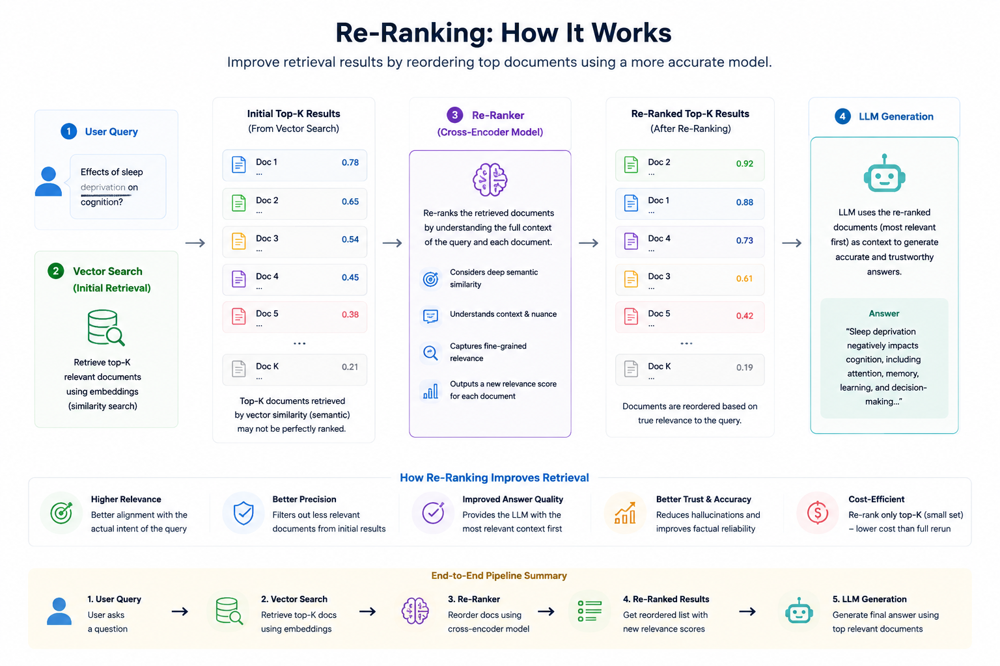
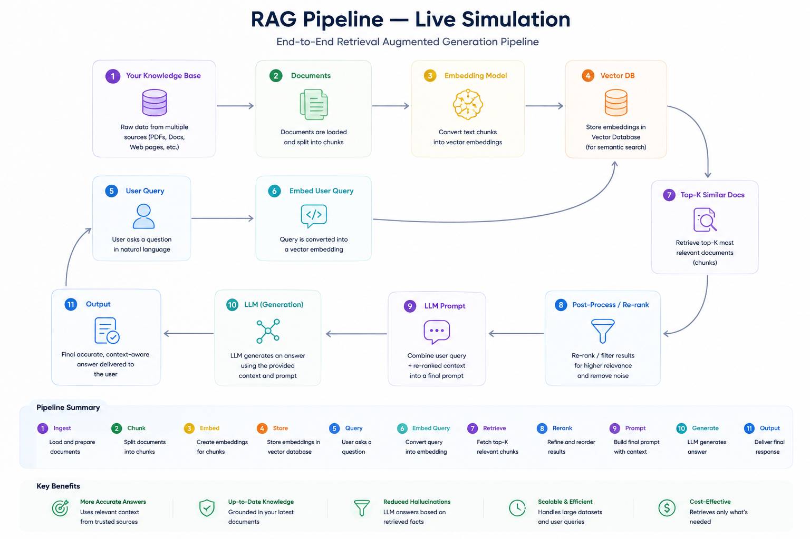

# Module 8: Retrieval-Augmented Generation (RAG)

> **By the end of this module** you'll have built a document Q&A system that answers questions about your own files, cites its sources, and says "I don't know" instead of inventing answers. You'll also know why chunking is the single biggest quality lever, and how to fix the exact-match failure you found in Lab 3.

| | |
|---|---|
| **Time** | ~3 hours (90 min reading, 90 min lab) |
| **Prerequisites** | [Modules 3](03-tokens-embeddings-similarity.md), [5](05-prompt-engineering.md), [6](06-langchain-chains.md), [7](07-vector-databases.md) |
| **Packages** | `sentence-transformers`, `faiss-cpu` or `chromadb`, `pypdf`, `rank-bm25`, `openai` |
| **Cost** | ~$0.10 for the lab, or free with Ollama |
| **🏗️ Milestone** | **This is the course's first portfolio piece.** |

---

## Contents

- [8.0 Why This Matters](#80-why-this-matters)
- [8.1 What RAG Is](#81-what-rag-is)
- [8.2 The Pipeline End to End](#82-the-pipeline-end-to-end)
- [8.3 Loading Documents](#83-loading-documents)
- [8.4 Chunking: The Biggest Quality Lever](#84-chunking-the-biggest-quality-lever)
- [8.5 Chunk Size and Overlap](#85-chunk-size-and-overlap)
- [8.6 Hybrid Search](#86-hybrid-search)
- [8.7 Re-ranking](#87-re-ranking)
- [8.8 Advanced Retrieval Patterns](#88-advanced-retrieval-patterns)
- [8.9 Grounding the Generation](#89-grounding-the-generation)
- [8.10 Citations](#810-citations)
- [8.11 Where RAG Fails](#811-where-rag-fails)
- [8.12 The Complete Pipeline](#812-the-complete-pipeline)
- [🧪 Hands-On Lab 8](#-hands-on-lab-8)
- [✅ Key Takeaways](#-key-takeaways)
- [⚠️ Common Mistakes & Misconceptions](#️-common-mistakes--misconceptions)
- [📚 Going Deeper](#-going-deeper)

---

## 8.0 Why This Matters

Everything in Modules 1–7 has been building to this.

An LLM has two hard limits you've now met repeatedly: **it doesn't know your data**, and **it invents plausible answers** when it doesn't know something (Module 1 §1.7). RAG addresses both by doing something almost embarrassingly simple:

> **Find the relevant text, paste it into the prompt, and tell the model to answer only from that.**

That's it. No training, no fine-tuning, no model changes. And it turns a fluent bullshitter into something that can answer questions about your company's documentation with citations you can check.

RAG is also the most common LLM application pattern in production by a wide margin — support bots, internal search, documentation assistants, legal and medical research tools. If you build one professional GenAI system, statistically it will be this.

### The honest framing

RAG is simple to demo and genuinely hard to make good. A working prototype takes an afternoon. Getting from "impressive demo" to "people trust it" is where the engineering lives, and it's almost entirely in **retrieval quality**:

> **🔑 Retrieval is the ceiling.** If the right chunk isn't retrieved, no prompt, no model and no amount of temperature tuning will save the answer. Garbage in, garbage out.

So most of this module is about retrieval, not generation. The generation step is about fifteen lines.

---

## 8.1 What RAG Is

**Retrieval-Augmented Generation**: retrieve relevant text at query time and add it to the prompt, leaving the model's weights untouched.

| | |
|---|---|
| **What** | Fetch relevant documents, inject them into the prompt |
| **Pros** | Always-current knowledge, source citations, no retraining, far fewer hallucinations |
| **Cons** | Bounded by retrieval quality; adds latency; competes for context budget |
| **When** | Knowledge changes often, you need traceability, or you have a large private corpus |

### The four components

| Component | Job |
|---|---|
| **Knowledge base** | Where your documents and their vectors live (Module 7) |
| **Retriever** | Finds the most relevant chunks for a query |
| **Generator** | The LLM that writes the answer from those chunks |
| **Orchestration** | The glue — chunking, prompt assembly, citation, fallbacks (Module 6) |

### RAG or fine-tuning?

Module 4 §4.9 gave the rule. It's worth repeating because it's the most expensive mistake in applied GenAI:

> **Fine-tuning teaches skills, style and format. RAG supplies facts.**

| Your problem | Reach for |
|---|---|
| "It doesn't know our internal docs" | **RAG** |
| "It needs today's information" | **RAG**, or tools (Module 9) |
| "We need to cite sources" | **RAG** — fine-tuning cannot cite |
| "Facts change weekly" | **RAG** — re-index, don't retrain |
| "It won't match our house tone" | Fine-tuning (Module 12) |
| "Output must be in this exact schema" | Prompting first (Module 5), then fine-tuning |

Three properties make RAG the right tool for knowledge: **exact text** (not blurred into weights), **citations** (you can verify), and **instant updates** (re-index a document, done).

---

## 8.2 The Pipeline End to End

Two phases. The first runs occasionally; the second runs on every question.

```
  ═══ INDEXING (offline, once + on updates) ═══════════════════════

   Documents ──▶ LOAD ──▶ CHUNK ──▶ EMBED ──▶ STORE
                          §8.4      §3.4     Module 7


  ═══ QUERYING (online, every request) ════════════════════════════

   Question ──▶ EMBED ──▶ RETRIEVE ──▶ RE-RANK ──▶ BUILD PROMPT ──▶ GENERATE
                          §8.6         §8.7          §8.9            §8.9
                                                                       │
                                                       Answer + citations
                                                                  §8.10
```



### A worked example

Take the query *"What is the maximum daily dose of metformin?"*

**1. Embed the query** → a 384-dimensional vector.

**2. Similarity search** against the indexed chunks:

| Chunk | Similarity |
|---|---|
| ✅ "Metformin: usual max 2,000 mg/day; up to 2,550 mg with monitoring (IR)." | **0.91** |
| ✅ "Extended-release formulations are dosed once daily, max 2,000 mg/day." | **0.86** |
| ✗ "Metformin is contraindicated when eGFR is below 30 mL/min/1.73m²." | 0.39 |
| ✗ "Common side effects include nausea and transient GI discomfort." | 0.27 |

**3. Take the top-k** — here the top 2 clear the bar, the others don't.

**4. Build an augmented prompt:**

```
Answer using ONLY the context below.

CONTEXT:
[1] Metformin: usual max 2,000 mg/day; up to 2,550 mg with monitoring (IR).
[2] Extended-release formulations are dosed once daily, max 2,000 mg/day.

QUESTION: What is the maximum daily dose of metformin?
```

**5. Generate:** *"The maximum daily dose of metformin is 2,000 mg, or up to 2,550 mg for immediate-release with monitoring [1]. Extended-release is capped at 2,000 mg once daily [2]."*



Notice what changed versus asking the model directly: the answer came from **retrieved text**, and you can **check it**. That's the whole value proposition.

---

## 8.3 Loading Documents

Before chunking, you need text. This stage is unglamorous and causes more trouble than it should.

```powershell
pip install pypdf
```

```python
"""Load documents into a common shape: text plus metadata."""

from pathlib import Path
from pypdf import PdfReader


def load_pdf(path: str) -> list[dict]:
    """Extract text from a PDF, one record per page.

    Keeping the page number is not optional: it is what makes a citation
    verifiable later (section 8.10).
    """
    reader = PdfReader(path)
    records = []

    for page_number, page in enumerate(reader.pages, start=1):
        text = page.extract_text() or ""       # extract_text() CAN return None
        if not text.strip():
            continue                            # skip blank or image-only pages

        records.append({
            "text": text,
            "metadata": {
                "source": Path(path).name,
                "page": page_number,
            },
        })

    return records


def load_text_files(directory: str) -> list[dict]:
    """Load every .txt and .md file in a directory."""
    records = []
    for path in sorted(Path(directory).glob("*.[tm][xd]*")):
        if path.suffix.lower() not in {".txt", ".md"}:
            continue
        records.append({
            "text": path.read_text(encoding="utf-8", errors="replace"),
            "metadata": {"source": path.name, "page": None},
        })
    return records
```

### What goes wrong here

| Problem | Symptom | What to do |
|---|---|---|
| **Scanned PDFs** | `extract_text()` returns empty — it's an image | You need OCR (`pytesseract`), or a different source |
| **Multi-column layout** | Text extracted in the wrong reading order | Use a layout-aware parser (`unstructured`, `pymupdf`) |
| **Tables** | Flattened into unreadable runs of numbers | Extract tables separately; consider describing them with an LLM |
| **Headers and footers** | Repeated on every chunk, diluting the signal | Strip them with a regex before chunking |
| **Encoding** | Mojibake, `UnicodeDecodeError` | `errors="replace"`, and check the source encoding |

> **⚠️ Look at your extracted text before you index it.** Print the first 500 characters of a few documents. A surprising proportion of disappointing RAG systems are disappointing because the loader silently produced garbage, and nobody checked. **You cannot retrieve what was never extracted.**

---

## 8.4 Chunking: The Biggest Quality Lever

**Chunking** splits documents into pieces small enough to embed and retrieve individually.

### Why not just embed whole documents?

Three reasons, and they compound:

1. **One vector can't represent a 50-page document.** Embedding averages everything into a single point, so a document about ten topics lands somewhere between all ten — near nothing in particular. Module 3 §3.7 called this "long documents blur".
2. **Context budget.** You can't paste a 50-page document into a prompt. Even if it fits, Module 3 §3.9's "lost in the middle" means the model won't reliably use it.
3. **Precision.** The user asked one question. Retrieving one relevant paragraph beats retrieving a chapter containing it.

> **🔑 Chunking is the single biggest quality lever in a RAG pipeline.** It determines what retrieval can possibly return. Get it wrong and everything downstream is fighting your data layout.

### Strategy 1 — Fixed-size

Split every N characters or tokens. The simplest baseline.


```python
def chunk_fixed(text: str, chunk_size: int, overlap: int = 0) -> list[str]:
    """Split text every chunk_size characters, with optional overlap.

    Raises:
        ValueError: if overlap >= chunk_size, which would loop forever.
    """
    if chunk_size <= 0:
        raise ValueError("chunk_size must be positive")
    if overlap >= chunk_size:
        # step would be <= 0, so the loop never advances.
        raise ValueError("overlap must be smaller than chunk_size")
    if not text:
        return []

    step = chunk_size - overlap
    return [text[i:i + chunk_size] for i in range(0, len(text), step)]
```


| ✅ | ❌ |
|---|---|
| Trivial, fast, predictable sizes | **Cuts mid-sentence and mid-idea** |
| A fine baseline to measure against | Chunk boundaries are arbitrary |

**Use it** as a baseline, or for unstructured text with no natural boundaries. Always add overlap.

### Strategy 2 — Recursive character (the sensible default)

Try a hierarchy of separators — paragraphs, then lines, then words, then characters — and only fall to a coarser split when a piece is still too big.



```python
def chunk_recursive(text: str, chunk_size: int,
                    separators: tuple = ("\n\n", "\n", " ", "")) -> list[str]:
    """Split on the largest separator that keeps pieces under chunk_size.

    Tries paragraph breaks first, then line breaks, then spaces, then a hard
    character split - so natural boundaries survive wherever possible.
    """
    if not text:
        return []
    if len(text) <= chunk_size:
        return [text]

    # Out of separators, or explicitly asked for a hard split.
    if not separators or separators[0] == "":
        return [text[i:i + chunk_size] for i in range(0, len(text), chunk_size)]

    separator, remaining = separators[0], separators[1:]

    chunks = []
    for piece in (p for p in text.split(separator) if p):
        if len(piece) <= chunk_size:
            chunks.append(piece)
        else:
            # Still too big - try the next, finer separator.
            chunks.extend(chunk_recursive(piece, chunk_size, remaining))

    return chunks
```

| ✅ | ❌ |
|---|---|
| Respects paragraph and sentence structure | Chunk sizes vary |
| Works well on most prose | Ignores document semantics |

**This is LangChain's default (`RecursiveCharacterTextSplitter`) and the right starting point for most projects.**

> **📌 Real implementations also *merge* small pieces** back up toward `chunk_size`, so you don't end up with a chunk containing one short line. The version above splits without merging, which keeps the algorithm legible — you'll implement it in the lab and see the effect.

### Strategy 3 — Document structure

Use the document's own markers: Markdown headings, HTML tags, PDF bookmarks, code functions.



```
[Document]                        [Chunks]
├─ Title            ─────────▶    Chunk 1: Title
├─ Introduction     ─────────▶    Chunk 2: Introduction
├─ Section 1        ─────────▶    Chunk 3: Section 1
├─ Section 2        ─────────▶    Chunk 4: Section 2
└─ Conclusion       ─────────▶    Chunk 5: Conclusion
```

| ✅ | ❌ |
|---|---|
| Respects the author's own structure | Needs structured input |
| Headings become excellent metadata | Sections can be far too long |

**Use it** for technical documentation, API references, manuals, and code. Combine with recursive splitting for over-long sections.

> **💡 A cheap trick with large returns:** prepend the heading path to each chunk's text — `"Billing > Refunds > Partial refunds\n\n<chunk text>"`. The chunk now carries its own context, which markedly improves retrieval for questions that use words from the heading but not the body.

### Strategy 4 — Semantic

Split where the *meaning* shifts, detected by embedding adjacent sentences and watching for a drop in similarity.



```
Process:
  1. Split into sentences
  2. Embed each sentence
  3. Compute similarity between consecutive sentences
  4. Where similarity DROPS sharply, start a new chunk
```

```
cosine similarity between consecutive sentences

 high │ ●──●──●        ●──●──●──●         ●──●
      │          \    /            \     /
 low  │           ●──●              ●───●
      └───────────┬──────────────────┬────────────▶ sentence position
                  │                  │
             topic shift        topic shift
```

| ✅ | ❌ |
|---|---|
| Chunks are self-contained units of meaning | Requires embedding every sentence first |
| Strong on long unstructured prose | Slower and costlier to build |

**Use it** for research papers, long articles, transcripts — content with real topic shifts and no helpful structure.

### Strategy 5 — LLM / agentic

Ask a model to decide the split points, and often to summarise or label each chunk as it goes.



| ✅ | ❌ |
|---|---|
| Best coherence; handles nuance | **Expensive** — an LLM call per document |
| Can generate summaries and labels | Slow, and non-deterministic |

**Use it** for high-value corpora where retrieval accuracy dominates cost: legal contracts, financial filings, medical literature.

### Choosing

| Strategy | Granularity | Coherence | Cost | Use for |
|---|---|---|---|---|
| **Fixed-size** | Character count | Low | Very low | Baselines, unstructured text |
| **Recursive** | Paragraph/sentence | Medium–high | Low | **The default for most projects** |
| **Document** | Heading/section | High | Low–medium | Technical docs, manuals, code |
| **Semantic** | Topic | High | Medium | Research papers, long articles |
| **LLM/agentic** | Contextual | Highest | High | Legal, financial, medical |

**Start with recursive.** Move up only when you've measured that chunking is your bottleneck — which the lab shows you how to do.

---

## 8.5 Chunk Size and Overlap

Two numbers, and they matter more than the strategy choice.

### The size trade-off

```
  SMALL CHUNKS (100-300 tokens)          LARGE CHUNKS (1000-2000 tokens)
  ─────────────────────────────          ───────────────────────────────
  ✅ Precise retrieval                    ✅ More context per chunk
  ✅ More chunks fit in the prompt         ✅ Fewer boundary problems
  ❌ May lack surrounding context          ❌ Diluted embeddings
  ❌ An answer may span two chunks         ❌ Retrieves irrelevant text alongside
```

| Content | Suggested size |
|---|---|
| FAQ pairs, short entries | 100–300 tokens |
| General prose, documentation | **300–800 tokens** ← start here |
| Technical/legal with long dependencies | 800–1,500 tokens |
| Code | Function or class boundaries |

### Overlap

Overlap repeats the tail of one chunk at the start of the next, so an idea spanning a boundary survives somewhere intact.

```
  No overlap:
    chunk 1: "...the maximum daily dose is"
    chunk 2: "2,000 mg for adults..."
             ^ the answer is split across both, and NEITHER chunk answers the question

  With overlap:
    chunk 1: "...the maximum daily dose is 2,000 mg for adults"
    chunk 2: "dose is 2,000 mg for adults. Renal impairment requires..."
             ^ chunk 1 now contains a complete answer
```

**Rule of thumb: 10–20% of chunk size.** For 500-token chunks, 50–100 tokens of overlap.

> **⚠️ Overlap costs storage and retrieval quality.** 50% overlap doubles your chunk count, doubles storage and embedding cost, and fills your top-k with near-duplicates — so you retrieve five chunks that are really two. Keep it modest.

### There is no universally correct answer

Chunk size interacts with your content, your embedding model's effective input length, your queries, and your context budget. **The only way to choose is to measure**, and §8.11 plus Module 11 cover how.

A practical approach: build with recursive chunking at 500 tokens and 10% overlap, assemble 20 test questions with known answers, then vary one parameter at a time and count how often the right chunk is retrieved.

---

## 8.6 Hybrid Search

Time to fix the failure you found in Lab 3.

### The problem, restated

Pure semantic search is bad at exact matches. Searching `"SKU-4471"` returns documents that are vaguely "about short alphanumeric strings" — because the embedding captures *type*, not identity.

| Query type | Semantic search | Keyword search |
|---|---|---|
| "how do I cancel my subscription" | ✅ Excellent | ⚠️ Misses paraphrase |
| `"SKU-4471"` | ❌ **Fails** | ✅ Exact |
| `"error E1042"` | ❌ Fails | ✅ Exact |
| "the thing that makes coffee taste bitter" | ✅ Excellent | ❌ No shared words |
| "Dr. Yusuf's 2019 paper" | ⚠️ Partial | ✅ Names and dates |

Neither wins alone. **Use both.**

### BM25: keyword scoring done properly

BM25 is the standard keyword-relevance function — a refined TF-IDF. Three ideas:

1. **Term frequency** — a document mentioning your term more is more relevant
2. **Saturation** — but with diminishing returns; the 10th mention adds little
3. **Length normalisation** — a match in a short document means more than in a long one

$$\text{score}(D,Q) = \sum_{q \in Q} \text{IDF}(q) \cdot \frac{f(q,D)\cdot(k_1+1)}{f(q,D) + k_1\left(1-b+b\frac{|D|}{\text{avgdl}}\right)}$$

That looks worse than it is. In code:

```python
import math
import re
from collections import Counter


def tokenize_words(text: str) -> list[str]:
    """Lowercase alphanumeric tokens. Crude, and adequate for BM25."""
    return re.findall(r"[a-z0-9]+", text.lower())


def bm25_scores(query: str, documents: list[str],
                k1: float = 1.5, b: float = 0.75) -> list[float]:
    """Score every document against the query using BM25.

    Args:
        k1: Term-frequency saturation. Higher = repeated terms count more.
        b:  Length normalisation, 0 to 1. 0.75 is the usual default.

    Returns:
        One score per document. 0.0 means no query term appeared.
    """
    doc_tokens = [tokenize_words(d) for d in documents]
    n_documents = len(documents)
    average_length = sum(len(d) for d in doc_tokens) / n_documents

    # Document frequency: in how many documents does each term appear?
    document_frequency = Counter()
    for tokens in doc_tokens:
        document_frequency.update(set(tokens))       # set(): once per document

    scores = []
    for tokens in doc_tokens:
        term_frequency = Counter(tokens)
        score = 0.0

        for term in tokenize_words(query):
            if term not in term_frequency:
                continue

            # IDF: rare terms are more informative than common ones.
            n_containing = document_frequency[term]
            idf = math.log((n_documents - n_containing + 0.5) /
                           (n_containing + 0.5) + 1)

            frequency = term_frequency[term]
            numerator = frequency * (k1 + 1)
            denominator = frequency + k1 * (
                1 - b + b * len(tokens) / average_length)

            score += idf * numerator / denominator

        scores.append(score)

    return scores
```

> **💡 Note what BM25 gives you for free:** a document containing none of the query terms scores exactly `0.0`. That's a clean, cheap signal that keyword search has nothing to offer for this query — useful when deciding how much weight to give it.

### Fusing the two rankings

You now have two rankings in **incompatible units** — cosine similarities around 0–1, and BM25 scores that can be anything. Adding them directly is meaningless.

**Reciprocal Rank Fusion (RRF)** solves this by discarding the scores and using only the *ranks*:

$$\text{RRF}(d) = \sum_{r \in \text{rankings}} \frac{1}{k + \text{rank}_r(d)}$$

```python
def reciprocal_rank_fusion(rankings: list[list], k: int = 60) -> list:
    """Merge several ranked lists into one.

    Uses only RANK POSITION, never the underlying scores - which is why it
    can combine cosine similarity and BM25 without any normalisation.

    Args:
        rankings: Each inner list is document ids in descending relevance.
        k:        Damping constant. 60 is the value from the original paper;
                  higher flattens the difference between top ranks.

    Returns:
        Document ids sorted by fused score, best first.
    """
    fused = {}

    for ranking in rankings:
        for position, document_id in enumerate(ranking, start=1):
            fused[document_id] = fused.get(document_id, 0.0) + 1.0 / (k + position)

    return sorted(fused, key=lambda doc: -fused[doc])
```

**Why RRF is the right default:**

- **No normalisation needed.** It never touches the scores, so incompatible scales don't matter.
- **Documents ranked well by *both* methods rise.** That's exactly the signal you want.
- **It's robust.** One method producing garbage scores can't dominate, because scores are ignored.

The `k` constant damps the top ranks: with `k=60`, rank 1 scores `1/61` and rank 2 scores `1/62` — close together, so being #1 in one ranking doesn't automatically beat being #2 in both.

### Putting hybrid search together

```python
def hybrid_search(query: str, chunks: list[str], chunk_embeddings,
                  embed_model, top_k: int = 5) -> list[int]:
    """Combine dense (semantic) and sparse (keyword) retrieval."""
    # --- Dense: semantic similarity (Modules 3 and 7) ---
    query_vector = embed_model.encode(query, normalize_embeddings=True)
    dense_scores = chunk_embeddings @ query_vector
    dense_ranking = list(np.argsort(dense_scores)[::-1][:top_k * 4])

    # --- Sparse: BM25 keyword matching ---
    sparse_scores = bm25_scores(query, chunks)
    sparse_ranking = list(np.argsort(sparse_scores)[::-1][:top_k * 4])

    # --- Fuse. Over-fetch above, then trim here. ---
    return reciprocal_rank_fusion([dense_ranking, sparse_ranking])[:top_k]
```

Note the over-fetching: each retriever returns `top_k * 4` candidates so fusion has enough to work with. Fusing two lists of 5 gives fusion almost nothing to do.

---

## 8.7 Re-ranking

Retrieval gets you *approximately* the right chunks, fast. Re-ranking makes the top few *precisely* right, slowly. Use both.

### Why first-stage retrieval isn't enough

| Limitation | Why it happens |
|---|---|
| **ANN is approximate** | Module 7 — optimised for speed, not precision |
| **Embeddings drift** | High similarity ≠ actually answers the question |
| **Query/document length mismatch** | A short query against a long chunk embeds awkwardly |
| **No cross-attention** | Query and document are embedded **independently**, so no token-level interaction |

That last point is the important one, and it's an architectural limitation:

```
  BI-ENCODER (retrieval)                CROSS-ENCODER (re-ranking)
  ──────────────────────                ──────────────────────────
  embed(query)   ──┐                    embed(query + document together)
                   ├──▶ cosine                    │
  embed(document) ─┘                              ▼
                                             relevance score

  Documents embedded ONCE, offline.      Every pair scored at QUERY time.
  Fast. Scales to billions.              Slow. Handles ~100 candidates.
  No query/document interaction.         FULL attention across both.
```

A bi-encoder must compress a document into a vector **without knowing the query**. A cross-encoder reads both together and can notice that this specific document answers this specific question — which no independent embedding can.



### The two-stage pattern

```
  Query ──▶ [ retrieve top-50 ]  ──▶ [ re-rank to top-5 ]  ──▶ prompt
             fast, approximate         slow, precise
             bi-encoder, ANN           cross-encoder
```

```python
from sentence_transformers import CrossEncoder

# Small, fast, and runs locally on CPU.
reranker = CrossEncoder("cross-encoder/ms-marco-MiniLM-L-6-v2")


def retrieve_and_rerank(query: str, chunks: list[str], chunk_embeddings,
                        embed_model, fetch_k: int = 50, top_k: int = 5):
    """Two-stage retrieval: fetch broadly, then re-rank precisely."""
    # STAGE 1: cheap and broad.
    candidate_ids = hybrid_search(query, chunks, chunk_embeddings,
                                  embed_model, top_k=fetch_k)

    # STAGE 2: expensive and precise. The cross-encoder reads each
    # (query, chunk) PAIR together.
    pairs = [(query, chunks[i]) for i in candidate_ids]
    scores = reranker.predict(pairs)

    ranked = sorted(zip(candidate_ids, scores), key=lambda x: -x[1])
    return [chunk_id for chunk_id, _ in ranked[:top_k]]
```

### The options

| Approach | Quality | Speed | Notes |
|---|---|---|---|
| **Cross-encoder** | **Highest** | Slow — one pass per candidate | `ms-marco-MiniLM`, `bge-reranker`. The default. |
| **ColBERT / late interaction** | High | Fast | Token-level vectors; large index footprint |
| **LLM-as-reranker** | Flexible | Slowest, costly | Handles edge cases; non-deterministic |
| **Score heuristics** | Low | Instant | BM25 re-scoring, position bias. Cheap baseline. |

**Re-ranking is often the highest-return single addition to a mediocre RAG system.** Published benchmarks typically show substantial precision gains, and a small cross-encoder adds tens of milliseconds on CPU.

> **💡 The counter-intuitive win:** re-ranking lets you retrieve *more* and send *less*. Fetch 50 candidates, re-rank, send the best 5. You get better context in fewer tokens — so quality goes up and cost goes down at the same time.

---

## 8.8 Advanced Retrieval Patterns

Reach for these when basic retrieval plus re-ranking isn't enough. Each solves a specific failure.

| Pattern | Fixes | How |
|---|---|---|
| **Multi-query** | Badly phrased queries | LLM rewrites the question 3 ways; retrieve for each; fuse with RRF |
| **HyDE** | Query/document asymmetry | LLM writes a *hypothetical answer*, then retrieves using **that** |
| **Parent-document** | Precision vs context conflict | Search small chunks, return their larger parent |
| **Self-query** | Filters buried in natural language | LLM extracts metadata filters: "after 2023" → `year >= 2023` |
| **Contextual compression** | Wasted context budget | Trim retrieved chunks to only the relevant spans |

### The two most useful

**Parent-document retrieval** resolves the §8.5 trade-off rather than compromising on it:

```python
# Index SMALL chunks for precise matching...
# ...but return the LARGER parent for full context.
small_chunks = chunk_recursive(document, chunk_size=200)
parent_map = {i: parent_id for i, parent_id in enumerate(...)}

matched_ids = search(query, small_chunks, top_k=5)
context = [parents[parent_map[i]] for i in matched_ids]      # deduplicate these
```

You get small-chunk precision *and* large-chunk context. Often the single best structural improvement to a RAG pipeline.

**Multi-query** handles the reality that users ask badly:

```python
def multi_query_retrieve(question: str, retrieve_fn, model, n: int = 3):
    """Rewrite the question several ways, retrieve for each, fuse."""
    rewrites = model.invoke(
        f"Write {n} different search queries for this question. "
        f"One per line, no numbering.\n\nQuestion: {question}"
    ).content.strip().splitlines()

    rankings = [retrieve_fn(q) for q in [question, *rewrites] if q.strip()]
    return reciprocal_rank_fusion(rankings)
```

Note it keeps the original question alongside the rewrites — the rewrites might all drift, and the original is your safest bet.

> **⚠️ Every pattern here adds latency, cost and failure modes.** Multi-query means 4 retrievals and an extra LLM call. **Add them one at a time, and measure.** Adding four techniques simultaneously and finding it "seems better" teaches you nothing about which one helped.

---

## 8.9 Grounding the Generation

Retrieval done. Now the generation prompt — where Module 5 pays off.

### The grounded prompt

```python
def build_grounded_prompt(question: str, chunks: list[str]) -> str:
    """Build a prompt that answers ONLY from the given context."""
    context = "\n".join(f"[{i}] {chunk}" for i, chunk in enumerate(chunks, start=1))

    return (
        "Answer the question using ONLY the context below.\n"
        "If the context does not contain the answer, reply exactly: I don't know.\n"
        "Cite the sources you used as [1], [2], etc.\n\n"
        f"CONTEXT:\n{context}\n\n"
        f"QUESTION: {question}\n\n"
        "ANSWER:"
    )
```

Four deliberate choices:

**1. "ONLY the context."** Without this the model happily blends retrieved text with its training knowledge — and you lose the ability to trust or verify anything.

**2. An explicit escape hatch.** Module 5 §5.4: `"reply exactly: I don't know"` is a *behaviour the model can execute*, unlike "don't hallucinate". And because the string is exact, **your code can detect it** and respond appropriately.

**3. Numbered chunks.** `[1]`, `[2]` give the model a citation vocabulary. Without numbers you get "according to the first document", which you can't parse.

**4. Question after context.** Module 3 §3.9 — recall is best at the start and end of a context. Putting the question last places it in a high-attention position, right before generation begins.

### A stronger system prompt

```python
RAG_SYSTEM_PROMPT = """You are a documentation assistant. You answer questions
strictly from the provided context.

RULES:
- Use ONLY information present in the context. Never add outside knowledge.
- Cite every claim with the bracketed number of its source, e.g. [2].
- If the context does not answer the question, reply exactly: I don't know.
- If sources conflict, say so and cite both.
- Quote exact figures, names and dates rather than paraphrasing them.
- Do not speculate, and do not offer advice beyond the context.
"""
```

The **conflict** rule earns its place. Real corpora contain contradictions — an outdated policy alongside its replacement. Without instruction, the model silently picks one. With it, you find out.

### Ordering the chunks

A small change with a real effect:

```python
# Best matches at the START and END, weakest in the middle -
# exploiting the recall curve from Module 3, section 3.9.
def order_for_attention(chunks: list[str]) -> list[str]:
    """Place the strongest chunks where the model attends best."""
    if len(chunks) <= 2:
        return chunks
    # chunks arrive best-first
    return chunks[::2] + chunks[1::2][::-1]
```

If you're going to bury anything, bury your weakest evidence.

---

## 8.10 Citations

Citations are what make a RAG system trustworthy. Without them the user has to take the answer on faith — which defeats the point.

```python
import re


def extract_cited_indices(answer: str) -> list[int]:
    """Pull the [n] citation markers out of an answer.

    Returns:
        Sorted, de-duplicated 1-based indices.
    """
    if not answer:
        return []
    return sorted({int(m) for m in re.findall(r"\[(\d+)\]", answer)})


def attach_sources(answer: str, chunks: list[dict]) -> dict:
    """Resolve citation markers back to their source documents."""
    cited = extract_cited_indices(answer)

    sources = []
    for index in cited:
        # Markers are 1-based; guard against the model inventing [7]
        # when you only supplied 5 chunks.
        if 1 <= index <= len(chunks):
            metadata = chunks[index - 1]["metadata"]
            sources.append({
                "marker": index,
                "source": metadata.get("source"),
                "page": metadata.get("page"),
                "excerpt": chunks[index - 1]["text"][:200],
            })

    return {"answer": answer, "sources": sources}
```

### Verify the citations

The model can cite a chunk that doesn't support its claim, or invent a marker you never supplied. Both are checkable:

```python
def validate_citations(answer: str, n_chunks: int) -> tuple[bool, list[str]]:
    """Check citation markers are present and in range."""
    problems = []
    cited = extract_cited_indices(answer)

    if not cited and "i don't know" not in answer.lower():
        problems.append("answer makes claims but cites no sources")

    out_of_range = [i for i in cited if not 1 <= i <= n_chunks]
    if out_of_range:
        problems.append(f"cited non-existent sources: {out_of_range}")

    return (not problems, problems)
```

An answer with no citations that also isn't "I don't know" is a red flag: **the model is answering from its own knowledge rather than your documents.** That's the failure RAG exists to prevent, and this check catches it cheaply.

> **💡 Show the excerpt, not just the filename.** "Source: policy.pdf, page 12" requires trust. "Source: policy.pdf, page 12 — *'refunds are processed within 14 days'*" lets the user verify in two seconds. That difference is most of what makes people trust the system.

---

## 8.11 Where RAG Fails

RAG reduces hallucination substantially. It does not eliminate it, and the remaining failures are worth knowing by name.

### How RAG helps

| Mechanism | Effect |
|---|---|
| **Evidence-conditioned answers** | The model writes from retrieved text, not fuzzy memory |
| **Citations** | Every claim can be traced and checked |
| **"Only from context"** | An explicit instruction to refuse when evidence is absent |
| **Swappable knowledge** | Fix a fact by re-indexing, instantly |

### Where it still fails

| Failure | What happens | Mitigation |
|---|---|---|
| **Retrieval miss** | The right chunk was never retrieved. **The dominant failure.** | Better chunking, hybrid search, re-ranking |
| **Context ignored** | Model overrides evidence with its training beliefs | Stronger prompt; check citations |
| **Conflicting sources** | Contradictory chunks → confident, muddled answer | Instruct it to surface conflicts; de-duplicate; prefer recent |
| **Stale index** | Documents changed, index didn't | Scheduled re-indexing; track document versions |
| **Wrong granularity** | Answer spans two chunks; neither is sufficient | Overlap; parent-document retrieval |
| **Over-retrieval** | 20 chunks dilute the signal and blow the budget | Retrieve fewer, better — re-rank |

> **🔑 The uncomfortable one:** if retrieval misses, your system produces a confident answer from irrelevant context. It *looks* grounded — it has citations! — and it's wrong. **This is why evaluating retrieval separately from generation is essential.** An end-to-end "does the answer look good?" check cannot distinguish "retrieved the wrong thing" from "reasoned badly about the right thing", and those need completely different fixes.

### The RAG evaluation triad

Three questions, three metrics. Module 11 builds these properly; know the shape now.

```
                    ┌─────────────────┐
                    │  USER QUESTION  │
                    └────┬───────┬────┘
       Context           │       │        Answer
      relevance          │       │       relevance
    (is retrieval    ┌───▼──┐ ┌──▼──────┐   (does it address
      finding the    │CONTEXT│ │ ANSWER │    the question?)
     right stuff?)   └───┬──┘ └──▲──────┘
                         │       │
                         └───────┘
                        Faithfulness
                   (is the answer supported
                     by the context?)
```

| Metric | Asks | A low score means |
|---|---|---|
| **Context relevance** | Did retrieval find the right chunks? | Fix chunking, retrieval, re-ranking |
| **Faithfulness** | Is the answer supported by the context? | Fix the prompt — the model is inventing |
| **Answer relevance** | Does the answer address the question? | Fix the prompt or the model |

**Diagnosing with all three is the point.** A bad answer with good context relevance and poor faithfulness is a *prompting* problem. Poor context relevance is a *retrieval* problem. Without the split you're guessing.

### Build your evaluation set now

Twenty question/answer pairs with the correct source document for each. It takes an hour and it's the difference between engineering and guessing — every chunking, retrieval and prompt decision from here becomes measurable.

---

## 8.12 The Complete Pipeline

Everything assembled.

```python
"""rag.py - a complete, minimal RAG pipeline."""

import os
import numpy as np
from dotenv import load_dotenv
from openai import OpenAI
from sentence_transformers import SentenceTransformer, CrossEncoder

load_dotenv()

embed_model = SentenceTransformer("all-MiniLM-L6-v2")
reranker = CrossEncoder("cross-encoder/ms-marco-MiniLM-L-6-v2")
client = OpenAI()
MODEL = "gpt-4o-mini"


class SimpleRAG:
    """A RAG pipeline you can read end to end."""

    def __init__(self, chunk_size: int = 500, overlap: int = 50):
        self.chunk_size = chunk_size
        self.overlap = overlap
        self.chunks: list[dict] = []
        self.embeddings = None

    # ---------- INDEXING (offline) ----------

    def index(self, records: list[dict]) -> None:
        """Chunk, embed and store a list of {text, metadata} records."""
        for record in records:
            pieces = chunk_recursive(record["text"], self.chunk_size)
            for piece in pieces:
                self.chunks.append({"text": piece, "metadata": record["metadata"]})

        texts = [c["text"] for c in self.chunks]
        self.embeddings = embed_model.encode(
            texts, normalize_embeddings=True, show_progress_bar=True)

        print(f"Indexed {len(self.chunks)} chunks from {len(records)} documents")

    # ---------- RETRIEVAL (online) ----------

    def retrieve(self, question: str, fetch_k: int = 30, top_k: int = 5) -> list[dict]:
        """Hybrid search, then cross-encoder re-ranking."""
        texts = [c["text"] for c in self.chunks]

        # Dense + sparse, fused by rank (section 8.6).
        query_vector = embed_model.encode(question, normalize_embeddings=True)
        dense = list(np.argsort(self.embeddings @ query_vector)[::-1][:fetch_k])
        sparse = list(np.argsort(bm25_scores(question, texts))[::-1][:fetch_k])
        candidates = reciprocal_rank_fusion([dense, sparse])[:fetch_k]

        # Re-rank the candidates precisely (section 8.7).
        pairs = [(question, texts[i]) for i in candidates]
        scores = reranker.predict(pairs)
        ranked = sorted(zip(candidates, scores), key=lambda x: -x[1])

        return [self.chunks[i] for i, _ in ranked[:top_k]]

    # ---------- GENERATION (online) ----------

    def answer(self, question: str, top_k: int = 5) -> dict:
        """Retrieve, generate, and attach verifiable sources."""
        retrieved = self.retrieve(question, top_k=top_k)

        if not retrieved:
            return {"answer": "I don't know.", "sources": []}

        prompt = build_grounded_prompt(question, [c["text"] for c in retrieved])

        response = client.chat.completions.create(
            model=MODEL,
            messages=[
                {"role": "system", "content": RAG_SYSTEM_PROMPT},
                {"role": "user", "content": prompt},
            ],
            temperature=0,        # grounded extraction, not creativity
        )
        answer = response.choices[0].message.content

        # Flag it if the model answered without citing anything (section 8.10).
        is_valid, problems = validate_citations(answer, len(retrieved))
        result = attach_sources(answer, retrieved)
        result["warnings"] = problems
        return result


if __name__ == "__main__":
    rag = SimpleRAG()
    rag.index(load_pdf("my_document.pdf"))

    result = rag.answer("What is the refund policy?")
    print(result["answer"])
    print()
    for source in result["sources"]:
        print(f"  [{source['marker']}] {source['source']} p.{source['page']}")
        print(f"      \"{source['excerpt'][:100]}...\"")
    if result["warnings"]:
        print(f"\n  ⚠️  {result['warnings']}")
```



**`temperature=0` is deliberate.** This is grounded extraction, not creative writing. You want the same question to give the same answer, and you want the model to stick closely to the retrieved text.

---

## 🧪 Hands-On Lab 8

**→ [Go to Lab 8: Build a Document Q&A Bot](../labs/08-rag/README.md)**

**🏗️ This is the course's first portfolio milestone.** Implement chunking, BM25, reciprocal rank fusion, grounded prompting and citation extraction from scratch — then build a working RAG system over your own PDFs, with citations and an "I don't know" fallback, and measure its retrieval quality.

Part 1 is pure Python: no packages, no API key. Budget 90 minutes.

---

## ✅ Key Takeaways

1. **RAG is: retrieve relevant text, put it in the prompt, answer only from it.** No training required.

2. **Retrieval is the ceiling.** If the right chunk isn't retrieved, nothing downstream can fix it. Most RAG work is retrieval work.

3. **Fine-tuning teaches skills; RAG supplies facts.** RAG is the only one that can cite sources and update instantly.

4. **Look at your extracted text before indexing.** Many disappointing RAG systems have a broken loader nobody checked.

5. **Chunking is the biggest quality lever.** Start with recursive splitting at 300–800 tokens and 10–20% overlap.

6. **Hybrid search fixes exact-match failure.** Semantic search can't find `SKU-4471`; BM25 can. Fuse them with RRF.

7. **RRF works because it ignores scores** and uses only ranks — so incompatible scales don't matter.

8. **Re-ranking is often the highest-return single improvement.** A cross-encoder reads query and document *together*, which no independent embedding can.

9. **Re-rank to retrieve more and send less** — better context, fewer tokens, lower cost.

10. **Give the model an explicit escape hatch** — `reply exactly: I don't know` — and detect it in code.

11. **Citations make it trustworthy, and are checkable.** An answer with no citations that isn't "I don't know" means the model ignored your context.

12. **Evaluate retrieval and generation separately.** Context relevance, faithfulness, answer relevance — they point at different fixes.

13. **Add one technique at a time and measure.** Four simultaneous improvements teach you nothing about which helped.

---

## ⚠️ Common Mistakes & Misconceptions

<br>

> ### ❌ "RAG eliminates hallucination"
> **Reality:** it reduces it substantially. The model can still ignore context, misread it, or answer confidently from irrelevant retrieved chunks. And the most dangerous case *looks* grounded, because it has citations.

<br>

> ### ❌ Not checking what the loader extracted
> **Reality:** scanned PDFs yield empty text; multi-column layouts scramble reading order; tables become number soup. **You cannot retrieve what was never extracted.** Print the first 500 characters of a few documents before you index anything.

<br>

> ### ❌ Embedding whole documents instead of chunks
> **Reality:** one vector cannot represent 50 pages. It averages everything into a point near nothing in particular. Chunk first.

<br>

> ### ❌ Copying chunk size from a tutorial
> **Reality:** optimal size depends on your content, queries, embedding model and context budget. 500 tokens is a *starting point*. Measure with a real evaluation set.

<br>

> ### ❌ Using 50% overlap "to be safe"
> **Reality:** it doubles your storage and embedding cost, and fills your top-k with near-duplicates — so five retrieved chunks are really two. 10–20% is the range.

<br>

> ### ❌ `overlap >= chunk_size`
> **Reality:** the step becomes zero or negative and your chunker loops forever, or produces infinite chunks. Guard it explicitly and raise.

<br>

> ### ❌ Relying on semantic search alone
> **Reality:** it fails on product codes, error codes, names and version numbers — the things users actually search for. Add BM25 and fuse.

<br>

> ### ❌ Adding dense and sparse scores together
> **Reality:** cosine similarity sits around 0–1; BM25 is unbounded. Summing them lets BM25 dominate arbitrarily. Use RRF, which ignores the scores entirely.

<br>

> ### ❌ Fusing two lists of 5 results
> **Reality:** fusion needs candidates to work with. Over-fetch (`top_k * 4` or more) from each retriever, fuse, *then* trim.

<br>

> ### ❌ Retrieving more chunks to improve answers
> **Reality:** usually makes it worse. More chunks dilute the signal, consume budget, and push relevant text into the middle where recall is weakest (Module 3 §3.9). Retrieve fewer, better — re-rank.

<br>

> ### ❌ "Don't hallucinate" in the RAG prompt
> **Reality:** unactionable. Use `"If the context does not contain the answer, reply exactly: I don't know."` — a behaviour the model can perform and your code can detect.

<br>

> ### ❌ Trusting citations without validating them
> **Reality:** models cite `[7]` when you supplied five chunks, and cite chunks that don't support the claim. Check that markers are in range, and that an answer making claims cites *something*.

<br>

> ### ❌ Evaluating end to end only
> **Reality:** "the answer was bad" doesn't tell you whether retrieval missed or the model reasoned poorly — and those have opposite fixes. Measure context relevance and faithfulness separately.

<br>

> ### ❌ Building a RAG system without an evaluation set
> **Reality:** every subsequent decision becomes taste rather than evidence. Twenty question/answer/source triples takes an hour and makes everything after it measurable.

<br>

> ### ❌ Never re-indexing
> **Reality:** documents change and your index doesn't notice. A confidently-cited answer from a superseded policy is worse than no answer. Track versions; re-index on a schedule.

---

## 📚 Going Deeper

**Foundational**
- [*Retrieval-Augmented Generation for Knowledge-Intensive NLP Tasks*](https://arxiv.org/abs/2005.11401) — the original 2020 paper
- [*Lost in the Middle*](https://arxiv.org/abs/2307.03172) — why chunk ordering matters
- [*Reciprocal Rank Fusion*](https://plg.uwaterloo.ca/~gvcormac/cormacksigir09-rrf.pdf) — the short paper behind §8.6; where `k=60` comes from

**Practical**
- [LangChain: RAG tutorial](https://python.langchain.com/docs/tutorials/rag/) — the framework version of what you built
- [Pinecone: chunking strategies](https://www.pinecone.io/learn/chunking-strategies/) — a thorough treatment of §8.4
- [Anthropic: contextual retrieval](https://www.anthropic.com/news/contextual-retrieval) — prepending context to chunks, with measurements

**Evaluation** (leading into Module 11)
- [RAGAS](https://docs.ragas.io/) — the triad from §8.11, implemented
- [*Seven Failure Points of RAG Systems*](https://arxiv.org/abs/2401.05856) — a useful catalogue of what actually goes wrong

---

<div align="center">

**[⬅ Module 7](07-vector-databases.md)** · **[🧪 Do Lab 8](../labs/08-rag/README.md)** · **[🏠 README](../README.md)** · **➡️ Module 9: AI Agents & Tool Use** *(coming next)*

</div>
