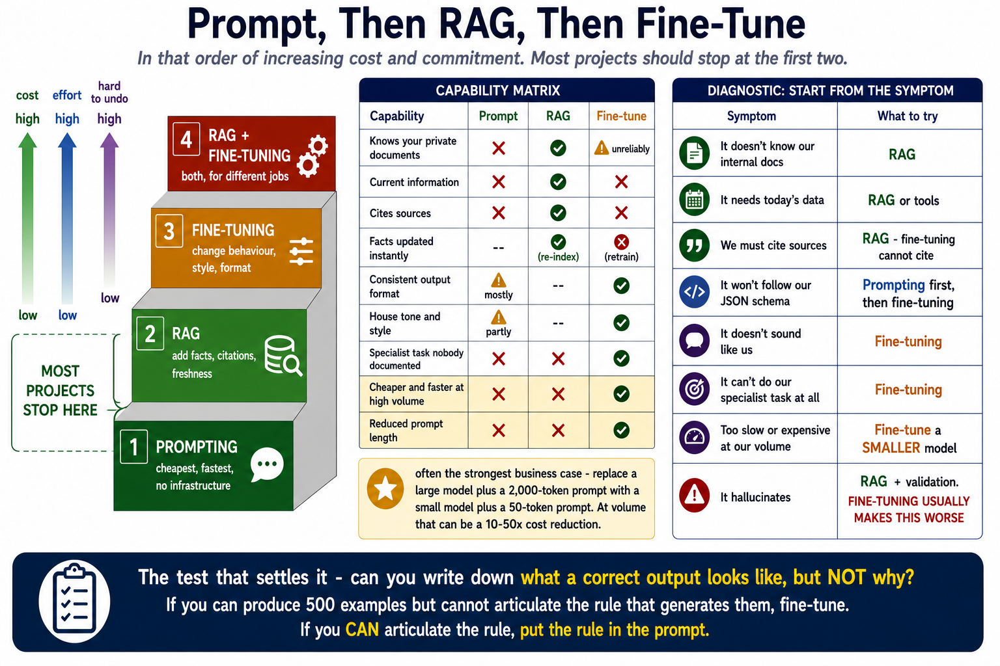
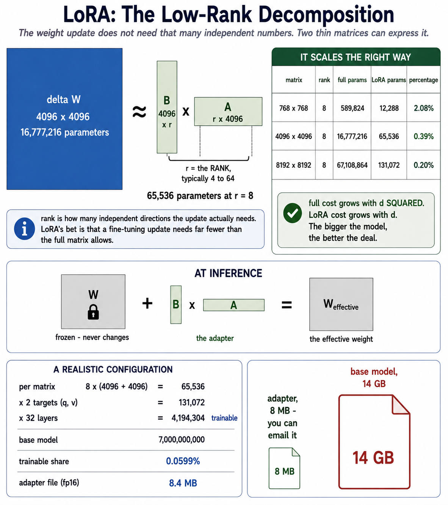
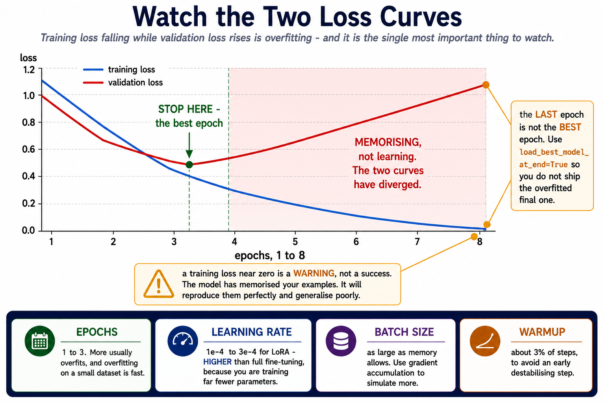
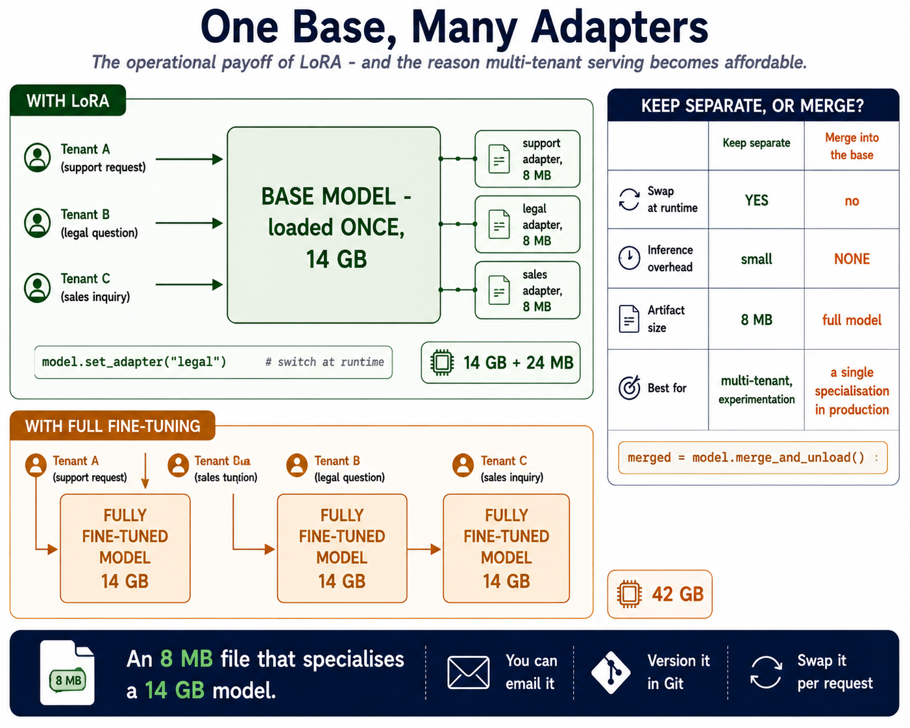

# Module 12: Fine-Tuning & Model Customization

> **By the end of this module** you'll be able to answer the question this course has deferred twice: prompt, RAG, or fine-tune? You'll understand what LoRA actually does, why an adapter for a 7-billion-parameter model is 8 MB, and — most importantly — how to tell when fine-tuning is the wrong answer.

| | |
|---|---|
| **Time** | ~2.5 hours (80 min reading, 70 min lab) |
| **Prerequisites** | [Modules 4](04-transformers.md), [8](08-rag.md), [11](11-guardrails-evaluation.md) |
| **Packages** | Part 1 needs none. Optional: `peft`, `transformers`, `datasets` |
| **Cost** | Part 1 free. An optional real fine-tune runs free on Colab. |

---

## Contents

- [12.0 Why This Matters](#120-why-this-matters)
- [12.1 The Decision](#121-the-decision)
- [12.2 What Fine-Tuning Actually Changes](#122-what-fine-tuning-actually-changes)
- [12.3 Full Fine-Tuning vs PEFT](#123-full-fine-tuning-vs-peft)
- [12.4 LoRA: How It Works](#124-lora-how-it-works)
- [12.5 QLoRA and Quantization](#125-qlora-and-quantization)
- [12.6 The Data Is the Work](#126-the-data-is-the-work)
- [12.7 Preparing a Dataset](#127-preparing-a-dataset)
- [12.8 Training: The Knobs That Matter](#128-training-the-knobs-that-matter)
- [12.9 Evaluating a Fine-Tune](#129-evaluating-a-fine-tune)
- [12.10 Serving Adapters](#1210-serving-adapters)
- [12.11 Costs and Practicalities](#1211-costs-and-practicalities)
- [12.12 When Not to Fine-Tune](#1212-when-not-to-fine-tune)
- [🧪 Hands-On Lab 12](#-hands-on-lab-12)
- [✅ Key Takeaways](#-key-takeaways)
- [⚠️ Common Mistakes & Misconceptions](#️-common-mistakes--misconceptions)
- [📚 Going Deeper](#-going-deeper)

---

## 12.0 Why This Matters

Module 4 §4.9 gave you the rule: **fine-tuning teaches skills and style; RAG supplies facts.** Module 8 repeated it. Both times the detail was deferred to here.

Now it's time to be precise, because fine-tuning is where beginners most often spend weeks and money on the wrong thing.

The honest summary, stated up front:

> **🔑 You probably don't need to fine-tune.** Most problems people reach for fine-tuning to solve are better solved by a clearer prompt or by retrieval. Fine-tuning is the right answer for a genuinely narrow set of problems — and for those, it's excellent.

This module is therefore as much about **recognising when to stop** as about how to proceed. §12.1 gives you a decision procedure; §12.12 lists the cases where the answer is "don't".

What has changed recently is the cost. Full fine-tuning of a large model needs a cluster. **LoRA** makes it a few hours on a single GPU, with an artifact you can email. That shift is what moved fine-tuning from "big lab only" to "reasonable Tuesday project" — and it's why knowing when it's warranted matters more than it used to.

---

## 12.1 The Decision

### Try these in order

```
   1. PROMPTING           cheapest, fastest, no infrastructure
        │  not good enough?
        ▼
   2. RAG                 add facts, citations, freshness
        │  not good enough?
        ▼
   3. FINE-TUNING         change behaviour, style, format
        │  not good enough?
        ▼
   4. RAG + FINE-TUNING   both, for different jobs
```

**Most projects stop at 1 or 2.** Climbing the ladder costs increasing time, money and operational burden, and each rung is harder to undo.



### What each one can and cannot do

| Need | Prompt | RAG | Fine-tune |
|---|---|---|---|
| Knows your private documents | ❌ | ✅ | ⚠️ Unreliably |
| Current information | ❌ | ✅ | ❌ |
| Cites sources | ❌ | ✅ | ❌ |
| Facts updated instantly | — | ✅ Re-index | ❌ Retrain |
| Consistent output format | ⚠️ Mostly | — | ✅ |
| House tone and style | ⚠️ Partly | — | ✅ |
| Specialist task nobody documented | ❌ | ❌ | ✅ |
| Cheaper/faster at high volume | ❌ | ❌ | ✅ Smaller model |
| Reduced prompt length | ❌ | ❌ | ✅ |

The two rows people miss are the last two, and they're often the strongest business case: **fine-tuning lets you replace a large model plus a 2,000-token prompt with a small model plus a 50-token prompt.** At volume that can be a 10–50× cost reduction, and the case for it is economic rather than about quality.

### The diagnostic questions

| Your symptom | The likely fix |
|---|---|
| "It doesn't know our internal docs" | **RAG** |
| "It needs today's data" | **RAG** or tools |
| "We must cite sources" | **RAG** — fine-tuning cannot cite |
| "It won't follow our JSON schema" | **Prompting** first (Module 5 §5.8), then fine-tuning |
| "It doesn't sound like us" | **Fine-tuning** |
| "It can't do our specialist task at all" | **Fine-tuning** |
| "It's too slow/expensive at our volume" | **Fine-tune a smaller model** |
| "It hallucinates" | **RAG** + validation. Fine-tuning usually makes this *worse*. |

That last row matters. Fine-tuning on domain data can make a model **more** confidently wrong — it learns your domain's *style* of assertion without learning every fact, so it produces fluent, authoritative-sounding claims it can't support.

### The test that settles it

> **Can you write down what a correct output looks like, but not why?**

If you can produce 500 examples of correct behaviour but cannot articulate a rule that generates them — **fine-tune**. That's exactly the situation where examples beat instructions.

If you *can* articulate the rule, put the rule in the prompt. It's cheaper, instantly editable, and you don't need a dataset.

---

## 12.2 What Fine-Tuning Actually Changes

Recall Module 1 §1.3: a model is a large set of numbers (parameters), and training adjusts them. Fine-tuning continues that process on your data.

```
   base model weights  ──(training on YOUR examples)──▶  adjusted weights
```

### What that does and doesn't achieve

**It shifts the probability distribution over next tokens** toward the patterns in your data. Show it 500 examples of your house style and it becomes more likely to produce that style unprompted.

**It does not install a database.** Facts seen during fine-tuning are blended into weights alongside everything the model already knew — lossily, unpredictably, and with no way to cite or update them.

```
   RAG:          fact lives in a document  ──▶  retrieved   ──▶  quoted, cited, updatable
   Fine-tuning:  fact blended into weights ──▶  maybe recalled ──▶  no source, no update
```

That asymmetry is the whole of Module 4 §4.9's rule, and it's why "fine-tune it on our documentation" is the most expensive common mistake in applied GenAI.

### Catastrophic forgetting

Train hard on a narrow dataset and the model gets worse at everything else. A model fine-tuned intensively on legal contracts may lose general conversational ability.

Mitigations: fewer epochs, lower learning rate, mixing in general-purpose examples, and — most effectively — **PEFT**, which leaves the base weights untouched entirely (§12.3).

---

## 12.3 Full Fine-Tuning vs PEFT

### Full fine-tuning

Update **every** parameter.

| | |
|---|---|
| **Memory** | Roughly 12–16 bytes per parameter during training (weights, gradients, optimiser state) |
| **A 7B model** | ~80–110 GB of GPU memory. Multiple high-end GPUs. |
| **Output** | A complete new model — ~14 GB for a 7B model at fp16 |
| **Risk** | Catastrophic forgetting |

The memory figure is the killer. It's not that the weights are large; it's that Adam-style optimisers keep two extra values per parameter, and gradients add another.

### PEFT: Parameter-Efficient Fine-Tuning

**Freeze the base model. Train a small number of new parameters instead.**

```
   ┌───────────────────────────────┐
   │   BASE MODEL (frozen)         │   7,000,000,000 params, unchanged
   │                               │
   │   ┌──────────────────────┐    │
   │   │  adapter (trainable) │    │   ~4,000,000 params
   │   └──────────────────────┘    │
   └───────────────────────────────┘
```

| | Full fine-tune | LoRA (PEFT) |
|---|---|---|
| Trainable params (7B) | 7,000,000,000 | **~4,000,000** |
| GPU memory | ~80+ GB | **~16 GB** |
| Output artifact | ~14 GB | **~8 MB** |
| Catastrophic forgetting | Likely | **Rare** — base is untouched |
| Multiple specialisations | A model each | **An adapter each, one base** |

**LoRA is the dominant PEFT method**, and the rest of this module concentrates on it.

---

## 12.4 LoRA: How It Works

**Low-Rank Adaptation.** The idea is elegant and the arithmetic is worth doing yourself.

### The insight

Fine-tuning changes a weight matrix `W` by some update `ΔW`:

```
   W_new = W + ΔW
```

For a 4096 × 4096 matrix, `ΔW` has 16.7 million values. **But the observation behind LoRA is that this update is "low rank"** — it doesn't need that many independent numbers to express. It can be approximated by the product of two much smaller matrices:

```
   ΔW  ≈  B @ A

   where  B is (d_in × r)
          A is (r × d_out)
          r  is the RANK, typically 4 to 64
```

```
        ΔW                        B            A
   ┌────────────┐          ┌──────┐     ┌────────────┐
   │            │          │      │     │            │
   │  4096 x    │    ≈     │ 4096 │  @  │  r x 4096  │
   │    4096    │          │  x r │     └────────────┘
   │            │          │      │
   └────────────┘          └──────┘
   16,777,216 params        65,536 params at r=8
```

At inference the adapter is added back: `W + BA`. The base weights never change.



### The arithmetic

```python
def lora_parameter_count(d_in: int, d_out: int, rank: int) -> int:
    """Trainable parameters LoRA adds for one weight matrix."""
    # B is (d_in x rank), A is (rank x d_out).
    return rank * (d_in + d_out)


def full_parameter_count(d_in: int, d_out: int) -> int:
    """Parameters a full fine-tune would update for the same matrix."""
    return d_in * d_out
```

| Matrix | Rank | Full params | LoRA params | % of full |
|---|---|---|---|---|
| 768 × 768 | 8 | 589,824 | 12,288 | 2.08% |
| 4096 × 4096 | 8 | 16,777,216 | 65,536 | **0.39%** |
| 8192 × 8192 | 8 | 67,108,864 | 131,072 | **0.20%** |

> **💡 Notice that LoRA saves proportionally *more* on larger matrices.** Full cost grows with `d²`; LoRA cost grows with `d`. So the bigger the model, the better the deal — which is exactly the right direction for the technique to scale.

### A realistic configuration

Applying LoRA to the query and value projections across all 32 layers of a 7B model, at rank 8:

```
  per matrix       : 8 x (4096 + 4096)  =         65,536
  x 2 targets      :                    =        131,072
  x 32 layers      :                    =      4,194,304 trainable

  base model       :                       7,000,000,000
  trainable share  :                             0.0599%
  adapter (fp16)   :                              8.4 MB
```

**An 8 MB file that specialises a 14 GB model.** You can email it, version it in Git, and swap it at runtime.

### The knobs

| Parameter | What it does | Typical |
|---|---|---|
| **`r` (rank)** | Adapter capacity. Higher = more expressive, more params. | 8–32 |
| **`lora_alpha`** | Scaling. The update is scaled by `alpha / r`. | Often `2 × r` |
| **`target_modules`** | Which matrices get adapters | `q_proj`, `v_proj` minimally; all attention + MLP for more capacity |
| **`lora_dropout`** | Regularisation | 0.05–0.1 |

**Start at `r=8`, `alpha=16`, targeting `q_proj` and `v_proj`.** Raise the rank only if training loss plateaus too high — that's the signal the adapter lacks capacity. Raising it because "more is better" just adds parameters and overfitting risk.

```python
from peft import LoraConfig, get_peft_model

config = LoraConfig(
    r=8,
    lora_alpha=16,
    target_modules=["q_proj", "v_proj"],
    lora_dropout=0.05,
    task_type="CAUSAL_LM",
)

model = get_peft_model(base_model, config)
model.print_trainable_parameters()
# trainable params: 4,194,304 || all params: 7,004,194,304 || trainable%: 0.0599
```

---

## 12.5 QLoRA and Quantization

LoRA cuts the *trainable* parameters. The frozen base model still has to fit in GPU memory — ~14 GB at fp16 for a 7B model, before activations.

**QLoRA** quantizes the frozen base to 4 bits:

```
   fp16 base  :  7B x 2 bytes   =  14.0 GB
   4-bit base :  7B x 0.5 byte  =   3.5 GB      <- now fits a consumer GPU
   + LoRA adapters in fp16 (trained at full precision)
```

| | LoRA | QLoRA |
|---|---|---|
| Base precision | 16-bit | **4-bit** |
| 7B memory | ~16 GB | **~6 GB** |
| Speed | Faster | ~30% slower |
| Quality | Baseline | Very close |

> **💡 QLoRA is what makes fine-tuning possible on a free Colab GPU.** The quality cost is small enough that it's the default choice for anyone without a datacentre.

The trade is deliberate: you spend time and a little quality to buy the ability to run at all.

---

## 12.6 The Data Is the Work

**This is the section that matters most, and the one people skip.**

> **🔑 Fine-tuning is 90% data preparation and 10% training.** The training script is thirty lines and mostly copied. The dataset is where your project succeeds or fails.

### How much data

| Examples | What you can expect |
|---|---|
| **< 50** | Not enough. Use few-shot prompting instead (Module 5 §5.5). |
| **50–200** | Enough for style and format. A reasonable starting point. |
| **500–2,000** | The sweet spot for most task-specific fine-tunes |
| **10,000+** | Needed for genuinely new capabilities |

**Quality beats quantity, decisively.** 200 carefully curated examples routinely outperform 2,000 scraped ones — because the model learns *whatever pattern is in your data*, including the mistakes.

### What good data looks like

| Property | Why |
|---|---|
| **Consistent format** | The model imitates formatting as readily as content |
| **Diverse inputs** | Vary everything you don't want learned (Module 5 §5.5) |
| **Correct outputs** | Every error is a lesson you're paying to teach |
| **Representative** | Match the distribution you'll see in production |
| **Includes edge cases** | Ambiguity, refusals, out-of-scope inputs |

That last row is routinely missed. **If every training example has a confident answer, you're teaching the model to always be confident** — including when it shouldn't be. Include examples where the correct response is "I don't have enough information."

### The failure that catches everyone

Module 5 §5.5 and Lab 1's Teachable Machine stretch both warned about it, and it bites hardest here: **the model learns any accidental pattern in your data.**

If all your "approve" examples are long and all your "reject" examples are short, it learns length. If your positive examples were written by one person and negatives by another, it learns writing style. **Vary everything you don't want learned.**

---

## 12.7 Preparing a Dataset

### The format

Most fine-tuning APIs and libraries take JSONL — one JSON object per line, in chat format:

```jsonl
{"messages": [{"role": "system", "content": "You are a support classifier."}, {"role": "user", "content": "I was charged twice"}, {"role": "assistant", "content": "billing"}]}
{"messages": [{"role": "system", "content": "You are a support classifier."}, {"role": "user", "content": "App crashes on upload"}, {"role": "assistant", "content": "technical"}]}
```

Three rules the format imposes:

1. **Every example must end with an `assistant` message** — that's the target the model learns to produce
2. **Roles must alternate sensibly** — `system` (optional, first), then `user`/`assistant` pairs
3. **The system prompt should match production** — train and serve with the same framing, or you've taught the model a context it will never see

### Validate before you train

Training on a broken dataset wastes hours and money, and the failure is often silent — the loss goes down and the model learns the wrong thing.

```python
def validate_training_example(example: dict) -> tuple[bool, list[str]]:
    """Check one example against the chat-format rules."""
    problems = []

    messages = example.get("messages")
    if not isinstance(messages, list) or not messages:
        return (False, ["missing or empty 'messages' list"])

    valid_roles = {"system", "user", "assistant"}
    for index, message in enumerate(messages):
        if not isinstance(message, dict):
            problems.append(f"message {index} is not an object")
            continue
        if message.get("role") not in valid_roles:
            problems.append(f"message {index}: invalid role {message.get('role')!r}")
        if not str(message.get("content", "")).strip():
            problems.append(f"message {index}: empty content")

    # The LAST message must be the assistant's - it is the training target.
    if messages and isinstance(messages[-1], dict) \
            and messages[-1].get("role") != "assistant":
        problems.append("last message must have role 'assistant'")

    # A system message may only appear first.
    for index, message in enumerate(messages[1:], start=1):
        if isinstance(message, dict) and message.get("role") == "system":
            problems.append(f"message {index}: system message must come first")

    return (not problems, problems)
```

### Dataset-level checks

Per-example validation isn't enough. The dataset as a whole has its own failure modes:

| Check | Why it matters |
|---|---|
| **Size** | Below ~50 examples, prompt instead |
| **Duplicates** | Over-weight whatever they contain |
| **Class balance** | 90/10 teaches the model to always predict the majority |
| **Train/validation leakage** | Makes your evaluation meaningless |
| **Output-length correlation** | The spurious pattern from §12.6 |

### Splitting

```python
def stratified_split(examples: list, label_fn, validation_fraction: float = 0.2,
                     seed: int = 42) -> tuple[list, list]:
    """Split into train/validation, preserving the label distribution."""
    import random
    from collections import defaultdict

    by_label = defaultdict(list)
    for example in examples:
        by_label[label_fn(example)].append(example)

    rng = random.Random(seed)          # seeded: the split must be reproducible
    train, validation = [], []

    for label, group in sorted(by_label.items(), key=lambda item: str(item[0])):
        shuffled = list(group)
        rng.shuffle(shuffled)
        cut = int(len(shuffled) * validation_fraction)
        validation.extend(shuffled[:cut])
        train.extend(shuffled[cut:])

    return (train, validation)
```

**Stratified, not random.** A random split of an imbalanced dataset can put every example of a rare class on one side, and then your validation score for that class is meaningless.

**Seeded**, so the split is reproducible. Comparing two training runs across different splits tells you nothing.

---

## 12.8 Training: The Knobs That Matter

The training script is the easy part.

```python
from transformers import TrainingArguments

arguments = TrainingArguments(
    output_dir="./adapter",
    num_train_epochs=3,              # how many passes over the data
    per_device_train_batch_size=4,
    gradient_accumulation_steps=4,   # effective batch size = 4 x 4 = 16
    learning_rate=2e-4,              # higher than full fine-tuning, on purpose
    warmup_ratio=0.03,
    logging_steps=10,
    eval_strategy="epoch",           # evaluate every epoch - watch for overfitting
    save_strategy="epoch",
    load_best_model_at_end=True,     # keep the best, not the last
)
```

| Knob | Effect | Guidance |
|---|---|---|
| **Epochs** | Passes over the data | **1–3.** More usually overfits. |
| **Learning rate** | Step size | `1e-4` to `3e-4` for LoRA — higher than full fine-tuning, because you're training far fewer parameters |
| **Batch size** | Examples per step | As large as memory allows; use gradient accumulation to simulate more |
| **Warmup** | Ramp the learning rate up | ~3% of steps, to avoid an early destabilising step |

### Watch the two loss curves

```
   loss
    │
    │╲                                    training loss
    │ ╲___________________________
    │
    │╲                                    validation loss
    │ ╲______                    ____
    │        ‾‾‾‾‾‾‾‾‾‾‾‾‾‾‾‾‾‾‾‾
    │              ▲
    └──────────────┼──────────────────▶ epochs
                   │
            STOP HERE. Validation loss turning up
            means it is memorising, not learning.
```



**Training loss falling while validation loss rises is overfitting**, and it's the single most important thing to watch. `load_best_model_at_end=True` saves you from shipping the overfitted final epoch.

> **⚠️ A training loss near zero is a warning, not a success.** It means the model has memorised your examples. It will reproduce them perfectly and generalise poorly.

---

## 12.9 Evaluating a Fine-Tune

Module 11's evaluation set is what makes this answerable.

### The comparison that matters

| Configuration | Why include it |
|---|---|
| **Base model, zero-shot** | The floor |
| **Base model, few-shot prompted** | **The real baseline** — this is what you're trying to beat |
| **Base model + RAG** | Often the actual right answer |
| **Fine-tuned model** | Your candidate |
| **Fine-tuned + RAG** | If you need both |

> **🔑 Row 2 is the one people skip, and it's the one that matters.** Comparing a fine-tune against a *zero-shot* baseline flatters it enormously. A well-constructed few-shot prompt is often within a point or two of a fine-tune, at none of the cost.

### Measure more than accuracy

| Dimension | Question |
|---|---|
| **Task accuracy** | Did it get better at the thing? |
| **General capability** | Did it get *worse* at everything else? (§12.2) |
| **Format compliance** | Is output more consistently parseable? |
| **Latency** | Is a smaller fine-tuned model faster? |
| **Cost per request** | Including the shorter prompt |
| **Refusal behaviour** | Does it still say "I don't know"? |

**Hold out a general-capability set** — 20 questions unrelated to your task — and run it before and after. A fine-tune that improves your task by 5% and destroys general reasoning is usually a bad trade, and you cannot see that from task metrics alone.

---

## 12.10 Serving Adapters

The operational payoff of LoRA.

```
   ┌──────────────────────────────────────────┐
   │       BASE MODEL (loaded once)           │
   │                                          │
   │   ┌──────────┐ ┌──────────┐ ┌─────────┐  │
   │   │ support  │ │  legal   │ │  sales  │  │  swap at request time
   │   │ adapter  │ │ adapter  │ │ adapter │  │
   │   │  8 MB    │ │  8 MB    │ │  8 MB   │  │
   │   └──────────┘ └──────────┘ └─────────┘  │
   └──────────────────────────────────────────┘
```



One 14 GB base in memory; adapters swapped per request. Full fine-tuning would need a separate 14 GB model per specialisation.

```python
from peft import PeftModel

model = PeftModel.from_pretrained(base_model, "./adapters/support")
model.load_adapter("./adapters/legal", adapter_name="legal")
model.set_adapter("legal")            # switch at runtime
```

You can also **merge** an adapter into the base weights permanently:

```python
merged = model.merge_and_unload()     # no adapter overhead at inference
```

| | Keep separate | Merge |
|---|---|---|
| Swap at runtime | ✅ | ❌ |
| Inference overhead | Small | **None** |
| Artifact size | 8 MB | Full model |
| Best for | Multi-tenant, experimentation | A single specialisation in production |

---

## 12.11 Costs and Practicalities

### Two routes

| | **Hosted fine-tuning API** | **Self-hosted (LoRA/QLoRA)** |
|---|---|---|
| Setup | Upload JSONL, click train | Manage GPUs, environment, code |
| Cost | Per training token, plus higher inference rates | GPU hours, then normal serving costs |
| Control | Limited knobs | Full |
| Data | Leaves your infrastructure | **Stays put** |
| Best for | Getting an answer quickly | Cost at scale, privacy, deep control |

**Start hosted** to find out whether fine-tuning helps at all. Move self-hosted once you know it does and volume justifies it.

### The costs people forget

| Cost | Often larger than expected |
|---|---|
| **Data preparation** | The real expense — days of human curation |
| **Evaluation** | Building the harness, labelling ground truth |
| **Re-training** | Every time your data or requirements change |
| **Serving** | Fine-tuned hosted models often cost more per token |
| **Maintenance** | Base model deprecated → retrain from scratch |

That last one is a genuine operational risk. **A fine-tune is tied to a base model, and base models get deprecated.** A prompt migrates in an afternoon; a fine-tune means redoing the whole pipeline.

### The break-even calculation

Fine-tuning to save cost only pays back at volume:

```
  saving per request = (base cost with long prompt) - (tuned cost with short prompt)
  break-even volume  = total fine-tuning cost / saving per request
```

Run that arithmetic **before** you start. If your break-even is ten million requests and you serve ten thousand a month, the answer is no.

---

## 12.12 When Not to Fine-Tune

Nine cases where the answer is "don't", and what to do instead.

| Situation | Do this instead |
|---|---|
| **You haven't tried a good prompt** | Module 5. Seriously — most "fine-tuning problems" are prompt problems. |
| **You want it to know facts** | RAG (Module 8) |
| **Facts change** | RAG — re-index, don't retrain |
| **You need citations** | RAG — a fine-tune cannot cite |
| **You have fewer than 50 examples** | Few-shot prompting (Module 5 §5.5) |
| **You have no evaluation set** | **Build one first (Module 11 §11.7)** — otherwise you cannot tell if it worked |
| **You can articulate the rule** | Put the rule in the prompt |
| **It's a one-off experiment** | Prompt. Fine-tuning is infrastructure. |
| **The base model already does it** | Measure before assuming it doesn't |

> **🔑 The single most common mistake: fine-tuning to teach a model your documents.** It produces blurred facts, no citations, a retrain per document change, and often *more* confident hallucination. Use RAG.

### The honest checklist

Before you fine-tune, you should be able to say yes to all of these:

- [ ] I've tried a well-constructed prompt with few-shot examples, and measured it
- [ ] I've tried RAG, or established that my problem isn't about facts
- [ ] I have an evaluation set and a baseline number
- [ ] I have at least 50 high-quality examples, and a plan to get more
- [ ] I can state what "better" means as a number
- [ ] I've done the break-even arithmetic if the motivation is cost

**If any box is unticked, that's your next task** — not fine-tuning.

---

## 🧪 Hands-On Lab 12

**→ [Go to Lab 12: Decide, Then Prepare](../labs/12-fine-tuning/README.md)**

Implement the decision framework as code, validate a training dataset against the failure modes that silently ruin a fine-tune, compute LoRA parameter counts and adapter sizes, and run the break-even arithmetic.

Part 1 is pure standard library. An optional Colab path runs a real QLoRA fine-tune for free.

Budget 70 minutes.

---

## ✅ Key Takeaways

1. **Try prompting, then RAG, then fine-tuning.** Most projects should stop at the first two.

2. **Fine-tuning teaches skills, style and format. RAG supplies facts.** Fine-tuning cannot cite and cannot be updated without retraining.

3. **The test: can you write down what correct looks like, but not why?** If yes, fine-tune. If you can state the rule, put it in the prompt.

4. **Fine-tuning on documents often makes hallucination worse** — the model learns your domain's tone of authority without learning every fact.

5. **LoRA trains ~0.06% of parameters** and produces an 8 MB adapter for a 7B model.

6. **LoRA saves proportionally more on bigger models** — full cost grows with `d²`, LoRA with `d`.

7. **QLoRA quantizes the frozen base to 4 bits**, which is what makes this possible on a free Colab GPU.

8. **It's 90% data preparation.** The training script is thirty copied lines.

9. **Quality beats quantity.** 200 curated examples beat 2,000 scraped ones, because the model learns your mistakes too.

10. **Include edge cases and refusals.** All-confident training data teaches all-confident behaviour.

11. **Validate the dataset before training** — duplicates, imbalance, leakage and length correlation all fail silently.

12. **Split stratified and seeded**, or your validation number is noise.

13. **Compare against a few-shot prompted baseline**, not a zero-shot one. That comparison is the one people skip and the one that matters.

14. **Measure general capability too.** A task gain that destroys general reasoning is usually a bad trade.

15. **A fine-tune is tied to a base model, and base models get deprecated.** A prompt migrates in an afternoon.

---

## ⚠️ Common Mistakes & Misconceptions

<br>

> ### ❌ Fine-tuning to teach a model your company's documents
> **Reality:** the most expensive common mistake in applied GenAI. You get blurred facts, no citations, a retrain per document change, and often *more* confident hallucination. Use RAG.

<br>

> ### ❌ Fine-tuning before trying a good prompt
> **Reality:** a large share of "we need to fine-tune" turns out to be "our prompt was vague". Module 5 costs an afternoon; a fine-tune costs weeks.

<br>

> ### ❌ Fine-tuning without an evaluation set
> **Reality:** you cannot tell whether it worked. "It seems better" after two weeks of work is how projects ship that made things worse. Build the eval set first (Module 11 §11.7).

<br>

> ### ❌ Comparing against a zero-shot baseline
> **Reality:** flatters the fine-tune enormously. A good few-shot prompt is often within a couple of points, at none of the cost or operational burden. Compare against your *best* prompt.

<br>

> ### ❌ "More data is always better"
> **Reality:** the model learns whatever pattern is in your data, including the errors. 200 curated examples routinely beat 2,000 scraped ones.

<br>

> ### ❌ Training data where every answer is confident
> **Reality:** you're teaching the model to always be confident — including when it shouldn't be. Include examples where the correct response is a refusal or "I don't have enough information".

<br>

> ### ❌ Not checking for accidental patterns
> **Reality:** if all your positive examples are longer, or written by a different person, the model learns *that*. Same spurious-correlation failure as Lab 1's Teachable Machine stretch. Vary everything you don't want learned.

<br>

> ### ❌ A random train/validation split on imbalanced data
> **Reality:** a rare class can land entirely on one side, making its validation score meaningless. Stratify, and seed the split so runs are comparable.

<br>

> ### ❌ Training until the loss hits zero
> **Reality:** that's memorisation, not learning. Watch validation loss; when it turns up, stop. Use `load_best_model_at_end`.

<br>

> ### ❌ Running many epochs "to be thorough"
> **Reality:** 1–3 is usually right for LoRA. More overfits, and overfitting on a small dataset is fast.

<br>

> ### ❌ Raising the LoRA rank because higher must be better
> **Reality:** more parameters, more overfitting risk, no gain unless the adapter was actually capacity-limited. Raise it when training loss plateaus too high — that's the signal.

<br>

> ### ❌ Only measuring the target task
> **Reality:** catastrophic forgetting is invisible in task metrics. Hold out a general-capability set and run it before and after.

<br>

> ### ❌ Assuming a fine-tune is cheaper
> **Reality:** fine-tuned hosted models often cost *more* per token. The saving comes from a shorter prompt and a smaller model — do the break-even arithmetic before starting.

<br>

> ### ❌ Forgetting the base model will be deprecated
> **Reality:** a fine-tune is tied to its base. When that base is retired you redo the entire pipeline. A prompt migrates in an afternoon.

---

## 📚 Going Deeper

**The papers**
- [*LoRA: Low-Rank Adaptation of Large Language Models*](https://arxiv.org/abs/2106.09685) — §12.4's source, and readable
- [*QLoRA: Efficient Finetuning of Quantized LLMs*](https://arxiv.org/abs/2305.14314) — §12.5
- [*LIMA: Less Is More for Alignment*](https://arxiv.org/abs/2305.11206) — evidence for §12.6's "quality beats quantity"

**Practical**
- [Hugging Face PEFT docs](https://huggingface.co/docs/peft) — the library from §12.4
- [Hugging Face: fine-tuning guide](https://huggingface.co/docs/transformers/training)
- [OpenAI: fine-tuning guide](https://platform.openai.com/docs/guides/fine-tuning) — the hosted route, including their own "try prompting first" advice
- [Unsloth](https://github.com/unslothai/unsloth) — notably faster QLoRA training, with free Colab notebooks

**Worth reading before you commit**
- Search out write-ups of fine-tuning projects that *didn't* pay off. They're rarer than success stories and considerably more informative.

---

<div align="center">

**[⬅ Module 11](11-guardrails-evaluation.md)** · **[🧪 Do Lab 12](../labs/12-fine-tuning/README.md)** · **[🏠 README](../README.md)** · **➡️ Module 13: Deployment Basics** *(coming next)*

</div>
