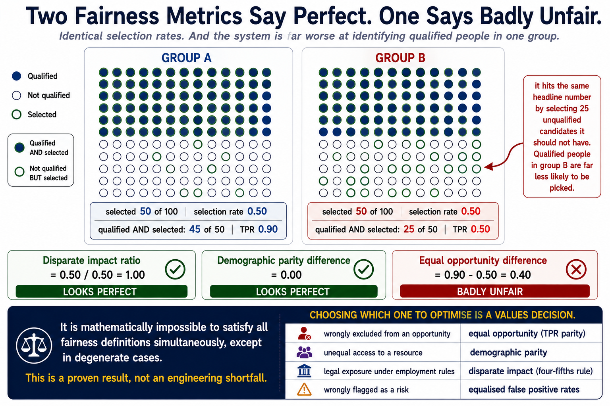
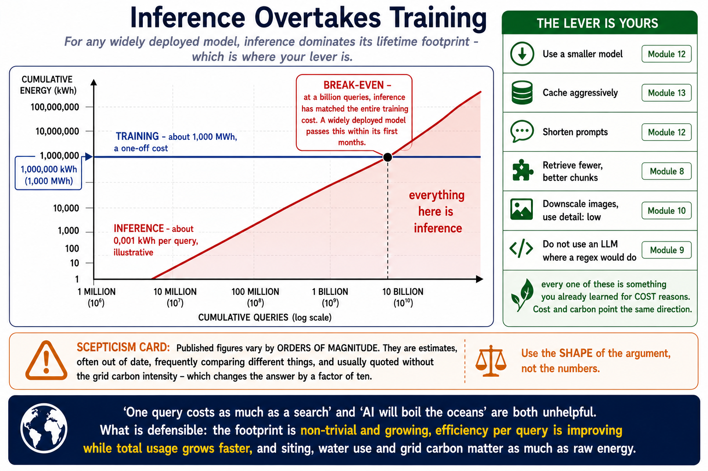
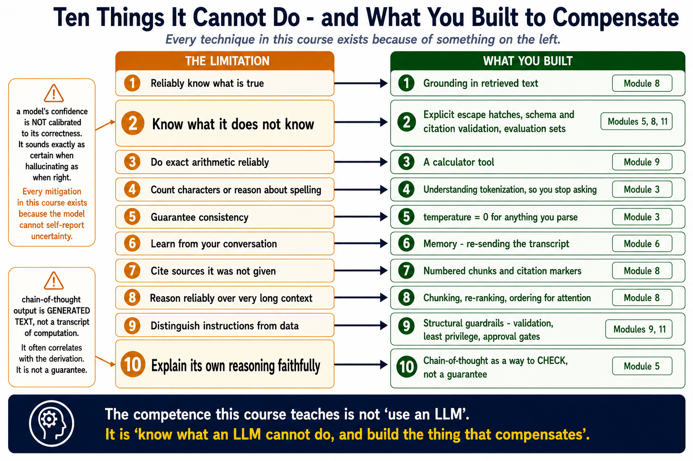

# Module 14: Ethics & Limitations

> **By the end of this module** you'll be able to measure fairness rather than assert it, reason clearly about intellectual property and environmental cost without hand-waving in either direction, and decide what *not* to build — which is the judgement that separates a competent engineer from a useful one.

| | |
|---|---|
| **Time** | ~2 hours (75 min reading, 45 min lab) |
| **Prerequisites** | [Modules 1](01-foundations.md), [11](11-guardrails-evaluation.md) |
| **Packages** | None. Part 1 is pure standard library. |
| **Cost** | Free |
| **🎓** | **The final module.** |

---

## Contents

- [14.0 Why This Matters](#140-why-this-matters)
- [14.1 Where Bias Comes From](#141-where-bias-comes-from)
- [14.2 Measuring Fairness](#142-measuring-fairness)
- [14.3 Intellectual Property](#143-intellectual-property)
- [14.4 Environmental Cost](#144-environmental-cost)
- [14.5 Labour and the Data Supply Chain](#145-labour-and-the-data-supply-chain)
- [14.6 Privacy](#146-privacy)
- [14.7 What GenAI Genuinely Cannot Do](#147-what-genai-genuinely-cannot-do)
- [14.8 Misuse and Dual Use](#148-misuse-and-dual-use)
- [14.9 Deciding What to Build](#149-deciding-what-to-build)
- [14.10 Disclosure](#1410-disclosure)
- [14.11 Where This Is Going](#1411-where-this-is-going)
- [🧪 Hands-On Lab 14](#-hands-on-lab-14)
- [✅ Key Takeaways](#-key-takeaways)
- [⚠️ Common Mistakes & Misconceptions](#️-common-mistakes--misconceptions)
- [🎓 Where to Go Next](#-where-to-go-next)

---

## 14.0 Why This Matters

You can now build a RAG system, an agent, a vision pipeline, an evaluation harness, and ship the result to a public URL. This module is about the question none of that answers: **should you?**

That sounds like a soft question. It isn't, and this module treats it as an engineering one:

| Question | Engineering answer |
|---|---|
| "Is our system fair?" | **Measure it.** §14.2 gives you three metrics that disagree. |
| "Can we use this training data?" | Depends on jurisdiction and use. §14.3 gives the state of play. |
| "What's the environmental cost?" | Arithmetic. §14.4 shows which term dominates. |
| "Should we build this at all?" | A structured assessment. §14.9. |

### The honest framing

This is a contested area, and much of the writing about it is either boosterism or catastrophism. **Both are useless to someone building things.**

So the register here is deliberate: where something is settled, this module says so. Where it's genuinely unresolved — and quite a lot is — it says that too, and gives you the shape of the disagreement rather than picking a side for you.

**The one position taken throughout: you are responsible for what you deploy.** Not the model provider, not the framework, not the training-data licensing. If your system makes a decision about someone, you own that decision.

---

## 14.1 Where Bias Comes From

"Bias" is used loosely. Precisely, it means: **the system produces systematically different outcomes for different groups, in ways that aren't justified by the task.**

It enters at five distinct points, and they need different fixes.

### 1. Training data

Models learn from text and images produced by people, and inherit their patterns.

If historical hiring data reflects historical discrimination, a model trained on it learns to reproduce that discrimination — **accurately**. It isn't malfunctioning. It's doing exactly what it was trained to do.

> **🔑 A model that perfectly reproduces a biased past is working correctly and is still unacceptable.** This is the point where "is the model accurate?" stops being the right question.

### 2. Representation

Whose text made it into the training corpus? Predominantly: English, online, from wealthier countries, from demographics over-represented on the web.

Consequences you've already met in this course:

- Module 3 §3.3 — the same meaning costs **several times more tokens** in some languages, so non-English users pay more and get a smaller effective context
- Performance is worse in under-represented languages
- Cultural assumptions default to the majority in the data

### 3. Labelling

Module 1 §1.3: RLHF trains models on human preferences. **Whose preferences?** A small group of annotators, following a rubric written by a small group of people, in a particular cultural context.

Module 11 §11.9's inter-annotator agreement problem is the same issue seen from the evaluation side.

### 4. Your data

Module 12 §12.6: fine-tuning teaches whatever pattern is in *your* examples. If your positive examples came from one team and negatives from another, you taught writing style.

The spurious-correlation failure has now appeared four times in this course — Lab 1's Teachable Machine, Module 5's few-shot warning, Module 12's training data, and here — because **it isn't a bug in any technique. It's what models do.**

### 5. Deployment context

A model that performs equally well across groups can still produce unfair outcomes if it's *used* unequally: applied to one population and not another, or with a threshold tuned on one group's data.

### Which fix goes with which source

| Source | What actually helps |
|---|---|
| Training data | Curation, reweighting, or **not using the model for that task** |
| Representation | Choosing a model evaluated on your languages and populations |
| Labelling | Diverse annotators, published rubrics |
| Your data | Module 12's dataset checks; vary what you don't want learned |
| Deployment | Measure outcomes **per group**, in production |

**No amount of prompt engineering fixes a representation problem.** That's worth stating plainly, because prompting is the cheapest lever and therefore the one people reach for.

---

## 14.2 Measuring Fairness

Here's the part that makes this an engineering module rather than a discussion.

### Three metrics

Consider a screening system: it says yes or no about people, and people belong to groups.

**1. Demographic parity** — does each group receive positive outcomes at the same rate?

```
   selection_rate(group) = positives in group / total in group
   parity_difference = max(rate) - min(rate)
```

**2. Disparate impact ratio** — the same idea as a ratio:

```
   ratio = min(selection_rate) / max(selection_rate)
```

A ratio below **0.8** is the "four-fifths rule", used as a screening threshold in US employment discrimination practice. It's a flag for investigation, not a verdict.

**3. Equal opportunity** — among people who *should* receive a positive outcome, does each group receive it at the same rate?

```
   TPR(group) = correctly-positive in group / actually-positive in group
```

This one needs ground truth: you must know who *should* have been selected.

### The demonstration that matters

These metrics **disagree**, and the disagreement is not a technicality.

Two groups, 100 people each, 50 genuinely qualified in each:

```
                    selected   selection rate   qualified & selected   TPR
   Group A             50           0.50              45 of 50         0.90
   Group B             50           0.50              25 of 50         0.50

   Disparate impact ratio  = 0.50 / 0.50 = 1.00     <- looks PERFECT
   Demographic parity diff = 0.00                    <- looks PERFECT
   Equal opportunity diff  = 0.90 - 0.50 = 0.40     <- badly unfair
```

**Identical selection rates. The system looks flawless on the two most commonly-cited metrics.**

And it is substantially worse at identifying qualified people in group B — it hits the same headline number by selecting 25 unqualified candidates it shouldn't have. Group B members who *are* qualified are far less likely to be picked.

> **🔑 It is mathematically impossible to satisfy all fairness definitions simultaneously**, except in degenerate cases. This is a proven result, not an engineering shortfall.
>
> So **choosing which definition to optimise is a values decision, not a technical one.** It belongs to whoever owns the product and its consequences — and it should be written down and defended, not left implicit in whichever metric someone happened to compute.



### Choosing deliberately

| If the harm is... | Favour |
|---|---|
| Being wrongly excluded from an opportunity | **Equal opportunity** (TPR parity) |
| Unequal access to a resource | **Demographic parity** |
| Legal exposure under employment rules | **Disparate impact** (the four-fifths rule) |
| Wrongly flagged as a risk | **Equalised false positive rates** |

**Decide first. Then measure.** Computing whichever metric your library defaults to, and reporting it because it looked good, is how systems get certified as fair while doing harm.

### And measure in production

Module 11 §11.12 argued for monitoring. Fairness needs it more than most, because:

- Your evaluation set may not match who actually uses the system
- Group composition drifts
- Thresholds tuned on one population transfer badly

**Log outcomes per group where you lawfully can**, and compute the metrics on a schedule. A one-off fairness audit at launch tells you about launch day.

---

## 14.3 Intellectual Property

**Genuinely unsettled**, actively litigated, and jurisdiction-dependent. Anyone telling you it's clear-cut is selling something.

### The three questions

**1. Was training on copyrighted work lawful?**

The core dispute. Arguments made in good faith on both sides:

| For lawfulness | Against |
|---|---|
| Training is transformative — learning statistical patterns, not copying | The work was copied to train, without licence |
| Analogous to a person reading and learning | Output can compete commercially with the source |
| Fair use / text-and-data-mining exceptions in some jurisdictions | Those exceptions often exclude commercial use |

**Status: contested.** Multiple major lawsuits are in progress, outcomes differ by jurisdiction, and the picture is still forming. Some providers now offer licensed-data models or indemnification precisely because the question is open.

**2. Who owns the output?**

| Jurisdiction | Broad position |
|---|---|
| **US** | Purely AI-generated work generally **cannot** be copyrighted — human authorship is required. Human-authored elements may be. |
| **UK** | Has a provision for computer-generated works, though its application to modern GenAI is debated |
| **EU** | Generally requires human creativity for authorship |

**The practical upshot:** you may not own AI-generated output the way you'd own written work. That matters if your business depends on exclusivity.

**3. Can output infringe?**

**Yes, and this one is not contested.** Models can reproduce training data closely — memorisation is documented, particularly for text repeated many times in training. Generating something substantially similar to a protected work can infringe regardless of how it was produced.

### What to actually do

| Practice | Why |
|---|---|
| **Check your provider's terms** on output ownership and indemnification | They differ substantially |
| **Don't assume you own the output** | See above |
| **Check generated code against licences** | Models can reproduce GPL-licensed code |
| **Keep humans in creative work you'll claim authorship of** | And keep a record of the human contribution |
| **For high-stakes use, prefer models with disclosed training data** | Fewer unknowns |
| **Attribute your sources in RAG** | Module 8's citations are also an IP practice |

That last row is worth noticing: **you already built the right thing.** A RAG system that cites its sources handles the attribution question far better than one that blends everything into an unattributed answer.

---

## 14.4 Environmental Cost

Real, frequently misstated in both directions, and mostly a question of arithmetic.

### The two terms

```
   TOTAL = training (one-off, large)  +  inference (tiny each, enormous count)
```

**Training** a frontier model consumes energy on the scale of hundreds of megawatt-hours to low thousands, with corresponding emissions depending entirely on the grid. It happens once per model.

**Inference** is small per request — a fraction of a watt-hour for a typical text query — and is multiplied by every request forever.

### Which dominates

This is the part that's usually stated backwards. Rough arithmetic:

```
  Training:   ~1,000 MWh                            = 1,000,000 kWh
  Inference:  ~0.001 kWh per query (illustrative)

  Break-even: 1,000,000 / 0.001 = 1,000,000,000 queries
```

**At a billion queries, inference has matched the training cost.** A widely-deployed model passes that within its first months.

> **🔑 For any model at scale, inference dominates its lifetime footprint.** Which means the environmental lever available to *you* — as someone building on top — is real: every optimisation from Module 13 is also an environmental one.



### Be sceptical of the numbers

Published figures vary by **orders of magnitude** and are frequently:

- Estimates, because providers rarely publish measurements
- Out of date — efficiency improves fast
- Comparing different things (training only, or training plus inference; one model, or all experiments)
- Quoted without the grid carbon intensity, which changes the answer by a factor of ten

**The shape of the argument is more robust than any specific figure.** Use the shape; be careful quoting numbers.

### What reduces it

Every one of these is something you already learned for cost reasons:

| Lever | Module |
|---|---|
| Use a smaller model | 12 §12.1 |
| Cache aggressively | 13 §13.7 |
| Shorten prompts | 12 §12.11 |
| Retrieve fewer, better chunks | 8 §8.7 |
| Downscale images, use `detail: low` | 10 §10.2 |
| Don't use an LLM where a regex would do | 9 §9.9 |

**Cost and carbon point the same direction**, which is convenient: the optimisations you were already motivated to do are the ones that help.

### And the honest counterweight

Comparisons are hard and often self-serving in both directions. "One query costs as much as a Google search" and "AI will boil the oceans" are both unhelpful. What's defensible:

- The absolute footprint is **non-trivial and growing**
- It's small relative to some sectors and large relative to others
- Efficiency per query is improving while total usage grows faster
- Data-centre siting, water use and grid carbon intensity matter as much as raw energy

---

## 14.5 Labour and the Data Supply Chain

Less discussed than bias or IP, and worth knowing about.

**Modern models depend on substantial human labour:**

| Role | What they do |
|---|---|
| **Data annotators** | Label training data, rank outputs for RLHF (Module 1 §1.3) |
| **Content moderators** | Review harmful material to build safety classifiers |
| **Red teamers** | Deliberately attempt to elicit harmful output |
| **Domain experts** | Produce specialist training and evaluation data |

Reporting over several years has documented concerns about pay, conditions and psychological impact — particularly for content moderation work, which involves sustained exposure to disturbing material, and which has often been outsourced to lower-wage countries.

**Why this belongs in an engineering module:** when you build a fine-tuning dataset (Module 12) or an evaluation set (Module 11), **you are commissioning annotation work.** Whether that's your own time, a colleague's, or a contracted service, the conditions of that work are a choice you're making.

There's also a displacement question worth holding honestly: GenAI genuinely automates work people are paid to do. The historical pattern of technology creating new work as it destroys old is real, and it offers no comfort to a specific person in a specific year.

---

## 14.6 Privacy

Four distinct issues.

### 1. Training data may contain personal information

Web-scraped corpora contain personal data — names, addresses, private information posted publicly or scraped from places it shouldn't have been.

Models can reproduce it, and **there's no reliable way to remove a fact from a trained model** short of retraining. This sits awkwardly with data-protection regimes that grant a right to erasure.

### 2. Your prompts go to a third party

Unless you self-host, every prompt leaves your infrastructure. That includes anything a user pastes in.

| Check | Why |
|---|---|
| Does the provider train on your data by default? | Many don't for API traffic; consumer products often do |
| What's the retention period? | Usually days to a month for abuse monitoring |
| Where is it processed? | Matters for data-residency requirements |
| Is there a data-processing agreement? | Required under GDPR-style regimes for personal data |

### 3. Your logs

Module 13 §13.10 was emphatic: **logging user questions is a privacy decision, not a default.** Log length and a hash unless you've decided otherwise, told users, and set a retention policy.

### 4. RAG indexes inherit access control problems

Module 7 §7.6: if your vector store contains documents with different access levels, **filtering must happen at the query boundary.** Post-filtering means restricted documents were retrieved into your process before being discarded — one log line from leaking.

This is the most likely way a real system leaks data: not a model failure, but an access-control failure in the retrieval layer.

---

## 14.7 What GenAI Genuinely Cannot Do

A clear-eyed list, and every item traces back to something earlier in this course.

| Limitation | Why | Module |
|---|---|---|
| **Reliably know what's true** | Optimises for plausibility, not truth | 1 §1.7 |
| **Know what it doesn't know** | No calibrated internal uncertainty signal | 1, 5 |
| **Do exact arithmetic reliably** | Sees token fragments, not place value | 3 §3.2 |
| **Count characters or reason about spelling** | Below the token level | 3 §3.2 |
| **Guarantee consistency** | Sampling; same input, different output | 3 §3.8 |
| **Learn from your conversation** | Weights are frozen after training | 1 §1.7 |
| **Cite sources it wasn't given** | It can only cite what's in context | 8 §8.10 |
| **Reason reliably over very long context** | Recall degrades in the middle | 3 §3.9 |
| **Distinguish instructions from data** | One flat token stream | 11 §11.2 |
| **Explain its own reasoning faithfully** | Stated reasoning may not be actual computation | 4, 5 §5.6 |



### The two that catch people out

**"Know what it doesn't know."** A model's confidence is not calibrated to its correctness. It sounds exactly as certain when hallucinating as when right. **Every mitigation in this course — grounding, citations, arithmetic checks, schema validation — exists because the model cannot self-report uncertainty.**

**"Explain its own reasoning faithfully."** Chain-of-thought output is generated text, not a transcript of computation. It often *correlates* with the answer's derivation, and it is not a guarantee. Module 5 §5.6 said it: visible reasoning is not correct reasoning; it's a way to *check*.

### Where this leaves you

None of these make GenAI useless. They define where it needs scaffolding — which is what Modules 5 through 13 were.

> **🔑 The competence being taught in this course isn't "use an LLM". It's "know what an LLM cannot do, and build the thing that compensates."**

---

## 14.8 Misuse and Dual Use

Some capabilities are genuinely dual-use: the same thing that makes a system valuable makes it dangerous.

| Capability | Legitimate | Harmful |
|---|---|---|
| Fluent persuasive text | Marketing, education | Disinformation, fraud at scale |
| Personalisation | Better UX | Targeted manipulation |
| Voice and image synthesis | Accessibility, film | Impersonation, non-consensual imagery |
| Code generation | Productivity | Malware, vulnerability discovery |
| Summarising personal data | Research | Surveillance, profiling |

**The scale change is what's new.** Persuasive text and forged images predate GenAI; what's different is producing them cheaply, in volume, personalised per target.

### What you can reasonably do

You cannot prevent all misuse. You can:

| Practice | Effect |
|---|---|
| **Don't build the harmful thing** | The most effective control, and the most overlooked |
| **Restrict capability to the use case** | Module 9 §9.12's least privilege |
| **Rate limit** | Module 13 §13.8 — bounds automation at scale |
| **Require authentication for consequential actions** | Attribution deters |
| **Log and monitor** | You can't respond to what you can't see |
| **Label synthetic content** | §14.10 |

> **⚠️ And be honest about "it's just a tool".** Tools have affordances. A system that makes something easy makes it more common. That's not an argument against building things; it's an argument for thinking about what you're making easy.

---

## 14.9 Deciding What to Build

The practical section. A structured way to decide.

### The questions, in order

**1. What decision does this system influence, and about whom?**

| Impact | Care required |
|---|---|
| Nobody — a personal tool | Low |
| Users see output and choose | Medium |
| It makes a recommendation someone acts on | **High** |
| It makes a decision automatically | **Highest** |

**2. What happens when it's wrong?**

Not *if*. It will be. Ask: is the error visible? Recoverable? Who bears the cost — the user, a third party, you?

The asymmetry matters. **A system where errors are invisible to the person affected and costly to them is the dangerous shape**, regardless of accuracy.

**3. Is there a human in the loop, and is it a real one?**

"Human review" that rubber-stamps a hundred recommendations an hour is not review. Automation bias is well documented: people defer to confident systems, especially under time pressure.

**Real human review needs the time, the information and the incentive to disagree.**

**4. Can the affected person contest it?**

Do they know a system was involved? Can they see why? Can they appeal to someone who can actually overturn it?

**5. Would you be comfortable explaining this publicly?**

Crude, and it works. If the honest description of what you're building would embarrass you, that's information.

### The domains where the bar is higher

Not "never", but "much more care, and probably regulated":

| Domain | Why |
|---|---|
| **Health** | Errors harm people; regulated in most jurisdictions |
| **Legal** | Errors have legal consequences; hallucinated citations have led to real sanctions |
| **Financial** | Regulated, auditable, contestable |
| **Employment** | Discrimination law applies directly; the four-fifths rule in §14.2 comes from here |
| **Education** | Assessment decisions affect life outcomes |
| **Criminal justice** | The highest stakes and the worst track record |
| **Anything about children** | Additional protections almost everywhere |

**Regulation is arriving.** The EU AI Act takes a risk-tiered approach with obligations that scale with impact; other jurisdictions are moving in similar directions. **If you're in one of the domains above, find out what applies to you before you build**, not after.

### A note on doing this properly

The above is a starting point, not a compliance framework. For anything consequential you want an actual impact assessment, documented, reviewed by people who aren't you, before you build. **The version of this that catches problems is the one done early enough to change the design.**

---

## 14.10 Disclosure

Should people know they're interacting with AI, or reading AI-generated content?

### Where the answer is clearly yes

- A user might reasonably believe they're talking to a person
- The output could be mistaken for a human-authored professional opinion
- Someone is making a decision based on it
- Synthetic media depicting a real person
- **Increasingly, where the law requires it** — disclosure obligations are appearing in several jurisdictions

### Where it's genuinely debatable

Autocomplete, grammar suggestions, search ranking, spam filtering. Nobody expects a disclosure banner on a spell-checker, and the line between "AI feature" and "software" isn't crisp.

### Practical disclosure

```python
DISCLOSURE = (
    "This assistant is AI-generated. It answers only from our published "
    "documentation and may be wrong. Check the cited sources, and contact "
    "support for anything important."
)
```

Four things done there, and each earns its place:

1. **Says it's AI** — no ambiguity
2. **States the scope** — sets expectations about what it can answer
3. **Admits fallibility** — plainly, not buried in a footer
4. **Gives a route to a human** — the part most disclosures omit

> **💡 Good disclosure is a product feature, not a legal disclaimer.** A user who knows the limits trusts the output more appropriately — they use it where it's good and escalate where it isn't. Buried small print achieves neither.

---

## 14.11 Where This Is Going

Brief, and deliberately non-predictive.

**Things that seem robust:**

- Models get cheaper per unit of capability
- Context windows get longer; the "lost in the middle" problem persists in some form
- Multimodality becomes the default rather than a feature
- Small specialised models remain competitive with large general ones for narrow tasks
- Regulation increases and diverges by jurisdiction

**Things genuinely uncertain:**

- Whether current approaches lead to something qualitatively different
- How IP litigation resolves
- Whether hallucination becomes manageable enough for unsupervised high-stakes use
- What the labour-market effects actually turn out to be

**Things to be sceptical of:** confident timelines in either direction, benchmark results without independent verification, demos that aren't a product, and anyone whose forecast happens to align exactly with what they're selling.

> **🔑 The fundamentals you learned here outlast the tools.** Tokens, embeddings, attention, retrieval, evaluation, guardrails — these have been stable while frameworks, model names and APIs churned repeatedly. Module 6 §6.10's translation table exists because LangChain's API changed; the *concept* of a chain didn't.

---

## 🧪 Hands-On Lab 14

**→ [Go to Lab 14: Measure It, Then Decide](../labs/14-ethics-limitations/README.md)**

Implement three fairness metrics and demonstrate for yourself that they disagree, compute the energy break-even between training and inference, and build a structured impact assessment you can run on something you actually want to build.

Pure standard library. Budget 45 minutes.

---

## ✅ Key Takeaways

1. **A model that perfectly reproduces a biased past is working correctly and is still unacceptable.** "Is it accurate?" stops being the right question.

2. **Bias enters at five points** — training data, representation, labelling, your data, deployment — and they need different fixes. No prompt fixes a representation problem.

3. **Fairness metrics disagree, provably.** You cannot satisfy them all simultaneously.

4. **Choosing which definition to optimise is a values decision**, and it should be written down and defended rather than left to whichever metric your library computes.

5. **A system can show perfect demographic parity while being far worse at identifying qualified people in one group.** Measure more than one thing.

6. **IP is genuinely unsettled.** Training lawfulness is contested; output ownership varies by jurisdiction; output *can* infringe, and that part isn't contested.

7. **You may not own AI-generated output** the way you'd own written work.

8. **Inference dominates a deployed model's lifetime footprint**, which means your cost optimisations are also environmental ones.

9. **Be sceptical of specific environmental figures** — they vary by orders of magnitude. The shape of the argument is more robust than the numbers.

10. **Building a dataset is commissioning annotation work.** The conditions of that work are a choice.

11. **RAG access control is the most likely way a real system leaks data** — a retrieval failure, not a model failure.

12. **The model cannot self-report uncertainty.** Every mitigation in this course exists because of that.

13. **Chain-of-thought is generated text, not a transcript of computation.** It's a way to check, not a guarantee.

14. **The dangerous shape is errors that are invisible to the person affected and costly to them** — regardless of accuracy.

15. **"Human in the loop" that rubber-stamps is not review.** It needs time, information and the incentive to disagree.

16. **Not building something is a legitimate engineering decision**, and often the right one.

---

## ⚠️ Common Mistakes & Misconceptions

<br>

> ### ❌ "We removed the protected attribute, so the model can't be biased"
> **Reality:** other features proxy for it — postcode, name, education history, writing style. Removing the label removes your ability to *measure* the disparity without removing the disparity.

<br>

> ### ❌ "Our fairness metric is good, so the system is fair"
> **Reality:** which metric? They disagree, provably. The worked example in §14.2 shows perfect demographic parity alongside a 40-point gap in true positive rates.

<br>

> ### ❌ Computing whichever fairness metric the library defaults to
> **Reality:** decide which harm you're guarding against *first*, then pick the metric that reflects it. The other order is how systems get certified as fair while doing harm.

<br>

> ### ❌ Auditing fairness once, at launch
> **Reality:** that tells you about launch day. Populations drift, thresholds transfer badly, and your evaluation set may not match who actually uses the system. Monitor per group.

<br>

> ### ❌ "The model provider handles the legal side"
> **Reality:** terms vary enormously, indemnification is often narrow and conditional, and **you are responsible for what you deploy.** Read the actual terms.

<br>

> ### ❌ "We own everything the model generates"
> **Reality:** purely AI-generated work generally cannot be copyrighted in the US, and positions differ elsewhere. If your business depends on exclusivity, check.

<br>

> ### ❌ "Training on public data is obviously fine" / "obviously theft"
> **Reality:** both are confident claims about actively litigated questions with differing outcomes by jurisdiction. The honest position is that it's unresolved.

<br>

> ### ❌ Quoting a specific carbon figure with confidence
> **Reality:** published estimates vary by orders of magnitude, are often stale, and frequently compare different things. Use the shape of the argument, not the number.

<br>

> ### ❌ "Training is the environmental problem"
> **Reality:** for any widely deployed model, inference overtakes training within months. That's also the good news — the lever is in your hands.

<br>

> ### ❌ Logging user prompts by default
> **Reality:** a privacy decision, not a default. Prompts contain personal data, and logs get shipped, retained and read.

<br>

> ### ❌ Post-filtering RAG results for permissions
> **Reality:** restricted documents were retrieved into your process before being discarded. Filter at the query boundary (Module 7 §7.6). This is the most likely real-world leak.

<br>

> ### ❌ Treating chain-of-thought as an explanation
> **Reality:** it's generated text that often correlates with the derivation. It is not a faithful transcript, and it should not be presented to users as "the reasoning".

<br>

> ### ❌ "There's a human in the loop, so it's fine"
> **Reality:** a reviewer approving a hundred confident recommendations an hour is not reviewing. Automation bias is well documented. Real review needs time, information and the incentive to disagree.

<br>

> ### ❌ "It's just a tool — misuse isn't my problem"
> **Reality:** tools have affordances, and making something easy makes it more common. Not an argument against building; an argument for thinking about what you're making easy.

<br>

> ### ❌ Treating "don't build it" as a failure
> **Reality:** it's a legitimate engineering decision and often the correct one. The judgement of what *not* to build is what separates a competent engineer from a useful one.

---

## 🎓 Where to Go Next

**You've finished.** Fourteen modules, fourteen labs, and two portfolio pieces: a document Q&A bot with citations, and a deployed app anyone can use.

### What you actually learned

Look back at the shape of it:

| | |
|---|---|
| **Modules 1–4** | How these systems work — tokens, embeddings, attention |
| **Modules 5–7** | How to control them — prompts, chains, vector search |
| **Modules 8–10** | How to build with them — RAG, agents, multimodal |
| **Modules 11–14** | How to ship them responsibly — evaluation, tuning, deployment, ethics |

**The thread running through all of it:** every technique exists to compensate for something the model cannot do. RAG exists because it doesn't know your data. Citations exist because it can't be trusted. Schemas exist because its output isn't structured. Guardrails exist because it can be persuaded. Evaluation exists because it can't tell you when it's wrong.

That framing is what makes the next technique legible when it arrives.

### Consolidate

The single best next step: **build something you actually want**, end to end, without a tutorial. You'll discover which parts you understood and which you copied.

Then, in rough order of value:

1. **Add evaluation to something you already built.** Module 11's harness on your Module 8 bot.
2. **Read your own code from Module 8 and simplify it.** You know more now.
3. **Break something deliberately** and fix it. Lab 13's stretch 6.

### Go deeper

| Direction | Start with |
|---|---|
| **The maths and internals** | Karpathy's *Let's build GPT from scratch*, then *Attention Is All You Need* |
| **Production RAG** | Anthropic's contextual retrieval write-up; the RAGAS docs |
| **Agents** | Anthropic's *Building Effective Agents*; LangGraph |
| **Evaluation** | OpenAI Evals; the LLM-as-a-judge literature |
| **Fine-tuning** | The LoRA and QLoRA papers; Unsloth's notebooks |
| **Safety and security** | OWASP LLM Top 10; Simon Willison on prompt injection |

### Stay current without drowning

The field moves fast and most of the noise doesn't matter. **What's worth tracking:**

- Provider changelogs for models you actually use
- One or two people whose judgement you trust, rather than a firehose
- Papers only when they change something you'd do differently

**What isn't:** benchmark leaderboards, funding announcements, and anyone whose forecast aligns suspiciously well with what they're selling.

> **🔑 The fundamentals outlast the tools.** Tokens, embeddings, attention, retrieval, evaluation — stable across every framework churn this course had to work around. If you understand those, the next library is a weekend.

### A last thought

You now know enough to build things that affect people. **That's the reason Module 14 is last rather than optional.**

The most valuable thing in this course isn't RAG or agents or LoRA. It's the habit that runs through every module: **measure it, don't assume it.** Retrieval recall, extraction accuracy, judge agreement, fairness across groups, cost per request. Every one of those is a number you now know how to produce.

Systems built by people who measure are better than systems built by people who are confident. Go and build something.

---

<div align="center">

**[⬅ Module 13](13-deployment.md)** · **[🧪 Do Lab 14](../labs/14-ethics-limitations/README.md)** · **[🏠 README](../README.md)**

**🎓 That's the course. Well done.**

</div>
